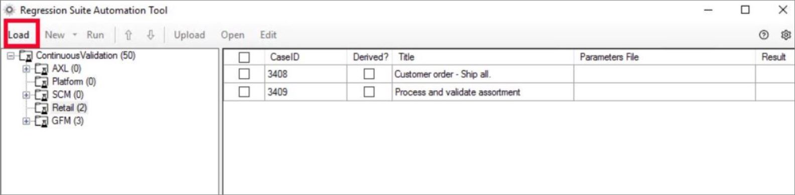
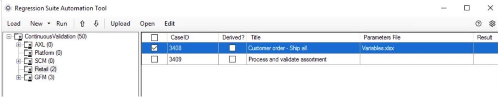
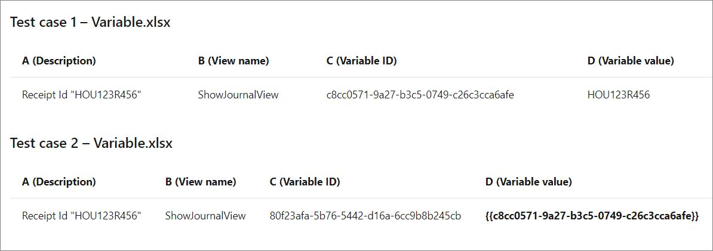

بعد إكمال تكوين RSAT، يمكن تشغيل حالات الاختبار. يمكنك فقط تشغيل حالات الاختبار التي تم إنشاء ملفات التشغيل التلقائي لها. بعد إنشاء مجموعة الاختبار، يمكن تحميلها في أداة RSAT، والتي يتم تثبيتها عادةً على خادم Azure أو على كمبيوتر محمول. 

في RSAT، حدد **تحميل** لتنزيل حالات الاختبار وملفات التشغيل التلقائي لحالات الاختبار من Azure DevOps. يتم تنزيل جميع حالات الاختبار التي تنتمي إلى خطة الاختبار المحددة في مربع الحوار **الإعدادات**.

 
يتم تنظيم حالات الاختبار من خلال مجموعة الاختبار وفقاً لخطة اختبار مشتركة. مجموعات الاختبار هي تلك التي أنشأتها في مشروع Azure DevOps الخاص بك. باستخدام RSAT، يمكنك العمل مع مجموعة اختبار واحدة في كل مرة. إذا تعذر على RSAT تحميل حالة اختبار، فتحقق من إنشاء خطة الاختبار الخاصة بك بشكل صحيح في Azure DevOps وأنها تحتوي على مجموعات الاختبار وحالات الاختبار المطلوبة.

لمعرفة كيفية إنشاء خطة اختبار في Azure DevOps والتي يمكنك استخدامها مع RSAT، شاهد الفيديو التالي.

 > [!VIDEO https://www.microsoft.com/videoplayer/embed/RE4vx0I]

إذا كنت تقوم بتحميل خطة الاختبار لأول مرة، فسيكون العمود **ملف المعلمات** فارغاً في الشبكة، ويجب عليك إنشاء ملفات معلمات التشغيل التلقائي للاختبار من أجل حالات الاختبار الخاصة بك.

لإجراء الاختبارات، أنشئ ملفات التشغيل التلقائي للاختبار التالية:

- اختبار ملفات المعلمات (ملفات Excel التي تحتوي على معلمات حالة الاختبار)
- ملفات XML المطلوبة لتشغيل الاختبارات

عند تحديد **جديد**، يتم إنشاء ملفات التشغيل التلقائي للاختبار في دليل العمل الخاص بك. تظهر ملفات معلمات اختبار Excel في العمود **ملف المعلمات** في الشبكة.
 

بالنسبة لملفات تسجيل الاختبار، لا يتوفر الخيار **إنشاء ملفات تنفيذ الاختبار فقط**. نظراً لأن Store Commerce للمتصفحات تستخدم شبكة Selenium مباشرة لإجراء التشغيل، فلا يجب إنشاء ملف نصي إضافي.
 

## تعديل معلمات الاختبار
يشرح هذا القسم كيفية تعديل ملفات Excel عن طريق تحديد الإدخال ومعلمات التحقق من صحة التشغيل التجريبي.

في RSAT، حدد حالة اختبار واحدة أو أكثر لتعديلها، ثم حدد تحرير. يتم فتح نافذة Excel لكل حالة اختبار قمت بتحديدها. وبدلاً من ذلك، يمكنك فتح ملفات Excel مباشرة من دليل العمل.

بالإضافة إلى علامة التبويب **الملخص**، يشتمل ملف Excel على علامة التبويب **المتغيرات** التي تحتوي على تفاصيل جميع المتغيرات التي تم إنشاؤها. يقوم Store Commerce تلقائياً بإنشاء متغيرات لجميع قيم الإدخال التي تم إدخالها أثناء جلسة عمل التسجيل. لست بحاجة إلى إنشاء المتغيرات بشكل منفصل. يحتوي كل متغير على معرف متغير فريد يمكنك تمريره إلى حالات اختبار مختلفة في مثيل واحد للتشغيل التجريبي. تظهر جميع المتغيرات في علامة التبويب **المتغيرات** بالترتيب الذي تم إدخالها به أثناء جلسة التسجيل.

لتمرير المتغيرات أو القيم بين حالات اختبار Store Commerce، حدد حالات الاختبار في أداة RSAT وافتح ملف Variables.xlsx عن طريق تحديد رمز **Excel** في الأداة. انسخ قيمة **معرف متغير** (العمود C) وألصقها في حقل **قيمة المتغير** (العمود D). 

على سبيل المثال، لتمرير **معرف الإيصال** من حالة الاختبار 1 - variable.xlsx إلى حالة الاختبار 2 - variable.xlsx، قم بنسخ قيمة المعرف المتغير من العمود C: c8cc0571-9a27-b3c5-0749-c26c3cca6afe. الصق القيمة في **قيمة المتغير** في العمود D في حالة الاختبار 2 - ملف variable.xlsx، بأقواس: {{ c8cc0571-9a27-b3c5-0749-c26c3cca6afe}}

تُظهر الصورة التالية مثالاً على إنشاء حالات الاختبار.

 
## قم بتشغيل الاختبارات باستخدام RSAT
في RSAT، حدد **تشغيل** لتشغيل حالات الاختبار المحددة. يمكنك فقط تشغيل حالات الاختبار التي تم إنشاء ملفات التشغيل التلقائي لها. يقوم RSAT بفتح Store Commerce ويقوم بتشغيل الاختبارات باستخدام البيانات التي تم إدخالها في Excel. 

بعد تشغيل الاختبارات، يتم تحديث النتائج في العمود **النتيجة** في RSAT وفي Azure DevOps.

لتغيير التسلسل الذي يتم تشغيل حالات الاختبار به، استخدم زري السهم لأعلى والسهم لأسفل.

