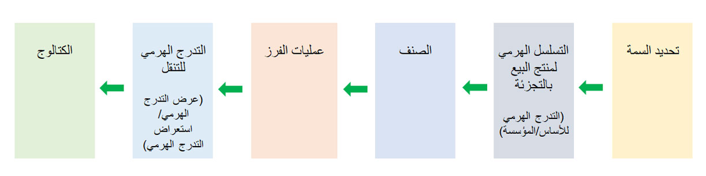

يحتوي الحل Dynamics 365 Commerce على مجموعة ميزات قوية لترويج المنتجات والتي تعمل على تمكين المواءمة الاستراتيجية للمنتجات إلى الكيانات القانونية والقنوات والأسواق، كما تسمح باكتشاف المنتجات وتصنيفها للعملاء والموظفين. يعمل الحل Commerce على تسهيل عملية تبسيط إنشاء المنتجات وصيانتها من خلال قوالب وتجميعها لخفض حجم الوقت المستغرق في إدارة المنتجات.  

من خلال ميزة البحث الديناميكي في قنوات الحل Commerce، يمكن البحث عن المنتجات ومقارنتها باستخدام أي عدد من المعايير. يمكن تحسين المنتجات لقنوات محددة في الحل Commerce لتنظيم بيئة بائع التجزئة بدون إزالة المنتجات كلياً من النظام. 

بما أن قنوات Commerce يتم إنشاؤها في نفس النظام الذي تم إنشاء المنتجات فيه، سيعمل المستخدم من مصدر فردي دقيق لإنشاء المحتوى ونشره دون الحاجة إلى نقاط تكامل متعدد أو أخطاء تعيين البيانات. 

باستخدام تقنيات مثل Microsoft Power BI، يمكنك استخدام Dynamics 365 analytics لقياس كفاءة المنتجات المتنوعة واستراتيجيات التسويق للمنتجات في قنوات Commerce المختلفة. 

يعرض المثال التالي دورة حياة الترويج للمنتجات المتكاملة. 
 

