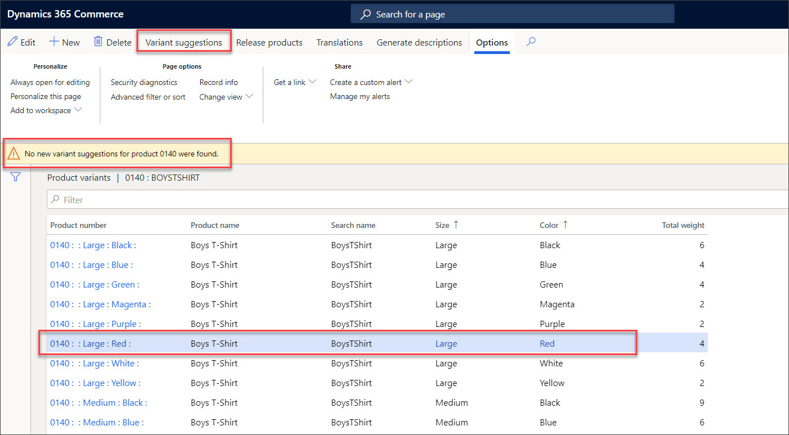

يحتوي Commerce على إطار عمل لإنشاء المنتجات وإدارتها يسهل العمليات المبسطة من خلال السماح بإنشاء البيانات مرة واحدة ثم توسيع تلك البيانات لتشمل كيانات قانونية متعددة.Commerce contains a product creation and management framework that facilitates streamlined processes by allowing for the creation of data once and then extending that data to multiple legal entities. باستخدام اطار العمل هذا، فإن الإدخالات المكررة غير ضرورية.With this framework, duplicate entry is unnecessary. 

وفيما يلي نوعان من المنتجات:The two types of products are: 

- المنتجاتProducts
- أصول المنتجاتProduct masters

عندما يتم تكوين كلا المنتجين بشكل كامل، يتم تكوينهما على المستوى العمومي ويكونان غير متاحين للاستخدام بعد في أي مكان في النظام.When both products are fully configured, they are configured at the global level and are not yet available to be used anywhere in the system. ويجب إصدارهما إلى الكيانات القانونية التي سيتم استخدامها فيها.They must be released to the legal entities in which they will be used. يسمح هذا الأسلوب بوجود إعداد واحد متسق لصنف يمكن بعد ذلك استخدامه وإدارته بشكل مختلف للمتطلبات الخاصة بالكيان القانوني.This approach allows for a single consistent setup of an item that can then be used and managed differently for legal entity-specific requirements. 

## المنتجاتProducts
المنتجات هي الأصناف الفردية القابلة للجرد التي تتم إدارتها وتصنيفها على أنها وحدة SKU أو رمز شريطي واحد.Products are single inventoriable items that are managed and categorized as a single SKU or barcode. أصول المنتجات هي منتجات فردية لها أشكال متعددة لنفس المنتج، وتسمى متغيرات المنتج.Product masters are single products that have multiple variations of the same product, called product variants. 

ويعد كل متغير منتج منفصل مع الرمز الشريطي الخاص به.Each variant is a separate product with its own barcode. 

## أصول المنتجاتProduct masters
يمكن لأصول المنتجات إنشاء مجموعات متغيرات المنتج باستخدام مجموعة أبعاد منتجات تحدد أبعاد المنتج الصالحة للمنتج: **الحجم**، **واللون**، **والنمط**، **والتكوين**.Product masters can create product variant combinations by using a product dimension group that defines which product dimensions are valid for the product: **Size**, **Color**, **Style**, and **Configuration**. 

على سبيل المثال، يمكن اعتبار القميص منتجاً معيناً لأغراض إعداد التقارير، ولكن يتم بيعه بمواصفات مختلفة مثل صغير أو متوسط أو كبير أو أزرق أو أحمر أو أخضر.For example, a t-shirt might be considered a specific product for reporting purposes, but it is sold in different specifications such as small, medium, or large, or blue, red, or green. يمكن أن يؤدي الجمع بين هذه المواصفات إلى العديد من الأصناف المختلفة ذات وحدات مخزون ورموز شريطية الخاصة بها.The combination of these specifications can result in many different items with their own inventories and barcodes. قد لا تكون بعض المجموعات صالحة لجميع الأصناف.Some combinations might not be valid for all items. 

## اقتراحات المتغيراتVariant suggestions
تُستخدم وظيفة **اقتراحات المنتج** الموجودة في **Retail وCommerce > المنتجات والفئات > متغيرات المنتج** لإنشاء مجموعات من الأصناف تلقائياً وفقاً للقيم الموجودة في أبعاد المنتج.The **Variant suggestions** functionality in **Retail and Commerce > Products and categories > Product variants** is used to automatically create combinations of items based on the values in the product dimensions. إذا لم تكن هناك أبعاد جديدة متاحة للإنشاء، فسيشير النظام إلى تلك المعلومة.If no new dimensions are available to generate, the system will indicate that information.
 
 

شاهد مقطع الفيديو التالي لمعرفة كيفية إنشاء منتج في Commerce.Watch the following video to learn how to create a Commerce product.

 > [!VIDEO https://www.microsoft.com/videoplayer/embed/RE4Afyg]
