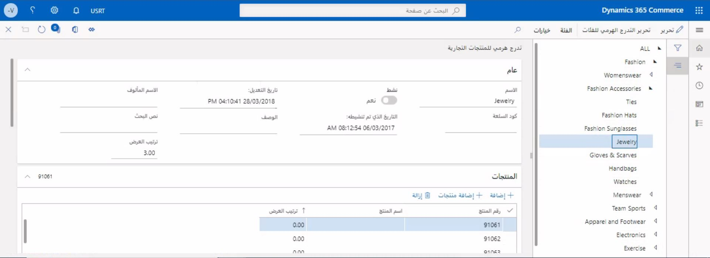
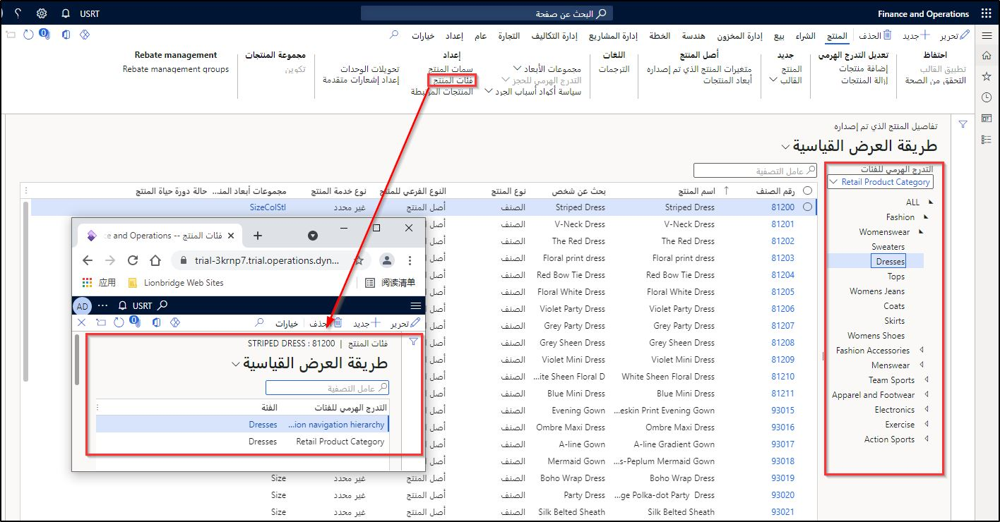

يمكن استخدام التدرجات الهرمية للفئات لإدارة المنتجات عن طريق التجميع المنطقي للمنتجات لأغراض مختلفة.Category hierarchies can be used to manage products by logical grouping of products for various purposes. 

على سبيل المثال، يمكن استخدام هيكل التدرج الهرمي واحد لعرض المنتجات وصيانتها عبر الشركة بأكملها.For example, a single hierarchy structure might be used to view and maintain products across the entire company. على العكس من ذلك، قد يكون لديك متطلب ثانٍ لعرض الأصناف التي تم تنظيمها في تدرج هرمي حسب الشركة المصنعة أو كيفية عرضها على موقع التجارة الإلكترونية.Conversely, you might have a second requirement to view items that are structured in a hierarchy by manufacturer or how it's viewed on an e-Commerce site. 

يمكن العثور على صفحة **التدرج الهرمي التجاري للمنتج** ضمن **البيع بالتجزئة والتجارة > المنتجات والفئات**.The **Commerce product hierarchy** page can be found under **Retail and Commerce > Products and categories**.

عند إنشاء المنتجات وتخصيصها لفئة واحدة أو أكثر، يمكن صيانتها وعرضها بواسطة تلك الفئات خلال صفحات **المنتجات** و **المنتجات الصادرة حسب الفئة**.When products are created and have been assigned to one or more categories, they can be maintained and viewed by those categories though the **Products** and **Released products by category** pages. ستسمح هذه الصفحات بعرض المنتجات من خلال أنواع متعددة من التدرجات الهرمية للمنتجات، مما سيساعد في تحسين وتبسيط الطرق التي يحتاجها أعضاء مختلفون في المؤسسة لإدارة منتجاتهم.These pages will allow the products to be viewed by multiple types of product hierarchies, which will help optimize and streamline the ways that different members of the organization need to manage their products. 

يمكن العثور على الصفحة الموضحة في الشكل التالي ضمن **البيع بالتجزئة والتجارة > المنتجات والفئات > المنتجات الصادرة حسب الفئة**.The page shown in the following figure can be found under **Retail and Commerce > Products and categories > Released products by category**.

