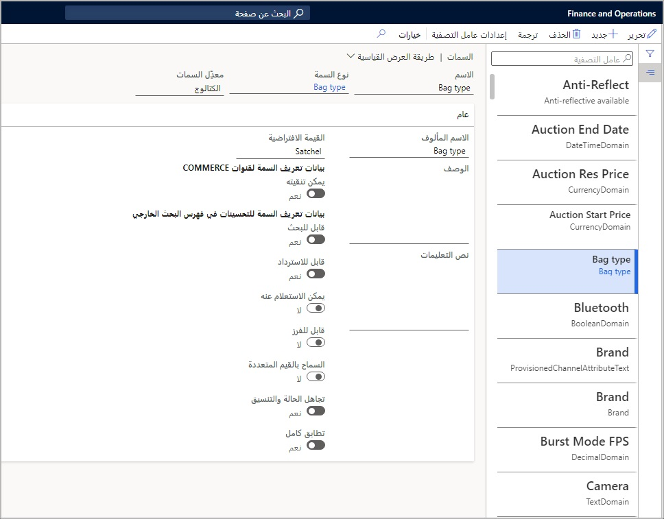
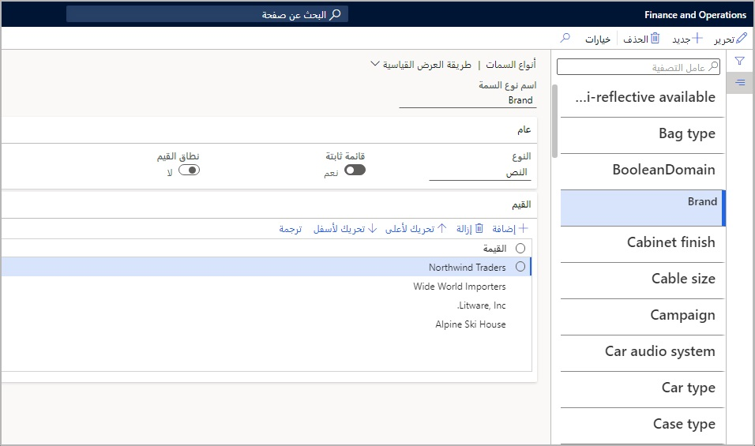
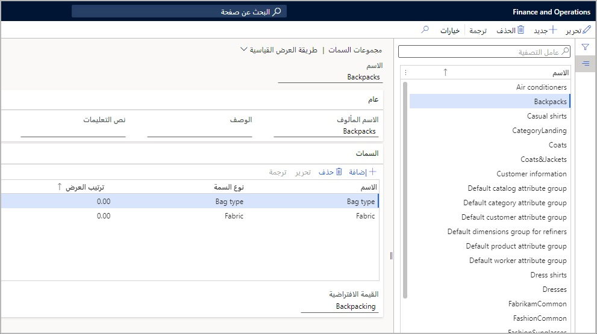

سمات المنتج، أو خصائص المنتج، هي نقاط بيانات يحددها المستخدم حول منتج يمكن أن تصف منتجاً معيناً بشكل أكبر، مثل نوع النسيج أو المادة التي تم تصنيعها منها. تختلف السمات عن أبعاد المنتج من حيث أنها لا تُستخدم للتمييز بين الأصناف الفريدة المخزونة. يتم استخدام السمات للحصول على المعلومات والبحث عن المنتج. 

يمكن للمستخدم إنشاء سمات المنتج لأي عدد من مكونات المنتج. يتم ضبط خصائص سمات المنتج من خلال تعيين أنواع السمات المعرفة من قبل المستخدم والتي يمكن إعادة استخدامها لمواصفات مماثلة. 

يوضح المثال التالي صفة في صفحة **سمات** في **البيع بالتجزئة والتجارة > المنتجات والفئات > سمات**. 

  

يمكن تعريف أنواع السمات هذه على أنها حقول **نص**،حقول **قائمة ثابتة** وحقول نصية و **العملة**، **DateTime**، **عدد عشري**، **عدد صحيح**، **قيمة منطقية**، و **مرجع** للمساعدة في تناسق البيانات وإدخالها. يمكن أيضاً تعيين نطاقات قيمة السمة الصالحة. على سبيل المثال، قيم 1-10 فقط هي الصالحة. 

توجد صفحة **أنواع السمات** في **البيع بالتجزئة والتجارة > المنتجات والفئات > السمات > أنواع السمات**.
 

  

يمكن بعد ذلك تجميع سمات المنتج معاً في مجموعات سمات المنتج في صفحة **البيع بالتجزئة والتجارة > المنتجات والفئات > السمات > مجموعات السمات**.

يمكن بعد ذلك تكوين مجموعات السمات إلى فئات البيع بالتجزئة أو قنوات التجارة في **البيع بالتجزئة والتجارة > إعداد القناة > فئات القنوات وسمات المنتج**.

