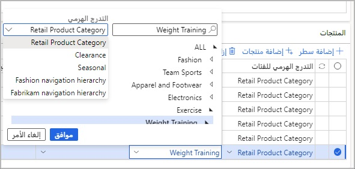
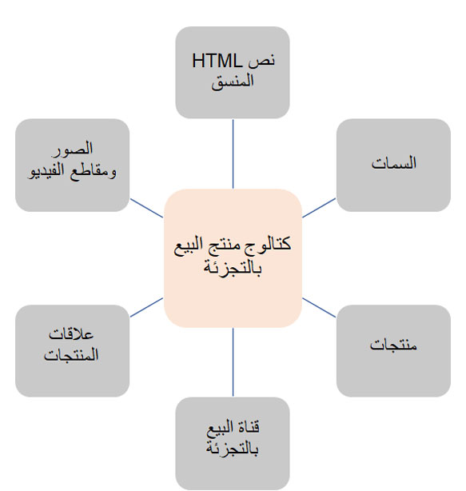

تُستخدم عمليات الفرز لتحديد المنتجات المتوفرة وفي أي قنوات يتم توفرها خلال فترات زمنية محددة. يتم تعيين المنتجات والقنوات إلى عمليات الفرز التي لها تواريخ سريان لتحديد الفترة. بدلاً من تحديد كل منتج لتضمينه في مجموعة متنوعة بشكل فردي، يمكن إضافة المنتجات عن طريق تحديد عقدة تدرج هرمي كاملة **لفئة المنتج** من أي من التدرجات الهرمية للفئات التي تم إنشاؤها أو من خلال البحث في عُقد التدرج الهرمي للفئات واختيار المنتجات بشكل مجمّع يدوياً. 

يمكن تحديد الخطوط المضافة على أنها مضمنة أو مستبعدة من عملية الفرز. سيكون لحالات الاستبعاد الأسبقية على أي إدراج للمنتجات، لذلك من الممكن دعم سيناريو الرغبة في كل منتج في كل فئة، باستثناء صنف واحد محدد فقط، باستخدام بندين في عملية الفرز. يتم تحديد المنتجات المتوفرة داخل المتجر من خلال عملية فرز واحدة أو أكثر يتم استخدامها لهذا المتجر. 

يمكن أيضاً استخدام الوظيفة الإضافية Microsoft Excel لإنشاء عملية فرز والحفاظ عليها. لمزيد من المعلومات، راجع [Microsoft Office تكامل](https://docs.microsoft.com/learn/modules/implement-common-integration-features-finance-ops/2-office/?azure-portal=true). 

يعتبر الشكل التالي مثالاً على تحديد الفئة عند إضافة فئة جديدة إلى عملية فرز للتضمين الذي يمكن العثور عليه ضمن **Retail وCommerce > الكتالوجات وعمليات الفرز > عمليات الفرز**.
 

إذا كان منتج بعينه بحاجة إلى أن تتم إضافته، تتيح لك ميزة **‏‫إضافة منتجات‬** إمكانية البحث عن الأصناف حسب فئة المنتج ليتم تضمينها بشكل مجمّع. ويمكن استخدام فئات منتجات متعددة عند البحث عن هذه الأصناف. 

عندما يتم إنشاء عملية فرز، يجب أن يتم نشرها. عندما يتم إجراء تغيير على أحدي الفئات التي يتم استخدامها داخل عملية الفرز، يجب تشغيل وظيفة **معالجة عمليات الفرز** لتسجيل أي تغييرات في التدرج الهرمي للفئات. يمكن تشغيل هذه المهمة الدورية يدوياً أو يمكن إعدادها للتشغيل وفقاً لجدول زمني. سيؤدي نشر عملية الفرز إلى تشغيل وظيفة **معالجة عمليات الفرز** في ذلك الوقت.

الكتالوجات عبارة عن مجموعات من المنتجات والسمات التي يمكن نشرها إلى حلول التجارة الإلكترونية الأخرى أو كتالوجات التسويق المباشر إلى المستهلك في قناة مركز الاتصال في Commerce.‬ غالباً ما تحتوي الكتالوجات التي يتم إرسالها إلى العملاء على خصومات وعروض ترويجية لها رموز تعريف كتالوج فريدة يمكن جمعها في وقت إنشاء الأمر. تساعد هذه الرموز في تتبع فعالية الكتالوج في إنشاء المبيعات مقابل تكلفة إنتاج الكتالوجات وإرسالها بالبريد. 

يتم إنشاء الكتالوجات وإرفاقها بقناة Commerce واحدة أو أكثر. ثم يتم إضافة المنتجات إلى قنوات Commerce. يمكنك التحقق من صحة الكتالوج بالنتائج المتاحة عن طريق تحديد **عرض النتائج**. بعد ذلك، ستحتاج إلى بدء سير عمل الموافقة على الكتالوج عن طريق إرسال الكتالوج إلى سير العمل. بعد الانتهاء من الخطوات المحددة لسير العمل، يمكنك نشر الكتالوج واستخدامه في مركز الاتصال. 

يمكن للعملاء طلب إرسال كتالوج مطبوع من خلال ميزة **إرسال كتالوج** في صفحات **بحث العملاء** و **خدمة العملاء**.

يوضح الرسم التخطيطي التالي المزيد من المكونات التي يمكن إضافتها إلى كتالوج لتحديد التخطيطات. 
 

