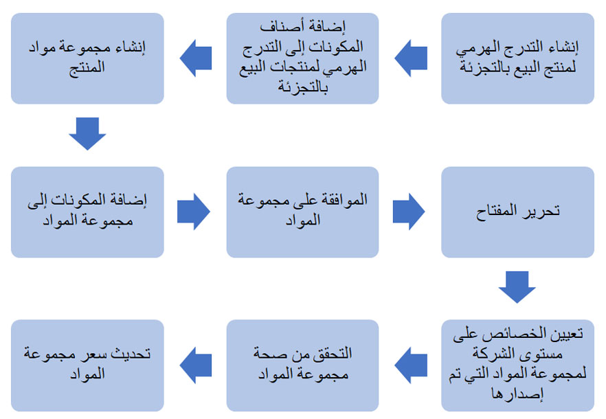

مجموعة مواد منتجات البيع بالتجزئة عبارة عن مجموعة من الأصناف التي يتم تجميعها في منتج واحد قابل للبيع. المنتجات الموجودة في مجموعة المواد هي منتجات نهائية ويمكن بيعها بشكل منفصل عن مجموعة المواد، إذا لزم الأمر. هذا العامل هو اختلاف رئيسي عن أصناف قائمة مكونات الصنف (BOM) التي لا تحتوي على أصناف منتهية لتكوين منتج قابل للبيع. 

على غرار المنتجات وأصول المنتجات، يتم تكوين أصناف مجموعة المواد على أنها **مجموعة مواد المنتجات** ثم يتم إصدارها للكيانات القانونية المختلفة. تتوفر مجموعات مواد المنتجات بعد ذلك للتكوين الإضافي في الكيانات القانونية مثل **مجموعات مواد المنتجات الصادرة**. تتكون مجموعات مواد المنتجات من مكونات يمكنها تحديد الكمية والتسعير الخاص لهذا المكون عند استخدامه في مجموعة المواد بدلاً من استخدامه بشكل منفصل. 

لإنتاج مخزون لمجموعات مواد المنتجات، يجب إنشاء أوامر مجموعات المواد بحيث يتم تقليل مخزون المكونات بناءً على كميات مجموعة المواد بينما يتم زيادة مخزون صنف مجموعة المواد. يتم تحديد أوامر مجموعة المواد من خلال تحديد عدد أصناف مجموعة المواد التي تريد تجميعها في أي مستودع. تحتوي أوامر مجموعة المواد على تكوينات، يتضمن كل منها منتجات صادرة مختلفة تسمح بتكوين مجموعات مواد متعددة في وقت واحد. 

يمكن استخدام أوامر مجموعة المواد لتفكيك مجموعات المواد وتجميعها. يمكن أن تحدث عملية التفكيك داخل Commerce Headquarters (HQ) أو داخل Store Commerce لدعم العميل الذي يريد شراء صنف معين داخل مجموعة مواد وهو غير متوفر خارج مجموعة المواد. إذا انتهى الترويج لمجموعة مواد، يمكن بيع الأصناف بشكل منفصل عن طريق تفكيك أصناف مجموعة المواد. تقلل عملية التفكيك من مخزون أصناف مجموعة المواد وتزيد من مخزون الأصناف المنفصلة المبنية تلقائياً على تعريف مجموعة المواد في المركز الرئيسي. 

تظهر دورة حياة إنشاء مجموعة مواد في Commerce في الرسم التخطيطي التالي. 

