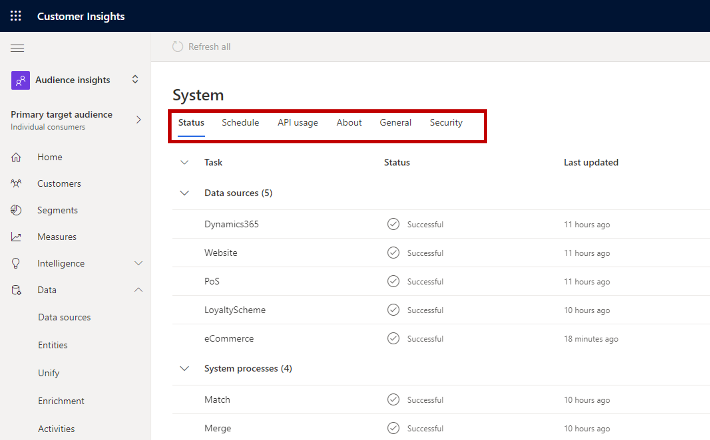

يعتبر النظام الأساسي بيانات العملاء جزءاً مهماً من المؤسسة. يساعدك على توحيد بيانات العميل في ملف تعريف واحد، ويسمح لك ببناء رؤى قوية تساعدك على فهمها بشكل أفضل حتى تتمكن من إنشاء رحلات عملاء هادفة. لهذا السبب، من الأهمية بمكان التأكد من تشغيل كل شيء ومعالجته بكفاءة، وأن الأفراد الذين يحتاجون إلى العمل في الحل يمكنهم إنجاز كل ما يحتاجون إليه.

إذا لم تتم معالجة أي شيء داخل الحل كما هو متوقع، فقد يكون له تأثير كبير على مؤسستك. على سبيل المثال، قد تستخدم شركتك مقاطع محددة في رؤى الجمهور لدفع جهود التسويق مع خدمات مثل Microsoft Advertising أو Ads Facebook أو Google Ads. إذا كانت البيانات التي يتم استيعابها في Microsoft Dynamics 365 Customer Insights غير محدثة، فمن المحتمل ألا تكون المقاطع التي تستخدمها مع هذه الخدمات حديثة. نتيجة لذلك، قد لا تستهدف العملاء المناسبين في تلك الخدمات.

بصفتك مسؤولاً في رؤى الجمهور، لديك العديد من الميزات المتاحة لك للمساعدة في ضمان تشغيل المثيل على النحو المنشود:

- **إدارة البيئات** - يمكنك إنشاء البيئات أو حذفها أو تعديلها في مثيل Dynamics 365 Customer Insights حسب الحاجة.

- **إدارة المهام والعمليات** - عرض حالة المهام والعمليات المختلفة التي يتم تنفيذها في التطبيق، والتأكد من التعامل مع عناصر مثل الإخفاقات أو الأخطاء بسرعة.

- **إدارة جداول تحديث البيانات** - تحديد جدول زمني لتحديث بياناتك في التطبيق.

- **تحديد الأمان والأذونات** - تأكد من أن المستخدمين في تطبيق Customer Insights، مثل محللي البيانات لديك، لديهم الأذونات اللازمة لإنجاز ما يحتاجون إليه في التطبيق.

### أداء المهام الإدارية

تحتوي رؤى الجمهور على قسم **المسؤول** الذي يسمح للمسؤولين بأداء المهام الإدارية في بيئتهم. قم بالوصول إلى هذه الميزة عن طريق توسيع قسم **المسؤول** واختيار **النظام**.

تتضمن **صفحة النظام** علامات التبويب التالية:

- **الحالة** - اعرض حالة العمليات والمهام المختلفة التي يتم تنفيذها في حالة رؤى الجمهور.

- **الجدول** - حدد جدولاً لتحديث مصادر البيانات التي يتم استيعابها.

- **استخدام API** - مراقبة استخدام API في التطبيق.

- **حول** - راجع التفاصيل المهمة حول بيئتك، مثل معرّف البيئة والنوع والمنطقة.

- **عام** - تعديل إعدادات البيئة، مثل اللغة والمنطقة، بعد نشرها.

- **الأمان** - استخدم Microsoft Azure لتلبية متطلبات الامتثال والأمان لمؤسستك.

    > [!div class="mx-imgBorder"]
    > 

سيوفر الجزء المتبقي من هذه الوحدة شرحاً مفصلاً لبعض العناصر الإدارية المتوفرة في Customer Insights.
