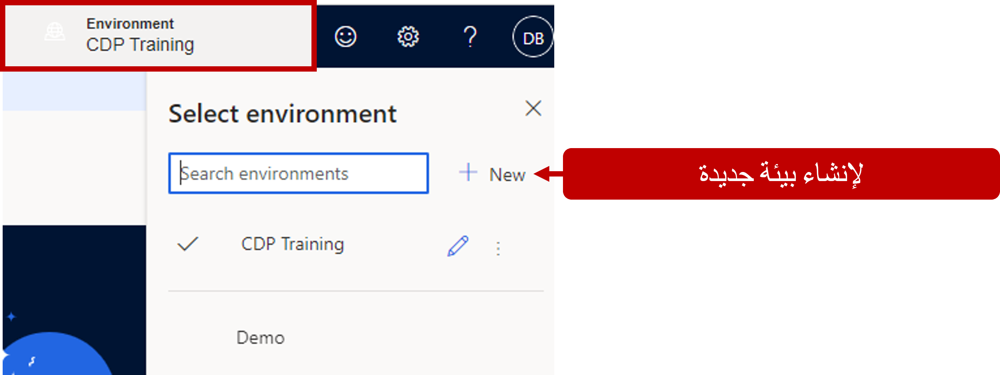
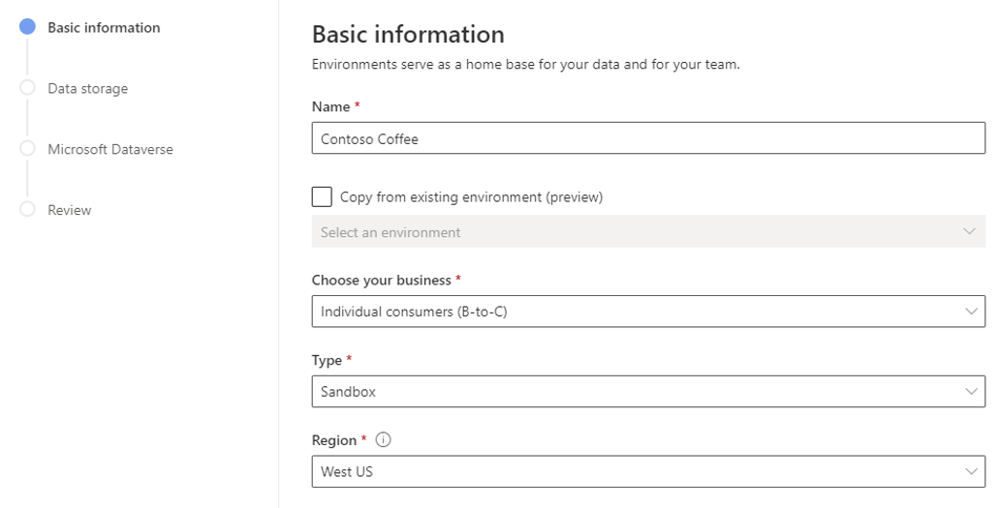
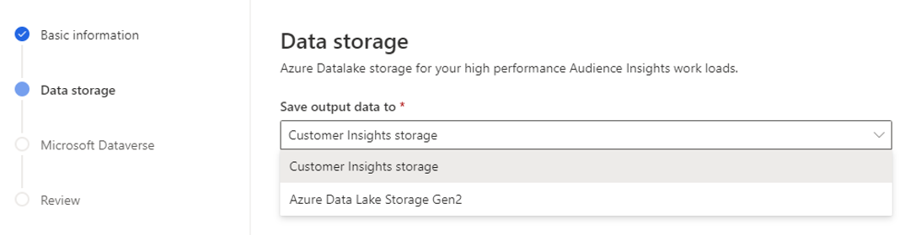
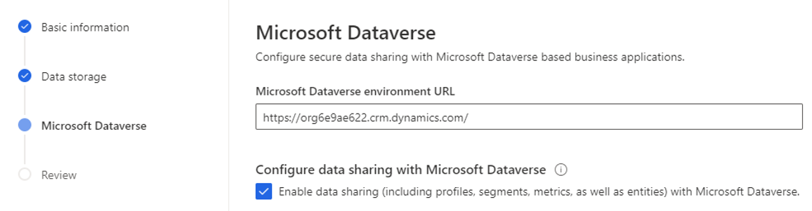
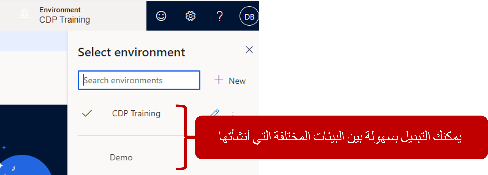

تمثل البيئات في Customer Insights المكان حيث ستقوم بإنشاء الوظائف، مثل

- إنشاء ملف تعريف العميل الموحد

- استيعاب البيانات من مصادر بياناتك المختلفة

- تحليل البيانات، والمزيد.

يمكنك إنشاء *بيئتين* لكل ترخيص Customer Insights تشتريه.

عند إنشاء بيئة Customer Insights الجديدة، فإنها تتضمن **رؤى الجمهور** التي تساعدك على تحويل عملك إلى مؤسسة تركز على العملاء. سيكون لدى متخصصي التسويق والمبيعات والخدمة الرؤى التي يحتاجون إليها لإضفاء الطابع الشخصي على التجارب.

### إنشاء بيئة جديدة

عند الوصول إلى التطبيق لأول مرة، سيتم عرض عينة بيئة تتضمن عينة بيانات لمساعدتك على الشروع في العمل. عندما تصبح جاهزاً لبدء استخدام بياناتك الخاصة، ستحتاج إلى إنشاء بيئة جديدة عن طريق تحديد منتقي **البيئة** ثم تحديد **+ جديد**.

> [!div class="mx-imgBorder"]
> 

عند إنشاء بيئة جديدة، تأكد من توفير المعلومات في الشاشات التالية:

- **المعلومات الأساسية** - تحدد التفاصيل الأساسية للبيئة، مثل النوع والمنطقة والأعمال محل التركيز.

- **مخزن البيانات** - يحدد مكان تخزين البيانات.

- **Microsoft Dataverse** - يحدد مثيل Microsoft Dataverse الذي تريد إرفاقه بـ Customer Insights.

في شاشة **المعلومات الأساسية**، حدد التفاصيل التالية:

- **الاسم** - يحدد اسم البيئة الذي سيظهر في التطبيق وما سيتم استخدامه لتحديد البيئة التي تتصل بالتطبيقات الأخرى.

- **الأعمال محل التركيز** - يحدد نوع العملاء الذين ستركز عليهم البيئة. يمكنك تحديد أحد الأنواع التالية:

  - حسابات الأعمال (B-to-B)

  - العملاء الفرديون (متاجرة عمل-مستهلك)

        Depending on the initial focus that you choose for the environment, you
        can add the other focus area later. For example, consider a scenario
        where your organization supports both B-to-C and B-to-B customers. If
        you initially create an environment for business accounts, when you
        create your next environment, you will only be able to select individual
        customers.

- **النوع** - يحدد نوع البيئة التي تريد إنشاءها. يمكنك الاختيار من بين الأنواع التالية:

  - **الإنتاج** - يمثل البيئة المباشرة التي تستخدمها مؤسستك بنشاط.

  - **بيئة الاختبار المعزولة** - مخصصة لسيناريوهات ما قبل التنفيذ والاختبار.
        لا تسمح بتحديث البيانات المجدولة.

  - **إصدار تجريبي** - يمثل مؤسسة تجريبية. لا يتوفر هذا النوع إلا عندما تعمل في إصدار تجريبي من مثيل Customer Insights.

يمكنك امتلاك بيئة تشغيل واحدة فقط. بعد تحديد بيئة التشغيل، يجب أن تكون البيئة الثانية التي تقوم بإنشائها هي مثيل آلية تحديد الوصول.

- **المنطقة** - تحدد المنطقة التي ستتم استضافة بيئتك فيها. حاول اختيار المنطقة الأقرب لموقعك.

> [!div class="mx-imgBorder"]
> 

عندما تنشئ بيئة جديدة، فأنت تنشئ بيئة فارغة جديدة لا تحتوي على بيانات أو مقاييس أو شرائح أو أي شيء من هذا القبيل. وبالتالي، ستحتاج إلى بناء تلك المعلومات من البداية. إذا كنت ترغب في إنشاء بيئة جديدة بناءً على بيئة موجودة مسبقاً، فحدد الخيار **نسخ من بيئة حالية**، والذي سينشئ نسخة متطابقة من البيئة المحددة. يعتبر هذا الخيار مفيداً إذا كنت تريد إنشاء بيئة اختبار معزولة لأغراض الاختبار تعتمد على مثيل الإنتاج الحالي لديك.

في شاشة **مخزن البيانات**، ستختار مكان تخزين البيانات من Customer Insights. يوجد خياران يمكنك الاختيار من بينهما:

- **مخزن Customer Insights** - سيتم تخزين البيانات في Azure Data Lake Storage يديره فريق Customer Insights.

- **Azure Data Lake Storage** - سيتم تخزين البيانات في Microsoft Azure Data Lake Storage الخاص بك. يتطلب هذا الخيار أن يكون لديك مخزن Azure Data Lake Gen2 للاتصال به.

بشكل افتراضي، سيتم تحديد خيار **مخزن Customer Insights**.

> [!div class="mx-imgBorder"]
> 

لمزيد من المعلومات، راجع [الاتصال بحساب Azure Data Lake Storage](/dynamics365/customer-insights/audience-insights/connect-service-principal/?azure-portal=true).

في شاشة **Microsoft Dataverse**، يمكنك توصيل Customer Insights ببيئة Dataverse الخاصة بك. سيربط هذا الإجراء بين Customer Insights ومثيلات Dataverse لديك. إذا كنت ترغب في استخدام نماذج التوقع الجاهزة، وإعداد مشاركة البيانات مع Dataverse، ومشاركة بيانات Customer Insights (مثل ملفات التعريف والشرائح والمقاييس) مع مثيل Microsoft Dataverse، فحدد **تمكين مشاركة البيانات**.

> [!div class="mx-imgBorder"]
> 

### العمل مع البيئات

بعد إنشاء بيئة أخرى، يمكنك التبديل بينهما باستخدام عنصر تحكم **البيئة** في الزاوية العلوية اليمنى من التطبيق.

> [!div class="mx-imgBorder"]
> 

الآن، يمكن للمسؤولين تنفيذ مهام بيئية متعددة، مثل:

- **إنشاء بيئات جديدة** - يفتح معالج إنشاء البيئة.

- **تحرير البيئات الحالية** - يسمح لك بإجراء تغييرات طفيفة، مثل تعيين البيئة كبيئة افتراضية أو الاتصال بـ Dataverse إذا لم تقم بذلك في البداية. لمزيد من المعلومات، راجع [تحرير بيئة حالية](/dynamics365/customer-insights/audience-insights/manage-environments#edit-an-existing-environment/?azure-portal=true).

- **إعادة تعيين بيئة** - لإعادة تعيين البيئة إلى حالة فارغة إذا كنت تريد فقط إزالة التكوينات والبيانات التي تم استيعابها ولكنك تريد الاحتفاظ بالبيئة. لمزيد من المعلومات، راجع [إعادة تعيين بيئة حالية](/dynamics365/customer-insights/audience-insights/manage-environments#reset-an-existing-environment/?azure-portal=true).

- **إزالة البيئات** - يقوم بإزالة البيئة من المثيل الخاص بك. لمزيد من المعلومات، راجع [حذف بيئة حالية](/dynamics365/customer-insights/audience-insights/manage-environments#delete-an-existing-environment/?azure-portal=true).

تعد إدارة البيئات جزءاً واحداً فحسب من الحفاظ على مثيل النظام الأساسي لبيانات العملاء. بعد ذلك، ستتعرف على حالات النظام وكيفية التأكد من تحديث معلوماتك في Customer Insights حسب الحاجة.
