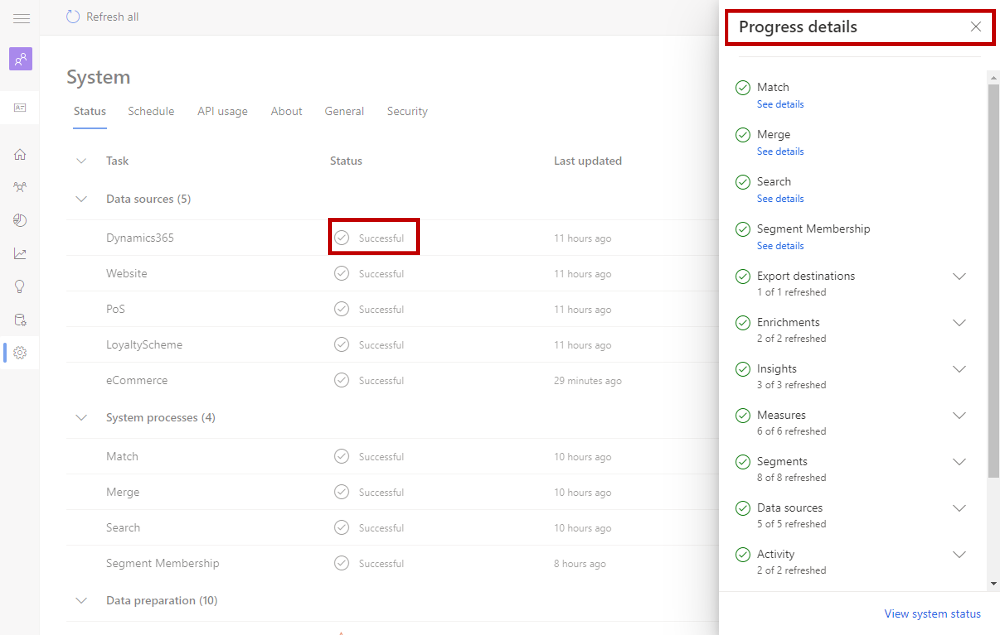

يتضمن مثيل Customer Insights النموذجي العديد من العناصر المختلفة المعنية التي تؤثر في كيفية تقديم البيانات وما يمكن القيام به في التطبيق. تتضمن هذه العناصر كل شيء من استيعاب البيانات في التطبيق وإنشاء ملف تعريف العملاء الموحد، لتعريف المقاييس والشرائح التي سيتم استخدامها في التطبيق.

ونظراً لأن العديد من هذه العناصر تعتمد على بعضها البعض، فإنك بحاجة إلى القدرة على تحديد حالات المهام والعمليات المختلفة في التطبيق. على سبيل المثال، قد لا يحتوي المقياس الذي يحسب ما أنفقه العميل على مدار حياته على أحدث المعلومات الحالية إذا لم يتم تحديث مصادر البيانات المرتبطة بالمقياس مؤخراً.

في علامة تبويب **الحالة**، يمكنك تعقب تقدم المهام واستيعاب البيانات وتصدير البيانات وعمليات المنتجات الهامة الأخرى. من الأفضل مراجعة المعلومات الموجودة في علامة التبويب هذه بانتظام لضمان اكتمال مهامك وعملياتك النشطة.

سيتم تجميع المهام في فئات مختلفة، مثل مصادر البيانات أو المعلومات أو النشاط أو المقاييس. استناداً إلى ما قمت بإعداده في بيئة Customer Insights، ستختلف عمليات التجميع والمهام المحددة. بالنسبة لكل مهمة معروضة، ستعرض علامة التبويب حالة أحدث تشغيل ووقت آخر تحديث له. يمكنك عرض المزيد من التفاصيل عن طريق تحديد حالة العملية، والتي ستفتح جزء **تفاصيل التقدم**.

> [!div class="mx-imgBorder"]
> 

تستخدم Customer Insights الحالات التالية للمهام والعمليات.

|     الحالة         |     التعريف  |
|-|-|
|     تم الإلغاء       |     تم إلغاء المعالجة بواسطة المستخدم قبل الانتهاء من العملية.     |
|     فشل         |     حدثت أخطاء في استيعاب البيانات.  |
|     فشل        |     فشلت المعالجة.  |
|     لم يبدأ    |     لم يتم إدخال أي بيانات لمصدر البيانات حتى الآن أو أنه لا يزال في وضع المسودة.    |
|     جارٍ المعالجة     |     المهمة أو العملية قيد التقدم.   |
|     تحديث     |     جارٍ استيعاب البيانات. يمكنك إلغاء هذه العملية بتحديد **إيقاف التحديث** في عمود **الإجراءات**. سيؤدي إيقاف تحديث مصدر البيانات إلى إعادته إلى آخر حالة تحديث له.    |
|     تم التخطي        |     تم تخطي المهمة أو العملية. فشلت واحدة أو أكثر من العمليات التالية التي تعتمد عليها المهمة أو تم تخطيها.   |
|     ناجح     |     اكتملت المهمة بنجاح.   |
|     موضوع في قائمة انتظار         |     يتم وضع المعالجة في قائمه الانتظار وسوف تبدأ عند إتمام كافة المهام والعمليات التمهيدية.  |

كما ذكر سابقاً، من الأفضل مراجعة الحالات بانتظام لضمان اكتمال مهامك وعملياتك النشطة.
