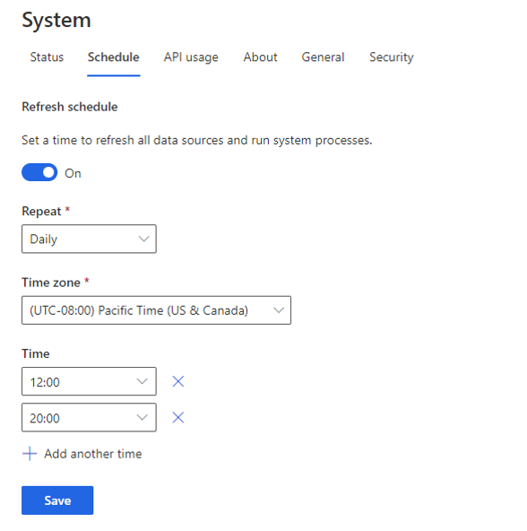

تعتمد عناصر مثل القياسات والشرائح على البيانات التي يتم إدخالها في تطبيقك. وبينما يتم تحديث البيانات من مصادر بياناتك، سيتم أيضاً تحديث عمليات نهائية مثل القياسات والشرائح.

عندما تنشئ مصدر بيانات في البداية، يمكنك أن تحدد تحديث مصدر البيانات يدوياً أو وفقاً لجدول. في حال عدم الإشارة إلى رغبتك في استخدام جدول لمصدر بيانات، فلن يتم تحديثه تلقائياً. ونتيجة لذلك، قد لا تكون العناصر الأخرى في التطبيق دقيقة كما ينبغي لأنها لا تعمل مع الإصدار الأحدث من البيانات.

على علامة تبويب **جدول**، التي تتوفر من خلال تحديد **النظام** ضمن العنوان **الإدارة**، يمكنك جدولة التحديثات التلقائية لجميع [مصادر البيانات التي تم استيعابها](/dynamics365/customer-insights/audience-insights/data-sources/?azure-portal=true#). من خلال إعداد عمليات التحديث التلقائية، يمكنك أن تتأكد من أن التحديثات من جميع مصادر بياناتك تنعكس في ملفات تعريف العملاء الموحدة.

بعد تشغيل مفتاح التبديل **تعيين وقت لتحديث جميع مصادر البيانات**، يمكنك تعريف الجدول الذي تريده. تتضمن خيارات الجدولة التي يمكنك إعدادها:

- **التكرار** - حدد مدى تكرار عملية تحديث مصادر البيانات. يمكنك الاختيار بين عمليات التحديث **الأسبوعية** (إعداد افتراضي) و **اليومية**.

   عندما تحدد التحديثات الأسبوعية، يمكنك تحديد الأيام التي تنوي خلالها جدولة عمليات التحديث الأسبوعية عن طريق تحديد يوم أو أكثر تريد تشغيل التحديث فيه.

- **المنطقة الزمنية** - حدد المنطقة الزمنية حيث أنت.

- **الوقت** - حدد الوقت الذي تريد فيه حدوث عملية تحديث البيانات.

    > [!div class="mx-imgBorder"]
    > 

إذا أردت أن يتم تحديث البيانات أكثر من مرة واحدة في اليوم، فيمكنك إضافة المزيد من الأوقات. على سبيل المثال، من المحتمل أن تتغير المشتريات التي يتم استيعابها في Customer Insights من نظام نقطة البيع على مدار اليوم حيث يقوم العملاء بشراء أصناف من مؤسستك. قد تؤدي جدولة تحديث في منتصف اليوم إلى ضمان توفر البيانات خلال فترة بعض الظهر. وقد تؤدي جدولة تحديث في نهاية اليوم إلى ضمان انعكاس عمليات الشراء في بداية اليوم التالي.

عندما تقوم بإعداد تحديثات مجدولة، ستنشئ جدولاً لتحديث جميع مصادر البيانات الجاري استيعابها. لا يسمح لك جدول التحديث بتحديث مصادر بيانات فردية وفقاً لجدولها الخاص. قد تحدث سيناريوهات حيث تريد تحديث البيانات من مصادر بيانات فردية بشكل أكثر تكراراً أو في وقت قريب من الوقت الحقيقي. في هذه السيناريوهات، يمكنك إعداد تحديثات للبيانات سواء تزايدية أو في الوقت الفعلي.

لمزيد من المعلومات، راجع الروابط التالية:

- [التحديث التزايدي لمصادر البيانات](/dynamics365/customer-insights/audience-insights/incremental-refresh-data-sources/?azure-portal=true#)

- [استيعاب البيانات في الوقت الفعلي](/dynamics365/customer-insights/audience-insights/real-time-data-ingestion/?azure-portal=true#)

بعد ذلك، ستتعلم كيفيه تعريف الأذونات والأمان في Customer Insights.
