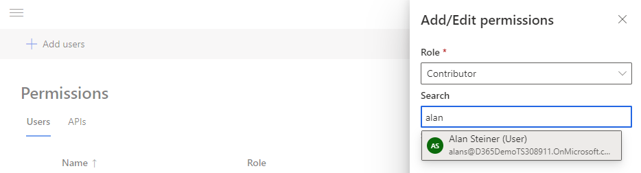

إن Customer Insights عبارة عن تطبيق فريد لأن معظم مستخدمي مؤسستك في الواقع لن يصلوا إلى التطبيق مباشرة. بدلاً من ذلك، سوف يستخدمون البيانات من Customer Insights في التطبيقات التي يستخدمونها كل يوم.

على سبيل المثال، قد يستخدم أحد الموظفين في متجر للبيع بالتجزئة تطبيقاً للترحيب بالعميل على كمبيوتر لوحي. وعندما يصل العميل إلى المتجر، يفتح الموظف تطبيق الترحيب المدعوم بواسطة بيانات من Customer Insights. توفر هذه الميزة للموظف صورة كاملة عن هوية العميل. في مثال آخر، قد يستخدم أخصائي التسويق شرائح تم إنشاؤها في Customer Insights في تطبيق التسويق الذي يستخدمه للتفاعل مع العملاء.

هناك عادةً عدد قليل من المستخدمين الذين يعملون في التطبيق في كل مؤسسة. قد يتضمن هؤلاء المستخدمون المسؤولون الذين يقومون بتكوين مصادر البيانات وإنشاء ملفات تعريف العملاء. أو قد يكونون محللي بيانات يفهمون الجوانب اليومية لعملك. هؤلاء المستخدمون هم الأشخاص الذين يبنون المقاييس والشرائح والرؤى التي يستخدمها المستخدمون في التطبيقات الأخرى.

يجب أن تتوفر لدى الأشخاص الذين سيعملون في التطبيق الأذونات اللازمة للقيام بما يحتاجون إليه في التطبيق. بإمكان المسؤولين التحقق من الأذونات ومنحها من صفحة **الأذونات** في قسم **الإدارة**.

يجب إعداد أي شخص ينتقل إلى تطبيق Customer Insights مباشرةً كمستخدم في التطبيق ويجب تعيين دور أمان له.

> [!div class="mx-imgBorder"]
> 

أنواع الأدوار التي يمكنك الاختيار من بينها هي:

- العارض

- المساهم

- المسؤول

### دور العارض

دور **العارض** هو من الأدوار الأكثر تقييداً في التطبيق. إنه يركّز على توفير الرؤية للبيانات، ولكن ليس على منح القدرة على تعديل أو إنشاء أي شيء في التطبيق.

بإمكان المستخدمين الذين تم تعيينهم إلى دور **العارض** تنفيذ الإجراءات التالية:

- استكشاف الرؤى والشرائح في الصفحات **الرئيسية** وصفحات **الشرائح**.

- البحث في ملفات تعريف العملاء وتصفيتها باستخدام صفحة **العملاء**. يجب أن يكون البحث ممكناً في الحقول.

- عرض صفحة **الإثراء** واستكشافها.

- استكشاف الكيانات وتصديرها باستخدام صفحة **الكيانات‏‎**.

- عرض حالة عمليات النظام باستخدام صفحة **النظام**.

- عرض عمليات التصدير في صفحة **عمليات التصدير‬**.

- تثبيت لوحة معلومات **Power BI Customer Insights** واستخدامها.

### دور المساهم

يوفر دور **المساهم** المزيد من التحكم لتنفيذ المهام المتعلقة بالبيانات في التطبيق. يوصى بهذا الدور للمستخدمين الذين من المحتمل أن يقوموا باستيعاب البيانات في التطبيق وإنشاء عناصر مثل الشرائح والقياسات.

بإمكان المستخدمين الذين تم تعيينهم إلى دور **المساهم** تنفيذ الإجراءات التالية:

- تحميل البيانات وتحويلها باستخدام صفحة **مصادر البيانات**.

- إكمال أقسام **توحيد البيانات** (**التعيين والمطابقة والدمج**)، مما يؤدي إلى الحصول على كيان معلف تعريف العميل الموحد.

- تحديد **العلاقات** و **الأنشطة**.

- إنشاء شرائح باستخدام صفحة **الشرائح**.

- إنشاء قياسات باستخدام صفحة **القياسات**.

- إدارة التكوين وإثراء ملفات تعريف العملاء من صفحة **الإثراء** (لعمليات الإثراء من Microsoft فقط).

- إدارة عمليات التصدير وإنشاؤها استناداً إلى الاتصالات المشتركة مع المساهمين.

### دور المسؤول

تتوفر لدى المستخدمين الذين تم تعيينهم إلى دور **المسؤول** جميع الأذونات المتوفرة للمساهمين، ويمكنهم أيضاً القيام بما يلي:

- تغيير الإعدادات في صفحة **النظام**، يما في ذلك لغة العمل وجداول التحديث لعمليات النظام.

- عرض الأذونات وإضافتها باستخدام صفحة **الأذونات**.

- تعيين تعريفات البحث والتصفية لصفحة **العملاء** باستخدام صفحة **فهرس البحث والتصفية‬** (التي يمكن الوصول إليها من صفحة **العملاء‏‎**).

- إدارة الاتصالات والسماح بها لأدوار المستخدم الأخرى في صفحة **الاتصالات**.

- إدارة التكوين وإثراء ملفات تعريف العملاء من صفحة **الإثراء** (لجميع عمليات الإثراء).

- إدارة عمليات التصدير وإنشاؤها في صفحة **عمليات التصدير**.

- تثبيت **الوظيفة الإضافية بطاقة العميل** واستخدامها.

- إضافة **موصل Power Apps** واستخدامه.

- تمكين استخدام [واجهات API لـ Customer Insights](/dynamics365/customer-insights/audience-insights/apis/?azure-portal=true#).

- تعيين الأدوار والأذونات.
