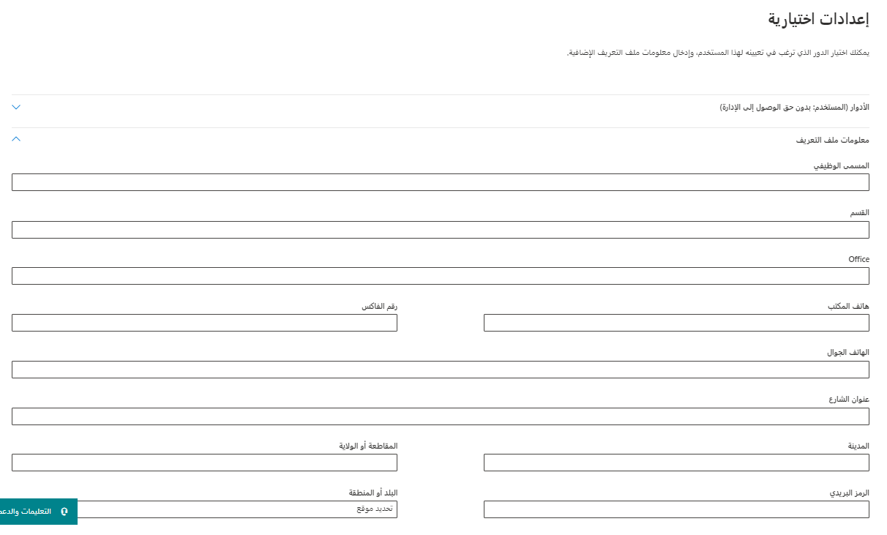

يمكنك استخدام مركز إدارة Microsoft 365 لإنشاء حسابات مستخدمين لكل مستخدم يحتاج إلى الوصول إلى التطبيقات التي تم إنشاؤها باستخدام Microsoft Power Apps وتطبيقات مشاركة العملاء في Microsoft Dynamics ‏365 (Dynamics 365 Sales، وDynamics 365 Customer Service، وDynamics 365 Field Service، وDynamics 365 Marketing، وDynamics 365 Project Service Automation). سيستخدم حساب المستخدم بيئة Microsoft Online Services لتسجيل المستخدم. 

بالإضافة إلى التسجيل في الخدمة عبر الإنترنت، تأكد من تعيين ترخيص لحساب المستخدم حتى يتمكن المستخدم من الوصول إلى الخدمة. عندما تقوم بتعيين مستخدم إلى المسؤول العام أو أدوار مسؤول الخدمة في بيئة Microsoft Online Services، فسوف يقوم تلقائياً بتعيين المستخدم إلى دور أمان مسؤول النظام في تطبيقات مشاركة العملاء.

### إنشاء حسابات المستخدم

عند إنشاء حساب مستخدم في مركز إدارة Microsoft 365، سيقوم النظام بإنشاء معرف مستخدم وكلمة مرور مؤقتة للمستخدم. لديك خيار السماح للخدمة بإرسال رسالة بريد إلكتروني إلى المستخدم في هيئة نص واضح. ورغم أن كلمة المرور مؤقتة، إلا أنه يمكنك أن تفكر في نسخ المعلومات لإرسالها إلى المستخدم من خلال قناة أكثر أمانا، مثل خدمة البريد الإلكتروني التي يمكنها تشفير المحتويات رقمياً. 

لمزيد من المعلومات، راجع  [إضافة المستخدمين وتعيين التراخيص](/office365/admin/add-users/add-users?redirectSourcePath=%252fen-US%252fArticle%252fCreate-or-edit-users-in-Office-365-1970f7d6-03b5-442f-b385-5880b9c256ec&view=o365-worldwide) في Microsoft 365.

لمزيد من المعلومات، راجع [منح المستخدمين النجاح](/power-platform/admin/grant-users-access).

> [!Note]
> عند إنشاء مستخدم وتعيين ترخيص في مركز إدارة Microsoft 365، يتم أيضاً إنشاء المستخدم في تطبيقات مشاركة العملاء. قد يستغرق الأمر بضع دقائق لإكمال عملية المزامنة بين مركز إدارة Microsoft 365 وتطبيقات مشاركة العملاء.
> 
> عن طريق إدخال معرف المستخدم وكلمة المرور، يستطيع المستخدم الوصول إلى مركز إدارة Microsoft 365 لعرض المعلومات المتعلقة بالخدمة. ومع ذلك، لن يتمكن المستخدم من الوصول إلى تطبيقات تفاعل العملاء حتى يتم تعيين دور أمان لهم بشكل مباشر أو غير مباشر كعضو في **فريق المجموعة**.

### معلومات ملف تعريف المستخدم

يتم الاحتفاظ ببعض معلومات ملف تعريف المستخدم وإدارتها في مركز إدارة Microsoft 365. بعد إنشاء مستخدم أو تحديثه، سيتم تحديث حقول ملف تعريف المستخدم هذه تلقائياً ومزامنتها في بيئات مشاركة العملاء الخاصة بك.

يوضح الجدول التالي الحقول التي تتم إدارتها في قسم **المستخدمين** في مركز إدارة Microsoft 365.

|  **نموذج مستخدم تطبيقات مشاركة العملاء** |  **مستخدم Microsoft 365/Azure Active Directory** |
|  --------------------------------------------------------| ----------------------------------------------|
|  اسم المستخدم                                               |  Username|
|  الاسم الكامل                                               |  الاسم الأول + اسم العائلة|
|  ‏‫العنوان                                                   |  المسمى الوظيفي|
|  البريد الإلكتروني الأساسي*                                          |  البريد الإلكتروني|
|  الهاتف الرئيسي                                              |  هاتف المكتب|
|  الهاتف المحمول                                            |  الهاتف المحمول|
|  الفاكس                                                     |  رقم الفاكس|
|  العنوان                                                 |  عنوان الشارع|
|  العنوان                                                 |  المدينة|
|  العنوان                                                 |  المحافظة أو المنطقة|
|  العنوان                                                 |  البلد أو المنطقة|
|  AzureActiveDirectoryObjectId**                          |  ObjectId |

*لمنع فقدان البيانات، لا يتم تحديث حقل البريد الإلكتروني الأساسي ومزامنته تلقائياً مع تطبيقات مشاركة العملاء (عبر الإنترنت).  \** ObjectId

تُظهر الصورة التالية حقول جهات اتصال مستخدم Microsoft 365.

### أدوار مسؤول Microsoft 365

يأتي Microsoft 365 مزوداً بمجموعة من أدوار الإدارة التي يمكنك  [تعيينها](/office365/admin/add-users/assign-admin-roles?view=o365-worldwide)  إلى المستخدمين في مؤسستك. يقوم كل دور مسؤول بتعيين وظائف الأعمال الشائعة ويمنح الموظفين في مؤسستك أذونات لأداء مهام محددة في مركز إدارة Microsoft 365.

من بين جميع الأدوار التي يمكنك تعيينها للمستخدمين، يرتبط القليل منها بـ Microsoft Dynamics ‏365:

- **مسؤول عمومي** - يمكنه الوصول إلى كل الميزات الإدارية في مجموعة خدمات Microsoft 365 في خطتك، بما في ذلك Skype for Business. بشكل افتراضي، يصبح الشخص الذي يقوم بالتسجيل لشراء Microsoft 365 مسؤولاً عمومياً. والمسؤولون العموميون هم المسؤولون الوحيدون الذين يمكنهم تعيين أدوار أخرى للمسؤول. يمكن للمسؤولين العموميين فقط إدارة حسابات المسؤولين العموميين الآخرين. يمكنك الحصول على أكثر من مسؤول عمومي في مؤسستك. كأفضل ممارسة، نوصي بأن يكون لعدد قليل فقط من الأشخاص في شركتك هذا الدور لتقليل المخاطر التي يتعرض لها عملك.
- **مسؤول الفوترة** - يقوم بالشراء وإدارة الاشتراكات وتذاكر الدعم ومراقبة سلامة الخدمة.
- **مسؤول إدارة المستخدمين** - يقوم بإعادة تعيين كلمات المرور ومراقبة سلامة الخدمة وإضافة حسابات المستخدمين وحذفها وإدارة تذاكر الدعم وإضافة الأعضاء وإزالتهم من مجموعات Microsoft 365. لا يمكن لمسؤول إدارة المستخدمين حذف مسؤول عمومي، أو إنشاء أدوار مسؤول أخرى، أو إعادة تعيين كلمات المرور للمسؤول العمومي، ومسؤول الفوترة، وExchange Online، وSharePoint، ومدير التوافق، ومسؤولي Skype for Business.
- **مسؤول خدمة** - استخدم هذا الدور لتعيين المستخدمين لإدارة Dynamics 365 على مستوى المستأجر دون الاضطرار إلى تعيين امتيازات مسؤول عمومي Microsoft 365 أكثر قوةً. يمكن لمسؤول خدمة Dynamics 365 تسجيل الدخول إلى مركز إدارة Dynamics 365 لإدارة المثيلات. لا يمكن لشخص بهذا الدور أداء وظائف مقيدة بمسؤول Microsoft 365 العمومي، مثل إدارة حسابات المستخدمين أو إدارة الاشتراكات أو إعدادات الوصول لتطبيقات Microsoft 365 مثل Exchange أو SharePoint.

لمزيد من المعلومات، راجع [أذونات أدوار المسؤولين](/azure/active-directory/users-groups-roles/directory-assign-admin-roles) في Microsoft Azure Active Directory (Azure AD).

### الإدارة المفوضة

إذا كنت عميلاً تعمل مع أحد شركاء Microsoft، فيمكنك تعيين أدوار المسؤول له. وبدوره، يمكنه تعيين المستخدمين في شركتك (أو شركته) لأدوار المسؤول. على سبيل المثال، قد ترغب في أن يقوم الشريك بإكمال هذه المهمة إذا كان يقوم بإعداد وإدارة Dynamics 365 نيابةً عنك.

يمكن للشريك تعيين الأدوار التالية:
- **الإدارة الكاملة** - تتمتع بامتيازات تعادل المسؤول العمومي.
- **الإدارة المحدودة** - تتمتع بامتيازات تعادل مسؤول مكتب المساعدة/كلمة المرور.

قبل أن يتمكن الشريك من تعيين هذه الأدوار للمستخدمين، يجب عليك إضافة الشريك كمسؤول مفوض إلى حساب Microsoft 365 الخاص بك. يتم بدء هذه العملية بواسطة شريك مخوّل. سيرسل إليك الشريك رسالة إلكترونية ليسألك عما إذا كنت تريد منحه الإذن للعمل كمسؤول مفوض. ولمزيد من المعلومات، راجع [تخويل علاقات الشركاء أو إزالتها](https://support.office.com/article/201ccb3b-6011-4bf1-a6b2-84e7cc1ee2d0.aspx).

### تعيين تراخيص المنتجات

لكي يتمكن المستخدمون من الوصول إلى تطبيقات مشاركة العملاء، يجب أن يكون لديهم ترخيص اشتراك مستخدم تم تعيينه لحساب المستخدم الخاص بهم. 

يصف الفيديو التالي هذه العملية.

> [!VIDEO https://www.microsoft.com/videoplayer/embed/RWqR0P]

### إدارة المستخدمين من خلال PowerShell

يمكن للمؤسسات التي ترغب في إنشاء المستخدمين وإعدادهم وإدارتهم بشكل مجمع بكفاءة استخدام PowerShell لـ Microsoft 365 لإكمال هذه المهام بسرعة.

لمزيد من المعلومات، راجع [إدارة Microsoft 365 باستخدام PowerShell](/office365/enterprise/powershell/manage-office-365-with-office-365-powershell).
