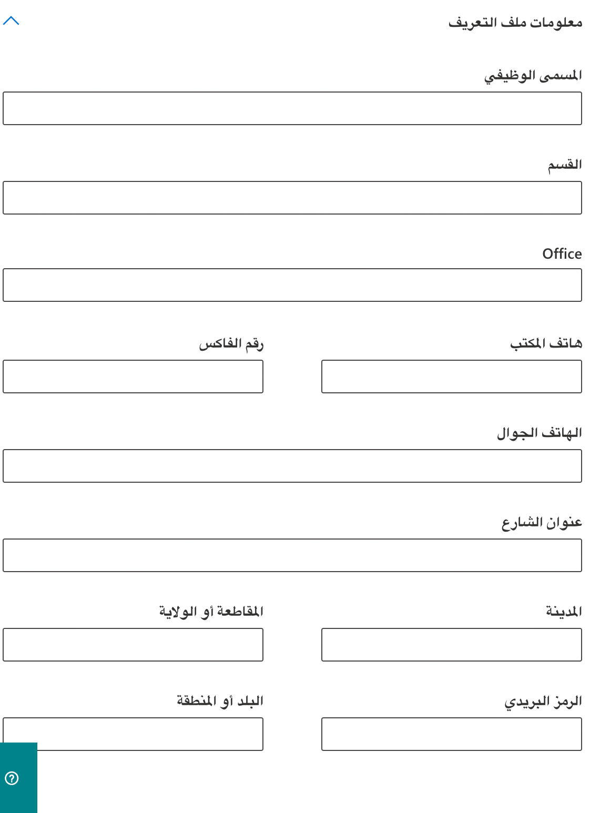

يمكنك استخدام مركز إدارة Microsoft 365 لإنشاء حسابات المستخدمين لكل مستخدم يحتاج إلى الوصول إلى تطبيقات Dynamics 365 Customer Engagement. يعمل حساب المستخدم على تسجيل المستخدم مع بيئة خدمات الإنترنت من Microsoft. بالإضافة إلى التسجيل في خدمة الإنترنت، يجب أن يتم تعيين ترخيص لحساب المستخدم حتى يتمكن المستخدم من الوصول إلى الخدمة. لاحظ أنه عند تعيين مستخدم، المسؤول العمومي، أو دور مسؤول الخدمة في بيئة خدمات الإنترنت من Microsoft، فإنه يقوم تلقائياً بتعيين المستخدم أو دور أمان مسؤول النظام في تطبيقات Dynamics 365 Customer Engagement.

### إنشاء حسابات المستخدمين

عند إنشاء حساب مستخدم في مركز إدارة Microsoft 365، ينشئ النظام معرف مستخدم وكلمة مرور مؤقتة للمستخدم. لديك خيار السماح للخدمة بإرسال رسالة بريد إلكتروني إلى المستخدم في هيئة نص واضح. ورغم أن كلمة المرور مؤقتة، إلا أنه يمكنك أن تفكر في نسخ المعلومات لإرسالها إلى المستخدم من خلال قناة أكثر أمانا، مثل خدمة البريد الإلكتروني التي يمكنها تشفير المحتويات رقمياً. للحصول على إرشادات خطوة بخطوة لإنشاء حساب مستخدم خدمة الإنترنت من Microsoft، راجع [إنشاء أو تحرير مستخدمين في Microsoft 365](/office365/admin/add-users/add-users?redirectSourcePath=%252fen-US%252fArticle%252fCreate-or-edit-users-in-Office-365-1970f7d6-03b5-442f-b385-5880b9c256ec&view=o365-worldwide).

راجع، [إضافة أشخاص إلى تطبيقات Dynamics 365 Customer Engagement](/power-platform/admin/grant-users-access) للحصول على مزيد من المعلومات.

> [!Note]
> عند إنشاء مستخدم وتعيين ترخيص في مركز إدارة Microsoft 365، يتم إنشاء المستخدم أيضاً في تطبيقات Dynamics 365 Customer Engagement. قد تستغرق عملية المزامنة بين مركز إدارة Microsoft 365 وتطبيقات Dynamics 365 Customer Engagement بضع دقائق لإكمالها.

عن طريق إدخال معرف المستخدم وكلمة المرور، يستطيع المستخدم الوصول إلى مركز إدارة Microsoft 365 لعرض المعلومات المتعلقة بالخدمة. ومع ذلك، لن يتمكن المستخدم من الوصول إلى تطبيقات Dynamics 365 Customer Engagement حتى تقوم بتعيين دور أمان تطبيقات Dynamics 365 Customer Engagement واحد على الأقل لهذا المستخدم.

### معلومات ملف تعريف المستخدم

يتم الاحتفاظ ببعض معلومات ملف تعريف المستخدم وإدارتها في مركز إدارة Microsoft 365. بعد إنشاء مستخدم أو تحديثه، يتم تحديث حقول ملف تعريف المستخدم هذه تلقائياً ومزامنتها في مثيلات Customer Engagement.

يعرض الجدول الآتي الحقول التي تتم إدارتها في قسم **المستخدمين** في مركز إدارة Microsoft 365.

|  **نموذج مستخدم تطبيقات Dynamics 365 for Customer Engagement** |  مستخدم **Microsoft 365 / Azure Active Directory** |
|  --------------------------------------------------------| ----------------------------------------------|
|  اسم المستخدم                                               |  اسم المستخدم|
|  الاسم الكامل                                               |  الاسم الأول + اسم العائلة|
|  ‏‫المسمى الوظيفي                                                   |  المسمى الوظيفي|
|  البريد الإلكتروني الأساسي*                                          |  البريد الإلكتروني|
|  الهاتف الرئيسي                                              |  هاتف المكتب|
|  الهاتف المحمول                                            |  الهاتف المحمول|
|  الفاكس                                                     |  رقم الفاكس|
|  العنوان                                                 |  عنوان الشارع|
|  العنوان                                                 |  المدينة|
|  العنوان                                                 |  الولاية أو المنطقة|
|  العنوان                                                 |  البلد أو المنطقة|

*لتفادي فقدان البيانات، لا يتم تحديث حقل البريد الإلكتروني الأساسي تلقائياً ومزامنته مع تطبيقات Dynamics 365 Customer Engagement (عبر الإنترنت).

فيما يأتي حقول جهات اتصال مستخدم Microsoft 365.

### أدوار مسؤول Microsoft 365

يأتي Microsoft 365 مزوداً بمجموعة من أدوار الإدارة التي يمكنك [تعيينها](/office365/admin/add-users/assign-admin-roles?view=o365-worldwide) إلى المستخدم في مؤسستك. يقوم كل دور مسؤول بتعيين وظائف الأعمال الشائعة ويمنح الموظفين في مؤسستك أذونات لأداء مهام محددة في مركز إدارة Microsoft 365.

من جميع الأدوار التي يمكننا تعيينها للمستخدمين، هناك عدد قليل منها يتعلق بـ Microsoft Dynamics 365:

- مسؤول عمومي: يمكنه الوصول إلى كافة الميزات الإدارية في مجموعة خدمات Microsoft 365 في خطتك، بما في ذلك Skype for Business. بشكلٍ افتراضي، يصبح الشخص الذي يسجل لشراء Microsoft 365 مسؤولاً عمومياً. المسؤولون العموميون هم المسؤولون الوحيدون الذين يمكنهم تعيين أدوار مسؤول أخرى، ولا يمكن إلا للمسؤولين العموميين إدارة حسابات المسؤولين العموميين الآخرين. يمكنك الحصول على أكثر من مسؤول عمومي في مؤسستك. وكواحدة من أفضل الممارسات، نوصي بتعيين هذا الدور لعدد قليل من الموظفين في شركتك. حيث إنه يقلل من المخاطر التي تتعرض لها أعمالك.
- مسؤول الفوترة: يقوم بالشراء وإدارة الاشتراكات وتذاكر الدعم ومراقبة سلامة الخدمة.
- مسؤول إدارة المستخدمين: يقوم بإعادة تعيين كلمات المرور ومراقبة سلامة الخدمة وإضافة حسابات المستخدمين وحذفها وإدارة تذاكر الدعم وإضافة الأعضاء وإزالتهم من مجموعات Microsoft 365. لا يمكن لمسؤول إدارة المستخدمين حذف مسؤول عمومي أو إنشاء أدوار مسؤول أخرى أو إعادة تعيين كلمات المرور لمسؤولي global وglobal وExchange وSharePoint وCompliance وSkype for Business.
- مسؤول خدمة Dynamics 365: استخدم هذا الدور لتعيين المستخدمين لإدارة Dynamics 365 على مستوى المستأجر دون الاضطرار إلى تعيين امتيازات مسؤول عمومي Microsoft 365 أكثر قوة. يمكن لمسؤول خدمة Dynamics 365 تسجيل الدخول إلى مركز إدارة Dynamics 365 لإدارة المثيلات. لا يمكن لأي شخص له هذا الدور القيام بوظائف تقتصر على مسؤول Microsoft 365 العمومي مثل إدارة حسابات المستخدمين أو إدارة الاشتراكات أو إعدادات الوصول لتطبيقات Microsoft 365 مثل Exchange أو SharePoint.

للحصول على قائمة تفصيلية بكافة الأدوار المتوفرة، بالإضافة إلى المهام التي يمكن لكل من هذه الأدوار القيام بها وما لا يمكنه القيام بها، وكيفية تداخلها مع الأدوار في خدمات Microsoft الأخرى، راجع [أذونات دور المسؤول في Azure Active Directory](/azure/active-directory/users-groups-roles/directory-assign-admin-roles).

### الإدارة المفوضة

إذا كنت عميلاً وكنت تتعامل مع شريك Microsoft، فيمكنك تعيين أدوار مسؤول له. يمكنه بدوره تعيين مستخدمين في شركتك - أو شركته - لتولي أدوار مسؤول. قد ترغب في تنفيذهم لذلك، إذا كانوا يقومون بإعداد وإدارة Dynamics 365.

يمكن للشريك تعيين هذه الأدوار:
- الإدارة الكاملة، التي تتمتع بامتيازات تعادل المسؤول العمومي.
- الإدارة الكاملة، التي تتمتع بامتيازات تعادل مسؤول مكتب المساعدة/كلمة المرور.

قبل أن يتمكن الشريك من تعيين هذه الأدوار للمستخدمين، يجب إضافة الشريك كمسؤول مفوض إلى حساب Microsoft 365. يتم بدء هذه العملية بواسطة شريك مخوّل. يرسل إليك الشريك رسالة بريد إلكتروني ليسألك عما إذا كنت تريد منحه الإذن للعمل كمسؤول مفوض. للحصول على إرشادات، راجع [تخويل علاقات الشركاء أو إزالتها](https://support.office.com/article/201ccb3b-6011-4bf1-a6b2-84e7cc1ee2d0.aspx).

### تعيين تراخيص المنتجات

لكي يتمكن المستخدمون من الوصول إلى تطبيقات Dynamics 365 Customer Engagement، يجب أن يكون لديهم ترخيص اشتراك مستخدم معين إلى حساب المستخدم الخاص بهم. 

هذه العملية البسيطة موضحة هنا:

> [!VIDEO https://www.microsoft.com/videoplayer/embed/RWqR0P]

### إدارة المستخدمين عبر PowerShell

المؤسسات التي تتطلع إلى إنشاء المستخدمين وتكوينهم وإدارتهم بشكلٍ جماعي يمكنها الاستفادة من Microsoft 365 PowerShell لتنفيذ هذه المهام بطريقة سريعة.

[اعرف المزيد حول Microsoft 365 PowerShell](/office365/enterprise/powershell/manage-office-365-with-office-365-powershell)
