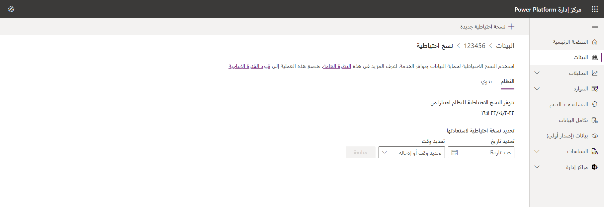
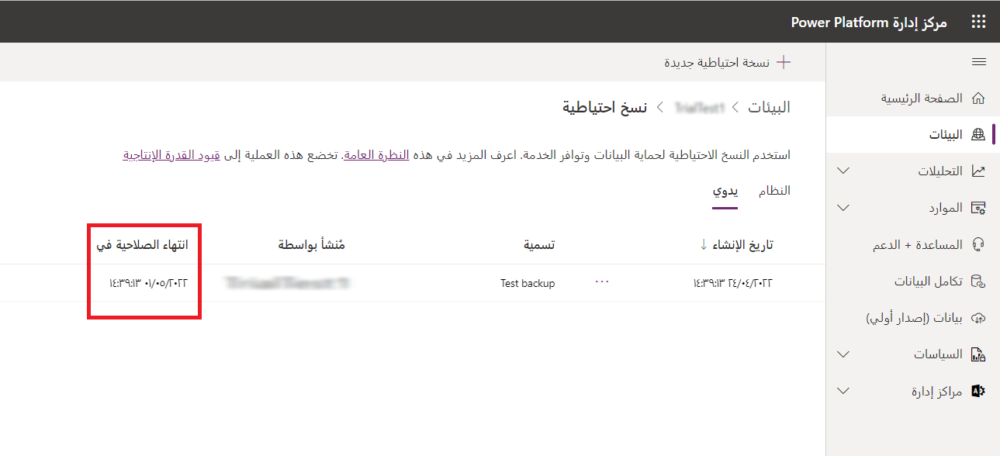

يُعد فهم إدارة البيئة جانباً مهماً لإدارة دورة حياة التطبيق (ALM) السليمة. كما أنه مفيد جداً عندما تختبر وظائف جديدة قبل إدخالها إلى بيئة التشغيل، وقبل اختبار الوظائف بعد التحديث، ومزامنة البيئات قبل أحداث التدريب.

### وضع الإدارة

يمكنك تعيين بيئة الاختبار المعزولة أو بيئة التشغيل أو بيئة الإصدار التجريبي (المستندة إلى الاشتراك) في وضع الإدارة حتى يتمكن المستخدمون الذين لديهم أدوار أمان "مسؤول النظام" أو "مخصص النظام" فقط من تسجيل الدخول إلى تلك البيئة. يكون وضع الإدارة مفيداً عندما تريد إجراء تغييرات تشغيلية ولا تريد أن يؤثر المستخدمون العاديون في عملك أو أن يؤثر عملك في المستخدمين النهائيين (غير المسؤولين).

ضع في اعتبارك العوامل التالية:

- يمكنك وضع بيئة الاختبار المعزولة‬ أو بيئة التشغيل أو بيئة الإصدار التجريبي (المستندة إلى الاشتراك) في وضع الإدارة.
- تستمر معالجة العمليات التي تستخدم التعليمات البرمجية، مثل المكونات الإضافية أو تجميعات سير العمل المخصصة، بواسطة النظام الأساسي لـ Microsoft Dataverse عند تمكين وضع الإدارة وتعطيل العمليات بالخلفية.
- سيحتاج مخصصو النظام إلى تسجيل الدخول إلى البيئة مباشرةً من خلال عنوان URL. والسبب وراء ذلك هو أن البيئة في وضع الإدارة لن تظهر لمخصصي النظام في صفحة **البيئات** في مركز مسؤولي Microsoft Power Platform.

يوضح الجدول التالي الخيارات، التي يمكنك تعيينها في لوحة **الإعدادات**.

| الإعداد| الوصف‏‎|
| :------------------- | :------------------- |
| وضع الإدارة  | حدد هذا الخيار لتمكين وضع الإدارة لبيئة الاختبار المعزولة المحددة. سيكون بمقدور "مسؤولي النظام" أو "مخصصي النظام" فقط تسجيل الدخول إلى بيئة الاختبار المعزولة المحددة. |
| العمليات بالخلفية (اختيارية)                 | حدد هذا الخيار لتعطيل كل العمليات غير المتزامنة (راجع [بنية الخدمات غير المتزامنة](/dynamics365/customer-engagement/developer/asynchronous-service-architecture))، مثل عمليات سير العمل والمزامنة مع Exchange. لن يتم إرسال الرسائل الإلكترونية، وسيتم تعطيل المزامنة على جانب الخادم للمواعيد وجهات الاتصال والمهام. **ملاحظة:** لتعطيل العمليات بالخلفية، تحتاج إلى تمكين وضع الإدارة.                 |
| الرسالة المخصصة (اختيارية)                 | أدخل الرسالة، التي ستظهر لجميع المستخدمين، عند محاولتهم تسجيل الدخول.                  |

### تعيين وضع الإدارة

لتعيين وضع الإدارة، اتبع الخطوات التالية:

1. انتقل إلى [مركز مسؤولي Microsoft Power Platform](https://admin.powerplatform.microsoft.com/)، وسجِّل الدخول باستخدام بيانات اعتماد دور "مسؤول البيئة" أو "مسؤول النظام".

2. من القائمة اليسرى، حدد **البيئات**، ثم حدد بيئة الاختبار المعزولة أو بيئة التشغيل أو بيئة الإصدار التجريبي (المستندة إلى الاشتراك).

3. في صفحة **التفاصيل**، حدد **تحرير**.

4. ضمن **وضع الإدارة**، قم بتبديل **معطل** إلى **ممكّن**.

5. بشكل اختياري، يمكنك تعيين **العمليات بالخلفية** و **الرسالة المخصصة**، ثم تحديد **حفظ**.

### نسخ بيئة

يمكنك استخدام وظيفة **نسخ البيئة** في مركز مسؤولي Microsoft Power Platform لنسخ تطبيقات إشراك العملاء (Dynamics 365 Sales، وDynamics 365 Customer Service، وDynamics 365 Field Service، وDynamics 365 Marketing، وDynamics 365 Project Service Automation)، وكل البيانات الموجودة بين البيئات. يمكنك تحديد مستويين من النسخ: **كل شيء** أو **التخصيصات والمخططات فقط**.

### نسخ كل شيء

تتضمن عملية نسخ **كل شيء** كل بيانات التطبيق والمستخدمين والتخصيصات من البيئة المصدر. هذا المستوي من النسخ مناسب لما يلي:

- اختبار قبول المستخدم (UAT)
- ترقية الاختبار
- الإصدار الأولي في الإنتاج (TAP/EA)
- التدريب
 
#### سيناريو مثال

إن Isaac مطور تطبيقات أعمال تلقى طلباً من قسم المبيعات لإعداد حل تكامل وسائط اجتماعية ونشره من مورد شركة آخر. ولم يسبق أن ثبت Isaac حلاً من هذا المورد وهو غير متأكد من تأثير هذا الحل على تطبيق الإنتاج. ويريد Isaac استيراد الحل إلى بيئة مطابقة تقريباً للإنتاج، ولكنها معزولة عنه، للتعرف على الحل وإجراء تغييرات التكوين المناسبة. يقدم Isaac طلباً إلى Thomas، مدير تكنولوجيا المعلومات في Contoso، لإنشاء بيئة الاختبار المعزولة لنسخ **كل شيء**.

وبعد اكتمال عملية نسخ **كل شيء**، يتلقى Isaac رسالة إلكترونية من Thomas، يخبره فيها بأن بيئة الاختبار المعزولة جاهزة. ويسجِّل Isaac الدخول إلى بيئة الاختبار المعزولة، ويُجري التغييرات اللازمة للتأكد من أن الخدمات الخارجية للإنتاج لن تتأثر ببيئة الاختبار المعزولة. وعندما تكتمل التغييرات، يُوقف Isaac تشغيل وضع الإدارة ويُمكّن خدمات الخلفية. يستطيع Isaac استخدام بيئة الاختبار المعزولة لنسخ **كل شيء** لإجراء اختباره واستيراد الحل إلى الإنتاج يدوياً في وقت لاحق.

### نسخ التخصيصات والمخططات فقط

تتضمن النسخة المصغرة فقط المستخدمين، والتخصيصات، والمخطط من البيئة المصدر، وهي مناسبة لما يأتي:

- التطوير المتكرر للفريق
- حلول الشريك/ISV
- إثبات المفهوم

### سيناريو مثال

لدى Isaac مشروع كبير للتطوير يبدأ من الأسبوع المقبل لقسم المبيعات. ولدى Isaac فريق من المطورين على استعداد للبدء في المشروع، وبعض هذا الفريق من داخل Contoso والبعض الآخر عبارة عن موردين خارجيين. يحتوي تطبيق مبيعات Contoso على معلومات صرَّح مدير قسم المبيعات بوضوح أنه يجب عدم إتاحتها لأي جهات خارجية لأسباب تتعلق بالخصوصية والمسؤولية القانونية. ويطلب Isaac بيئة الاختبار المعزولة للنسخة المصغرة، التي لا تحتوي على أي بيانات إنتاج أو مستخدمين. بالإضافة إلى ذلك، ينشئ Isaac مجموعة أمان Microsoft 365 لمنح فريق التطوير إمكانية الوصول إلى بيئة الاختبار المعزولة.

وبعد أن قام Isaac بتعديل بعض المكونات الإضافية وتمكينها، تعمل بيئة الاختبار المعزولة للمطور بنفس الطريقة، ويتم عزلها تماماً عن تطبيق الإنتاج. ويعمل فريق التطوير على عمليات التعديل الخاصة به في هذه البيئة لعدة أسابيع. ويجمع تغييراته في حل ويقوم بتصديرها/استيرادها لنشرها في بيئة الاختبار المعزولة لنسخ **كل شيء**. وبعد جولة ناجحة من الاختبارات وعمليات الموافقة، يتم نشر التغييرات يدوياً إلى الإنتاج.

### يتم نسخ الجداول المقتطعة في التخصيصات والمخططات فقط

لمزيد من المعلومات، راجع [يتم نسخ الجداول المقتطعة في التخصيصات والمخططات فقط‬](/power-platform/admin/copy-environment#tables-truncated-in-customizations-and-schemas-only-copy).

### نسخ بيئة

للتعرف على خطوات نسخ إحدى البيئات، راجع [نسخ بيئة](/power-platform/admin/copy-environment#copy-an-environment-1).

بعد الانتهاء من عملية النسخ، سيتم وضع البيئة الهدف في [وضع الإدارة](/power-platform/admin/sandbox-environments#administration-mode) ، وسيتم تعطيل العمليات بالخلفية. يوضح القسم التالي إجراءات المسؤول الموصى بها لبيئة (الهدف) النسخ التي تم إنشاؤها حديثاً.

### الخطوات التالية بعد نسخ إحدى البيئات

للتأكد من أن بيئة (الهدف) النسخ التي تم إنشاؤها حديثاً لا تؤثر على بيئة التشغيل الخاصة بك، ستحدث العمليات التالية بعد انتهاء عملية النسخ:

1.  سيتم وضع بيئة النسخ التي تم إنشاؤها حديثاً في وضع الإدارة. يمكن فقط لمن لديهم دور "مسؤول النظام" تسجيل الدخول وإدارة بيئة النسخ. ولا يمكن للمستخدمين العاديين تسجيل الدخول واستخدام بيئة النسخ.

2.  سيتم تعطيل العمليات بالخلفية في بيئة النسخ. تتضمن العمليات المعطلة عمليات سير العمل والمزامنة مع Exchange.

### مراجعة المكونات

يجب عليك مراجعة حالة مكونات التطبيق في بيئة النسخ ذات الاتصالات الخارجية، مثل Yammer، والرسالة الإلكترونية، والمكونات الإضافية، وأنشطة سير العمل المخصصة، وما إلى ذلك. بعد مراجعة الحالات، فكر في الإجراء (الإجراءات) الذي قد ترغب في اتخاذه:

- تعطيل المكون.
- إعادة توجيه المكون إلى بيئة خدمة أخرى، مثل بيئة تشغل Exchange أو SharePoint.
- لا تفعل شيئاً واترك المكون كما هو في بيئة النسخ. على سبيل المثال، قد تقرر السماح لـ Yammer بالنشر إلى بيئتي النسخ والتشغيل.

قد تتضمن مكونات التطبيق التالية في بيئة النسخ اتصالات خارجية، ويمكنها أن تؤثر في الخدمات ذات الاتصالات نفسها في بيئة الإنتاج لديك:

-  **الرسالة الإلكترونية** - لا يمكن مزامنة صندوق البريد مع بيئتين مختلفتين. بالنسبة إلى بيئة نسخ **كل شيء**، تحتاج إلى تعطيل صناديق بريد المستخدمين في بيئة النسخ حتى لا تحاول صناديق البريد إرسال الرسالة الإلكترونية أو تلقيها أو تتبع المواعيد أو جهات الاتصال أو المهام. قم بتعيين مزامنة المكونات التالية إلى **لا شيء**:

   - الرسالة الإلكترونية الواردة
   - الرسالة الإلكترونية الصادرة
   - المواعيد، جهات الاتصال، المهام

لمزيد من المعلومات، راجع [تعيين طريقة التسليم للرسالة الإلكترونية الواردة والصادرة](/power-platform/admin/set-incoming-outgoing-email-synchronization).

- **SharePoint** - يمكنك إلغاء تنشيط SharePoint أو إعادة توجيهه إلى بيئة الاختبار المعزولة في SharePoint لمنع التأثير في المستندات الموجودة في تطبيقات مشاركة عملاء Microsoft Dynamics ‏365 المُدارة بواسطة SharePoint. في تطبيقات مشاركة عملاء Dynamics 365، انتقل إلى **الإعدادات > إدارة الوثائق > SharePoint > المواقع**. حدد موقعك، ثم حدد **إلغاء تنشيط**.

- **Yammer** - يمكنك تعطيل Yammer أو إعادة توجيهه إلى خدمة Yammer منفصلة لمنع تعارض عمليات الترحيل التي تم إجراؤها في بيئة النسخ مع عمليات الترحيل التي تم إجراؤها في بيئة التشغيل. في تطبيقات مشاركة عملاء Dynamics 365، انتقل إلى **الإعدادات > الإدارة > تكوين Yammer**.

بعد أن تُنشئ بيئة اختبار معزولة جديدة، قد تكون عمليات سير العمل ووظائف النظام في انتظار التنفيذ. وبغض النظر عن هذه الوظائف، إذا قمت بتوصيل Yammer بتطبيقات مشاركة عملاء Dynamics 365، فسيتم ترحيل عمليات تدفق أنشطة Yammer من تطبيقات مشاركة عملاء Dynamics 365 إلى Yammer بشكل غير متزامن. وتكون عمليات تدفق الأنشطة هذه غير مرئية من خلال وظائف النظام. في حالة وجود عمليات تدفق أنشطة Yammer معلقة قبل قيامك بتشغيل خيار **تعطيل العملية بالخلفية**، فسيتم ترحيلها إلى تكوين Yammer الحالي بعد قيامك بإيقاف تشغيل خيار **تعطيل العملية بالخلفية**. في بيئة الاختبار المعزولة، إذا قمت بتوصيل تكوين Yammer الحالي لديك بشبكة Yammer نفسها بوصفها بيئة التشغيل الخاصة بك، فقد تحصل على عمليات تدفق أنشطة متكررة. لتجنب تكرار عمليات تدفق أنشطة Yammer، أعد توجيه بيئة الاختبار المعزولة لديك إلى شبكة Yammer أخرى (يمكن أن تكون شبكة اختبار) قبل تشغيل العمليات بالخلفية مرة أخرى.

- **إمكانية توسعة النظام الأساسي** - ضع في الاعتبار تعطيل العناصر التالية، التي يمكن تشغيلها في بيئة النسخ والتأثير في مكونات الخدمة الخارجية:
  - المكونات الإضافية على جانب الخادم
  - النشاط المخصص لسير العمل

- **إمكانية التوسعة من جانب العميل** - راجع المكونات التالية:
  - **JavaScript على جانب العميل‬** - راجع موارد ويب JavaScript وHTML الخاصة بك لعمليات القراءة/الكتابة، التي قد تؤثر في الخدمات الخارجية.
  - **IFRAMES** - حدد ما إذا كان الهدف من IFRAME هو بيئة التشغيل.

- **بحث Dataverse** - تأكد من أن البحث سيعرض النتائج المتوقعة. إذا لم تكن النتائج دقيقة، فيمكنك إيقاف تشغيل بحث Dataverse لمدة 12 ساعة، ثم تشغيل بحث Dataverse مرة أخرى لتحديث الفهرس. يمكنك الاتصال [بدعم Microsoft](/power-platform/admin/get-help-support) إذا كنت لا تزال تواجه مشكلات.

- **التدفقات** - راجع التدفقات في البيئة المنسوخة حديثاً. حرر التدفقات التي تحتاج إلى تعديل المشغلات والإجراءات. قم بتمكين التدفقات وتعطيلها عند الحاجة.

- **مراجع الاتصالات‬** - ستتطلب مراجع الاتصالات اتصالات جديدة. أنشئ الاتصالات وقم بتعيينها في بيئة **مراجع الاتصالات**.

- **الموصلات المخصصة** - يجب عليك مراجعة الموصلات المخصصة وحذفها وإعادة تثبيتها، إذا لزم الأمر.

### النسخ الاحتياطي للبيئات واستعادتها

من المهم أن تكون البيانات الموجودة في تطبيقات مشاركة عملاء Dynamics 365 محمية وأن تتوفر الخدمة لديك بشكل مستمر. لذلك، تتوفر لك خيارات متعددة لنسخ البيئات الخاصة بك احتياطياً واستعادتها.

### عمليات النسخ الاحتياطي للنظام

تتم بعض عمليات النسخ الاحتياطي دون الحاجة إلى القيام بأي شيء.

ضع في الاعتبار العوامل التالية فيما يخص **عمليات النسخ الاحتياطي للنظام**:

- استناداً إلى كم بيانات التدقيق المنسوخة والمستعادة، يمكن أن تستغرق عمليات النسخ والاستعادة ما يصل إلى ثماني ساعات.
- يتم نسخ كل بيئاتك احتياطياً، باستثناء بيئات الإصدارات التجريبية (القياسية والمستندة إلى الاشتراك).
- تتم عمليات النسخ الاحتياطي للنظام باستمرار. التقنية الأساسية المستخدمة هي قاعدة بيانات Microsoft Azure ‏SQL. لمزيد من المعلومات، راجع عمليات النسخ الاحتياطية التلقائية لوثائق قاعدة بيانات SQL.
- يتم الاحتفاظ بنُسخ النظام الاحتياطية لبيئات التشغيل، التي تم إنشاؤها باستخدام قاعدة بيانات والتي تم تثبيت تطبيق واحد أو أكثر من تطبيقات Dynamics 365 لها، لمدة تصل إلى 28 يوماً. سيتم الاحتفاظ بنُسخ النظام الاحتياطية لبيئات التشغيل، التي لا تحتوي على تطبيقات Dynamics 365 منشورة فيها، لمدة سبعة أيام. سيتم الاحتفاظ بنُسخ النظام الاحتياطية لبيئات الاختبار المعزولة لمدة سبعة أيام.
- أنت بحاجة إلى استعادة بيئة إلى نفس المنطقة، التي تم نسخها احتياطياً فيها.
- عند استعادة بيئة ما إلى نفسها، لا يتم حذف سجلات التدقيق. على سبيل المثال، عند استعادة بيئة ما إلى وقت في الماضي **t1**، ستكون بيانات التدقيق الكاملة للبيئة متاحة، بما في ذلك سجلات التدقيق التي تم إنشاؤها بعد **t1**.
- سيتم إدراج البيئة الهدف في القائمة المنسدلة **تحديد البيئة المُراد استبدالها**. إذا لم تظهر البيئة، فلاحظ أن البيئة الهدف يجب أن تكون في نفس المنطقة الجغرافية (الموقع الجغرافي) مثل البيئة المصدر.
- تشارك تدفقات Power Apps وMicrosoft Power Automate فقط في حل Dataverse في عمليات النسخ الاحتياطي والاستعادة.

### عمليات النسخ الاحتياطي اليدوية

عمليات النسخ الاحتياطي التلقائية للنظام مفيدة، ولكنك ستحتاج إلى إنشاء نسخ احتياطية خاصة بك قبل إجراء تغييرات كبيرة في التخصيص أو تطبيق تحديث إصدار. في هذا السيناريو، يمكنك استخدام عمليات النسخ الاحتياطي اليدوية.

ضع في الاعتبار العوامل التالية فيما يخص **عمليات النسخ الاحتياطي اليدوية**:

- يتم إنشاء نسخة احتياطية لك عندما يقوم النظام بتحديث بيئتك.

- يمكنك إجراء نسخ احتياطي لبيئة التشغيل وبيئة الاختبار المعزولة.

- لا يمكنك نسخ البيئة الافتراضية احتياطياً.

- يتم الاحتفاظ بالنسخ الاحتياطية لبيئة الاختبار المعزولة لمدة تصل إلى سبعة أيام.

- يتم الاحتفاظ بالنسخ الاحتياطية لبيئات التشغيل، التي تم إنشاؤها باستخدام قاعدة بيانات والتي تم تثبيت تطبيق واحد أو أكثر من تطبيقات Dynamics 365 لها، لمدة تصل إلى 28 يوماً. سيتم الاحتفاظ بالنسخ الاحتياطية اليدوية لبيئات التشغيل، التي لا تحتوي على تطبيقات Dynamics 365 منشورة فيها، لمدة سبعة أيام.

- ستحتاج إلى التحقق من تاريخ انتهاء الصلاحية الخاص بك.

  

- أنت غير مقيد بعدد عمليات النسخ الاحتياطي اليدوية، التي يمكنك إجراؤها.

- لا يتم احتساب عمليات النسخ الاحتياطي اليدوية ضمن حدود التخزين الخاصة بك.

- ستحتاج إلى استعادة بيئة إلى نفس المنطقة، التي تم نسخها احتياطياً فيها.

### استعادة النسخ الاحتياطية

يمكنك فقط استعادة النسخ الاحتياطية إلى بيئات الاختبار المعزولة. لاستعادة بيئة تشغيل، قم أولاً بتبديلها إلى بيئة اختبار معزولة، واستعدها، ثم قم بتبديلها مرة أخرى إلى بيئة تشغيل. لمزيد من المعلومات، راجع [تغيير نوع البيئة](/power-platform/admin/switch-environment). 

لمزيد من المعلومات حول عمليات النسخ الاحتياطي، راجع [النسخ الاحتياطي للبيئات واستعادتها](/power-platform/admin/backup-restore-environments).
