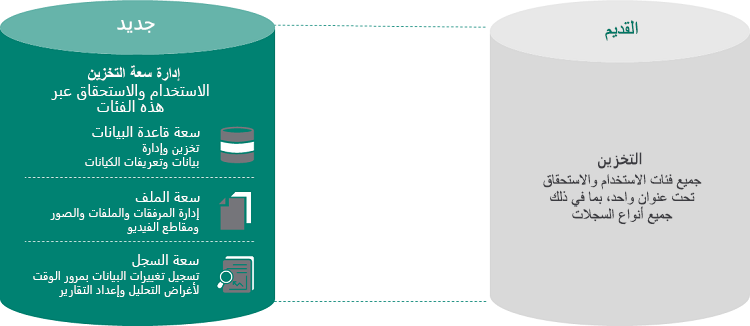
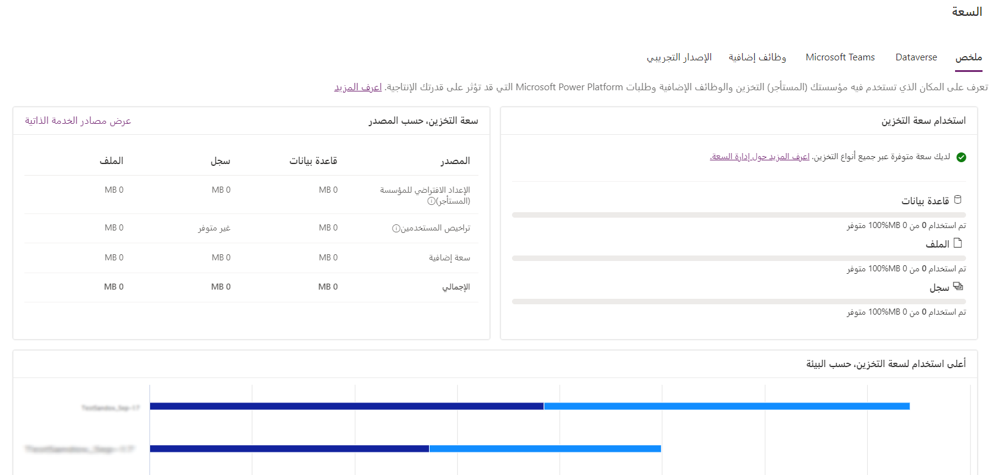

قامت Microsoft بإجراء تغييرات كبيرة على تخزين البيانات وإعداد التقارير. في أبريل 2019، قدمت Microsoft سعة تخزين Microsoft Dataverse، التي تم تحسينها للبيانات العلائقية (قاعدة البيانات) والمرفقات (ملف) وسجلات التدقيق (السجل). يتلقى العملاء الجدد لـ Power Apps، وPower Automate، وتطبيقات مشاركة العملاء (Dynamics 365 Sales، وDynamics 365 Customer Service، وDynamics 365 Field Service، وDynamics 365 Marketing، وDynamics 365 Project Service Automation) استحقاقاً افتراضياً على مستوى المستأجر لكل نوع تخزين واستحقاقات ترخيص اشتراك إضافية لكل مستخدم. يمكن للعملاء شراء سعة تخزين إضافية بزيادات قدرها 1 غيغابايت. لن يتأثر العملاء الحاليون بهذا التغيير حتى نهاية اشتراكهم الحالي في Power Apps أو Dynamics 365، عندما يكون التجديد مطلوباً.

### نسختان من تقارير التخزين
الإصداران من تقارير سعة التخزين هما:

- **نموذج السعة القديم** - المؤسسات التي لديها [نموذج الترخيص السابق](/power-platform/admin/legacy-capacity-storage#licenses-for-the-legacy-storage-model) للتخزين. سيختبر المستخدمون الذين لديهم هذه التراخيص سعة واحدة على الاستحقاق. لمزيد من المعلومات، راجع [سعة التخزين القديمة](/power-platform/admin/legacy-capacity-storage)

- **نموذج السعة الجديد** - المؤسسات التي لديها [نموذج الترخيص الجديد](/power-platform/admin/capacity-storage#licenses-for-the-new-storage-model) للتخزين. سيختبر المستخدمون الذين لديهم هذه التراخيص استحقاق سعة التخزين والاستخدام بواسطة قاعدة البيانات والملف والسجل. لمزيد من المعلومات، راجع [سعة تخزين Dataverse](/power-platform/admin/capacity-storage).

لمزيد من المعلومات حول كميات التخزين المضمنة في خطط تطبيقات مشاركة العملاء المتنوعة، راجع [أسعار Dynamics 365](https://www.microsoft.com/dynamics365/pricing).

### مراقبة مقدار مساحة التخزين التي تستخدمها مؤسستك

في مركز مسؤولي Microsoft Power Platform، تُظهر طريقة عرض على مستوى المستأجر المكان الذي تستخدم فيه مؤسستك سعة التخزين.

1. سجِّل الدخول إلى مركز مسؤولي Microsoft Power Platform كمسؤول.

2. حدد علامة التبويب **الموارد > السعة > الملخص**.

3. اعرض البيانات على صفحة **الملخص**.

### عند تجاوز حد التخزين

إذا تجاوزت سعة التخزين لديك، فسيتلقى مسؤولو النظام إخطارات عبر البريد الإلكتروني تنبههم إلى استخدام السعة الزائدة. بالإضافة إلى ذلك، سيتم عرض لافتة إعلام في مركز مسؤولي Microsoft Power Platform عندما يتجاوز المستأجر سعة التخزين.

لن تتوفر عمليات المسؤول التالية عندما يتجاوز المستأجر استحقاقات سعة التخزين:

- إنشاء بيئة جديدة (يتطلب توفر سعة 1 غيغابايت كحد أدنى)
- نسخ بيئة جديدة (يتطلب توفر سعة 1 غيغابايت كحد أدنى)
- استعادة بيئة جديدة (تتطلب توفر سعة 1 غيغابايت كحد أدنى)

### الإجراءات التي يجب اتخاذها لمواجهة عجز في سعة التخزين

عندما يكون لديك عجز في سعة التخزين، يمكنك [تفريغ مساحة التخزين](/power-platform/admin/free-storage-space)، أو [حذف البيئات غير المطلوبة](/power-platform/admin/delete-environment)، أو شراء المزيد من السعة لتكون متوافقة مع استخدام التخزين. لمزيد من المعلومات، راجع [دليل ترخيص Dynamics 365](https://go.microsoft.com/fwlink/p/?LinkId=866544) أو [قسم الإضافات في دليل ترخيص Power Apps وPower Automate](https://go.microsoft.com/fwlink/?linkid=2085130). يمكنك العمل من خلال عملية الشراء القياسية لمؤسستك لشراء [إضافات للسعة](/power-platform/admin/capacity-storage#actions-to-take-for-a-storage-capacity-deficit).

