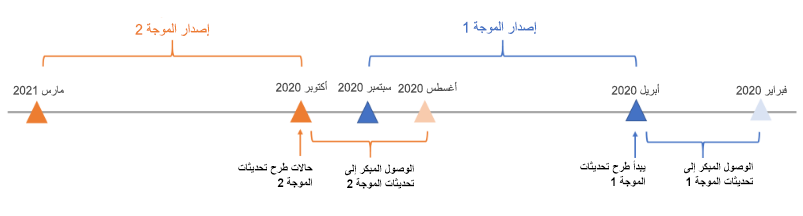
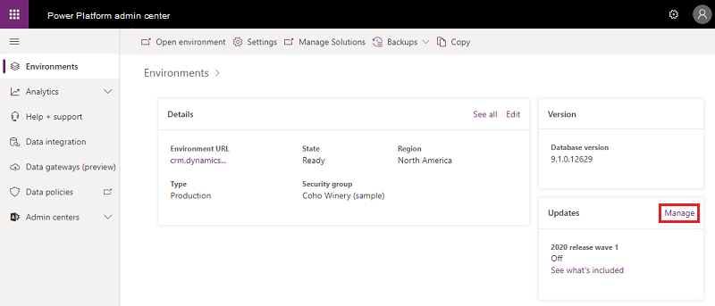
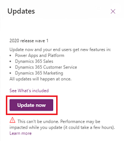
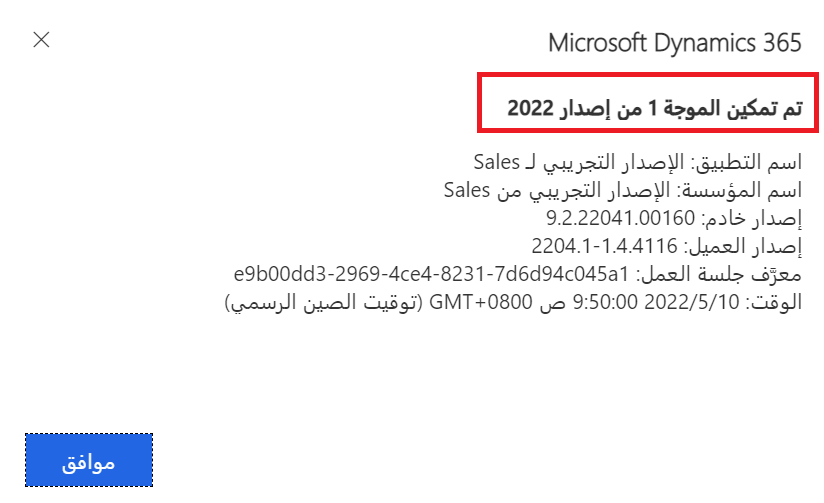
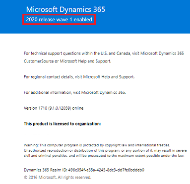

يمكن لـ Microsoft Power Platform وفرق مشاركة العملاء اختيار تسليم [إصدارين رئيسيين](/power-platform/admin/policies-communications#major-release-events) كل سنة (أبريل وأكتوبر) وهما يوفران إمكانات ووظائف جديدة. 

نظراً لأن الإصدارات الرئيسية تتضمن ميزات تؤثر على تجربة المستخدم، يمكنك الاشتراك في الوصول المبكر إلى التحديث الذاتي للإصدار الجديد. بعد ذلك، يمكنك البدء في اختبار الميزات الجديدة والتحقق منها قبل تمكينها تلقائياً للمستخدمين.

### توافر الوصول المبكر  
بالنسبة لكل إصدار رئيسي، يمكنك الاشتراك في تحديثات الوصول المبكر قبل شهرين تقريباً من تمكين الإصدار الرئيسي تلقائياً في منطقتك.

على سبيل المثال، بالنسبة للإصدار الرئيسي **الموجة 1** الذي من المقرر تمكينه تلقائياً بدءاً من الأسبوع الأول من أبريل، ستكون قادراً على الاشتراك في تحديثات الوصول المبكر في أوائل فبراير. وبالمثل، بالنسبة لإصدار **الموجة 2** الذي من المقرر تمكينه تلقائياً بدءاً من الأسبوع الأول من أكتوبر، ستكون كذلك قادراً على الاشتراك في تحديثات الوصول المبكر في أوائل أغسطس.

يُظهر المثال التالي مخططاً زمنياً لتوفر التحديث المبكر.

> [!NOTE]
> عندما تكون موجة الإصدار متاحة بشكل عام، سيتم تعيين حالة التحديث في بيئاتك إلى **تشغيل** لتلقي كل ما كل الميزات والتحديثات المخطط لها طوال الإصدار تلقائياً.  

### البيئات المتاحة لتحديثات الوصول المبكر 
تتوفر تحديثات الوصول المبكر لجميع أنواع البيئات، بما في ذلك الإصدار التجريبي وبيئة الاختبار المعزولة والإنتاج. ومع ذلك، فإن أفضل الممارسات هي تمكين التحديثات في بيئة **الإصدار التجريبي** أو **بيئة الاختبار المعزولة** قبل بيئات الإنتاج.
 
[ترحيل المستأجر إلى المستأجر](/power-platform/admin/move-environment-tenant) غير مدعوم لتحديثات الوصول المبكر.  

> [!IMPORTANT]
> على الرغم من أنه يمكنك تمكين تحديثات الوصول المبكر في بيئة الإنتاج، فإننا نوصي بشدة بإنشاء نسخة من بيئة الإنتاج الخاصة بك كبيئة حماية لتجربة الميزات الجديدة أولاً. لا يمكن التراجع عن التحديثات بعد تمكينها؛ لذا إذا قمت باختبار التحديثات والتحقق منها في بيئة آلية تحديد الصلاحيات قبل تمكينها في بيئة إنتاج، يمكنك تحديد تأثيرها على المستخدمين في مؤسستك.

### تمكين تحديثات الوصول المبكر 
لتمكين تحديثات الوصول المبكر، اتبع الخطوات التالية:

1. سجّل الدخول إلى [مركز مسؤولي Microsoft Power Platform](https://admin.powerplatform.microsoft.com/). 

2. حدد البيئة المُراد تحديثها. 

3. ضمن **التحديثات**، سيظهر موجه الإصدار الجديد على أنه متوفر. حدد **إدارة**. 

   
    لقطة شاشة مثال. ليست الموجة الحالية. 

4. حدد **تحديث الآن**، ثم تابع عبر مربعات حوار التأكيد لتمكين الميزات والإمكانات الجديدة لموجة الإصدار.  
 
   
    لقطة شاشة مثال. ليست الموجة الحالية. 

بعد اكتمال التحديث، سيتم تمكين جميع ميزات الوصول المبكر للتطبيقات التي تعتمد على النموذج في بيئتك. 

### تأكيد إكمال التحديث  
للتحقق من تمكين موجة الإصدار، افتح البيئة، وحدد **رمز الإعدادات > حول** لعرض موجة الإصدار الممكّنة.

|في الواجهة الموحدة  |في واجهة عميل الويب  | 
|---------|-------|
|  لقطة شاشة مثال. قد لا تكون الموجة الحالية.        |    لقطة شاشة مثال. قد لا تكون الموجة الحالية.         |

> [!NOTE]
> ستحتاج إلى تحديد **حول** صفحة تطبيقات Dynamics 365 المعروضة في [الواجهة الموحدة](/power-platform/admin/about-unified-interface)، مثل صفحات مركز المبيعات أو مركز خدمة العملاء. 
>
> لن يتم تحديث إصدار الخادم إلى الإصدار التالي بعد تمكين موجة الإصدار. 
