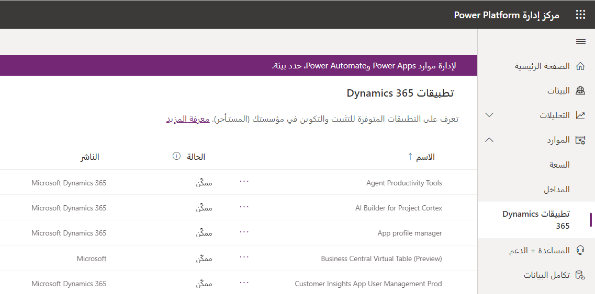
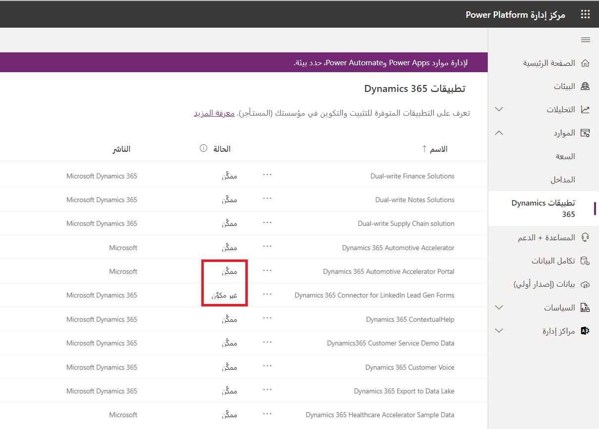
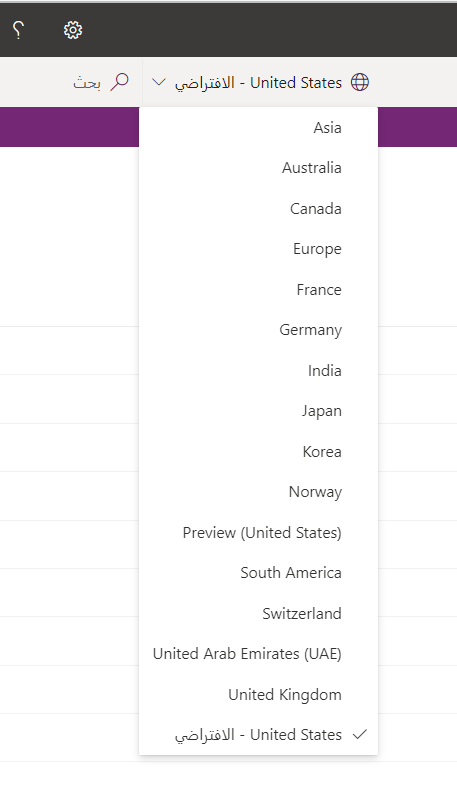
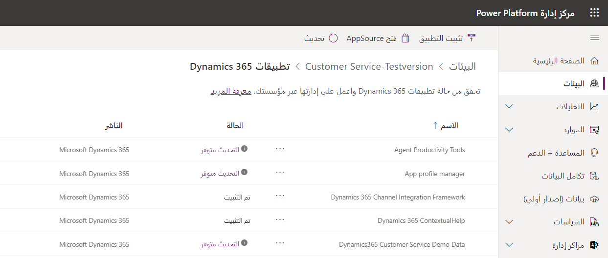
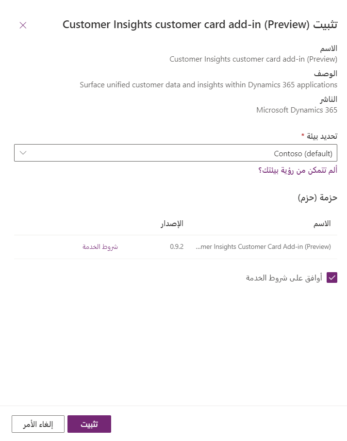
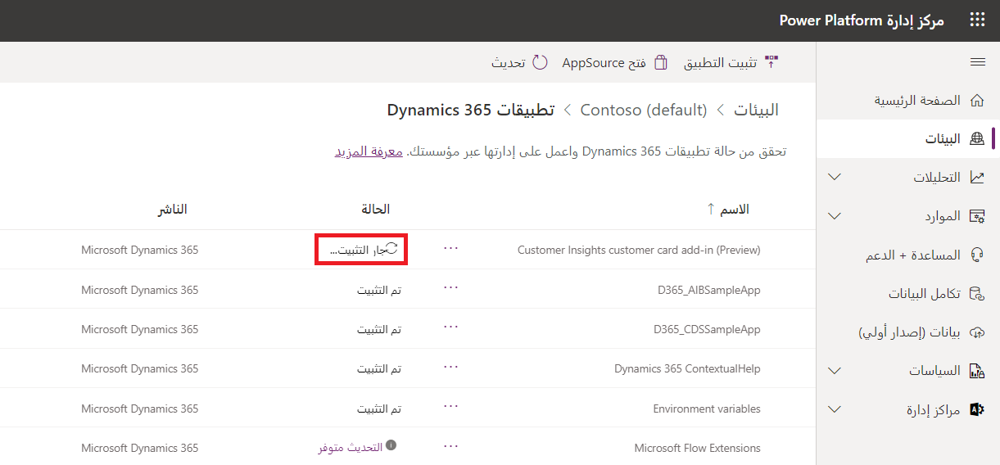
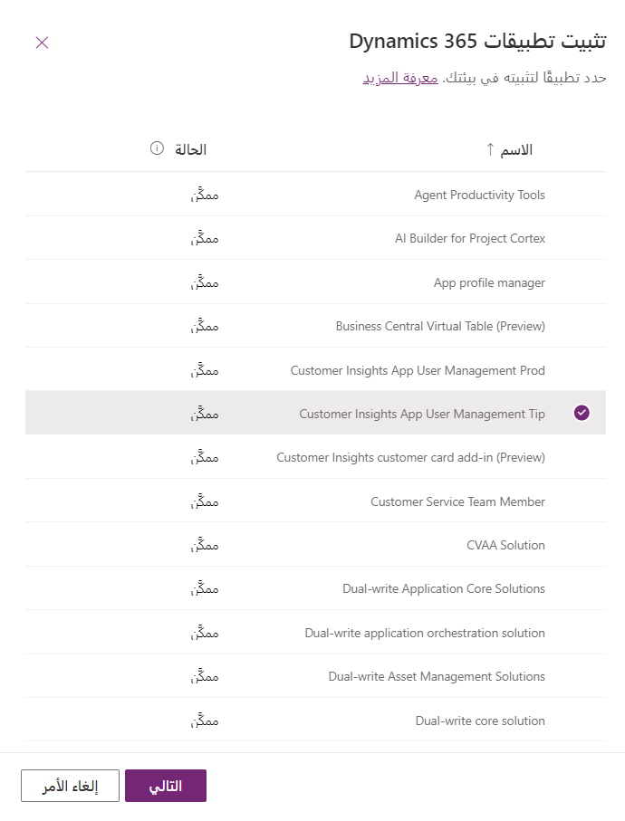

يأتي كل مستأجر ‪Microsoft Dynamics 365‬ بمجموعة متنوعة من التطبيقات والوظائف التي يجب على المؤسسة تثبيتها للاستفادة منها. يمكنك تثبيت هذه التطبيقات من خلال مركز مسؤولي Microsoft Power Platform.

> [!NOTE]
> يمكنك تثبيت تطبيقات Dynamics 365 وإدارتها فقط في بيئة تم إنشاؤها باستخدام قاعدة بيانات ومع تمكين تطبيقات Dynamics 365 أثناء إنشاء البيئة. مطلوب ترخيص Dynamics 365 صالح لتمكين تطبيقات Dynamics 365 أثناء إنشاء البيئة. لمزيد من المعلومات، راجع [إنشاء بيئة باستخدام قاعدة بيانات](/power-platform/admin/create-environment#create-an-environment-with-a-database).

يمكنك إدارة التطبيقات من مستوى المستأجر أو مستوى البيئة.

### عرض التطبيقات على مستوى المستأجر

في علامة التبويب **التطبيقات** في مركز إدارة Dynamics 365، يمكنك إدارة التطبيقات من عرض مستوى المستأجر للتطبيقات في مركز مسؤولي Microsoft Power Platform. 

اتبع هذه الخطوات لعرض قائمة بجميع التطبيقات المرخصة للمستأجر الخاص بك:

1. سجّل الدخول إلى [مركز مسؤولي Microsoft Power Platform](https://admin.powerplatform.microsoft.com).

2. حدد **الموارد > تطبيقات Dynamics 365** من القائمة اليسرى.

   سيتم عرض قائمة بتطبيقات Dynamics 365 المثبتة أو المتوفرة للتثبيت أو التكوين للمستخدم الذي قام بتسجيل الدخول. سيتمكن المسؤول من عرض جميع التطبيقات المثبتة أو المتاحة للتثبيت.

   ستظهر العناصر المكررة ضمن **الاسم**، إذا كان لديك ترخيص التطبيق نفسه المطبق على بيئات متعددة.

    

   تُظهر لقطة الشاشة السابقة الحالات التالية في عمود **الحالة**:

   - **ممكّن** - هذا التطبيق جاهز للتثبيت في بيئاتك. 
   - **مكوَّن** - تم إعداد التطبيق لبيئة. يمكنك إعداد التطبيق لبيئة مختلفة مرة أخرى، أو يمكنك تحديث الإعداد إلى البيئة الحالية.
   - **غير مكوَّن** - التطبيق جاهز للإعداد لبيئة.

3. بناءً على حالة التطبيق، يمكنك إكمال المهام التالية من شريط القائمة العلوي:

    - **إدارة** - حدد هذا الخيار للانتقال إلى صفحة، حيث يمكنك إدارة تطبيقك. 
    - **تفاصيل** - عرض معلومات حول التطبيق، مثل الناشر.
    - **تثبيت التطبيق** - تثبيت تطبيقات معينة للبيئة المحددة التي لديك أذونات لها. بعد تحديد بيئة، سيتم عرض قائمة بالحزم المطلوب تثبيتها.

4. إذا كان المستأجر الخاص بك في بلدان/مناطق متعددة، فيمكنك تغيير اللغة باستخدام محدّد المنطقة.

     

### عرض التطبيقات على مستوى البيئة

بالإضافة إلى مستوى البيئة، يمكنك إنجاز إدارة الحلول من عرض مستوى البيئة في مركز مسؤولي Microsoft Power Platform.

 

اتبع هذه الخطوات لعرض قائمة بجميع التطبيقات المرخصة التي قمت بتثبيتها لبيئتك:

1. سجّل الدخول إلى [مركز مسؤولي Microsoft Power Platform](https://admin.powerplatform.microsoft.com).

2. حدد **البيئات**، ثم حدد بيئة.

3. ضمن **الموارد**، حدد **تطبيقات Dynamics 365**.

   سيتم عرض قائمة بتطبيقات Dynamics 365 التي قمت بتثبيتها في البيئة المحددة.

   

4. حدد تطبيقاً. بناءً على حالة التطبيق، يمكنك إكمال المهام التالية من شريط القائمة العلوي:

    - **تثبيت التطبيق** - يمكن للمسؤولين تثبيت تطبيقات معينة على البيئة المحددة التي لديهم إذن بها. بعد تحديد بيئة، سيتم عرض قائمة بالحزم المطلوب تثبيتها.
    - **فتح AppSource** - حدد هذا الخيار لتثبيت تطبيق من Microsoft AppSource.
    - **التحديث** - يظهر في حالة توفر أحد التحديثات. حدد هذا الخيار لتحديث الحزمة.
    - **تفاصيل** - عرض معلومات حول التطبيق، مثل الناشر.

### تثبيت تطبيق
تعتمد عملية تثبيت التطبيق على طريق العرض الخاصة بك.

### تثبيت تطبيق في طريقة عرض المستأجر
لتثبيت تطبيق في طريقة عرض المستأجر، اتبع الخطوات التالية:

1. سجّل الدخول إلى [مركز مسؤولي Microsoft Power Platform](https://admin.powerplatform.microsoft.com).

2. حدد **الموارد > تطبيقات Dynamics 365** من القائمة اليسرى.

3. قم بتحديد تطبيق **ممكّن**، ثم حدد **تثبيت** من شريط القائمة العليا. 

4. حدد بيئة، وراجع الحزم المراد تثبيتها، ووافق على شروط الخدمة، ثم حدد **تثبيت**.

   

   في طريقة عرض مستوى البيئة، يمكنك عرض حالة التثبيت.

   

### تثبيت تطبيق في طريقة عرض البيئة
لتثبيت تطبيق في طريقة عرض البيئة، اتبع الخطوات التالية:

1. سجّل الدخول إلى [مركز مسؤولي Microsoft Power Platform](https://admin.powerplatform.microsoft.com).

2. حدد **البيئات**، ثم حدد بيئة.

3. ضمن **الموارد**، حدد **تطبيقات Dynamics 365**.

4. حدد **تثبيت تطبيق**. 

5. قم بتحديد تطبيق **ممكّن**، ثم حدد **التالي**.

   

6. وافق على شروط الخدمة، ثم حدد **تثبيت**.

### إدارة Power Apps

إذا كنت مسؤولاً عن البيئة، أو مسؤولاً عمومياً، أو مسؤول Microsoft Power Platform، فيمكنك إدارة التطبيقات من Power Apps التي تم إنشاؤها في مؤسستك.

لمزيد من المعلومات، راجع [إدارة Power Apps](/power-apps/powerapps-overview).
