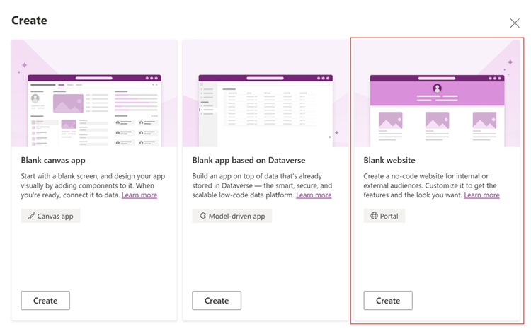
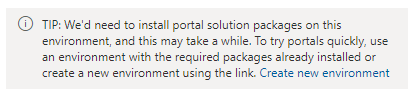
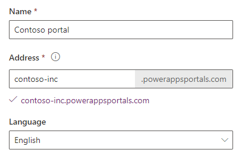
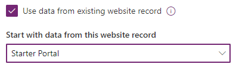
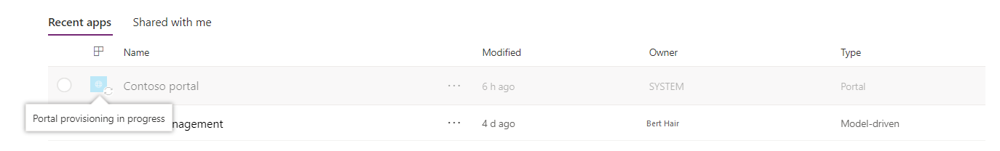
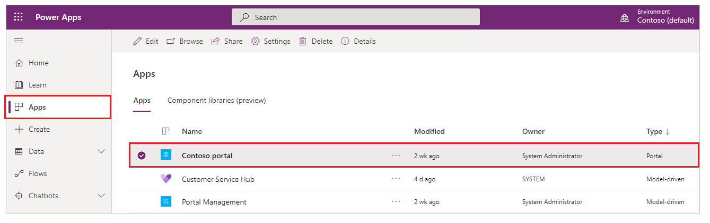

يسمح لك منشئو Power Apps بإنشاء نوع تجربة فعال جديد؛ مواقع ويب موجهة نحو الخارج تسمح للمستخدمين من خارج مؤسساتهم بتسجيل الدخول باستخدام مجموعة واسعة من الهويات أو إنشاء وعرض البيانات في Microsoft Dataverse أو حتى استعراض المحتوى من دون الإفصاح عن الهوية. الإمكانات الكاملة لمداخل Microsoft Dynamics 365 متاحة الآن كإمكانات قائمة بذاتها في Power Apps.

تتميز هذه الإمكانات بتجربة محدثة وشاملة للصانعين لإنشاء موقع ويب بسرعة وتخصيصه بالصفحات والتخطيط والمحتوى. يمكن للمنشئين إعادة استخدام تصميمات الصفحة من خلال القوالب وإضافة نماذج وطرق عرض لعرض البيانات الأساسية من Dataverse، ونشرها للمستخدمين.

من خلال القدرة على إنشاء مدخل في Power Apps، يمكنك إنشاء موقع ويب للمستخدمين الخارجيين والداخليين، مما يمكنهم من التفاعل مع البيانات المخزنة في Microsoft Dataverse.

تتضمن مزايا إنشاء مدخل Power Apps ما يلي:

- يتم تخزين البيانات في Dataverse، لذا لا تحتاج إلى إنشاء اتصال من Power Apps كما تفعل مع مصادر البيانات مثل SharePoint أو تطبيقات مشاركة العملاء (مثل Dynamics 365 Sales، وDynamics 365 Customer Service) أو Salesforce. ما عليك سوى تحديد الجداول التي تريد عرضها أو إدارتها في المدخل.

- يمكنك تصميم المدخل من خلال Microsoft Power Apps ‏Studio عن طريق إضافة مكونات وإعدادها على صفحات الويب.

يمكنك إنشاء مدخل في بيئة جديدة أو في بيئتك الحالية.

إذا اخترت إنشاء مدخلك في بيئة جديدة باستخدام رابط **إنشاء بيئة جديدة**، فإن المتطلبات الأساسية للمدخل، مثل الجداول والبيانات وقالب المدخل للمبتدئين، سيتم تثبيتها عند إنشاء البيئة. في هذه الطريقة، يتم توفير المدخل في بضع دقائق.

إذا اخترت إنشاء المدخل في بيئة موجودة بدون المتطلبات الأساسية للمدخل، فسيتم تثبيت المتطلبات الأساسية أولاً ثم يتم إنشاء المدخل. في هذه الطريقة، يمكن أن يستغرق توفير المدخل بعض الوقت وسيتم إعلامك عندما يتم توفير المدخل.

استناداً إلى البيئة المحددة في Power Apps، يمكنك إنشاء مدخل Dataverse لبدء التشغيل أو مدخل في بيئة تحتوي على تطبيقات مشاركة العملاء (مثل Dynamics 365 Sales وDynamics 365 Customer Service).

> [!TIP]
> لمعرفه الأدوار المطلوبة لإنشاء مدخل، راجع [أدوار المسؤول المطلوبة لمهام المدخل الإدارية](/powerapps/maker/portals/admin/portal-admin-roles.md).

لإنشاء مدخل Dataverse لبدء التشغيل في Power Apps، اتبع الخطوات التالية:

1. سجّل الدخول إلى [Power Apps](https://make.powerapps.com).  

2. ضمن **إنشاء التطبيق الخاص بك**، حدد **تطبيق فارغ**.

3. حدد **إنشاء** من خيار **موقع الويب الفارغ**.

   
    
4. إذا كانت البيئة المحددة لا تحتوي على المتطلبات الأساسية للمدخل، فسيتم عرض رسالة في نافذة **المدخل من فارغ** تقترح أن تحدد بيئة أخرى أو تنشئ بيئة جديدة.

   

1. إذا اخترت الاستمرار في البيئة الحالية، أدخل المعلومات المطلوبة في النافذة، كما هو مذكور في الخطوات التالية. إذا اخترت إنشاء بيئة جديدة، فراجع [إنشاء بيئة جديدة](/powerapps/maker/portals/create-additional-portals.md#create-new-environment).

2. في نافذة **مدخل من فارغ**، أدخل اسماً للمدخل وعنواناً لموقع الويب، ثم حدد لغة من القائمة المنسدلة **اللغة**.

    > [!TIP]
    > لإنشاء مدخل باستخدام لغة مختلفة، تأكد أولاً [من قيامك بتمكين اللغة في البيئة](/power-platform/admin/enable-languages#enable-the-language) حتى تصبح متوفرة في القائمة المنسدلة **اللغة**.

    

3. (اختياري) لإنشاء المدخل باستخدام سجل موقع ويب موجود، حدد خانة الاختيار **استخدام البيانات من سجل موقع الويب الحالي**، ثم حدد سجل موقع الويب الذي تريد استخدامه. لمزيد من المعلومات، راجع [إنشاء مدخل جديد باستخدام البيانات المرّحلة](/powerapps/maker/portals/migrate-portal-configuration.md#create-new-portal-using-migrated-data).

   

4. عند الانتهاء، حدد **إنشاء**.

بعد تحديد **إنشاء**، سيبدأ المدخل في التوفير، وسيتم عرض حالة التوفير من خلال [الإعلامات](/powerapps/maker/portals/create-portal.md#portal-provisioning-notifications).

إذا قمت بإنشاء المدخل في البيئة التي لم يتم تثبيت المتطلبات الأساسية للمدخل به، فسيتم عرض حالة التوفير في الشبكة أيضاً، كما هو موضح في الصورة التالية.

بعد توفير المدخل بنجاح، سيتم تحديث الحالة وسيتم عرض المدخل في الشبكة.

حدد **استعراض** لفتح المدخل لاستعراض موقع الويب. يساعدك هذا الخيار في عرض المدخل كما سيظهر لعملائك. 

لإدارة المدخل، بما في ذلك المشاركة والترخيص، راجع [تحرير مدخل](/powerapps/maker/portals/manage-existing-portals).
