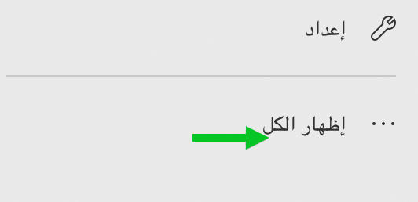

تحقق التمارين أفضل النتائج عند استخدام الإصدار 9.0 أو إصدار أحدث من البيئة التجريبية لتطبيقات Dynamics 365 Customer Engagement.

### الأهداف التعليمية

ستتمكن في نهاية هذه التمارين من تنفيذ المهام التالية: إنشاء نسخة احتياطية عند الطلب، والتحقق من التحديثات المتوفرة، وتثبيت تطبيق صوت العميل.

الوقت المقدر لإنهاء هذا التمرين العملي: 20 إلى 30 دقيقة

### الخطوات عالية المستوى

1. التحقق من التحديثات المتوفرة لمثيل الإنتاج في مركز إدارة 365 Microsoft Dynamics
2. إنشاء نسخة احتياطية عند الطلب من مثيل الإنتاج في مركز إدارة 365 Microsoft Dynamics
3. تثبيت تطبيق صوت العميل في مركز إدارة 365 Microsoft Dynamics

### الخطوات التفصيلية

تعمل مستشاراً وظيفياً يبدأ العمل في تنفيذ Dynamics 365 CE لعميل جديد. يتضمن هذا التنفيذ توزيع تطبيق صوت العميل وتكوينه. قبل تثبيت تطبيق صوت العميل على مثيل الإنتاج، عليك اتخاذ بعض الاحتياطات لضمان تقليل خطر مواجهة أي مشكلات أثناء التثبيت قدر المستطاع.

#### التحقق من التحديثات المتوفرة لمثيل الإنتاج

1. انتقل إلى **admin.microsoft.com**
2. في جزء التنقل الأيسر، انقر فوق **إظهار الكل**، أدنى > **تخصيص التنقل**

3. حدّد **كل مراكز الإدارة**

4. انقر فوق لوحة **Dynamics 365**
5. انقر فوق علامة التبويب **التحديثات**
6. دوّن حالة تحديث مثيل الإنتاج. في هذا المثال، تظهر الحالة **لا توجد جدولة تحديث**، وهذا أمر جيد في حالتنا. فنحن لا نريد أن نبدأ في تثبيت تطبيق مثل صوت العميل في أثناء توزيع تحديث في المثيل.

#### إنشاء نسخة احتياطية عند الطلب لمثيل الإنتاج

7. انقر فوق علامة التبويب **النسخ الاحتياطي والاستعادة**
8. تأكّد من أن مثيل الإنتاج الخاص بك قد تم تحديده في القائمة المنسدلة **النسخ الاحتياطية لـ:**
9. انقر فوق **نسخة احتياطية جديدة**

10. أدخِل **قبل تثبيت صوت العميل** بوصفه التسمية
11. أدخِل **تم إنشاء نسخة احتياطية قبل تثبيت تطبيق صوت العميل.** في حقل الملاحظات.
12. انقر فوق **إنشاء** لإنشاء نسخة احتياطية عند الطلب

13. انتظر حتى اكتمال إنشاء النسخة الاحتياطية قبل المتابعة إلى التمرين التالي. تستغرق هذه العملية عدة دقائق.
14. انقر فوق علامة التبويب **التطبيقات**
15. حدّد التطبيق **صوت العميل**
16. انقر فوق **إدارة**

17. انقر فوق **قبول** إذا طُلب منك التفويض
18. حدِّد **مثيل الإنتاج** الخاص بك
19. اقرأ شروط الترخيص وبيان الخصوصية واقبله

20. انقر فوق **تثبيت**

21. من المفترض أن تتلقى بعد بضع ثوانٍ رسالة مفادها: تم تشغيل تثبيت الحل بنجاح. الرجاء الرجوع إلى صفحة الحلول لمثيل المؤسسة في مدخل Microsoft 365 للتحقق من الحالة.
22. أغلِق النافذة.
23. بمجرد تثبيت التطبيق، يمكنك التنقل للخلف إلى علامة التبويب **المثيلات** في مركز إدارة Dynamics 365 وتأكيد إدراج **صوت العميل** بوصفه حلاً متوفراً على مثيل الإنتاج.
