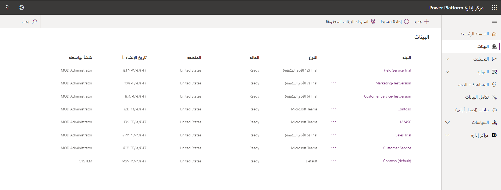

يوفر [مركز مسؤولي Power Platform](https://admin.powerplatform.microsoft.com) مدخلاً موحدًا للمسؤولين لإدارة البيئات والإعدادات لـ Power Apps وPower Automate وتطبيقات مشاركة العملاء (Dynamics 365 Sales، وDynamics 365 Customer Service، وDynamics 365 Field Service، وDynamics 365 Marketing، وDynamics 365 Project Service Automation).

 

