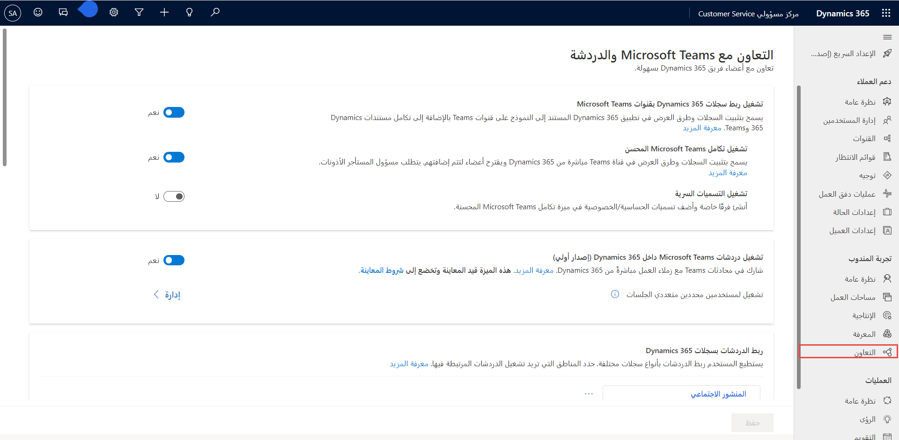
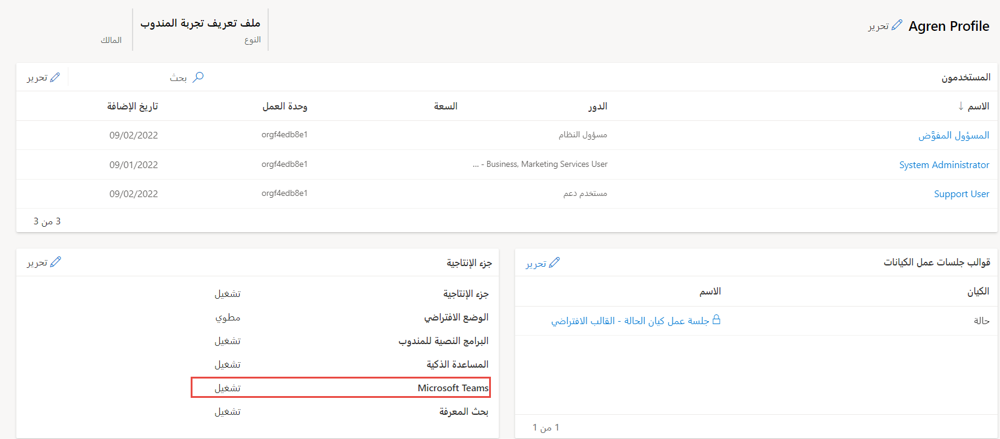
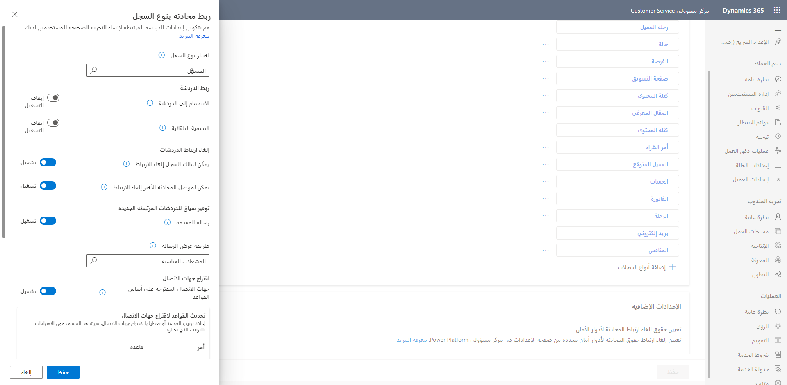
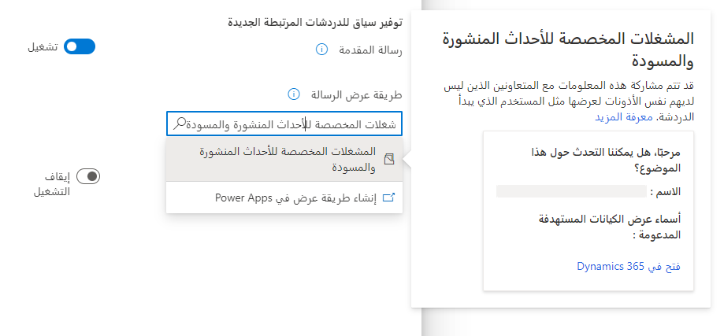

إن تزويد المندوبين بالقدرة على المحادثة مع الخبراء المتخصصين في Microsoft Teams من داخل مركز خدمة العملاء وCustomer Service workspace وتطبيقاتك المخصصة يعني أنه لا يتعين على المندوبين قضاء الوقت في التبديل بين التطبيقات. عند التمكين، أثناء عملهم على سجلات العملاء، يمكن للمندوبين بدء محادثة جديدة أو ربط محادثة موجودة بسجل. يمكن أن يساعد ربط جميع المحادثات المرتبطة بسجل المندوبين في الاحتفاظ بجميع المحادثات المتعلقة بالسجل في مكان واحد. يمكنك أيضاً تكوين رسالة مقدمة اختيارية يمكن للمندوبين استخدامها لتوفير سياق إضافي عند التعاون في Teams. تتوفر وظيفة محادثة Teams أيضاً في تطبيقات تفاعل العملاء الأخرى، مثل Dynamics 365 Field Service وDynamics 365 Sales.

## تمكين محادثة Teams أو تعطيلها

لاستخدام ميزة المحادثة في Microsoft Teams، يجب تمكينها في تطبيقات مشاركة العملاء والتطبيقات المخصصة.  للتأكد من أنه يعمل بشكل صحيح، فإنه يتطلب أذونات معينة للوصول إلى بيانات Teams. لمعرفة المزيد حول الأذونات اللازمة المطلوبة، راجع [الأذونات المطلوبة.](/dynamics365/customer-service/configure-teams-chat?azure-portal=true#permissions-required) بمجرد حصولك على الأذونات اللازمة، يمكنك تمكين الوظيفة في تطبيق **مركز مسؤولي Customer Service**. ضمن مجموعة **تجربة المندوب**، حدد **التعاون**. سترى ثلاثة خيارات متاحة لتكوين:

-   المحادثة المضمنة باستخدام Teams

-   تكامل الاجتماع باستخدام Teams

-   أسراب‬ دعم العملاء

عند تحديد **المحادثة المضمنة مع Teams**، سيتم تزويدك بخيارات متعددة يمكنك تكوينها لتخصيص التجربة لاحتياجاتك.

ستتمكن من تمكين الخيارات التالية:

-   **تشغيل ربط سجلات Dynamics 365 بقنوات Microsoft Teams:** يسمح لك بتثبيت السجلات وطرق العرض في تطبيقات Dynamics 365 المستندة إلى النموذج في قنوات Teams، بالإضافة إلى تكامل مستندات Dynamics 365 وTeams.

-   **تمكين تكامل Microsoft Teams المحسن: السماح** بتثبيت السجلات وطرق العرض في قناة Teams مباشرة من Dynamics 365 واقتراح إضافة أعضاء.

-   **تشغيل التسميات السرية‬**: أنشئ فرقاً خاصة وأضف تسميات الحساسية والخصوصية في ميزة تكامل Microsoft Teams المحسنة.

-   **تشغيل محادثات Microsoft Teams داخل Dynamics 365:** يوفر القدرة على المشاركة في محادثات Teams مع زملاء العمل مباشرةً من Dynamics 365.

-   **ربط المحادثات بسجلات Dynamics 365‬:** يسمح لك بتحديد محادثات سجلات Dynamics 365 التي يمكن ربط المحادثات بها. لمزيد من المعلومات، راجع [تكوين القدرة على ربط المحادثات بسجلات Dynamics 365](/dynamics365/customer-service/configure-teams-chat?azure-portal=true#configure-the-ability-to-link-chats-to-dynamics-365-records).

-   **الإعدادات الإضافية:** تسمح لك بتحديد أدوار الأمان التي لها القدرة على إلغاء ربط المحادثات بالسجلات. على سبيل المثال، قد تزود دور أمان مدير الخدمة بالقدرة على إلغاء ربط سجلات المحادثات. لمزيد من المعلومات، راجع [تعيين إلغاء ربط حقوق أدوار الأمان](/dynamics365/customer-service/configure-teams-chat?azure-portal=true#assign-unlink-chat-rights-for-security-roles).

> [!div class="mx-imgBorder"]
> 

بعد قيامك بتمكين محادثة Teams، يجب إتاحتها لأي مندوبين يقومون بالوصول إليها. يتم التحكم في الميزات المتاحة للمندوب من خلال ملفات تعريف خبرة المندوب. تمكّنك ملفات تعريف تجربة المندوب من إنشاء تجارب تطبيقات مستهدفة للمندوبين والمسؤولين، وهي بديل لبناء تطبيقات مخصصة وصيانتها.لمعرفة المزيد، راجع [ملفات تعريف تجارب المندوبين](/dynamics365/app-profile-manager/overview/?azure-portal=true).

بعد تمكين محادثة Teams، يجب أن يتم عرض محادثة Teams في تطبيق أي مندوب يقوم بتطبيق أحد ملفات تعريف تجربة المندوب الافتراضية. إذا قمت بإنشاء ملفات تعريف مخصصة لتجربة المندوب وتريد التأكد من توفر وظيفة دردشة Teams، يمكنك تحديد **إدارة** بجوار **تشغيل لمستخدمين محددين متعددي جلسات العمل**. حدد ملف تعريف تجربة المندوب المخصص الذي تريد تمكين الوظيفة له وقم بتعيين **Microsoft Teams** إلى **تشغيل** ضمن **جزء الإنتاجية**.

> [!div class="mx-imgBorder"]
> 

## ربط الدردشات بسجلات Dynamics 365

لا تقتصر القدرة على ربط محادثات Teams بسجلات معينة على سجلات خدمة العملاء فقط مثل الحالات. هناك العديد من السيناريوهات المختلفة حيث قد تجد أنه من المفيد أن تتوفر هذه القدرة على أنواع السجلات الأخرى. على سبيل المثال، قد تكون القدرة على إنشاء محادثة Teams وربطها بمقالة معرفية مفيدة لمؤلفي المقالة إذا كان لديهم سؤال حول مقالة يقومون بإنشائها. هناك العديد من أنواع السجلات القياسية بما في ذلك الحالة والحساب وجهات الاتصال والمقالة المعرفية والبريد الإلكتروني المتوفرة خارج الصندوق، أو يمكنك إضافة نوع السجل المطلوب. يمكنك إضافة المزيد من أنواع السجلات، عن طريق تحديد **إضافة أنواع السجلات** ثم تحديد نوع السجل الذي تريد إضافته.

ضمن نوع السجل، يمكنك تحديد ما يلي:

-   **ربط الدردشة**

    -   **الانضمام إلى المحادثة:** عند التعيين إلى تشغيل، يمكن للمتعاونين الذين لديهم أذونات صحيحة الانضمام إلى المحادثات المرتبطة

    -   **التسمية التلقائية:** سيعمل هذا الخيار على تسمية المحادثات باسم السجل الذي ترتبط به المحادثة. إذا تم إيقاف تشغيله، فسيتم استخدام أسماء المتعاونين كاسم للمحادثة.

-   **إلغاء ارتباط المحادثات**

    -   **يمكن لمالك السجل إلغاء الارتباط‬:** يحدِّد أن مالك السجل قادر على إلغاء ربط أي محادثات.

    -   **يمكن لموصل المحادثة الأخير إلغاء الارتباط‬:** يحدد أن الشخص الذي ربط المحادثة بالسجل في البداية يمكنه إلغاء ربط المحادثات.

-   **توفير سياق للدردشات المرتبطة الجديدة**

    -   **رسالة المقدمة:** عندما يبدأ شخص ما الدردشة، يمكنه إرسال معلومات متعلقة بالسجل المرتبط لمنح المتعاونين سياقاً.

-   **اقتراح جهات الاتصال**

    -   **جهات الاتصال المقترحة على أساس القواعد‬:** يتيح لك إعداد قواعد لتحديد كيفية اقتراح جهات اتصال ذات صلة بالسجل.

> [!div class="mx-imgBorder"]
> 

كما ذكرنا سابقاً، عند تحديد استخدام **رسائل مقدمة لنوع سجل**، يمكن إرسال المعلومات المتعلقة بالسجل إلى الشخص الذي ستدردش معه للمساعدة في توفير المزيد من السياق. سيُطلب منك تحديد إحدى طرق العرض المرتبطة بنوع السجل هذا. بناءً على طريقة العرض التي تم تحديدها، سيتم استخدام الحقول الخمسة الأولى من طريقة العرض كتفاصيل بطاقة السياق (بالإضافة إلى ارتباط إلى السجل).

> [!div class="mx-imgBorder"]
> 
