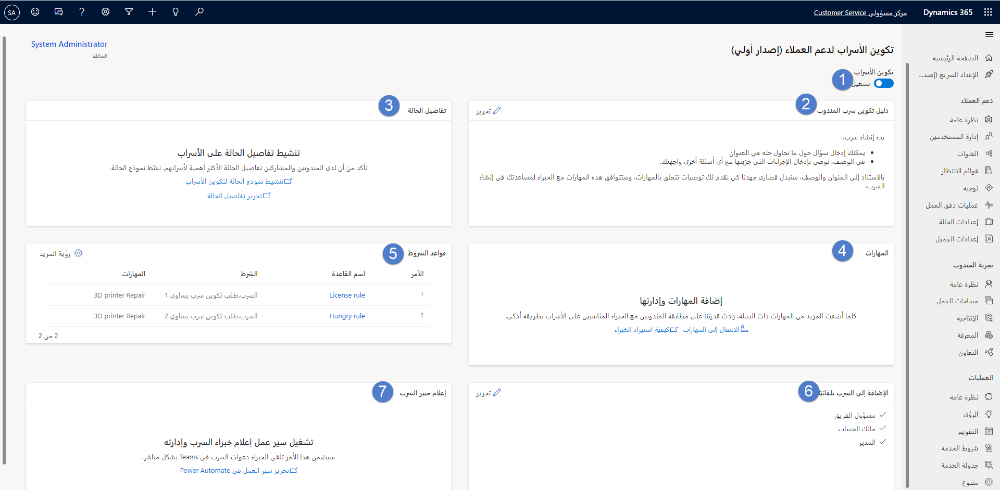
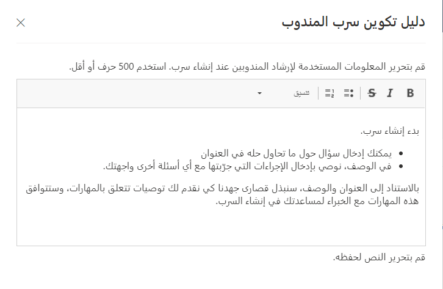
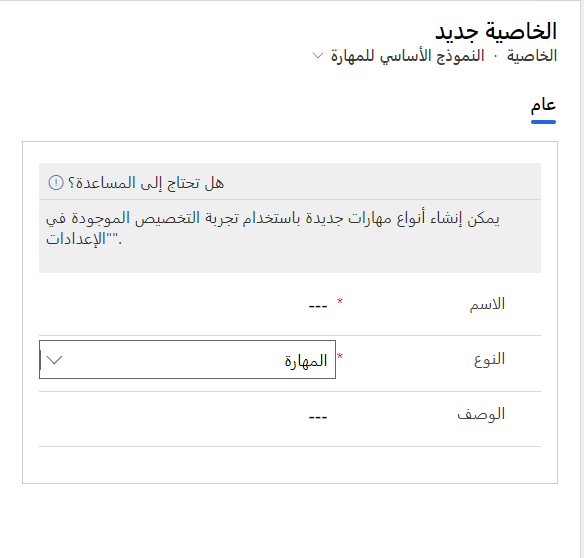
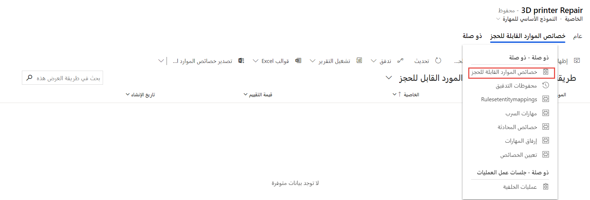
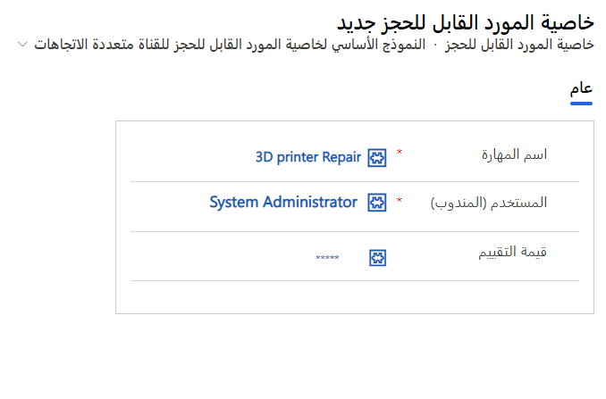
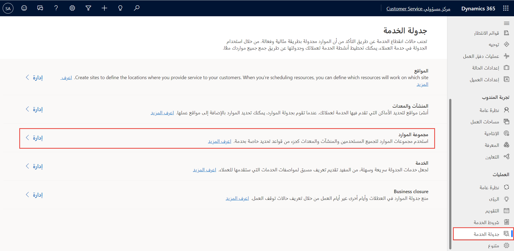
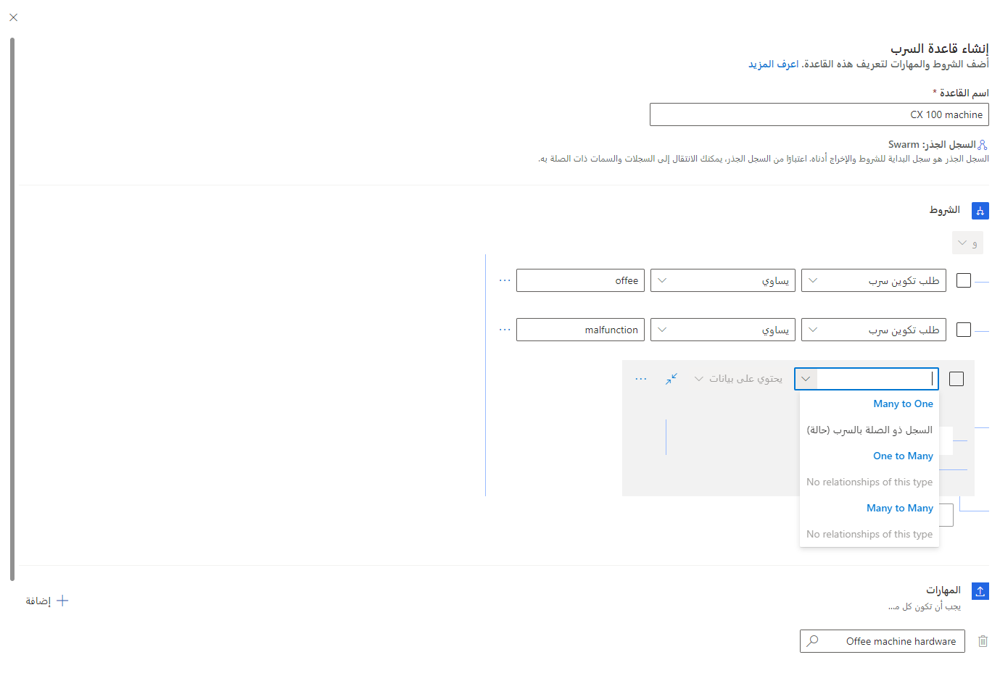

تكوين أسراب دعم العملاء هو نهج تعاوني لحل مشكلات العملاء. يسمح لك بجمع الخبراء عبر عملك بأكمله لمساعدة المندوبين على حل المشكلات. على سبيل المثال، أثناء العمل على مشكلة مستمرة تتعلق بإنترنت الأشياء (IoT)، قد يحتاج المندوب إلى مساعدة من مهندس إنترنت الأشياء الذي لديه معرفة بالجهاز وكيفية تكامله مع قطعة معينة من معدات التوجيه. قد يحتاج المندوب أيضاً إلى مساعدة من مهندس على دراية بمعدات التوجيه. بالإضافة إلى ذلك، يحتاجون إلى التفاعل مع شخص ما في العمليات لحل مشكلة لوجستية مع الجهاز.

بصفتك مسؤولاً، يمكنك إنشاء فريق خدمة عملاء أكثر توحيداً من خلال إعداد تطبيقاتك بحيث يمكن للمندوبين وخبراء الموضوع *الحشد* معاً عند حل الحالات المعقدة.

تشمل الفوائد الرئيسية لأسراب دعم العملاء ما يلي:

-   تم تحسين دقة الاتصال الأول

-   تقليل متوسط الوقت اللازم لحل المشكلة

-   تدريب سريع للمندوبين أثناء العمل

## توافر وترخيص تكوين أسراب دعم العملاء

تتوفر ميزات الأسراب في Dynamics 365 Customer Service workspace، ومركز خدمة العملاء، والتطبيقات المخصصة. لاستخدام أسراب دعم العملاء، ستحتاج إلى الحصول على ترخيص Dynamics 365 Customer Service Enterprise.

صفحة **أسراب دعم العملاء** هي المكان الذي يمكنك فيه إعداد العناصر المختلفة التي سيتم تطبيقها كجزء من حشد الحالات.
يمكنك الوصول إلى صفحة **أسراب دعم العملاء** من مركز مسؤولي Customer Service. ضمن **تجربة المندوب**، حدد **التعاون** ثم حدد **أسراب دعم العملاء**.

> [!div class="mx-imgBorder"]
> 

توضح الصورة السابقة المكونات المختلفة لصفحة **أسراب دعم العملاء** (المقابلة للقائمة المرقمة التالية):

1.  **تبديل الأسراب** - لتشغيل ميزة الأسراب‏‎.

2.  **دليل سرب المندوب** - إرشادات يقدمها المسؤول لمساعدة المندوبين على معرفة المحتوى الذي يجب تضمينه لبدء سرب أو إدارة عملية السرب.

3.  **تفاصيل الحالة** - إضافة حقول حالة جاهزة. يمكن للمسؤولين إعداد حقول الحالة التي ستظهر في النموذج.

4.  **المهارات** - أضف المهارات ذات الصلة للمساعدة في مطابقة الخبراء للأسراب.
    أضف زملاء العمل الذين هم خارج فريقك كخبراء (من خلال رسم الخرائط أو الاستيراد بالجملة) بحيث يمكن التوصية بهم للأسراب.

5.  **قواعد المهارات** - الشروط التي تحدد المهارات التي يجب إرفاقها بالأسراب. سيتم استخدام المهارات المرفقة للعثور على الخبراء ودعوتهم إلى الأسراب.

6.  **تتم إضافة المشاركين تلقائياً إلى الأسراب** - تتم إضافة جهات اتصال الفريق تلقائياً إلى الأسراب بسبب علاقتها بالعميل أو المندوب الذي تم تعيينه للمشكلة.

7.  **إشعار خبير السرب** - تدفق Power Automate يقوم بتشغيل وإدارة دعوات السرب التي يتم إرسالها إلى الخبراء.

لإعداد سرب دعم العملاء، ستحتاج إلى الحصول على امتيازات المسؤول ثم إكمال خطوات المتطلبات الأساسية التالية:

1.  [قم بتشغيل الدردشة المضمنة باستخدام ميزة Teams](/dynamics365/customer-service/configure-customer-support-swarming?azure-portal=true#turn-on-embedded-chat-using-teams).

1.  [تنشيط تفاصيل الحالة على الأسراب](/dynamics365/customer-service/configure-customer-support-swarming?azure-portal=true#activate-case-details-on-swarms).

1.  [تشغيل تدفق إعلام خبراء الأسراب في Power Automate](/dynamics365/customer-service/configure-customer-support-swarming?azure-portal=true#turn-on-the-swarm-expert-notification-flow-in-power-automate).

## تحرير دليل الأسراب

دليل السرب هو الاتجاه الذي تقدمه كمسؤول.
سيظهر الدليل في شكل سرب عندما يفتحه المندوب. يساعد دليل السرب على التأكد من أن مندوبك يدخل الأسئلة المناسبة. ويوفر سياقاً مفيداً لمطابقة المهارات والخبراء بشكل فعال. على سبيل المثال، قد يدخل أحد المندوبين عبارة مثل "آلة القهوة لا تعمل".
بالإضافة إلى ذلك، يمكنك تقديم تفاصيل أخرى، مثل ما حاولت الوصول إليه إلى هذه النقطة. بعد ذلك، سيتم تمرير هذه المعلومات إلى أي خبراء في الموضوع يتم إنشاؤهم عند بدء طلب سرب.
سيوفر دليل السرب إرشادات للمندوبين فيما يتعلق بما يجب إدخاله في أي طلب سرب يقدمونه. لتحرير دليل السرب، حدد **تحرير** على بطاقة **دليل سرب المندوب**.

العوامل المهمة التي يجب مراعاتها عند إنشاء دليل السرب:

-   يمكنك تحرير محتوى الدليل، وسيتم تطبيق الدليل الذي تقوم بإنشائه على جميع أنواع السرب المختلفة. لا يمكن تخصيصها بشكل أكبر.

-   قالب الدليل هو نص منسق ممكّن.

-   يحتوي نموذج الدليل على 500 حرف كحد أقصى.

توضح الصورة التالية مجموعة من التعليمات التي سيتم تقديمها إلى المندوبين عند بدء طلب سرب. 

> [!div class="mx-imgBorder"]
> 

## تحرير تفاصيل الحالة

عند إنشاء سرب، ستحتاج إلى تقديم أكبر قدر ممكن من المعلومات. الهدف هو توفير سياق مفصل تماماً للمشاركين في السرب الذين ينضمون إلى المحادثة.
يتضمن نموذج **حالة الأسراب** العديد من الحقول التي يمكنك استخدامها لالتقاط المعلومات وتوفيرها. بشكل غير تقليدي، يتم تضمين حقول من الحالة ذات الصلة والحساب المقترن بالحالة.

تتضمن حقول الحساب الجاهز اسم العميل والبريد الإلكتروني ورقم الهاتف.

يتم تضمين حقول الحالة الجاهزة التالية:

- عنوان الحالة

- رقم الحالة

- موضوع

- أولوية العميل

- حالة

- المنتج

- وصف المشكلة

يمكنك إعداد حقول الحالة التي تريد تضمينها كجزء من نموذج السرب.
يمكن إضافة أي عمود جدول حالة إلى النموذج حسب الحاجة. في الصفحة **سرب دعم العملاء**، حدد **تحرير تفاصيل الحالة**، مما سيؤدي إلى فتح نموذج الحشود، ثم تحرير التفاصيل في Power Apps. بعد إجراء التغييرات اللازمة، حدد **نشر** في الجانب العلوي الأيسر من الصفحة.

## إضافة مهارات جديدة وتعيينها

عندما يتم إنشاء سرب، سيستخدم النظام معلومات حول الحالة للمساعدة في تحديد الخبراء الذين يمكنهم المساعدة. على سبيل المثال، إذا كانت الحالة مرتبطة بمنتج معين، فيمكن للنظام البحث عن خبراء في الموضوع لديهم خبرة في هذا المنتج. يشبه هذا المفهوم ما يتم استخدامه لمطابقة الفنيين وتعريفهم في Dynamics 365 Field Service أو لتحديد العامل الذي سيتم توجيه محادثة إليه إذا كانت مؤسستك تطبق التوجيه المستند إلى المهارات. إذا كانت مؤسستك تستخدم المهارات بالفعل، فيمكنك إعادة استخدامها لتحديد قواعد السرب.

يمكنك تحديد المهارات من صفحة **أسراب دعم العملاء** ولكنك ستحتاج إلى تحديد **الانتقال إلى المهارة** في قسم المهارات. عند تعريف مهارة/خاصية، ستحدد التفاصيل التالية:

-   **الاسم** - يحدد اسم المهارة أو الشهادة كما سيتم تقديمها في الطلب.

-   **الوصف** - وصف قصير يوفر المزيد من التفاصيل حول المهارة.

-   **نوع مميز** - يحدد ما إذا كان ينبغي تصنيف هذا العنصر على أنه مهارة أو شهادة. 

> [!div class="mx-imgBorder"]
> 

### إرفاق المهارة الجديدة بخبير

يشير المورد القابل للحجز إلى شخص أو منظمة أو مرفق أو قطعة من المعدات التي يمكن تعيينها لعنصر ما. إنه مختلف عن سجل المستخدم. عادة ما يكون لدى المستخدم الذي يعمل كمندوب سجل مستخدم وسجل مورد قابل للحجز. سجل الموارد القابل للحجز هو المكان الذي يمكنك فيه تعيين عناصر، مثل المهارات/الخصائص، لهم للمساعدة في أنشطة مثل التوجيه والجدولة. في سرب دعم العملاء، فإن المورد القابل للحجز هو المكان الذي يمكنك فيه تعيين المهارات لخبرائك الذين سيساعدون المندوبين. لمزيد من المعلومات، راجع [إنشاء الموارد](/dynamics365/project-operations/resource-management/create-resources/?azure-portal=true).

تتمثل إحدى المزايا الرئيسية للموارد القابلة للحجز في أنه يمكنك إنشاؤها وربطها بسجلات الحساب أو جهات الاتصال. بشكل أساسي، لا يحتاج الخبير إلى أن يكون مستخدماً لـ Dynamics 365. يساعد هذا العامل على توفير المرونة. افتح المهارة/الخاصية التي تريد تعيينها لموردك. في الخاصية، حدد علامة التبويب **ذات الصلة** ثم حدد **خصائص الموارد القابلة للحجز**.

> [!div class="mx-imgBorder"]
> 

حدد  **خاصية جديدة لمورد قابل للحجز** ثم حدد **مستخدم (مندوب)** الذي تريد ربط المهارة به. يمكنك أيضاً تحديد قيمة تصنيف لتمثيل كفاءة الوكيل في هذه المهارة.

> [!div class="mx-imgBorder"]
> 

إذا تم تخزين المهارات التي تريد استخدامها لمطابقة الخبراء مع الأسراب في نظام آخر خارج Microsoft Dataverse، فيمكنك استيرادها باستخدام Microsoft Excel. لمزيد من المعلومات، راجع [مهارات الاستيراد المجمع](/dynamics365/customer-service/configure-customer-support-swarming?azure-portal=true#bulk-import-skills-optional).

## تعريف الخبراء

كما ذكرنا سابقاً، يستخدم السرب سجلات الموارد القابلة للحجز لتحديد الخبراء الذين سيكونون قادرين على المساعدة في هذا البند. إذا كانت مؤسستك تستخدم بالفعل موارد قابلة للحجز في جدولة الموارد أو مع القناة متعددة الاتجاهات لـ Customer Service، فيمكنك إعادة استخدام الموارد لتحديد قواعد السرب الخاصة بك. إذا لم تكن قد قمت بالفعل بإعداد خبراء، فيمكنك القيام بذلك في مركز مسؤولي Customer Service.
ضمن المجموعة **عمليات**، حدد **جدولة الخدمة** ثم حدد **إدارة** بجوار **الموارد**.

> [!div class="mx-imgBorder"]
> 

إذا تم تخزين الخبراء الذين تريد استخدامهم في نظام آخر خارج Dataverse، فيمكنك استيرادهم باستخدام Excel ثم تحميل الخبراء الذين يمكن استخدامهم كتطابقات في الأسراب. لمزيد من المعلومات، راجع [استيراد الموارد](/dynamics365/customer-service/configure-customer-support-swarming?azure-portal=true#bulk-import-resources-optional).

## تحديد قواعد السرب

يمكنك استخدام قواعد السرب لتحديد المهارات التي يجب اقتراحها عندما يقدم المندوب طلب سرب يطابق شروطاً محددة في قاعدة. يتم تعريف اقتراحات الخبراء بهدف العثور على الحد الأدنى من مجموعة الخبراء في مؤسستك الذين يطابقون الحد الأقصى لعدد المهارات المقترحة للسرب. على سبيل المثال، فكر في سيناريو يبدأ فيه المندوب طلب سرب حيث يذكر أن آلة القهوة معطلة. يمكن أن تنظر قاعدة السرب في الطلب، ولأنها تحتوي على الكلمات **القهوة** و **عطل**، فإنها ستعلق مهارة على طلب السرب تسمى **أجهزة آلة القهوة**. سيتم إضافة أي خبراء لديهم هذه المهارة إلى السرب.

> [!div class="mx-imgBorder"]
> 

نظراً لأنك قد ترغب في تعيين مهارات متعددة لطلب سرب، فليس من غير المألوف إنشاء عدة قواعد للتعامل مع العديد من أنواع الطلبات المختلفة. بينما يمكنك إضافة ما يصل إلى 100 قاعدة، يتم عرض القواعد الأربع الأولى فقط على صفحة السرب الرئيسية. لعرض المزيد من القواعد، حدد **مشاهدة المزيد**.
يمكنك تحديد القواعد بناءً على الحالة ذات الصلة وسمات الحساب.
بشكل افتراضي، يتم اقتراح طلب السرب أو السؤال الذي يحتاج المندوب إلى مساعدة فيه تلقائياً كأحد الشروط. بناء على القواعد التي تحددها، يمكنك إضافة مهارة فريدة محددة أو أكثر. عندما يتم مطابقة المهارات، يعمل النظام من خلال جميع القواعد الممكنة، حتى 100 منها. يتم تشغيل القواعد بالترتيب الذي تم سردها به.
يمكنك إعادة ترتيب القواعد أو تحريرها أو حذفها أو نسخها حسب الحاجة.

## إعداد جهات الاتصال لإضافتها تلقائياً إلى الأسراب

بالإضافة إلى مطابقة المهارات للعثور على الخبراء، بشكل افتراضي، يضيف النظام جهات اتصال خارج الصندوق إلى السرب. تتم إضافة هؤلاء المشاركين إلى السرب تلقائياً دون دعوة سرب. عادة ما يكون دورهم هو مراقبة عملية السرب وتوفير معلومات العملاء، إذا لزم الأمر، أو لإدارة اتصالات العملاء.

مطلوب ما لا يقل عن اثنين من المشاركين لسرب. تشمل جهات اتصال السرب الأشخاص التالية أسماؤهم.

-   مشرف المندوب (لا يمكن تحرير هذا الإعداد). تأكد من أن المندوب له مشرف. (يمكن أن يكون هذا الشخص هو نفسه بالنسبة للعديد من المندوبين في الفريق). إذا لم يتم تحديد مشرف للمندوب، إضافة المسؤول الذي قام بتمكين السرب تلقائياً.

-   اختياري: مسؤول الفريق الذي يكون المندوب عضواً فيه.

-   اختياري: مالك الحساب ذي الصلة.
