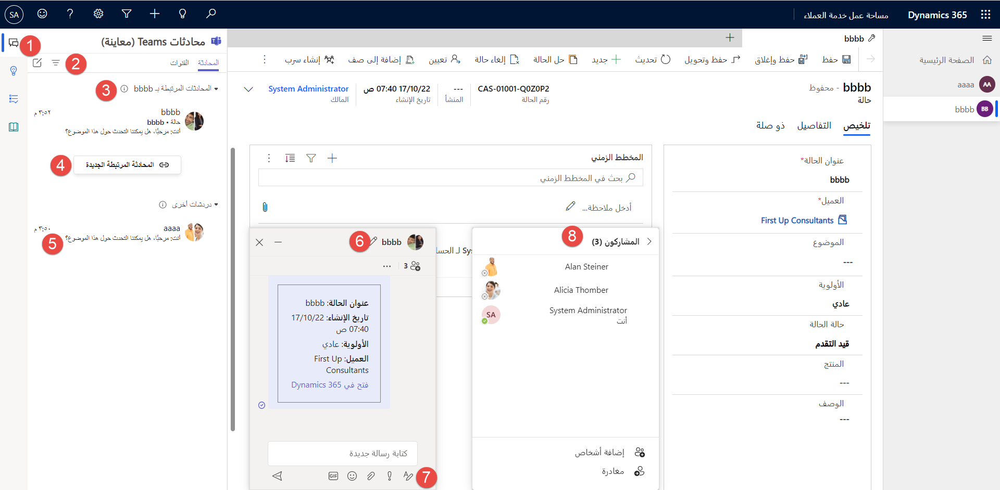
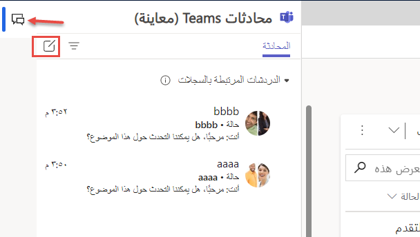

بعد إعداد ميزة دردشة Team، يمكن للمندوبين استخدامها أثناء العمل في مركز خدمة العملاء، وCustomer Service workspace، وأي تطبيق مخصص. أثناء العمل على سجلات العملاء، يمكنك بدء محادثة جديدة أو ربط محادثة دردشة موجودة بسجل Dynamics 365 دون مغادرة التطبيق. يمكن أن يساعدك ربط الدردشات المرتبطة بسجل في الحفاظ على جميع المحادثات المرتبطة بالسجل في مكان واحد.

> [!div class="mx-imgBorder"]
> 

توضح الصورة السابقة كيف تبدو تجربة المستخدم وتفصيلاً للعناصر المختلفة التي تشكل جزءاً من وظيفة الدردشة المضمنة (كما هو موضح في القائمة المرقمة المقابلة).

1.  **دردشة جديدة** - إنشاء دردشات غير مقترنة بسجلات Dynamics 365.

1.  **التصفية** - تصفية الدردشات حسب الاسم.

1.  **الدردشات المرتبطة بسجلات أخرى** - الدردشات المقترنة بسجلات Dynamics 365 الأخرى التي يكون المستخدم الحالي جزءاً منها. بإمكان المستخدمين تحديد أولوية الردود على هذه الدردشات على الدردشات الأخرى.

1.  **دردشة مرتبطة جديدة** - ابدأ دردشة جديدة مرتبطة بالسجل.
    يمكن للمشاركين في الدردشة عرض هذه الدردشات في Dynamics 365 فقط.

1.  **دردشات أخرى** - الدردشات غير المرتبطة بالسجلات أو التي بدأت من Teams.

1.  **التحكم في الدردشة** - يسمح للمستخدمين بتعدد المهام عبر الدردشات.

1.  **وظائف Teams الأساسية** - التنسيق واستخدام الرموز التعبيرية واستخدام صور GIF وتعيين خيارات التسليم وإرفاق الملفات.

1.  **إضافة/إزالة مشاركين** - حدد من يشارك في الدردشة ومن لا يشارك.

## بدء دردشة مرتبطة جديدة

يمكنك ربط دردشات Teams الجديدة أو الحالية بسجل Dynamics 365. افتح أي سجل لـ Dynamics 365 Customer engagement، ثم حدد أيقونة تكامل **دردشات وقنوات Teams**. 
سيتم فتح لوحة **دردشة Teams**. إذا كنت تعمل في تطبيق متعدد الجلسات، مثل Customer Service workspace، فيمكنك الوصول إلى لوحة الدردشة من **لوحة الإنتاجية**، كما هو موضح في الصورة التالية.

عند بدء محادثة، يمكنك استخدام أحد الأساليب التالية:

-   **بدء محادثة مرتبطة جديدة مع مشارك** - حدد **دردشة مرتبطة جديدة**. 
    في القسم **مرتبط بهذا السجل**، أدخل اسم (أسماء) المشارك (المشاركين) الذين تريد الدردشة معهم.

-   **بدء محادثة مع جهة اتصال مقترحة** - إذا قام أحد المسؤولين بإعداد ميزات جهات الاتصال المقترحة، فيمكنك تحديد جهة الاتصال من قائمة جهات الاتصال المقترحة ثم تحديد **بدء محادثة مرتبطة**.

> [!div class="mx-imgBorder"]
> 
