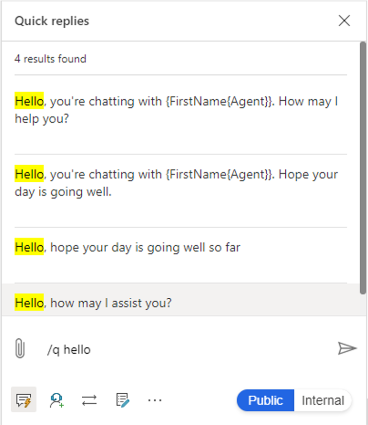
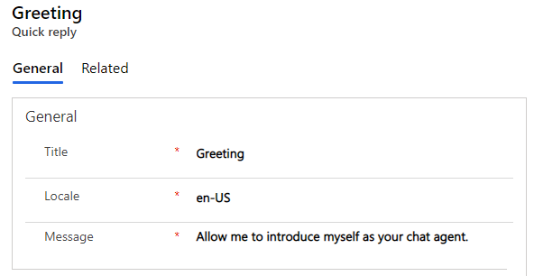
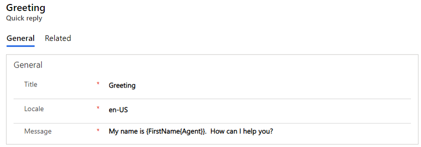
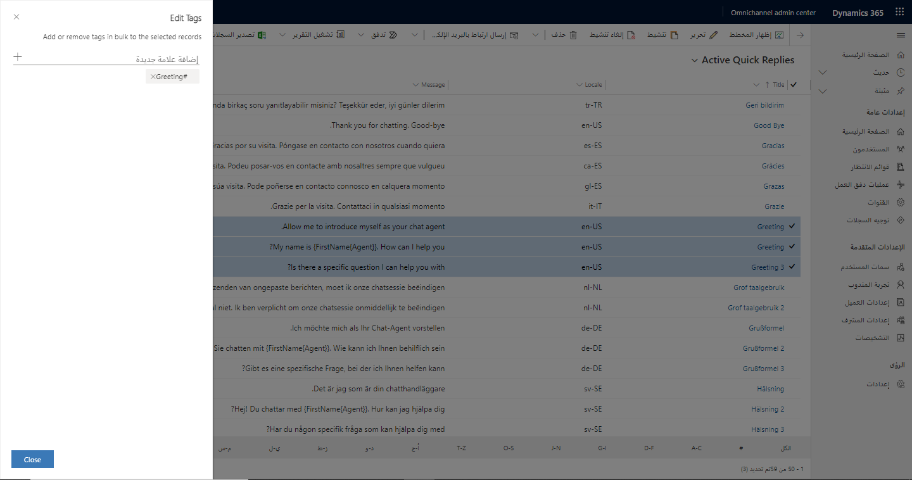
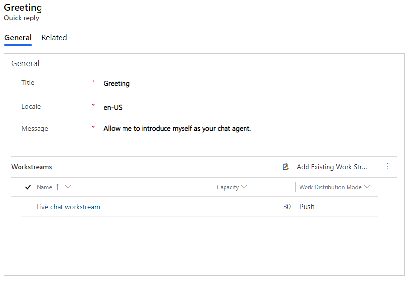

نظرًا لأن المندوبين يعملون مع العملاء عبر جلسات عمل متعددة، يجب أن يكونوا فعالين قدر الإمكان. يجب أن يكونوا قادرين على العثور على البيانات وإدخالها بسرعة. إحدى الطرق التي يمكنك من خلالها مساعدة المندوبين على تحسين الكفاءة هي تبسيط عملية الاتصال للتفاعل مع العملاء. ومن خلال إنشاء مكتبة للرسائل المحددة مسبقًا، يمكنك مساعدة المندوبين على تحديد رسالة وإرسالها أثناء محادثة في جزء صغير من الوقت الذي يستغرقه كتابتها تلقائيًا. في القناة متعددة الاتجاهات لـ Customer Service، يمكن إكمال هذه المهمة من خلال الردود السريعة.

الردود السريعة عبارة عن رسائل محددة مسبقًا يمكن للمندوبين استخدامها للرد بسرعة على الأسئلة الشائعة أو في السيناريوهات الشائعة. أثناء المحادثة، يمكن للمندوبين الوصول إلى الردود السريعة عن طريق تحديد الزر **الردود السريعة** أو بكتابة **‎/Q** على لوحة المفاتيح.
عندما تكون في لوحة الردود السريعة، يمكن للمندوبين إدخال الكلمات الأساسية التي سيتم تضمينها في الرسالة أو علامات الرسائل التي يبحثون عنها. على سبيل المثال، إدخال كلمة "مرحبًا" أو "تحية" سيوفر قائمة بالرسائل المتاحة التي يمكن أن يستخدمها المندوب لتحية العميل.
بعد أن يختار المندوب الرد الذي يريد استخدامه، سيتم ملء الرسالة في نافذة الدردشة، حيث يمكنهم تعديلها أو إرسالها إلى العميل.

> [!div class="mx-imgBorder"]
> 

يمكن للمؤسسات إنشاء مكتبة للردود السريعة وإتاحتها عبر مسارات عمل مختلفة. يمكنك إنشاء الردود السريعة من تطبيق إدارة القناة متعددة الاتجاهات بالانتقال إلى **الردود السريعة** أسفل **خبرة المندوب**. بدلاً من ذلك، يمكنك إنشاء ردود سريعة في ‏‫مركز إدارة القناة متعددة الاتجاهات‬ عن طريق تحديد **الردود السريعة** من صفحة **خبرة المندوب** ضمن **‏‫الإعدادات المتقدمة‬**.

> [!div class="mx-imgBorder"]
> 

عندما تكون في قائمة الردود السريعة، يمكنك إنشاء رسائل ردود سريعة جديدة عن طريق تحديد الزر **جديد** على شريط الأوامر.

تحتوي رسالة الرد السريع على المعلومات التالية:

-   **العنوان** - يحدد عنوان الرسالة مثل الترحيب أو التحية.

-   **اللغة المحلية‬** لتحديد لغة الرسالة.

-   **الرسالة** - لتحديد النص الفعلي الذي سيتم عرضه في الرسالة عند تحديدها.

> [!div class="mx-imgBorder"]
> 

لا تترجم القناة متعددة الاتجاهات لـ Customer Service الردود السريعة، مما يعني أن النظام لن يترجم تلقائيًا رسائل الرد السريع إلى لغة مختلفة. إذا كنت تدعم العملاء بلغات متعددة، فستحتاج إلى إنشاء رد سريع منفصل لكل لغة. على سبيل المثال، إذا أردت عرض رسالة ترحيب باللغتين الإنجليزية والألمانية، فستحتاج إلى إنشاء نسخة ألمانية من الرسالة مع تعيين رمز اللغة إلى **الألمانية**، ويجب أيضًا إدخال العنوان ونص الرسالة باللغة الألمانية.

## استخدام حقول الاحتياط في الرسائل

ميزة أخرى لإنشاء ردود سريعة وتتمثل في إمكانية استخدام حقول الاحتياط لتعبئة البيانات الديناميكية حول المندوب أو العميل في الرسالة مسبقًا لتوفير تجربة أكثر تخصيصًا. حقول الاحتياط هي معلمة بديلة سوف يملأها النظام عند إرسال الرسالة. تدعم الردود السريعة استخدام حقول الاحتياط لمعلومات المندوب والعميل في الرسالة.

يدعم الحقل **الرسالة** حقول الاحتياط التالية.

|     حقل الاحتياط                    |     الوصف                                                        |
|-----------------------------|------------------------------------------------------------------------|
|     {FullName{Customer}}    |     الاسم الكامل للعميل الذي بدأ المحادثة.      |
|     {LastName{Customer}}    |     اسم عائلة العميل.                                     |
|     {FullName{Agent}}       |     الاسم الكامل للمندوب الذي تم تعيينه للمحادثة.    |
|     {FirstName{Agent}}      |     الاسم الأول للمندوب.                                       |
|     {LastName{Agent}}       |     الاسم الأخير للمندوب.                                        |
|     {Nickname{Agent}}       |     الاسم المستعار للمندوب.                                        |

على سبيل المثال، لإنشاء تحية مخصصة، يمكنك إدخال العبارة التالية في حقل الرسالة: شكرًا لك على الاتصال بنا اليوم.
اسمي **{FirstName{Agent}}**. كيف يمكنني مساعدتك؟ 

إذا اختار مندوب يُدعى أنتوني رسالة الرد السريع، فسيكون نصها "شكرًا لك على الاتصال بنا اليوم. اسمي هو **أنتوني**. كيف يمكنني مساعدتك؟"

> [!div class="mx-imgBorder"]
> 

## إنشاء علامات فئة الرد السريع أو تحريرها

يمكن تصنيف الردود السريعة وتمييزها إلى فئات. يمكن أن تساعدك إمكانية التصنيف في تجميع الردود السريعة في أجزاء منطقية تمثل حالات المحادثة الرئيسية للمندوبين.
على سبيل المثال، قد يكون لدى مؤسستك رسائل متعددة تمثل تحيات العملاء. يساعد إنشاء الفئات على تسريع قيام المندوبين بسحب الرسائل لأنهم يستطيعون إدخال اسم الفئة مثل **الترحيب** أو **الخاتمة**.

يمكن للمسؤولين تمييز الرسائل في قسم **العلامات** لرسالة رد سريعة فردية أو في مجموعات. لوضع علامة في مجموعات، حدد إثنين أو أكثر من الردود السريعة في القائمة ثم حدد الزر **‏‫تحرير العلامات** في شريط الأوامر. في الحقل **إضافة علامة جديدة**، ابدأ في كتابة العلامة التي تريد إنشاءها. إذا كانت العلامة موجودة بالفعل، فستظهر العلامة في قائمة أسفل الحقل. إذا لم تظهر، حدد علامة الجمع (**+**) لإضافتها.

> [!div class="mx-imgBorder"]
> 

## إقران الردود السريعة بدفق عمل

بشكل افتراضي، ستتوفر أي رسالة رد سريع يتم إنشاؤها لجميع المندوبين في مؤسستك. تمتلك العديد من المنظمات خطوط أعمال متنوعة، مثل الأقسام المختلفة التي قد تبيع وتدعم خطوط إنتاج مختلفة. قد تتطلب هذه التقسيمات رسائل فريدة لا معنى لها في الأقسام الأخرى. في هذه الحالات، يمكنك تحديد مكان توفر هذه الرسائل. عندما تعرف الردود السريعة اللازمة لاستخدام مجموعات مختلفة من المندوبين، يمكنك ربط الردود السريعة الفردية بدفق العمل. يمكن تمكين المحادثة الاستباقية في الشبكة الفرعية **‏‫عمليات دفق العمل‬** للرسالة.

> [!div class="mx-imgBorder"]
> 

يمكن أن يرتبط الرد السريع بأكثر من دفق عمل واحد. بعد إرفاقه، يكون الرد السريع متاحًا فقط في المحادثات المشتقة من عمليات دفق العمل هذه. إذا لم تقم بإقران رد سريع بدفق عمل واحد أو أكثر، فسيظل متاحًا لجميع المندوبين لاستخدامه في جميع عمليات دفق العمل.

الآن بعد أن تعلمت كيف يمكن إنشاء ردود سريعة على مستوى المؤسسة، ستتعرف على كيفية إنشاء المندوبين للردود الخاصة بهم.
