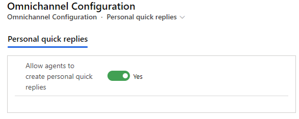
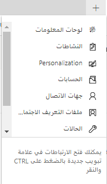
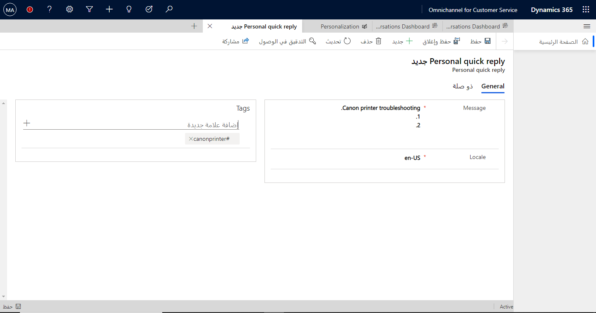

توفر الردود السريعة طريقة رائعة للوكلاء لتبسيط كيفية إدخالهم للرسائل أثناء التفاعل مع العملاء في المحادثات. بالإضافة إلى الردود السريعة التي يمكنك إنشاؤها وتمكينها على مستوى المؤسسة، يمكنك السماح للوكلاء بإنشاء ردود سريعة شخصية خاصة بهم. يتم تخزين هذه الرسائل في سياق الوكيل ويمكن استدعاؤها أثناء محادثة مع عميل باستخدام العلامات المرتبطة التي تم تحديدها للرسالة. من خلال إضافة ردودهم السريعة الشخصية، يمكن للوكلاء الرد على استفسارات العملاء بكفاءة وبأقل وقت ممكن.

## تمكين الردود السريعة الشخصية

قبل أن يتمكن الوكلاء من إنشاء ردود سريعة شخصية، يجب تمكين الوظيفة في مؤسستك. يمكنك إكمال هذه المهمة في مركز إدارة القناة متعددة الاتجاهات عن طريق تحديد **خبرة المندوب** ضمن **الإعدادات المتقدمة**. بجوار **الردود السريعة الشخصية**، حدد **إدارة**، ثم قم بتعيين خيار **السماح للمندوبين  بإنشاء ردود شخصية سريعة** إلى **نعم**. يمكنك أيضاً تمكين الردود السريعة الشخصية في تطبيق إدارة القناة متعددة الاتجاهات الموجود أسفل **خبرة المندوب** من خلال تحديد **الردود السريعة الشخصية**.

> [!div class="mx-imgBorder"]
> 

> [!IMPORTANT]
> قد يستغرق تفعيل الإعداد ما يصل إلى 15 دقيقة.

## إنشاء الردود السريعة الشخصية

بعد تمكين الردود السريعة الشخصية، يمكن للمندوبين إنشاؤها من خلال علامة التبويب **تخصيص**. ولفتح علامة التبويب، حدد الزر إضافة (**+**) بجوار علامات التبويب الموجودة أعلى شريط الأوامر، ثم حدد **تخصيص**.

> [!div class="mx-imgBorder"]
> 

ضمن علامة التبويب **الردود السريعة الشخصية**، حدد **رد سريع شخصي جديد**.

ستحتاج إلى توفير المعلومات التالية:

-   **رسالة** - تحديد نص الرسالة الذي سيتم عرضه عند تحديد الرسالة.

-   **اللغة المحلية** - تحديد لغة الرد السريع.

> [!NOTE]
> مثل ردود النظام السريعة، لا يتم ترجمة الردود السريعة الشخصية في القناة متعددة الاتجاهات لـ Customer Service. إذا كنت تريد أن تكون الاستجابة بلغات متعددة، فأنشئ سجل استجابة سريعة منفصل لكل لغة ثم حدد اللغة المحلية المقابلة له.

بعد حفظ الرد السريع لأول مرة، ستظهر منطقة **العلامات**، حيث يمكنك إدخال الكلمات الرئيسية التي تريد ربطها بالرد السريع.

> [!div class="mx-imgBorder"]
> 

قد يستغرق الأمر ما يصل إلى 15 دقيقة حتى تصبح الردود السريعة الشخصية متاحة بعد إنشائها. عندما تكون متاحة، يمكنك الوصول إليها من داخل محادثة، على غرار ردود النظام السريعة.
