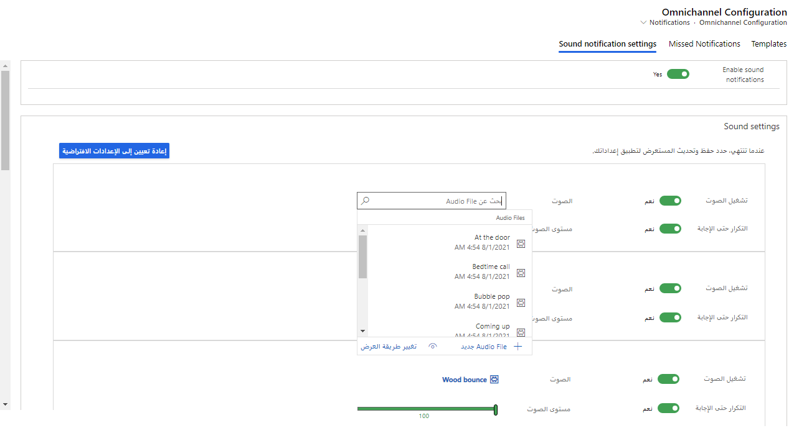
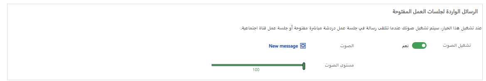
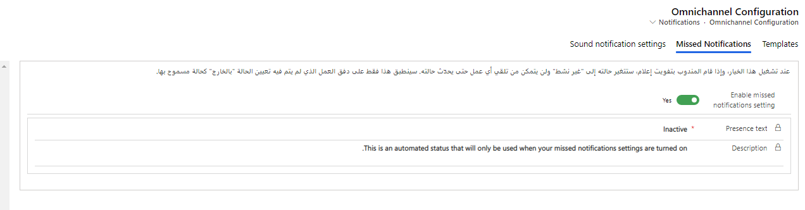

نظراً لأن المندوبون يعملون عبر جلسات متعددة في وقت واحد، فمن المحتمل أنهم سيشاركون في محادثات متعددة في وقت واحد.
يمكن أن يصبح هذا السيناريو تحدياً لأن المندوبون قد يفوتون محادثات مهمة أثناء العمل في جلسات أخرى.

تسمح القناة متعددة الاتجاهات لـ Customer Service باستخدام الإشعارات الصوتية لطلبات المحادثة الواردة، مثل الدردشة المباشرة. تساعد هذه الميزة في ضمان عدم فقدان هذه الطلبات. يتم تمكين الإشعارات الصوتية على مستوى المؤسسة، وهي متاحة عبر جميع القنوات، ويمكن تعيينها للرسائل في المحادثات الجارية. بعد تمكينه، يتيح خيار التخصيص للمندوبين تخصيص تفضيلاتهم لاختيار الصوت ومستوى الصوت، من بين خيارات أخرى.

> [!IMPORTANT]
> يؤدي تمكين الإشعارات الصوتية في القناة متعددة الاتجاهات لـ Customer Service إلى تمكينها فقط للتطبيق. بناءً على إعدادات المستعرض الخاص بك، قد لا يتم تشغيل الأصوات. تأكد من أن إعدادات المتصفح تسمح بتشغيل الأصوات. في Microsoft Edge، يُسمح بالصوت بشكل افتراضي. بالإضافة إلى ذلك، إذا لم يتم تشغيل الأصوات، فقد يرجع ذلك إلى إعدادات الصوت في لوحة التحكم، مثل ضبطها لإرسال الأصوات إلى مكبرات الصوت الخارجية بدلاً من مكبرات صوت النظام. يجب عليك التحقق من إعدادات صوت المتصفح والنظام حسب الحاجة.

## تمكين الإعلامات الصوتية

يمكنك تحديد إعدادات الإعلام الصوتي بتحديد **الإشعارات** ضمن قسم **تجربة المندوب** في تطبيق إدارة القناة متعددة الاتجاهات. لتحديد إعدادات الإشعارات الصوتية في مركز إدارة القناة متعددة الاتجاهات، انتقل إلى قسم **الإعدادات المتقدمة** وحدد **تجربة المندوب**. بجوار قوالب الإشعارات، حدد **إدارة**.

تحتوي صفحة **تكوين القناة متعددة الاتجاهات - الإشعارات** على علامات التبويب الثلاث التالية:

-   **القوالب** - تحديد قوالب الإشعارات الافتراضية التي يتم استخدامها بناءً على القنوات التي تم نشرها في البيئة.

-   **الإشعارات الفائتة** - تمكين إمكانات الإشعارات الفائتة للقناة متعددة الاتجاهات لـ Customer Service.

-   **إعدادات الإشعارات الصوتية** - تمكين إمكانات الإشعارات الصوتية وتعديلها.

عندما تكون في صفحة **تكوين القناة متعددة الاتجاهات - الإشعارات**، حدد علامة التبويب **إعدادات الإشعارات الصوتية**، ثم قم بتعيين تبديل **تمكين الإشعارات الصوتية** إلى **نعم**. سيعرض هذا الإعداد قسم **الإعدادات الصوتية**، حيث يمكنك تحديد إعدادات الإشعارات الصوتية الفردية بناءً على القنوات التي تم تمكينها في بيئتك.

استناداً إلى القنوات التي قمت بتمكينها، قد ترى أياً من القنوات التالية المتاحة لك لتكوينها:

-   Microsoft Teams

-   WeChat

-   سجلات الكيان

-   WhatsApp

-   Facebook

-   Twitter

-   محادثة مباشرة

-   LINE

-   الرسائل القصيرة

-   العميل

ستحتوي كل قناة على الخيارات الأربعة التالية التي يمكنك تعديلها:

-   **تشغيل الصوت** - تحديد ما إذا كنت تريد تشغيل إشعار صوتي لتلك القناة.

-   **التكرار حتى الإجابة** تحديد أنك تريد تشغيل الصوت حتى يستجيب المندوب.

-   **الصوت** - تحديد ملف الصوت الذي سيتم استخدامه للإشعار. يمكنك تحديد ملف موجود أو التحويم فوق حقل **الصوت**، وتحديد رمز **البحث**، ثم تحديد خيار **ملف صوتي جديد** لتحميل ملف صوتي من اختيارك واستخدامه.

-   **مستوى الصوت** - تحديد مستوى الصوت الذي تريد استخدامه في الإعلام.

> [!div class="mx-imgBorder"]
> 

بعد تخصيص أي إعداد، إذا كنت تريد العودة إلى الإعدادات الأصلية، فيمكنك تحديد الزر **إعادة تعيين إلى الإعدادات الافتراضية**.

بالإضافة إلى ذلك، يمكنك تكوين إعدادات الإشعارات الصوتية للرسائل الواردة للجلسات المفتوحة. عند تشغيل هذا الإعداد، سيتم تشغيل صوت عندما يتلقى المندوب رسالة في محادثة مباشرة مفتوحة أو جلسة قناة اجتماعية.

> [!div class="mx-imgBorder"]
> 

## الإشعارات الفائتة

من حين لآخر، قد يفوت المندوبون المحادثات التي تأتي من العملاء. يمكن أن يؤدي هذا الموقف إلى حدوث مشكلات محتملة إذا لم يدرك المندوب أنه فاتته المحادثة ومن المحتمل ألا يتفاعل أحد مع العميل. نتيجة لذلك، قد يكون لهذه المحادثة الفائتة تأثير كبير على رضا العملاء بشكل عام.

باستخدام ميزة **الإشعارات الفائتة**، يمكن للنظام تلقائياً تعيين حضور مندوب إلى **غير نشط** عندما يفقد محادثة.
عندما يكون المندوب غير نشط، لا يمكن تعيين مهام جديدة له.
يمكن أن تساعد هذه الميزة في منع التراكم ومنحهم الوقت لمعالجة الإشعار الفائت. بالإضافة إلى تغيير الحالة، سيُعرض على المندوب شريط رسائل على لوحة معلومات المندوب يشير إلى أن الإشعار قد فات. بعد أن يتعامل المندوب مع الإشعار الفائت، يمكنه إعادة تعيين حالته باستخدام خيار إعادة تعيين الحضور الذي يتم عرضه مع الإشعار أو عن طريق تغيير حالته يدوياً.

يتم تحديد الإشعارات الفائتة في علامة التبويب **الإشعارات الفائتة** من صفحة **تكوين القناة متعددة الاتجاهات - الإشعارات**.

> [!div class="mx-imgBorder"]
> 

بعد تعيين حقل **تغيير حالة المندوب إلى غير نشط بعد إشعار فائت‬** إلى **نعم**، سيتم عرض حقلين آخرين:

-   **اسم الحالة** - تحديد الحالة التي سيتم تعيين المندوب لها. يتم تعيين هذا الحقل تلقائياً إلى **غير نشط**، ولا يمكنك تغييره.

-   **وصف الحالة** - تحديد الوصف الخاص بالحالة.
    ‏‏يتعذر تغيير هذا الحقل.

لمزيد من المعلومات، راجع [تمكين الإشعارات الفائتة](/dynamics365/customer-service/manage-missed-notifications/?azure-portal=true).
