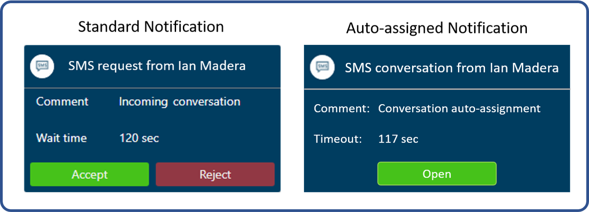
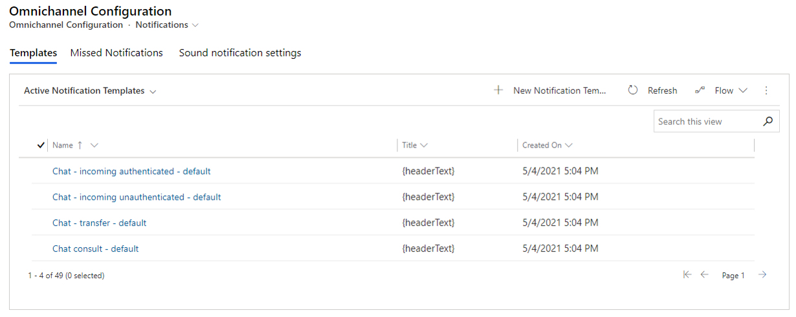
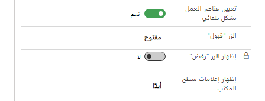

عادةً، عندما يأتي طلب محادثة جديد من أحد العملاء، تحدد القناة متعددة الاتجاهات لـ Customer Service مندوباً لديه التوفر والقدرة، ثم ترسل إليهم إشعاراً بأن محادثة متاحة للعمل عليها. يمكن للمندوب إما قبول أو رفض المحادثة. في حالة قبولها، يتم فتح جلسة جديدة، وسيبدأون في التفاعل مع العميل. إذا رفضوا ذلك، فستعود المحادثة إلى مجموعة حيث قد يتم إرسالها إلى مندوب آخر أو حيث يمكن لشخص ما تحديدها من المحادثات المتاحة.

عندما يتفاعل العملاء من خلال قنوات الدردشة الحية، من المتوقع أن يتفاعل المندوبون معهم في الوقت الفعلي.
لذلك، إذا قبل المندوب المحادثة، فيجب أن يكون قادراً على تخصيص مساعدة فورية للعميل. ومع ذلك، تحدث أشكال أخرى من الاتصال حيث تحدث التفاعلات على مدى فترات زمنية أطول، ويكون التأخير بين الاستجابات مقبولاً وغالباً ما يكون هو القاعدة. عادةً ما يحدث هذا الموقف مع المحادثات التي تأتي من القنوات الاجتماعية مثل Facebook أو عندما يشارك المندوبون والعملاء من خلال الرسائل النصية.

نظراً لأن هذه القنوات لا تتطلب أن يكون المندوب جاهزاً على الفور للمشاركة في المحادثة، يمكنك تمكين خيار التعيين التلقائي للمحادثات إلى المندوبين. عند تمكين التعيين التلقائي، يتم تعيين المحادثات من الرسائل النصية أو القنوات الاجتماعية (على سبيل المثال) تلقائياً إلى مندوب متاح ولديه القدرة على التعامل مع المشكلة. تضمن هذه الميزة تسليم طلب العميل إلى شخص ما، لكنها لا تزال توفر للمندوب المرونة للتعامل مع المحادثة لاحقاً.

الاختلاف الرئيسي هو أنه عند ظهور الإشعار الوارد، لا يتضمن الإشعار المقدم الزرين **قبول** و **رفض**؛ سيكون لذلك الزر **فتح** فقط. عندما يظهر الإشعار الوارد، سيتم تعيين المحادثة للمندوب على الفور عند تحديده **فتح**، أو سيتم تعيينه تلقائياً بعد انقضاء فترة المهلة المحددة مسبقاً.

> [!div class="mx-imgBorder"]
> 

يتم التخصيص التلقائي للمحادثات على مستوى قالب الإخطار. تحدد قوالب الإخطار التفاصيل المتعلقة بكيفية عرض الإعلامات في سيناريوهات مختلفة. على سبيل المثال، قد يكون لديك نموذج إشعار للمحادثات النصية الواردة، أو المحادثات النصية المنقولة، أو عندما يريد المندوب التشاور مع مندوب آخر. تتحكم قوالب الإعلام في عوامل مثل ما يتم عرضه ومدة عرضه وخيارات التفاعل.

يمكنك تمكين التعيين التلقائي للمحادثة لقالب من علامة التبويب **قوالب** في صفحة **تكوين القناة متعددة الاتجاهات - الإخطارات**. بشكل افتراضي، تعرض علامة التبويب **قوالب** جميع قوالب الإخطارات التي يتم استخدامها حالياً في جميع القنوات التي تم تكوينها وتمكينها.

> [!div class="mx-imgBorder"]
> 

كل قالب له خيار التعيين التلقائي الخاص به. ستحتاج إلى تمكينه لكل قالب حيث تريد حدوثه. على سبيل المثال، إذا كنت تريد التخصيص التلقائي لأي محادثة نصية واردة، فستحتاج إلى تعديل قوالب **الرسائل القصيرة - المصادقة الافتراضية الواردة** و **الرسائل القصيرة - غير المصادقة الافتراضية الواردة**.

من داخل القالب، قم بتعيين تبديل **التعيين التلقائي لعناصر العمل** إلى **نعم**. سيتم تغيير تسمية **زر القبول** من **قبول** إلى **فتح**، ويتم تعطيل تبديل **زر الرفض**.

> [!div class="mx-imgBorder"]
> 

بعد حوالي 15 دقيقة، سيتم تلقائياً تعيين أي محادثات تستخدم قالب الإشعارات هذا إلى المندوب التالي المتاح الذي لديه القدرة على العمل عليه.
