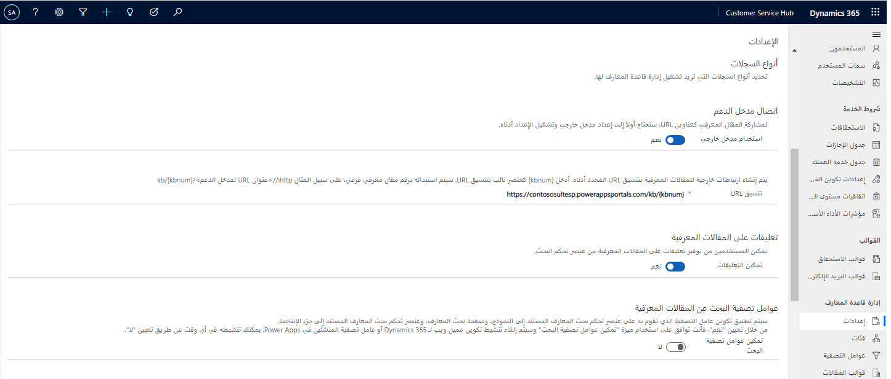
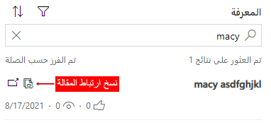

تحتفظ العديد من المؤسسات بمستودع معارف يمكن للوكلاء استخدامه أثناء عملهم مع العملاء للمساعدة في إيجاد حلول للمشكلات. على سبيل المثال، هناك طلب شائع تتلقاه المؤسسات من العملاء ألا وهو الحصول على تعليمات حول كيفية إرجاع السلع المعطلة.
وغالبًا ما توجد تعليمات مثل هذه في قاعدة المعارف الخاصة بالمؤسسة. قد يفضل الوكيل إرسال مقالة معرفية تحتوي على تعليمات إلى العميل بدلاً من كتابتها من الذاكرة، وهذا سيوفر الوقت ويقدم تجربة متسقة للعملاء. بعد تحديد المقالة، قد يرغب الوكيل في إرسال ارتباط لموقع المقالة على بوابة مؤسسته حتى يتمكن العميل من الوصول إليها مباشرة والرجوع إليها إذا لزم الأمر. لهذا السبب، تمنح العديد من المؤسسات الوكلاء القدرة على كتابة مقالات معرفية في مركز خدمة عملاء Dynamics 365 وتستضيف قاعدة المعارف في بوابة دعم يمكن للعملاء الوصول إليها.

على سبيل المثال، فكر في سيناريو خططت فيه لإنشاء بوابة دعم على [https://support.microsoft.com](https://support.microsoft.com/?azure-portal=true).
عند نشر بوابة Microsoft Power Platform مبدئيًا باستخدام قالب خدمة العملاء، ستصبح المقالات من قاعدة المعارف الخاصة بمؤسستك متاحة تلقائيًا على البوابة الإلكترونية.
وعلى الرغم من توفر المقالات على الموقع، فإن النظام لا يزال بحاجة إلى معرفة عنوان البوابة بحيث يتم توجيه العملاء إلى الموقع الصحيح عند إرسال الارتباط. ستنطبق هذه العملية أيضًا على الارتباطات التي يتم إرسالها إلى العملاء من وكلاء يعملون في تطبيق القناة متعددة الاتجاهات لـ Customer Service.

نظرًا لأن هذه الميزة هي عرض أساسي لخدمة العملاء، فستحتاج إلى تكوينها من تطبيق مركز خدمة العملاء. في مساحة **إدارة الخدمة**، حدد **الإعدادات** ضمن **إدارة قاعدة المعارف**.

في قسم **اتصال بوابة الدعم**، قم بتوفير المعلومات التالية:

-   **استخدام بوابة خارجية** - اضبط هذا الخيار على **نعم** لتمكين بوابة خارجية ومشاركة المقالات كارتباطات.

-   **تنسيق URL** - استخدمه للتأكد من أن النظام يوفر الارتباطات الصحيحة للعملاء. التنسيق النموذجي هو `https://<support portal URL>/kb/{kbnum}`.

    -   **عنوان URL لبوابة الدعم** - يمثل العنوان الخارجي لبوابة الدعم الخاصة بك مثل `support.microsoft.com`.

    -   **قاعدة المعارف (KB)** - تمثل امتداد URL لموقع قاعدة المعارف على البوابة الإلكترونية. *إذا كنت تستخدم قاعدة المعارف على بوابة Microsoft Power Platform، فإن القيمة هي KB*.

    -   **{KBnum}** - يمثل رقم المقالة الذي سيتم توفيره في الارتباط. *{KBnum} هو التنسيق المستخدم للمقالات المعرفية التي يتم إنشاؤها في مركز خدمة العملاء.*

على سبيل المثال، قد يظهر تنسيق URL مكتمل على النحو التالي: `https://support.microsoft.com/kb/{kbnum}`

> [!div class="mx-imgBorder"]
> 

بعد تكوين المعلومات، يمكن للوكيل الذي يعمل في القناة متعددة الاتجاهات لـ Customer Service تحديد موقع ارتباط مقالة ونسخه من جزء الإنتاجية ثم إرساله إلى العميل.

> [!div class="mx-imgBorder"]
> 

لمزيد من المعلومات، راجع [إعداد إدارة المعارف](/dynamics365/customer-service/set-up-knowledge-management-embedded-knowledge-search?azure-portal=true#set-up-knowledge-management-customer-service-hub).
