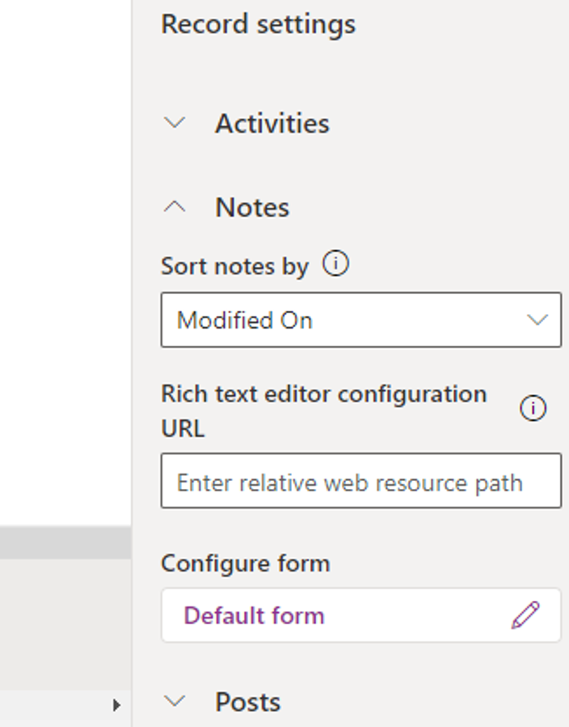

يجب على المندوبين الوصول بسرعة إلى البيانات السابقة حيث إنها تتصل بالمشكلة التي يباشرون حلها. قد تتضمن هذه البيانات إنشاء وتسجيل المكالمات الهاتفية المرتبطة بمشكلة أو تدوين ملاحظة سريعة تتعلق بالحالة. في Dynamics 365، يُساعد عنصر التحكم **‏‫المخطط الزمني** المندوبين على عرض جميع محفوظات تفاعل العميل عبر قنوات مختلفة وخلال دورة حياة الدعم الكاملة. لا يُستخدم المخطط الزمني فقط في Dynamics 365 Customer Service؛ بل يُستخدم كذلك عبر تطبيقات Dynamics 365 Customer Engagement لالتقاط أنشطة مثل الملاحظات ورسائل البريد الإلكتروني والمهام لضمان تعقب جميع التفاعلات مع أحد العملاء وإظهارها بمرور الوقت. سيستخدم المندوبون المخطط الزمني للوقوف بسرعة على أحدث تفاصيل النشاط للمساعدة في توفير تجربة الدعم الأكثر تخصيصاً.

يوفر عنصر التحكم **المخطط الزمني** تجربة ثرية للمندوبين لعرض المعلومات المتعلقة بأحد الكيانات، مثل حالة أو حساب أو جهة اتصال، مما يمنحهم فهماً أفضل ويساعدهم على تقديم خدمة أكثر تخصيصاً بطريقة ناجعة وفعّالة.

> [!div class="mx-imgBorder"]
> 

للتأكد من أن هذه التجربة هي الأنسب لمؤسستك، يُمكن لمسؤولي النظام تكوين المعلومات التي يتم عرضها في كل مخطط زمني بناءً على نوع السجل الذي يتعامل معه المستخدمون. على سبيل المثال، نظراً لأنك غالباً ما تعقِد اجتماعات مع العملاء لمناقشة العناصر، فمن المنطقي أن يشتمل المخطط الزمني لأحد الحسابات على المواعيد.
ومع ذلك، لا يلزم إجراء المواعيد دائماً في الحالات. يمكن أن يكون المخطط الزمني الذي يتم عرضه في نموذج حساب مختلفاً عن المخطط الزمني المعروض في نموذج حالة. تساعد هذه الميزة المستخدمين في الوصول إلى المعلومات الصحيحة وإنشاء سجلات أنشطة جديدة، مثل رسائل البريد الإلكتروني والمهام، مباشرةً من المخطط الزمني حتى يتمكنوا من تقديم خدمة أكثر تخصيصاً.

قبل أن تبدأ في تخصيص عنصر تحكم المخطط الزمني، اعلم أن عناصر تحكم المخطط الزمني تتم إضافتها إلى النماذج الموجودة داخل جداول Microsoft Dataverse. يمكنك الوصول إلى النماذج المتوفرة لأحد الجداول باستخدام بوابة الشركة المصنّعة لـ Microsoft Power Apps على [https://make.powerapps.com](https://make.powerapps.com/?azure-portal=true).

عندما تدخل على بوابة الشركة المُصنّعة لـ Power Apps، قم بتوسيع قسم **البيانات**، وحدد **الجداول**، ثم اختر الجدول الذي ترغب في تعديل نماذجه. توضِّح الصورة التالية جدول الحساب الجاري تحديده.

> [!div class="mx-imgBorder"]
> 

تتوفر أنواع مختلفة من النماذج لكل جدول. يُستخدم كل نوع من أنواع النماذج في سيناريوهات مختلفة. لا يمكن إضافة عنصر التحكم **المخطط الزمني** إلا في نوع النموذج **رئيسي**. كل نموذج رئيسي مرتبط بجدول يمكن أن يشتمل على عنصر تحكم مخطط زمني مُضاف إليه ومكوَّن. على سبيل المثال، تُظهر الصورة التالية أن جدول الحساب يحتوي على ثلاثة إصدارات مختلفة من النماذج الرئيسية. 

يمكنك فقط إضافة المخطط الزمني إلى هذه النماذج:

- الحساب

- حساب للتجربة التفاعلية

- حساب لتجربة متعددة الجلسات

- الحساب - Mobile

- ‏‏‏‏‏‏‏‏‏‏‏‏‏‏‏‏‏‏‏المعلومات

> [!div class="mx-imgBorder"]
> 

## إضافة مخطط زمني أو إزالته من نموذج كيان

حدد وافتح النموذج الرئيسي الذي تريد استخدام عنصر تحكم المخطط الزمني عليه.
يمكنك إضافة عنصر التحكم باستخدام جزء التنقل الأيمن لتحديد **المكونات**. قم بالتمرير لأسفل إلى المكون **المخطط الزمني** في جزء التنقل الأيمن، ثم قم بنقله إلى أحد الأقسام في النموذج.

> [!NOTE]
> في حالة تعطيل المكون **المخطط الزمني** ، سيكون هناك مخطط زمني موجوداً بالفعل في النموذج. لا يمكنك إلا إضافة عنصر تحكم مخطط زمني واحد لكل نموذج.

> [!div class="mx-imgBorder"]
> 

بعد إضافة المخطط الزمني إلى نموذج، يمكنك إزالة المكون **المخطط الزمني** عن طريق تحديده والضغط على المفتاح **حذف** .

## تكوين مكون المخطط الزمني

الميزة الرئيسية لعنصر التحكم **المخطط الزمني** هو أنه يمكنك تكوينه وتخصيصه لدعم احتياجات العمل الخاصة بمؤسسك. بعد إضافة عنصر التحكم إلى نموذج، ستتوفر لك ميزات ووظائف متعددة لتكوينها في ملف المكون **المخطط الزمني**. يتم عرض هذه العناصر مباشرة في خصائص عنصر التحكم عند تحديده.

هناك نوعان أساسيان من الأصناف التي يمكن تكوينها من حيث صلتها بالجدول الزمني هما:

- **‏‫خيارات العرض‬** - تؤثر على كيفية عرض الأصناف في المخطط الزمني.

- **إعدادات السجل** - تحديد السجلات التي تُعرَض وكيف يمكن للمستخدمين التفاعل معها.

يمكنك تعديل كل عنصر ليلائم احتياجاتك الخاصة.

> [!IMPORTANT]
> يتضمن Microsoft Learn إرشادات مفصّلة خطوة بخطوة حول كيفية تكوين كل عنصر في عنصر تحكم **المخطط الزمني**. ستُحدد هذه الوحدة العناصر المختلفة التي يمكنك تكوينها وستزودك برابط لمقال Docs الذي يشرح كيفية إعداد هذا العنصر.

## خيارات العرض

تتحكم ‏‫خيارات العرض‬ في كيفية عرض الأصناف في المخطط الزمني. على سبيل المثال، يمكنك تعديل اسم مكون **المخطط الزمني** وأنواع السجلات وأرقامها التي سيتم عرضها على المخطط الزمني.

هناك ثلاثة خيارات للعرض هي:

- **اسم مكون المخطط الزمني** - يُعد حقل **الاسم** ضمن علامة التبويب **الخصائص** في قسم **خيارات العرض** مرجعاً إدارياً ليس إلا. لمزيد من المعلومات، راجع [اسم مكون المخطط الزمني](/dynamics365/customer-service/customer-service-hub-user-guide-timeline-admin/?azure-portal=true#timeline-component-name).

- **‏‫السجلات المعروضة على الصفحة** - يسمح لك هذا القسم بالتحكم في عدد السجلات التي تظهر قبل ظهور خيار **‏‫تحميل المزيد‬** في الجزء السفلي من القسم.
لمزيد من المعلومات، راجع [‏‫السجلات المعروضة على الصفحة](/dynamics365/customer-service/customer-service-hub-user-guide-timeline-admin/?azure-portal=true#records-shown-on-page).

- **‏‫أنواع السجلات المطلوب عرضها‬** - الأنواع الثلاثة الرئيسية للسجلات هي الأنشطة والملاحظات والمنشورات. يتم تمكين جميع أنواع السجلات بشكل افتراضي. لمزيد من المعلومات، راجع [‏‫أنواع السجلات المعروضة](/dynamics365/customer-service/customer-service-hub-user-guide-timeline-admin/?azure-portal=true#record-types-shown).

> [!div class="mx-imgBorder"]
> 

## إعدادات السجل

في منطقة **إعدادات السجل** للمخطط الزمني، يمكنك تعديل الإعدادات المرتبطة بأنواع السجلات التي يتم عرضها في المخطط الزمني. استناداً إلى السجلات التي قمت بتحديدها في خيار العرض  **‏‫أنواع السجلات المطلوب عرضها‬**، يمكنك تعديل الإعدادات المرتبطة بتلك التحديدات في منطقة **إعدادات السجل**. على سبيل المثال، إذا قمت بتحديد **الأنشطة**، و **الملاحظات**، و **المنشورات**، ستكون جميعها متوفرة في منطقة **إعدادات السجل**.

> [!div class="mx-imgBorder"]
> 

- **الأنشطة** - يمكن أن تضم الأنشطة العديد من أنواع سجلات النشاط الفرعية القابلة للتخصيص لدعم احتياجات الأعمال. لمزيد من المعلومات، راجع [الأنشطة](/dynamics365/customer-service/customer-service-hub-user-guide-timeline-admin/?azure-portal=true#activities). للحصول على تعليمات مفصّلة حول تعديل إعدادات النشاط، راجع [إعدادات السجل](/dynamics365/customer-service/customer-service-hub-user-guide-timeline-admin/?azure-portal=true#record-settings).

- **الملاحظات** - تسمح لك الملاحظات بتدوين الملاحظات المتعلقة بسجل الكيانات.
على سبيل المثال، يمكنك استخدام الملاحظات لتدوين أفكارك وتلخيص المعلومات وتقديم تعليقات حول حالة معينة وإدخال تعديلات وقتما تشاء. للحصول على مزيد من المعلومات، راجع [الملاحظات](/dynamics365/customer-service/customer-service-hub-user-guide-timeline-admin/?azure-portal=true#notes). للحصول على تعليمات مفصلة حول تعديل إعدادات **الملاحظات**، راجع [الملاحظات في المخطط الزمني](/dynamics365/customer-service/customer-service-hub-user-guide-timeline-admin/?azure-portal=true#notes-on-timeline).

- **المنشورات** - تمثل العناصر التي يتم نشرها في المخطط الزمني. هناك نوعان من المنشورات هما:

  - **‏‫عمليات نشر تلقائية‬** - المنشورات التي ينشئها النظام والتي تُعلمك بنشاط الحساب الذي حدث.

  - **‏‫عمليات نشر المستخدمين‬** - تسمح لك بترك رسالة لمستخدم آخر في سجل.

  للحصول على مزيد من المعلومات، راجع [المنشورات](/dynamics365/customer-service/customer-service-hub-user-guide-timeline-admin/?azure-portal=true#posts). 
  للحصول على تعليمات مفصلة حول تعديل إعدادات **المنشورات**، راجع [المنشورات على المخطط الزمني](/dynamics365/customer-service/customer-service-hub-user-guide-timeline-admin/?azure-portal=true#posts-on-timeline).
