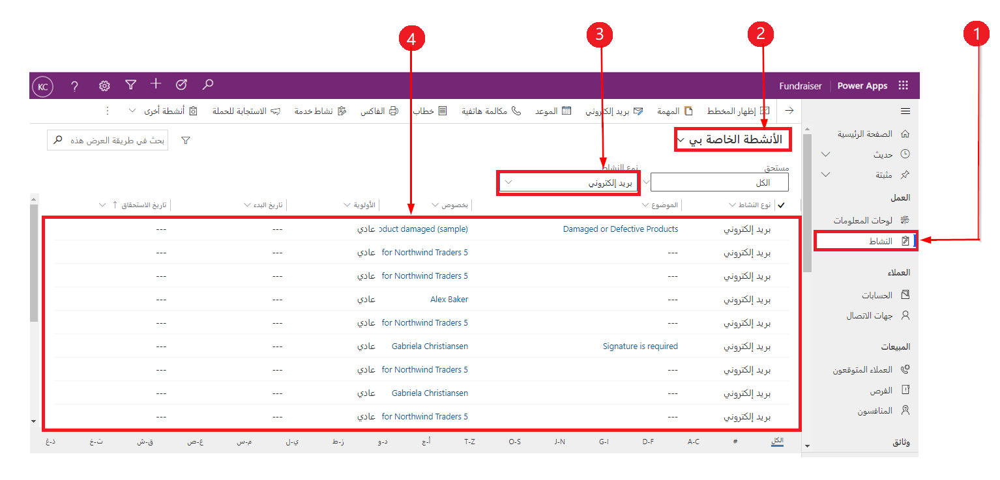
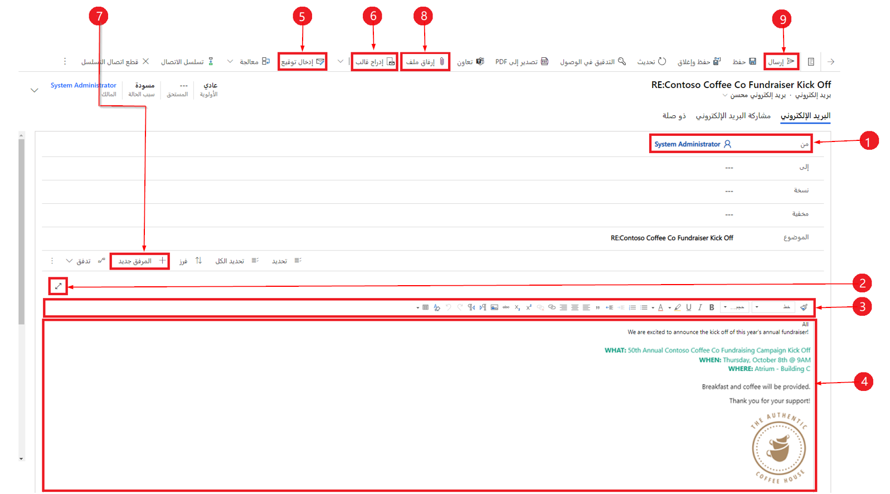
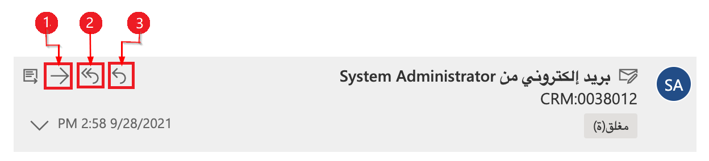
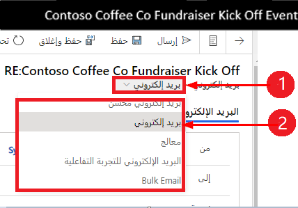
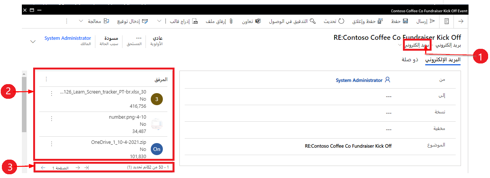
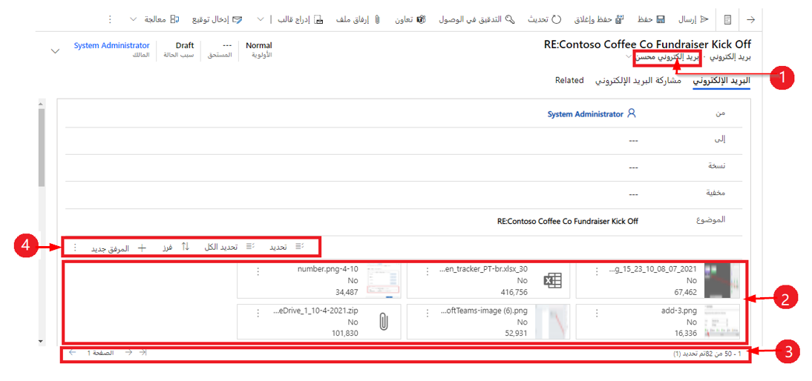
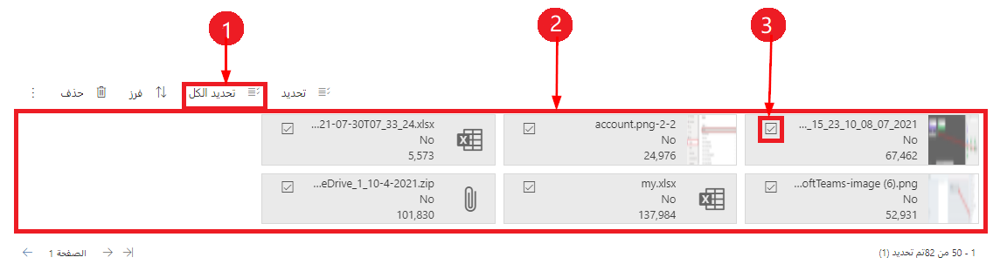
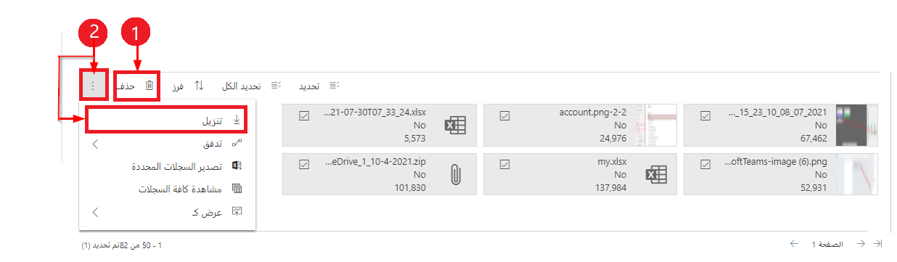
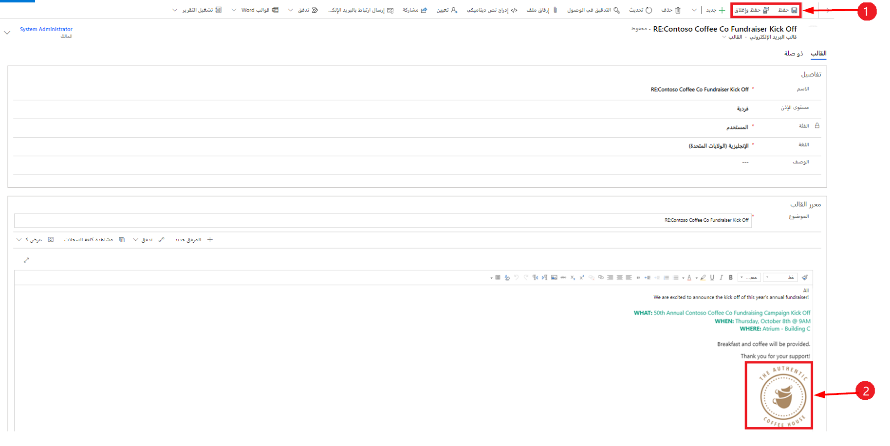

يعتبر التواصل المتسق إحدى الطرق المؤكدة لبناء علاقات طويلة الأمد مع العملاء. فمن شأن التواصل الفعال مع العملاء أن يؤثر على جميع مجالات مؤسستك، بدايةً من زيادة المبيعات إلى تعزيز رضا العملاء بشكل عام. وبينما تظهر وتُتاح المزيد من قنوات التواصل، فإن البريد الإلكتروني لا يزال هو الشكل الأكثر استخدامًا للتواصل. وغالبًا ما تتجلى أهمية البريد الإلكتروني بشكل خاص في سيناريوهات خدمة العملاء. يستخدم الوكلاء البريد الإلكتروني للتواصل مع العميل أثناء عملهم على المشكلات وكطريقة للتواصل بشأن العناصر المهمة ذات الصلة بالمشكلة مثل الصور. قد لا يتمكن الوكلاء من حل المشكلة بسرعة بدون مثل هذه التفاصيل.

من خلال إمكانيات البريد الإلكتروني المتوفرة في Dynamics 365، سيكون لدى وكلائك القدرة على الاستجابة بسرعة والانخراط في تفاعلات مناسبة وفي حينها مع العملاء.
سيتمكن الوكلاء، بالإضافة إلى ذلك، من إنشاء رسائل البريد الإلكتروني والرد عليها ومراجعتها، ثم إرفاق الصور وإرسالها بسرعة تضيف قيمة ودعمًا لتواصل العملاء باستخدام وظائف مبسطة. تساعد إمكانيات البريد الإلكتروني على ضمان أن تكون التفاعلات بينك وبين عملائك احترافية ومتسقة من خلال تمكينك من إنشاء قوالب بريد إلكتروني غنية بنصوص وصور.

## استكشاف تجربة البريد الإلكتروني

نظرًا لأن الوكلاء يعملون في تطبيقات Dynamics 365 Customer Service، فسيكون لديهم تجربتان أساسيتان عند استخدام إمكانيات البريد الإلكتروني:

- **الانتقال إلى** - دائمًا ما تعرض رسالة البريد الإلكتروني في شاشة جديدة.

- **سياقي** - بدأت من الجدول الزمني للسجلات، وتعرض رسالة البريد الإلكتروني في شاشة منبثقة، وتسمح لك بما يلي:

  - الانتقال إلى صفحات مختلفة دون فقد محتوى البريد الإلكتروني.

  - تصغير نافذة البريد الإلكتروني للعودة إلى السجلات التي كنت تعمل عليها.

  - عرض خمس رسائل بريد إلكتروني وإنشاؤها والرد عليها في وقت واحد في النوافذ المنبثقة، عند التمكين.

الاختلاف الوحيد بين التجربتين هو مكان عرض رسائل البريد الإلكتروني على شاشتك؛ ولا يحدث بخلاف ذلك أي اختلاف في الوظائف المتوفرة.

> [!IMPORTANT]
> يُشار أيضًا إلى البريد الإلكتروني السياقي بالبريد الإلكتروني المُحسَّن. يرجى الانتباه إلى أنه لا توجد وظائف خاصة مرتبطة بتجربة البريد الإلكتروني السياقي بخلاف حقيقة أنها تجربة منبثقة.

يجب تمكين البريد الإلكتروني السياقي أو المُحسَّن بواسطة مسؤول في مؤسستك. ستتم دراسة هذه العملية بمزيد من التفصيل لاحقًا في هذه الوحدة. لمزيد من المعلومات، راجع  [تمكين تجربة البريد الإلكتروني المُحسَّن](/dynamics365/customer-service/customer-service-hub-user-guide-email-admin/?azure-portal=true#enable-the-enhanced-email-experience). 

## عرض رسائل البريد الإلكتروني وإنشاؤها والرد عليها

قد يكون لديك العديد من الاتصالات على مدار اليوم بصفتك وكيلاً، ومن المهم أن تتمكن من الوصول إلى رسائل البريد الإلكتروني الخاصة بك بسرعة عندما تحتاج إليها. يمكنك، في Dynamics 365، عرض رسائل البريد الإلكتروني وإنشاؤها وإرسالها بشكل أسرع، من خلال الوصول المبسط الذي سيساعدك على إنشاء رسائل البريد الإلكتروني والرد عليها وإرسالها بشكل فعال باستخدام ميزات مثل تحرير النص المنسق وميزات إضافة المرفقات بالسحب والإفلات والوظائف.

توفر لك طريقة العرض **الأنشطة**، المتوفرة في جزء التنقل الأيمن، وصولاً سريعًا إلى جميع أنشطة Dynamics 365 الخاصة بك مثل المهام ورسائل البريد الإلكتروني والمكالمات الهاتفية. من طريقة عرض **الأنشطة**، يمكنك عرض رسائل البريد الإلكتروني والرد عليها عبر تطبيقات Dynamics 365 الخاصة بك.

> [!div class="mx-imgBorder"]
> 

وفقًا للأرقام الموجودة في لقطة الشاشة السابقة، تصف القائمة التالية العناصر المتوفرة في طريقة عرض **الأنشطة**:

1. **الأنشطة** - الانتقال إلى طريقة عرض **الأنشطة** في تطبيقك الحالي.

1. **جميع الأنشطة** - محدد طريقة العرض الذي يتيح لك تصفية الأنشطة المعروضة، مثل عرض الأنشطة الخاصة بك فقط.

1. **نوع النشاط** - يتيح لك تحديد نوع النشاط الذي تريد عرضه، مثل البريد الإلكتروني.

1. **قائمة الأنشطة** - تعرض قائمة بالأنشطة بناءً على عوامل التصفية التي حددتها. في لقطة الشاشة السابقة، تعرض القائمة رسائل البريد الإلكتروني.

### إنشاء رسالة بريد إلكتروني

بخلاف تلقي رسائل البريد الإلكتروني من العملاء، يقوم الوكلاء أيضًا وبشكل متكرر بإنشاء رسائل بريد إلكتروني جديدة للعملاء. والميزة هنا هي أن البريد الإلكتروني مقترن بالسجلات في Dynamics 365، كما يمكن الوصول إلى عناصر مثل الردود من التطبيق. يمكنك، بصفتك وكيلاً، إنشاء رسائل بريد إلكتروني بعدة طرق بناءً على مكانك في التطبيق. يمكنك إنشاء رسائل بريد إلكتروني جديدة عن طريق تحديد زر **البريد الإلكتروني** في شريط الأوامر عندما تكون تعمل في طريقة نشاط ما. إذا كنت تعمل ضمن سجل، يمكنك إنشاء رسائل بريد إلكتروني جديدة عن طريق تحديد الأيقونة **إنشاء سجل مخطط زمني** ثم تحديد **البريد الإلكتروني**.

> [!IMPORTANT]
> بناءً على مؤسستك وكيفية تكوين النظام، قد تجد إصدارات مختلفة من نموذج **البريد الإلكتروني** المتوفر. بينما يوفر كل نموذج إمكانيات للبريد الإلكتروني، يمكن أن تختلف الإمكانيات المتوفرة وكيفية تقديمها في النموذج بناءً على النموذج الذي تستخدمه.
يتم تناول كيفية العمل مع إصدارات النماذج المختلفة هذه لاحقًا في هذه الوحدة.

عند فتح نموذج بريد إلكتروني جديد، تتوفر عناصر متعددة لمساعدتك على إنشاء رسالة البريد الإلكتروني. تُظهر الصورة التالية نموذج **البريد الإلكتروني المُحسَّن**، والذي يوفر إمكانيات إضافية فيما يتعلق بالمرئيات.

> [!div class="mx-imgBorder"]
> 

وفقًا للأرقام الموجودة في لقطة الشاشة السابقة، تصف القائمة التالية العناصر الأكثر شيوعًا في نموذج **البريد الإلكتروني المُحسَّن**:

1. **من** - يتم ملؤه تلقائيًا استنادًا إلى المستخدم الذي هو قيد تسجيل الدخول حاليًا.

1. **توسيع** - يسمح لك بإنشاء رسالة البريد الإلكتروني في طريقة عرض ملء الشاشة والتصغير عند الانتهاء.

1. **محرر النص المنسق** - يساعدك شريط الأدوات هذا في تنسيق رسائل البريد الإلكتروني. يتم عرض المحرر كسطر واحد يمكنك توسيعه لعرض القائمة الكاملة بميزات التحرير بشكل افتراضي.

1. **النص الأساسي** - النص هو المكان الذي تنشئ فيه رسالة البريد الإلكتروني أو ترد عليها.

1. **إدراج توقيع** - يُمكِّنك من إدراج توقيع لتخصيص رسالتك.

1. **إدراج قالب** - يتيح لك تحديد قالب بريد إلكتروني محدد مسبقًا تريد استخدامه في رسالتك.

1. **مرفق جديد** - يتيح لك إرفاق ملف (ملفات) برسالة البريد الإلكتروني.

1. **إرفاق ملف** - يُستخدم لنقل المرفقات أو نسخها ولصقها.

1. **إرسال** - يرسل رسالة البريد الإلكتروني الخاصة بك عندما تكون جاهزًا.

## شريط أدوات محرر النص المنسق

يوفر شريط أدوات محرر النص المنسق ميزات ووظائف تتيح لك التعامل مع عناصر التحكم في تنسيق النص المنسق في رسائل البريد الإلكتروني حتى تتمكن من إقامة تواصل أفضل مع عملائك. يساعد شريط الأدوات على تسهيل التعامل مع المهام، مثل تنسيق النص في رسالة البريد الإلكتروني، كما يتيح لك تضمين العناصر المرئية، مثل الصور أو الارتباطات، إلى عناصر أخرى.

يصف الجدول التالي خيارات وظائف وميزات التنسيق المختلفة المتوفرة في محرر النص المنسق التي يمكنك استخدامها في نموذج البريد الإلكتروني.

| الأيقونة | الاسم | الوصف |
|------|------|-------------|
| :::image type="icon" source="../media/paint.png"::: | نسخ التنسيق | يطبق مظهر قسم معين على قسم آخر. |
| :::image type="icon" source="../media/font.png"::: | الخط | التغييرات على الخط المحدد. الخط الافتراضي هو Segoe UI. |
| :::image type="icon" source="../media/size.png"::: | حجم الخط | يغير حجم النص. الحجم الافتراضي هو 9. |
| :::image type="icon" source="../media/bold.png"::: | غامق | يطبق النمط الغامق على النص. |
| :::image type="icon" source="../media/italic.png"::: | مائل | يطبق النمط المائل على النص. |
| :::image type="icon" source="../media/underline.png"::: | تسطير | يقوم بوضع سطر تحت النص. |
| :::image type="icon" source="../media/highlight.png"::: | لون تمييز النص | يجعل النص بارزًا عن طريق تمييزه بلون ساطع. |
| :::image type="icon" source="../media/color.png"::: | لون الخط | يغير لون النص. |
| :::image type="icon" source="../media/bullets.png"::: | تعداد نقطي | ينشئ قائمة ذات تعداد نقطي. |
| :::image type="icon" source="../media/number.png"::: | تعداد رقمي | ينشئ قائمة ذات تعداد رقمي. |
| :::image type="icon" source="../media/decrease.png"::: | تقليل المسافة البادئة | يحرك فقرتك أقرب إلى الهامش. |
| :::image type="icon" source="../media/increase.png"::: | زيادة المسافة البادئة | يحرك فقرتك بعيدًا عن الهامش. |
| :::image type="icon" source="../media/quote.png"::: | كتلة نصية مقتبسة | تطبق تنسيق اقتباس على مستوى كتلة في المحتوى. |
| :::image type="icon" source="../media/left.png"::: | محاذاة لليسار | تحاذي النص إلى اليسار.|
| :::image type="icon" source="../media/center.png"::: | محاذاة في الوسط | تحاذي النص في المنتصف. |
| :::image type="icon" source="../media/right.png"::: | محاذاة لليمين | تحاذي النص إلى اليمين. |
| :::image type="icon" source="../media/link.png"::: | ارتباط | ينشئ ارتباطًا في المستند للوصول السريع إلى صفحات الويب والملفات. |
| :::image type="icon" source="../media/remove.png"::: | إلغاء الارتباط | يحذف ارتباطًا في رسالة البريد الإلكتروني أو المستند. |
| :::image type="icon" source="../media/super.png"::: | مرتفع | يكتب أحرفًا صغيرة فوق سطر النص. |
| :::image type="icon" source="../media/sub.png"::: | منخفض | يكتب أحرفًا صغيرة أسفل سطر النص. |
| :::image type="icon" source="../media/strike.png"::: | يتوسطه خط | يشطب النص برسم خط يتوسطه. |
| :::image type="icon" source="../media/image.png"::: | إدراج صورة | يُمكِّنك من إدراج صورة عن طريق نسخها ولصقها مباشرةً في المحرر، أو عن طريق نقلها من سطح المكتب أو المجلد المحلي مباشرةً إلى المحرر، أو عن طريق إدخال عنوان URL لها. |
| :::image type="icon" source="../media/left-right.png"::: | من اليسار إلى اليمين | يُغير النص بحيث يتجه من اليسار إلى اليمين لمحتوى مثل فقرة أو رأس أو جدول أو قائمة. يشيع استخدامه لمحتوى اللغة ثنائية الاتجاه. هذا الإعداد هو الافتراضي. |
| :::image type="icon" source="../media/right-left.png"::: | من اليمين الى اليسار | يُغير النص بحيث يتجه من اليمين إلى اليسار لمحتوى مثل فقرة أو رأس أو جدول أو قائمة. يشيع استخدامه لمحتوى اللغة ثنائية الاتجاه. الإعداد الافتراضي هو من اليسار إلى اليمين. |
| :::image type="icon" source="../media/undo.png"::: | التراجع عن الكتابة | يتراجع عن التغييرات التي أجريتها على المحتوى. |
| :::image type="icon" source="../media/redo.png"::: | إعادة الكتابة | يعيد التغييرات التي أجريتها على المحتوى. |
| :::image type="icon" source="../media/clear.png"::: | مسح التنسيق بأكمله | يزيل كل التنسيقات من نص محدد، مع ترك النص العادي غير المنسق فقط. |
| :::image type="icon" source="../media/table.png"::: | إضافة جدول | يضيف جدولاً إلى المحتوى. |
| :::image type="icon" source="../media/expand.png"::: | توسيع شريط الأدوات | يظهر عندما يكون شريط الأدوات مطويًا ولا تظهر جميع الخيارات. حدده لتوسيع شريط الأدوات وإظهار كل الخيارات. |

لمزيد من المعلومات، راجع [استخدام شريط أدوات محرر النص المنسق في البريد الإلكتروني](/powerapps/user/email-rich-text-editor/?azure-portal=true).

### الرد على رسالة بريد إلكتروني

على غرار إنشاء رسالة بريد إلكتروني، تعتمد الطريقة التي ترد بها على رسالة بريد إلكتروني كوكيل على مكان وجودك في التطبيق. ستتعامل غالبًا مع مشكلة أو سجل جهة اتصال حيث ينعكس نشاط البريد الإلكتروني في المخطط الزمني للسجل. في تلك الحالات، يمكنك الرد مباشرة من المخطط الزمني. عندما ترد على رسائل البريد الإلكتروني من مخططك الزمني، يوفر لك شريط الأوامر في الزاوية العلوية اليسرى خيارات الرد. عندما تحدد خيارًا، يتم تعيين بريدك الإلكتروني تلقائيًا وسيفتح في هذه الحالة، ويكون جاهزًا لبدء رسالتك.

يمكنك استخدام خيارات الأوامر التالية عند العمل مع رسائل البريد الإلكتروني في المخطط الزمني (الأرقام الموجودة في لقطة الشاشة تُطابق القائمة المرقمة اللاحقة).

1. **رد** - استخدم هذا الأمر للرد مباشرة على مرسل رسالة البريد الإلكتروني التي تلقيتها.

2. **رد على الكل** - استخدم هذا الأمر للرد على جميع الأشخاص في رسالة البريد الإلكتروني التي تلقيتها.

3. **إعادة توجيه** - استخدم هذا الأمر لإعادة توجيه رسالة البريد الإلكتروني إلى شخص آخر.

إذا فتحت رسالة البريد الإلكتروني المستلمة مباشرة في Dynamics 365، على سبيل المثال من قائمة **الأنشطة**، فسيتم عرض الأوامر **رد**، و **رد على الكل**، و **إعادة توجيه** على شريط الأوامر في الجزء العلوي من السجل.

## استكشاف نماذج البريد الإلكتروني

بناءً على مؤسستك والعناصر التي يتم تكوينها، قد تكتشف أن لديك عدة نماذج بريد إلكتروني متاحة. بينما يوفر كل نموذج إمكانيات للبريد الإلكتروني، يمكن أن تختلف الوظائف وكيفية ظهورها بناءً على النموذج الذي تستخدمه. النموذج الافتراضي هو **البريد الإلكتروني المُحسَّن**؛ ومع ذلك، يمكنك التبديل إلى أحد النماذج الأخرى المتاحة باستخدام أيقونة محدد النموذج في البريد الإلكتروني ثم تحديد النموذج الذي تريد العمل به.

تتأثر مرفقات الملفات بالنماذج المختلفة، ولكن القدرة على إرفاق الملفات لا تتأثر. بشكل أساسي، سيتم عرض مرفقات الملفات بشكل مختلف بناءً على نموذج البريد الإلكتروني الذي تعمل به.
إذا لزم الأمر، يمكنك إرسال الملفات بالبريد الإلكتروني دون فقدان المعلومات.

تُظهر الصورة التالية كيف يبدو النموذج وكيف تظهر المرفقات عند استخدام نموذج البريد الإلكتروني القياسي.

> [!div class="mx-imgBorder"]
> 

وفقًا للأرقام الموجودة في لقطة الشاشة السابقة، تصف القائمة التالية العناصر الموجودة في نموذج البريد الإلكتروني القياسي:

1. **البريد الإلكتروني** - يحدد أنك تستخدم نموذج **البريد الإلكتروني**.

1. **مرفق** - يعرض قائمة عمودية بمرفقات الملفات الثلاثة الأولى.

1. **عدد الملفات** - استخدمه للتنقل إلى الصفحات الأخرى عندما يكون لديك ملفات أكثر مما يمكن عرضه.

توضح الصورة التالية كيف يبدو النموذج وكيف يتم عرض المرفقات باستخدام نموذج **البريد الإلكتروني المُحسَّن**.

> [!div class="mx-imgBorder"]
> 

وفقًا للأرقام الموجودة في لقطة الشاشة السابقة، تصف القائمة التالية العناصر الموجودة في نموذج **البريد الإلكتروني المُحسَّن**:

1. **البريد الإلكتروني المُحسَّن** - يحدد أنك تستخدم نموذج **البريد الإلكتروني المُحسَّن** .

1. **الملفات المرفقة** - تعرض جميع مرفقات البريد الإلكتروني في طريقة عرض تجانب أفقي أعلى رسالتك.

1. **عدد الملفات** - استخدمه للتنقل إلى المزيد من الصفحات عندما يكون لديك ملفات أكثر مما يمكن عرضه.

1. **أوامر المرفقات** - تسمح لك باستخدام وظائف التحديد، وتحديد الكل، والفرز، والحذف، والتنزيل عند التعامل مع مرفقات الملفات.

## إرفاق ملف برسالة البريد الإلكتروني

يعد إرفاق الملفات برسالة بريد إلكتروني أحد أكثر ميزات البريد الإلكتروني استخدامًا.
قد يرسل لك العملاء مرفقات تمثل لقطات شاشة أو عناصر يمكن استخدامها لاستكشاف الأخطاء وإصلاحها. وبصفتك وكيلاً، يمكنك إرسال عناصر، مثل ملفات التكوين أو التعليمات. 

يمكنك إرفاق ملف بإحدى طريقتين:

- **إرفاق ملف** - الموجود في شريط الأوامر، ويتيح لك هذا الخيار القيام بإرفاق الملفات.

- **مرفق جديد** - يقع فوق محرر النص المنسق عند استخدام نموذج **البريد الإلكتروني المُحسَّن**، ويتيح لك هذا الخيار استخدام وظيفة السحب والإفلات أو النسخ واللصق.

بعد حفظ السجل للمرة الأولى، يمكن استخدام خياري **إرفاق ملف** و **مرفق جديد** بالتبادل.

لا يتم وضع حد لعدد الملفات التي يمكنك إرفاقها برسالة بريد إلكتروني؛ ومع ذلك، يتم إنشاء قيود لحجم الملفات التي يديرها مسؤول النظام. بشكل افتراضي، يبلغ الحد الأقصى لمرفقات ملفات البريد الإلكتروني 5 ميغابايت.

عند إرفاق ملف أو أكثر برسالة باستخدام نموذج **البريد الإلكتروني المُحسَّن**، يمكنك إدارة الأوامر وتنفيذها على مرفقات ملفات فردية أو مجموعات من مرفقات الملفات باستخدام أوامر إرفاق الملفات.

> [!div class="mx-imgBorder"]
> 

وفقًا للأرقام الموجودة في لقطة الشاشة السابقة، تصف القائمة التالية أوامر إرفاق الملفات:

1. **تحديد الكل** - يسمح لك بتحديد كافة مرفقات الملفات *المرئية* مرة واحدة. حدد مرفقات الملفات في الصفحات الأخرى بشكل مستقل.

1. **شفافية لون التجانب** - يتغير لون خلفية مرفقات الملفات المحددة إلى اللون الرمادي الفاتح لتحديد الملفات التي تم تحديدها.

1. **مربع الاختيار** - يعرض مربع اختيار عند تحديد الملف المرفق.

أثناء التعامل مع الصور والمرفقات، قد تجد أنك لست بحاجة إلى حقل يكون مرفقًا بالبريد الإلكتروني أو أنك تريد تنزيل نسخة من الملف. وكلا الخيارين مدعومان.

> [!div class="mx-imgBorder"]
> 

وفقًا للأرقام الموجودة في لقطة الشاشة السابقة، تصف القائمة التالية أوامر الحذف والتنزيل:

1. **حذف** - يحذف مرفق (مرفقات) الملف المحدد.

1. **تنزيل** - يقوم بتنزيل مرفق الملف المحدد.

## عرض الصور وإدراجها في رسالة البريد الإلكتروني

استخدام أدوات المساعدة المرئية يساعد المستخدمين على إيصال قدر عظيم من المعلومات بمجرد لمحة. تعد القدرة على عرض الصور المضمنة في رسالة البريد الإلكتروني وعلى إدراجها باستخدام السحب والإفلات أو النسخ واللصق أداة قوية للمستخدمين. بالإضافة إلى ذلك، يمكنك الاستعراض للوصول إلى ملف أو الرجوع إلى عنوان URL عبر الإنترنت باستخدام زر شريط أدوات الصورة.

يمكنك سحب الصور وإفلاتها أو نسخها ولصقها في رسالة البريد الإلكتروني.

> [!div class="mx-imgBorder"]
> 

وفقًا للأرقام الموجودة في لقطة الشاشة السابقة، تصف القائمة التالية أوامر تعديل الصور وحفظها:

1. **إرسال الصور بالبريد الإلكتروني** - يمكنك تعديل حجم الصورة.

1. **حفظ** - عند استكمال التعديلات، حدد  **حفظ**  أو **حفظ وإغلاق**
