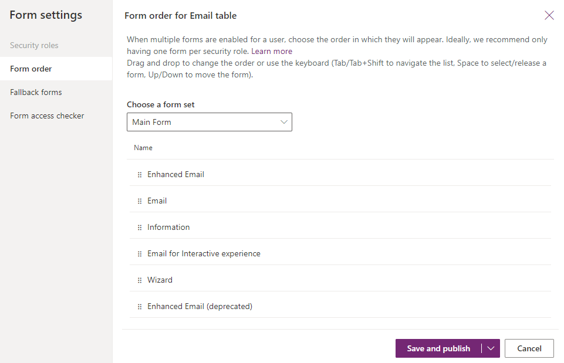
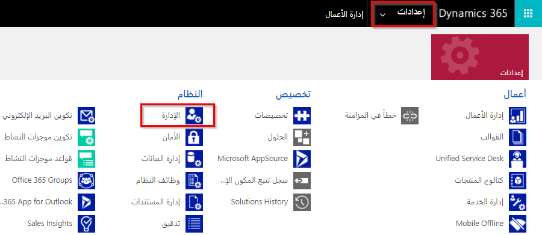
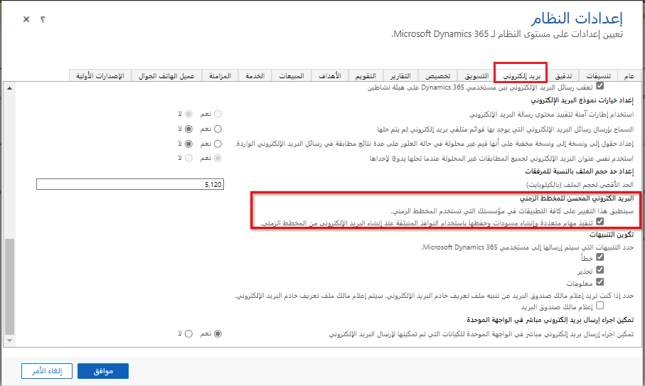
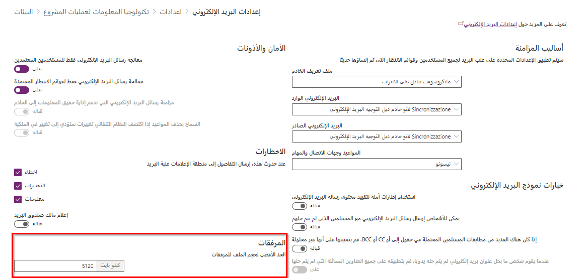
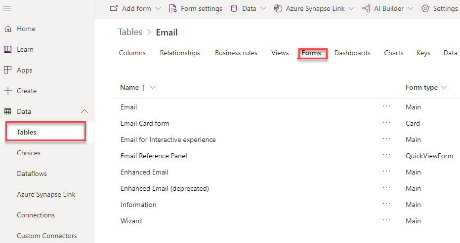
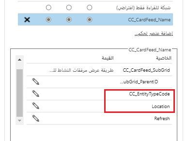
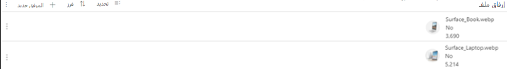
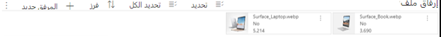
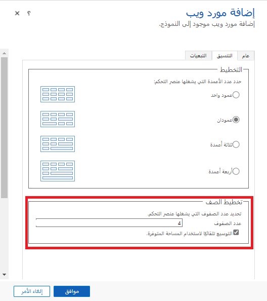
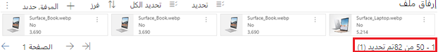

يُستخدم البريد الإلكتروني كقناة اتصال بين العملاء والمندوبين طوال دورة حياة تقديم الدعم. بينما أصبح من الشائع أن تبدأ حالات الدعم من خلال قنوات أخرى، مثل الدردشة أو وسائل التواصل الاجتماعي، لا يزال المندوبون يستخدمون البريد الإلكتروني في أغلب الأحيان لإرسال تفاصيل مهمة إلى عملائهم، مثل تأكيدات الحالة أو معرفات الحالة أو المرفقات أو أنواع أخرى من التواصل طوال دورة حياة الدعم بأكملها.

للمساعدة في تبسيط تجربة المندوب، يتحكم مسؤولو النظام في العديد من العناصر المتعلقة برسائل البريد الإلكتروني. على سبيل المثال، قد يقومون بإنشاء سلسلة من قوالب البريد الإلكتروني التي يمكن للمستخدمين تحديدها بحيث يتم عرض جميع العناصر ذات الصلة بشكل مشابه، أو يمكنهم تمكين الوصول السريع إلى البريد الإلكتروني.
يساعد هذا الأسلوب المستخدمين في إنشاء رسائل بريد إلكتروني مباشرة من الجدول الزمني لتقديم خدمة أكثر تخصيصاً.

بصفتك مسؤولاً، تتوفر لديك خيارات تكوين البريد الإلكتروني التالية:

- **تكوين أمر نموذج البريد الإلكتروني** - السماح للمستخدمين بالوصول إلى إمكانات البريد الإلكتروني وإنشاء خيار في شريط الأوامر.

- **تمكين تجربة البريد الإلكتروني المحسنة** - للسماح للأشخاص باستخدام وظائف بريد إلكتروني أوسع، مثل توسيع النافذة المنبثقة لمحرر البريد الإلكتروني، وتطبيق قوالب محددة مسبقاً، وإدراج المرفقات في البريد الإلكتروني.

- **تكوين حدود حجم مرفق البريد الإلكتروني** - السماح لك بإدارة حدود حجم الملف لمرفقات البريد الإلكتروني.

- **تكوين مخطط مصغر للإطارات المتجانبة للمرفقات** - السماح لك بتكوين التخطيط المرئي للمرفقات وعدد المرفقات التي سيتم عرضها في كل صفحة.

- **تغيير عدد المرفقات المراد عرضها في كل صفحة** - تكوين عدد المرفقات التي تريد عرضها.

- **إدارة أنواع ملفات المرفقات المحظورة** - السماح لك بتكوين أنواع الملفات التي تريد منع المستخدمين من تحميلها كمرفقات بريد إلكتروني.

## تكوين أمر نموذج البريد الإلكتروني

مثل جميع الجداول التي تم إنشاؤها باستخدام Microsoft Dataverse، يمكن أن يحتوي جدول البريد الإلكتروني الذي يوفر وظيفة النهاية الخلفية لإرسال رسائل البريد الإلكتروني على نماذج متعددة مرتبطة به لتوفير أنواع مختلفة من الوظائف بناءً على ما يُستخدم النموذج له. علي سبيل المثال، يوفر نموذج **البريد الإلكتروني المحسن** وظائف إضافية مرتبطة بالمرفقات وغير متوفرة في نموذج البريد الإلكتروني التقليدي.

عندما يحتوي جدول مثل البريد الإلكتروني على نماذج متعددة مرتبطة به، يمكنك تعديل ترتيب النموذج لتحديد النموذج المستخدم افتراضياً. لا يزال بإمكان المستخدمين الفرديين تبديل النموذج في التطبيق إذا لزم الأمر.

لتعديل ترتيب النموذج، تحتاج إلى حقوق مسؤول النظام، وتحتاج إلى الوصول إلى مدخل منشئ Power Apps على [https://make.powerapps.com](https://make.powerapps.com/?azure-portal=true). تأكد من أنك في البيئة التي تريد تعديل ترتيب النموذج بها.

في جزء التنقل الأيمن، قم بتوسيع **البيانات** وحدد **الجداول**. حدد موقع جدول البريد الإلكتروني وافتحه باستخدام عناصر التنقل. في الجزء العلوي من الشاشة، حدد علامة التبويب **النماذج**.

> [!div class="mx-imgBorder"]
> 

من شريط الأوامر، حدد **إعدادات النموذج**. في شاشة **إعدادات النموذج**، حدد **ترتيب النموذج**، ثم قم بتعديل الأمر وفقاً لاحتياجاتك. إذا لم يتم عرض  **البريد الإلكتروني المحسن**  في أعلى القائمة، فاسحبه بحيث يتم عرضه أولاً. عند الانتهاء، حدد **حفظ ونشر**.

> [!div class="mx-imgBorder"]
> 

## تمكين تجربة البريد الإلكتروني المحسن

إعداد **البريد الإلكتروني المحسن** هو الإعداد الافتراضي؛ ومع ذلك، لا يزال يتعين عليك تمكين البريد الإلكتروني للمستخدمين حتى يتمكنوا من الوصول إلى الميزة واستخدامها. يمكنك إكمال هذه المهمة من أي تطبيق من تطبيقات Dynamics 365 Customer Engagement. في الجزء العلوي من التطبيق، حدد الزر **إعدادات** (الذي يبدو كترس). من القائمة التي ستظهر، حدد **الإعدادات المتقدمة**.

يفتح هذا التحديد منطقة إعدادات. ضمن عنوان النظام، حدد **إدارة**.

> [!div class="mx-imgBorder"]
> 

حدد **إعدادات النظام**، وعلى علامة التبويب **البريد الإلكتروني**، قم بالتمرير لأسفل إلى قسم **البريد الإلكتروني المحسن للمخطط الزمني**، ثم حدد خانة الاختيار.

> [!div class="mx-imgBorder"]
> 

## تكوين حدود حجم مرفق البريد الإلكتروني

لم يتم وضع حد لعدد الملفات التي يمكنك إرفاقها برسالة بريد إلكتروني فردية. ومع ذلك، قد تجد أنه من الضروري تحديد حجم الملفات الفردية التي يمكن إرفاقها. الحد الأقصى لحجم الملف الافتراضي للمرفقات هو 5 ميغابايت. يمكن زيادة الحد الأقصى لحجم المرفقات إلى 132 ميغابايت كحد أقصى لكل ملف. يمكنك تعديل الحد الأقصى لحجم ملف مرفق باستخدام مدخل إدارة Microsoft Power Platform على [https://admin.powerplatform.microsoft.com](https://admin.powerplatform.microsoft.com/?azure-portal=true).

في مدخل المسؤول، يمكنك تحديد **بيئات** على جزء التنقل الأيمن.
حدد البيئة التي تريد تعديل الإعدادات لها، ثم حدد **الإعدادات**.
يمكنك تعديل حجم مرفق ملف البريد الإلكتروني من خلال توسيع قسم **البريد الإلكتروني** ثم تحديد **إعدادات البريد الإلكتروني**. ضمن **المرفقات**، أدخل قيمة في مربع **الحد الأقصى لحجم الملف للمرفقات**.

> [!div class="mx-imgBorder"]
> 

## تكوين مخطط مصغر للإطارات المتجانبة للمرفقات

من المزايا الممتازة لاستخدام نموذج البريد الإلكتروني المحسن الطريقة التي يقدم بها المرفقات في التطبيق. تساعد ميزة الصورة المصغرة في تسهيل الحصول على فكرة عن المحتوى الموجود في أحد المرفقات. يمكن لمسؤولي النظام تكوين تخطيط مصغر للإطارات المتجانبة للمرفقات عن طريق تعديل منطقة المرفقات للنموذج.

يمكنك إكمال هذه المهمة من خلال تعديل نموذج **البريد الكتروني المحسن** باستخدام مدخل منشئ Power Apps على [https://make.powerapps.com](https://make.powerapps.com/?azure-portal=true). في جزء التنقل الأيمن، قم بتوسيع **البيانات**، ثم حدد **الجداول**.
حدد موقع جدول البريد الإلكتروني وافتحه. حدد علامة التبويب **نماذج** في الجزء العلوي من الشاشة، ثم افتح نموذج **البريد الكتروني المحسن**.

> [!div class="mx-imgBorder"]
> 

لتعديل جميع الإعدادات المتعلقة بمنطقة المرفقات بشكل فعال، استخدم محرر النموذج التقليدي. في شريط الأوامر، حدد **تبديل إلى الوضع التقليدي**، وعندما يتم فتح محرر النموذج التقليدي، انقر نقراً مزدوجاً فوق منطقة  **المرفق**  الخاصة بالنموذج لإظهار مربع حوار  **خصائص** .

عنصر تحكم المرفقات عبارة عن شبكة للقراءة فقط تتضمن العناصر التالية:

- **سلوك إعادة التدفق** - تحديد ما إذا كان تخطيط الشبكة يتغير إلى تخطيط قائمة عندما لا تتوفر مساحة كافية.

- **إعادة التدفق** - تظهر في وضع القائمة أو وضع الشبكة، حسب الحجم المتاح.

- **القائمة فقط** - تظهر في وضع القائمة فقط.

- **الشبكة فقط** - تظهر في وضع الشبكة فقط.

- **نمط قائمة المرفقات‬** - طريقة عرض المرفقات الفردية في وضع القائمة (لكيان **المرفق** فقط).

- **الشبكة** - تظهر مجمعة مع العديد من المرفقات لكل صف.

- **الصفوف** - التجربة الافتراضية مع مرفق واحد لكل صف.

قم بتعديل العناصر لتلبي احتياجاتك الخاصة. علي سبيل المثال، توضح الصورة التالية أنه تم تعيين **سلوك إعادة التدفق** إلى  **القائمة فقط**  وتعيين  **نمط قائمة المرفقات‬**  إلى **الصفوف**.

تعرض هذه الإعدادات المرفقات، كما هو موضح في الصورة التالية.

> [!div class="mx-imgBorder"]
> 

يُظهر التغيير إلى القائمة والشبكة تخطيط المرفق الذي يظهر في الصورة التالية.

> [!div class="mx-imgBorder"]
> 

## تغيير عدد المرفقات المراد عرضها على كل صفحة

يمكنك تكوين الحد الأقصى لعدد المرفقات المراد عرضها على كل صفحة.
اضبط الإعدادات على علامة التبويب  **تنسيق**  في مربع الحوار  **تعيين خصائص المخطط أو القائمة**. علي سبيل المثال، إذا قمت بتعيين خاصية  **عدد الصفوف**  إلى **4**، ثم كان لديك أكثر من أربعة مرفقات لكل رسالة بريد إلكتروني، فسيتم ترقيم بقية المرفقات، ويمكنك بعد ذلك استخدام أزرار الأسهم لعرضها.

> [!div class="mx-imgBorder"]
> 
