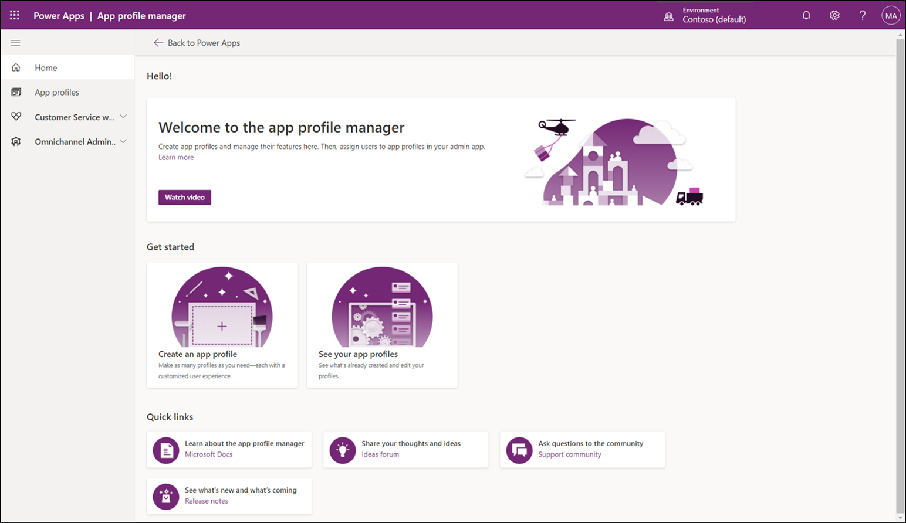

في كثير من منظمات الدعم، تختلف احتياجات المندوبين عن احتياجات والمشرفين على الأرجح. على سبيل المثال، يقوم المشرفون عادةً بإدارة المندوبين وقد لا يحتاجون إلى أصناف مثل البرامج النصية للمندوب للمساعدة في توجيه تفاعل العملاء لأنهم لا يتفاعلون مع العملاء. علاوة على ذلك، قد تتفاوت الخبرات التي يحتاجها المندوبون من قسم لآخر أو بناءً على أنواع العملاء الذين يدعمونهم. قد لا يحتاج بعض المندوبين إلى الوصول إلى قنوات محددة. بالإضافة إلى ذلك، ونظرًا لأن المندوبين يعملون مع نوع معين من العملاء، فقد يستفيدون من عرض الأصناف ووضعها بشكل مختلف في التطبيق. في السابق، كانت إحدى الطرق للتعامل مع هذه الاختلافات هي إنشاء تطبيقات مخصصة متعددة وصيانتها توفر الوظائف اللازمة عبر قواعد المستخدمين المختلفة.

توفر ميزة إدارة ملف تعريف التطبيق‬ بديلاً لإنشاء تطبيقات مخصصة وصيانتها. وتتيح للمؤسسات إنشاء تجارب تطبيقات مستهدفة للمندوبين والمشرفين الذين يستخدمون Microsoft Dynamics 365 Customer Service workspace وتطبيقات القناة متعددة الاتجاهات لـ Customer Service. باستخدام إدارة ملف تعريف التطبيق، يمكن للمسؤولين إنشاء ملفات تعريف مخصصة تحدد قوالب الجلسة وقنوات المحادثة وأدوات الإنتاجية المتوفرة لملفات التعريف الفردية. تمكّن أدوات الإنتاجية البحث البسيط في قاعدة المعارف، وتُقدّم اقتراحات لمقالات وحالات معرفية مماثلة، وتُوفّر البرامج النصية للمندوبين التي يمكن أن تتضمن وحدات ماكرو لأتمتة المهام في مهام سير العمل الشائعة.

على سبيل المثال، قد يكون لدى مؤسستك مجموعة من المندوبين الذين يركزون بشكل أساسي على خدمة العملاء من خلال التفاعلات الصوتية المُباشرة، بينما يقدم آخرون الدعم عبر قنوات متعددة مثل الدردشة أو الرسائل النصية أو Microsoft Teams.

باستخدام إدارة ملف تعريف التطبيق، يمكنك تلبية هذه الاحتياجات من خلال تحديد ملفي تعريف مختلفين:

- **مندوب الصوت** - قد يعتمد ملف التعريف هذا على تطبيق Customer Service workspace ويتضمن:

  - قناة صوتية.

  - البرامج النصية للمندوبين التي تركز على توفير الدعم الصوتي للعميل.

  - مزيد من قدرات الأتمتة.

  - البحث في المقالات المعرفية بمساعدة الذكاء الاصطناعي.

- **مندوب القناة متعددة الاتجاهات‬** - يعتمد ملف التعريف هذا على القناة متعددة الاتجاهات لـ Customer Service وقد يتضمن قنوات متعددة ونصوصًا برمجية تتضمن وظائف خاصة بالقنوات المتعددة مثل الردود السريعة وقوالب الإشعارات التي توفر تفاصيل القناة للمندوبين.

## تجربة الملف الشخصي للتطبيق 

قبل أن تتمكن من البدء في إنشاء ملفات تعريف التطبيق وتعيينها للمستخدمين، يحتاج مسؤول أو مجموعة من المسؤولين إلى إكمال المهام التالية أولاً.

1. **إنشاء المستخدمين وتعيين الترخيص في مركز إدارة Microsoft 365** - عندما يتم إنشاء المستخدم في النظام، تأكد من أنه تم تعيين ترخيص Dynamics 365 المناسب له لتزويده بامتياز الوصول إلى التطبيقات. لمزيد من المعلومات، راجع [إضافة مستخدمين وتعيين تراخيص](/microsoft-365/admin/add-users/add-users/?azure-portal=true).

1. **تعيين أدوار الأمان** - اعتمادًا على التطبيق الذي يعملون فيه، يحتاج المستخدمون إلى دور أمان مناسب للتطبيق، مثل ممثل خدمة العملاء أو مندوب القناة متعددة الاتجاهات‬. ‏‫لمزيد من المعلومات، راجع [‏‫تكوين أمان المستخدم‬](/power-platform/admin/database-security/?azure-portal=true).

1. **إنشاء مكونات ملف التعريف الضرورية** - تأكد من أنك قمت بإنشاء المكونات الضرورية التي يمكن تضمينها في التطبيق وملف تعريف التطبيق، مثل تحديد العمليات التجارية، وتكوين مسارات العمل الضرورية للقنوات، وتحديد قوائم الانتظار، وإنشاء قوالب الجلسات، وإنشاء أدوات إنتاجية مثل وحدات الماكرو والبرامج النصية للمندوبين.

بعد إكمال الخطوات السابقة، يمكنك إنشاء تجربة مخصصة للمندوبين والمشرفين من خلال:

- إنشاء ملفات تعريف التطبيق لتحديد العناصر التي تم تضمينها.

- تعيين ملفات تعريف التطبيق للمستخدمين لتحديد المستخدمين الذين ينطبق عليهم ملف التعريف.

> [!div class="mx-imgBorder"]
> 

يمكن للمستخدمين الذين لديهم دور المندوب أو المشرف المطلوب عرض واستخدام الإعدادات التي يتم توفيرها من خلال ملف تعريف التطبيق المعين.

> [!IMPORTANT]
> إذا لم تقم بتعيين ملف تعريف التطبيق، فسيتم تعيين ملف تعريف التطبيق المضمن بشكل افتراضي.

الآن بعد أن تعرفت على أساسيات إدارة ملف تعريف التطبيق، وكيفية استخدامه، وكيف يعمل، سوف تستكشف عملية إنشاء ملفات التعريف واكتشاف ما هو مدرج فيها.
