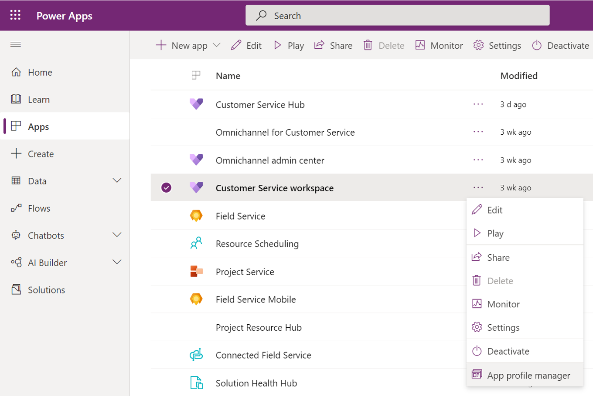
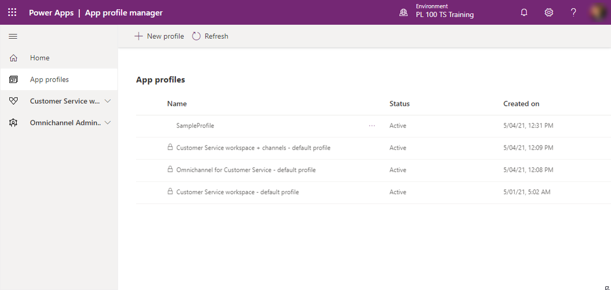
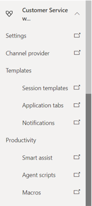

عندما تنشر مؤسستك Customer Service workspace أو القناة متعددة الاتجاهات لـ Customer Service، تصبح إدارة ملف تعريف التطبيق متاحة لك لاستخدامها. للوصول إليها، افتح الشركة المصنِّعة لـ Microsoft Power Apps بالانتقال إلى [https://make.powerapps.com](https://make.powerapps.com?azure-portal=true)، ثم حدد **إدارة ملف تعريف التطبيق** من القائمة **المزيد من الأوامر‬‏‫** لكل من Customer Service workspace أو القناة متعددة الاتجاهات لـ Customer Service.

> [!div class="mx-imgBorder"]
> 

> [!IMPORTANT]
> يتم إنشاء تطبيق Customer Service workspace تلقائيًا عندما يتم نشر Dynamics 365 Customer Service في بيئة ما. لن يكون تطبيق القناة متعددة الاتجاهات لـ Customer Service متاحًا إلا إذا تم نشره وتكوينه بناءً على الترخيص الخاص بك.

بخلاف توفير الوصول إلى ملفات تعريف التطبيقات التي تم تكوينها للبيئة، يمكنك استخدام جزء التنقل الأيمن للوصول إلى خيارات التكوين لعناصر مختلفة بناءً على التطبيقات التي تم نشرها. على سبيل المثال، لإنشاء قوالب يمكن استخدامها في Customer Service workspace، قم بتوسيع Customer Service workspace وحدد **قوالب جلسات العمل**. سينقلك هذا التحديد إلى منطقة جلسات العمل في مركز خدمة العملاء، حيث يمكنك تحديد المزيد من الجلسات. سيؤدي إكمال نفس الإجراء في إدارة القناة متعددة الاتجاهات إلى فتح علامة تبويب جديدة، حيث يمكنك التنقل في جلسات العمل في تطبيق إدارة القناة متعددة الاتجاهات.

> [!div class="mx-imgBorder"]
> 

بالنسبة لكل جلسة، يمكنك الانتقال إلى الخيارات التالية وتعديلها.

> [!div class="mx-imgBorder"]
> 

- **الإعدادات** لفتح علامة تبويب متصفح جديدة حيث يمكنك الوصول إلى الإعدادات وتعديلها بناءً على التطبيق. بالنسبة لـ Customer Service workspace، يقوم بفتح صفحة **الصفوف**، وبالنسبة لإدارة القناة متعددة الاتجاهات، فانه يفتح صفحة **سجلات الكيان**.

- **‏‫موفّر القناة‬** - لفتح طريقة عرض القنوات حيث يمكنك تكوين قناة جديدة أو تحديث إعدادات الموفرين الحاليين.

- **القوالب** - لتحديد القوالب المحددة التي ستكون متاحة في ملف التعريف. يمكن تضمين ثلاثة أنواع من القوالب:

  - **‏‫قوالب جلسات العمل** - مجموعة من السمات ومعلومات علامة تبويب التطبيق التي تحدد ماذا وكيف يتم وضع الأصناف في جلسة عمل محددة.

  - **علامات تبويب التطبيقات** - لتحديد نوع التطبيقات التي تريد فتحها عند بدء الجلسة.

  - **الإخطارات** - لتحديد التفاصيل التي سيتم عرضها عندما يرسل التطبيق إخطاراً إلى مندوب.

- **الإنتاجية** - لتحديد أدوات الإنتاجية التي ستكون متاحة في ملف التعريف. تتوفر ثلاثة خيارات:

  - **‏‫المساعدة الذكية‬** مساعد ذكي يوفر توصيات في الوقت الحقيقي للمندوبين لمساعدتهم على اتخاذ الإجراءات اللازمة أثناء التفاعل مع العملاء.

  - **‏‫البرامج النصية للمندوب‬** - لتوفير إرشادات للمندوبين بشأن ما يجب عليهم فعله عندما يتم تعيين مشكلة عميل لهم.

  - **‏‫وحدات الماكرو‬** - مجموعة من الإجراءات المتسلسلة التي يقوم بها المستخدم.

## الأدوار والأذونات

نظرًا لارتباطها بإدارة ملف تعريف التطبيق، تحدد الأدوار ما يمكن أن يفعله المستخدم الذي تم تعيينه للدور بالملف الشخصي. بدون تحديد دور، قد لا يتمكن المستخدمون من الوصول إلى التطبيق أو أداء المهام. قبل البدء في إنشاء ملفات التعريف، يجب أن تفكر في الأدوار والأذونات التي تريدها.

تتوفر الأدوار التالية مع إدارة ملف تعريف التطبيق:

- **‏‫مسؤول إدارة ملف تعريف التطبيق‬** - يوفر إمكانات إدارية للمستخدمين المعينين، بما في ذلك القدرة على إضافة قنوات وإنشاء قوالب جلسة ووظائف إدارية أخرى.

- **‏‫مستخدم ملف تعريف التطبيق‬** - يوفر إمكانيات المستخدم النهائي للمستخدمين المعينين، بما في ذلك الوصول إلى وحدة التطبيق، أو العمل مع القنوات ، أو بدء الجلسات.

بالنسبة للمؤسسات التي تستخدم Customer Service workspace، تمت إضافة الامتيازات المتعلقة بدور ‏‫مستخدم ملف تعريف التطبيق‬ بالفعل إلى دور ممثل خدمة العملاء ودور ‏‫مدير ممثلي خدمة العملاء‬ افتراضيًا. ستحتاج إلى توفير دور ‏‫مسؤول إدارة ملف تعريف التطبيق‬ يدويًا للمستخدم الذي سيقوم بإنشاء ملفات تعريف التطبيق والقوالب وأدوات الإنتاجية وتكوينات موفر القناة.
إذا كنت تستخدم القناة متعددة الاتجاهات لـ Customer Service، فقد تمت إضافة الامتيازات المتعلقة بدور ‏‫مسؤول إدارة ملف تعريف التطبيق‬ إلى دور مسؤول القناة متعددة الاتجاهات. تمت إضافة امتيازات دور مستخدم ملف تعريف التطبيق بالفعل لدور مندوب القناة متعددة الاتجاهات‬ ودور مشرف القناة متعددة الاتجاهات.

لمزيد من المعلومات، راجع [الأدوار والامتيازات الخاصة بها](/dynamics365/app-profile-manager/security-roles/?azure-portal=true#roles-and-their-privileges).
