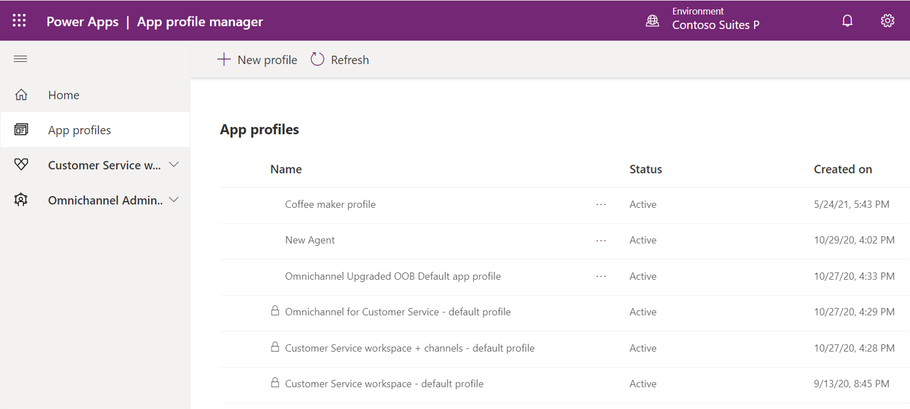

بعد أن تحدد أنك ستحتاج إلى ملف تعريف، يمكنك إنشاؤه من إدارة ملف تعريف التطبيق‬. سيؤدي تحديد الخيار **‏‫ملفات تعريف التطبيقات‬** في صفحة **إدارة ملف تعريف التطبيق** إلى عرض قائمة بكافة ملفات التعريف المحددة حاليًا لهذه البيئة. بشكلٍ افتراضي، تتوفر ثلاثة ملفات تعريف لـ Customer Service Workspace والقناة متعددة الاتجاهات لـ Customer Service: 

- **القناة متعددة الاتجاهات لـ Customer Service - ملف التعريف الافتراضي** - استخدم ملف التعريف هذا عندما يقوم مندوب بالوصول إلى تطبيق القناة متعددة الاتجاهات لـ Customer Service.

- **‏‫Customer Service workspace - ملف تعريف افتراضي‬** - استخدم ملف التعريف هذا عندما يقوم مندوب بالوصول إلى تطبيق Customer Service workspace ولم يتم تكوين أي قنوات أخرى.

- **‏‫Customer Service workspace + القنوات - ملف تعريف افتراضي‬** - استخدم ملف التعريف هذا عندما يقوم مندوب بالوصول إلى تطبيق Customer Service workspace وقد تم تكوين مزيد من القنوات.

إذا لم يتم تعيين ملف تعريف التطبيق إلى مندوب، فسيتم استخدام ملف التعريف الافتراضي.

> [!IMPORTANT]
> لا يمكن حذف ملفات التعريف هذه أو تعديلها.

## إنشاء ملف تعريف تطبيق

قبل أن تتمكن من إنشاء ملف تعريف تطبيق، تحتاج إلى تعيين دور مسؤول ‏‫إدارة ملف تعريف التطبيق‬ للحساب الذي تخطط لاستخدامه. في اللوحة اليمنى، حدد **‏‫ملفات تعريف التطبيقات‬** ثم حدد الزر **ملف تعريف جديد** لإنشاء ملف تعريف جديد.

> [!div class="mx-imgBorder"]
> 

على الشاشة **ملف تعريف جديد** ، حدد القيم التالية:

- **الاسم** - اسم ملف تعريف التطبيق.

- **الوصف** - وصف لملف التعريف. *(اختياري)*

- **الاسم الفريد** - معرف فريد بتنسيق `<prefix>_<name>`.

عند إنشاء الاسم الفريد، تأكد مما يلي:

- تتكون البادئة من أحرف أبجدية وأرقام بطول يتراوح بين ثلاثة إلى ثمانية أحرف.

- يتم تضمين شرطة سفلية بين البادئة والاسم، مثل **sample_cswvoice**.

> [!div class="mx-imgBorder"]
> 

## تعيين القوالب وتمكين جزء الإنتاجية والقنوات

بعد إنشاء ملف تعريف التطبيق الخاص بك في البداية، يمكنك البدء في تصميم كيفية ظهور ملف التعريف وما سيتضمنه. سيتضمن ملف التعريف أربع علامات تبويب يمكنك استخدامها:

- **عام** - لتعديل اسم ملف التعريف ووصفه.

- **‏‫قوالب جلسات العمل‬** - لتحديد قوالب جلسات العمل التي سيتم استخدامها لعرض الأصناف إلى المندوبين.

- **جزء الإنتاجية** لتمكين جزء الإنتاجية أو تعطيله وتحديد ميزات جزء الإنتاجية التي تريد استخدامها، بما في ذلك:

  - **‏‫البرامج النصية للمندوب‬** - لتقديم إرشادات خطوة بخطوة للمساعدة على تقليل الخطأ البشري وتوفير خدمة متناسقة.

  - **‏‫بحث المعارف‬** - يمكن للمستخدمين البحث عن مقالات معرفية ذات الصلة.

  - **‏‫المساعدة الذكية‬** - تقديم توصيات ذكية تتعلق بالمقالات المعرفية والحالات المماثلة والمزيد بالاستناد إلى سياق الوقت الحقيقي.

- **‏‫القنوات‬** - حدد القنوات التي تريد تضمينها في ملف التعريف هذا.

> [!div class="mx-imgBorder"]
> 

ستتم مناقشة هذه العناصر بمزيد من التفصيل خلال بقية هذه الوحدة.

## ‏‏تعيين ملفات التعريف إلى المستخدمين

بعد تحديد ما تريد تضمينه في ملف التعريف، قم بتعيين ملف التعريف للمستخدمين الذين ينبغي تطبيقه عليهم. هذه المواصفات مهمة لأنه إذا لم يتم تعيين مستخدم إلى ملف تعريف، فسيستخدم ملف التعريف الافتراضي تلقائيًا للتطبيق الذي يعمل معه.

قم بتعيين مستخدمين إلى ملف تعريف وذلك بتحديد الزر **تعيين المستخدمين**  في شريط الأوامر. يعمل هذا الإجراء على فتح شاشة **ملف تعريف التطبيق - المستخدمون** في علامة تبويب مستعرض جديده. في هذه الشاشة، يمكنك إضافة مستخدمين موجودين إلى ملف التعريف وذلك بتحديد الزر **إضافة مستخدم موجود**.

> [!div class="mx-imgBorder"]
> 

سيتم عرض المستخدمين الذين تم تحديدهم لملف التعريف في القائمة. بعد تعيين جميع المستخدمين الضروريين، يمكنك العودة إلى ‏‫إدارة ملف تعريف التطبيق‬.

> [!NOTE]
> إذا كنت ترغب في إضافة مستخدمي ملف تعريف أو تحريرهم أو حذفهم في المستقبل، حدد الزر  **تعيين المستخدمين** في شريط الأوامر للرجوع إلى شاشة **ملف تعريف التطبيق - المستخدمون**.

## تعيين ملف التعريف الافتراضي

عندما يتم تعيين أدوار للمستخدمين تتوافق مع Customer Service workspace أو القناة متعددة الاتجاهات لـ Customer Service، فسيستخدمون ملفات تعريف التطبيق الافتراضية لتلك التطبيقات ما لم يتم تعيينهم إلى ملف تعريف مختلف.

يتم تعيين ملفات تعريف التطبيق الافتراضية على النحو التالي:

- **Customer Service workspace** - يتم تعيين ملف تعريف التطبيق المضمن للمستخدمين الذين لديهم الأدوار التالية:

  - مدير ممثلي خدمة العملاء

  - ممثل خدمة العملاء

- **القناة متعددة الاتجاهات لـ Customer Service** - يتم تعيين ملف تعريف التطبيق المضمن للمستخدمين الذين لديهم الأدوار التالية:

  - مسؤول القناة متعددة الاتجاهات

  - مشرف القناة متعددة الاتجاهات‬

  - مندوب القناة متعددة الاتجاهات‬

الآن بعد أن عرفت كيفية إنشاء ملفات تعريف التطبيق، ستتعلم كيفية تكوين العناصر المختلفة.
