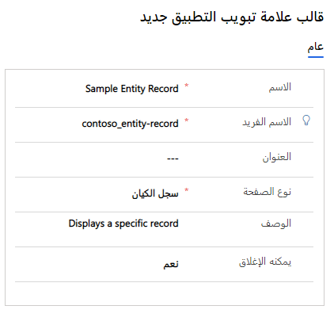
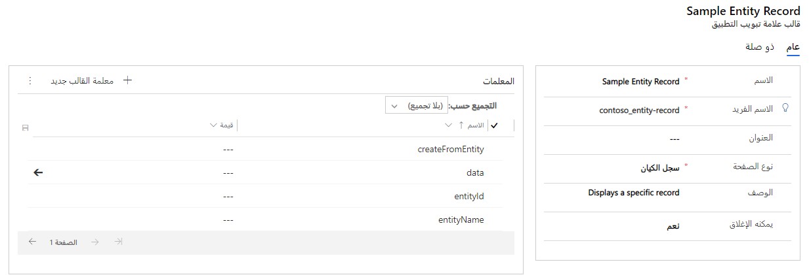

يحتاج المندوبون إلى الوصول إلى المعلومات ذات الصلة والسياقية المناسبة أثناء عملهم مع أحد العملاء. على سبيل المثال، أثناء قيام المندوب بالبحث في سجل حساب العميل، إذا حدد ارتباط جهة الاتصال الأساسية، فيجب فتح سجل جهة الاتصال في علامة تبويب منفصلة في الجلسة. يجب أن يظل سجل الحساب قابلاً للوصول عن طريق التبديل إلى علامة التبويب حسب الحاجة. في التطبيقات المستندة إلى الجلسة، مثل Customer Service workspace والقناة متعددة الاتجاهات لـ Customer Service، يُشار إلى علامات التبويب التي تفتح داخل جلسة لعرض معلومات مختلفة بعلامات تبويب التطبيق.

تتيح لك قوالب علامة تبويب التطبيق في Customer Service تحديد أنواع التطبيقات التي تريد فتحها عند بدء الجلسة. باستخدام قوالب علامة تبويب التطبيق، يمكنك تحديد التطبيقات المتاحة للجلسة. بعد ذلك، يمكنك ربط التطبيقات بجلسة. على سبيل المثال، يمكنك إنشاء نوع تطبيق  **ملخص العميل** ثم إقرانه بجلسات الدردشة والنص. الآن، عندما يقبل المندوب الإشعار من الدردشة أو القنوات النصية، تبدأ الجلسة وتبدأ صفحة **ملخص العميل** في التحميل. يمكنك أيضاً إنشاء قالب علامة تبويب تطبيق لتحميل موقع ويب خارجي ذي صلة في جلسة لضمان أن المندوب يمكنه الوصول إلى الموقع حسب الحاجة دون فتح جلسة متصفح أخرى.

عندما تحدد **علامات تبويب التطبيق** ضمن Customer Service workspace أو إدارة القناة متعددة الاتجاهات، يتم أخذك إلى صفحة **قوالب علامات تبويب التطبيق النشطة** . يمكنك إنشاء قوالب جديدة عن طريق تحديد الزر **جديد** على شريط الأوامر.

عند إنشاء قالب تطبيق مبدئياً، حدد القيم التالية:

- **الاسم** - تحديد اسم الجلسة.

- **الاسم الفريد** - معرف فريد بتنسيق `<prefix>_<name>`.
    المعلمات التالية مطلوبة للاسم الفريد:

  - يمكن أن تكون البادئة فقط أبجدية رقمية ويجب أن يتراوح طولها بين ثلاثة إلى ثمانية أحرف.

  - يجب أن تكون الشرطة السفلية بين البادئة والاسم، مثل **Contoso_application_tab**.

- **العنوان** - تحديد عنوان الجلسة التي يتم عرضها للمندوبين في واجهة المستخدم (UI) في وقت التشغيل، مثل **بحث في المقالات المعرفية‬**.

- **نوع الصفحة** - تحديد نوع التطبيق الذي سيتم تحميله.

- **الوصف** - يُستخدم لتقديم وصف للمرجع الخاص بك.

- **يمكن الإغلاق** - تحديد ما إذا كان يمكن إغلاق علامة التبويب بواسطة عميل أو لا.

> [!div class="mx-imgBorder"]
> 

## نوع التطبيقات

تتوفر سبعة أنواع من التطبيقات لتختار من بينها:

- **قائمة الكيانات** - عرض طريقة عرض تحدد كيفية عرض قائمة سجلات لجدول معين في تطبيق القناة متعددة الاتجاهات، مثل عرض قائمة بالحالات المفتوحة.

- **سجل الكيانات** - عرض سجل منفرد لجدول، مثل سجل حالة للعميل الذي تعمل معه.

- **مورد الويب** - عرض موارد الويب التي تمثل الملفات المستخدمة لتوسيع تطبيق الويب، مثل الصور أو ملفات HTML أو JavaScript.

- **عنصر التحكم** - للاستخدام الداخلي فقط.

- **لوحة المعلومات** - عرض لوحة معلومات.

- **بحث** - عرض نتائج البحث بناءً على النص الذي تم تمريره إلى عنصر تحكم البحث.

- **‏‫موقع ويب جهة خارجية‬** - عرض Microsoft والمواقع الخارجية كتطبيق.

بعد حفظ قالب علامة تبويب التطبيق لأول مرة، ستظهر شبكة فرعية **المعلمات** تتضمن معلمات محددة مسبقاً.
تضمن هذه المعلمات القابلة للتكوين أنه عند فتح علامة التبويب، سيتم تحميلها بالمعلومات الصحيحة.

> [!div class="mx-imgBorder"]
> 

تستند المعلمات التي يتم عرضها في الشبكة الفرعية إلى نوع الصفحة الذي تم تحديده للقالب. على سبيل المثال، إذا حددت نوع صفحة **سجل الكيان** لأن علامة التبويب يجب أن تقوم بتحميل سجلات الحساب، وللتأكد من حدوث ذلك بشكل صحيح، تحتاج إلى التفاصيل. يمكن أن تتضمن هذه التفاصيل الجدول الذي تأتي منه البيانات، والنموذج الذي يجب استخدامه، وبيانات التسجيل المراد تعبئتها في علامة تبويب التطبيق.

للتأكد من تحميل المعلومات الصحيحة، سيتضمن نوع تطبيق سجل الكيان المعلمات التالية.

| المعلمة | قيمة المثال | الوصف |
|-----------|---------------|-------------|
| createFromEntity | الحساب | سجل يوفر القيم الافتراضية بناءً على قيم السمات المعينة. يحتوي كائن البحث على خصائص السلسلة التالية: نوع الكيان والمعرف والاسم (اختياري). النوع = كائن JSON |
| البيانات | {"firstname":"Rigsby", "lastname":"cho", "jobtitle":"Sales Manager"} | سمات وقيم سجل الكيان الجديد. النوع = كائن JSON |
| entityId | d72e3735-5dca-e911-a826-000d3a1f0599 | معرف GUID لسجل الكيان. النوع = سلسلة |
| entityName | الحساب | الاسم المنطقي للكيان. النوع = سلسلة |
| formId | 8448B78F-8F42-454E-8E2A-F8196B0419AF | معرف GUID لمثيل النموذج. النوع = سلسلة |
| processId |  | معرف GUID لعملية الأعمال. النوع = سلسلة |
| العلاقة |  | كائن العلاقة من السجل. النوع = كائن JSON |
| selectStageId |  | معرف GUID للمرحلة المحددة في مثيل عملية الأعمال. النوع = سلسلة |

لمزيد من المعلومات، راجع [إدارة قوالب علامات تبويب التطبيقات](/dynamics365/app-profile-manager/application-tab-templates/?azure-portal=true).

بعد تحديد قوالب التطبيق، يمكنك إقرانها بقوالب الجلسة بحيث تكون متاحة عندما يحتاج إليها المستخدمون.
