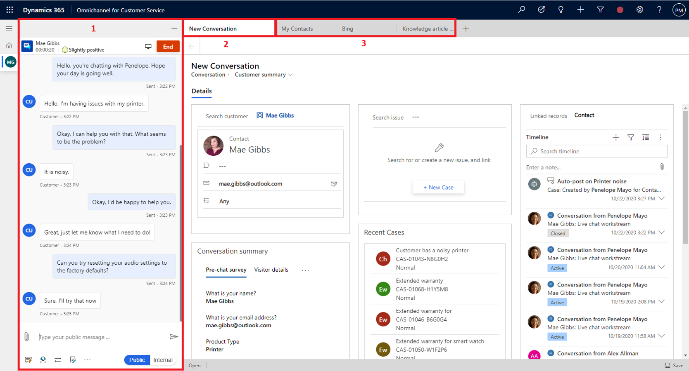

نظراً لأن المندوبين يعملون مع العملاء عبر قنوات مختلفة أو في سيناريوهات مختلفة، يمكن أن تختلف المعلومات التي يحتاجون إليها وكيفية تقديمها. تتحكم الجلسات في كيفية تقديم هذه العناصر إلى المندوبين.

عندما يقبل مندوب طلب محادثة وارد من أحد العملاء، تبدأ الجلسة. خلال الجلسة، يتم استخدام مجالات وتطبيقات مختلفة لتقديم البيانات إلى المندوبين. بشكل افتراضي، يقوم النظام بفتح تطبيق **ملخص العميل**  كلوحة علامة تبويب تطبيق. يوفر هذا التطبيق للمندوبين تفاصيل مهمة، مثل تفاصيل العميل وتفاصيل المحادثة والوصول إلى المعلومات الأخرى ذات الصلة.

يمكن للمندوبين فتح علامات تبويب التطبيق حسب الحاجة خلال الجلسة للحصول على مزيد من التفاصيل حول المعلومات ذات الصلة. على سبيل المثال، سيؤدي تحديد الحالة المرتبطة بالمحادثة إلى فتح تفاصيل الحالة في علامة تبويب تطبيق أخرى. بعد ذلك، يمكن للمندوبين التبديل بين علامات التبويب داخل الجلسة.

تتضمن كل جلسة **علامة تبويب الارتساء**. و **علامة تبويب الارتساء** هي علامة التبويب التي سيتم فتحها عند تشغيل جلسة عمل جديدة. إنها بمثابة علامة تبويب رئيسية لجلسة العمل. على سبيل المثال، في القناة متعددة الاتجاهات لـ Customer Service، **علامة تبويب الارتساء** هي تطبيق ملخص العميل. لا يمكن إغلاق **علامة تبويب الارتساء**؛ ستظل متوفرة أثناء فتح جلسة العمل.

لضمان حصول المندوبين على ما يحتاجون إليه، يمكنك تحديد قوالب جلسات مختلفة يمكن إضافتها إلى ملفات تعريف التطبيق. قالب الجلسة هو مزيج من السمات ومعلومات علامة تبويب التطبيق التي يمكن إعادة استخدامها حسب الحاجة.

تُستخدم قوالب الجلسة لتحديد العناصر الأساسية في تجربة الجلسة، كما هو موضح في لقطة الشاشة التالية (تتوافق الأرقام مع الصورة):

1. **لوحة الاتصال** - تحديد الوضع الافتراضي للوحة الاتصال (مثل نافذة الدردشة) عند بدء الجلسة.

2. **علامة تبويب الارتساء** - تحديد التطبيق المراد فتحه كعلامة التبويب الرئيسية لتلك الجلسة ولا يمكن إغلاقه.

3. **علامات تبويب التطبيقات الإضافية** - تحديد علامات تبويب أخرى لفتحها عند بدء الجلسة.

  > [!div class="mx-imgBorder"]
  > 

تتوفر قوالب الجلسة المضمنة بشكل افتراضي. بناءً على تطبيقات Customer Service التي قمت بنشرها، سيكون لديك قوالب مختلفة متاحة.

القوالب المضمنة للقناة متعددة الاتجاهات لـ Customer Service هي:

- جلسة عمل كيان الحالة - القالب الافتراضي
- جلسة عمل دردشة - افتراضي
- جلسة عمل مراسلة مخصصة - افتراضي
- جلسة عمل سجلات الكيان - افتراضي
- القنوات الاجتماعية:
  - جلسة عمل Facebook - افتراضي
  - جلسة عمل LINE - افتراضي
  - جلسة عمل SMS - افتراضي
  - جلسة عمل Teams - افتراضي
  - جلسة عمل Twitter - افتراضي
  - جلسة عمل WeChat - افتراضي
  - جلسة عمل WhatsApp - افتراضي

القالب المضمن لـ Customer Service Workspace هو **جلسة عمل كيان حالة**، وهو قالب افتراضي.

توفر القوالب نقطة بدء رائعة. ومع ذلك، لا يمكنك تخصيص قوالب الجلسة هذه. إذا كنت بحاجة إلى خيارات مختلفة، يمكنك إنشاء القوالب المخصصة الخاصة بك.

## إنشاء قالب جلسة عمل

يمكن إنشاء قوالب جلسات العمل من صفحة **إدارة ملف تعريف التطبيق**، وستقوم بإنشائها بناءً على التطبيق الذي تنطبق عليه.
على سبيل المثال، لإنشاء قالب جلسة ينطبق على ملفات تعريف Customer Service workspace، يمكنك إنشاء قالب جلسة لتطبيق Customer Service workspace. في الجزء الأيسر من صفحة **إدارة ملف تعريف التطبيق**، قم بتوسيع إما **Customer Service workspace** أو **إدارة القناة متعددة الاتجاهات**، ثم حدد **قوالب جلسات العمل**. سينقلك هذا الإجراء إلى شاشة **قوالب جلسات العمل النشطة**. يمكنك إنشاء قوالب جديدة عن طريق تحديد الزر **جديد** على شريط الأوامر.

> [!IMPORTANT]
> بغض النظر عن التطبيق الذي تختاره، سيتم نقلك إلى نفس الشاشة حيث سيتم عرض جميع قوالب جلسات العمل. سيتم فتح صفحة **الواجهة الموحدة** على علامة تبويب جديدة.

عند تحديد قالب جلسة عمل، ستحتاج إلى تحديد المعلمات التالية.

| الاسم | وصف القيمة | مثال |
|------|-------------------|---------|
| الاسم | تحديد اسم جلسة العمل. | جلسة عمل الدردشة |
| الاسم الفريد | معرف فريد بتنسيق `<prefix>_<name>`. | msdyn_chat_custom |
| النوع | تحديد نوع قالب جلسة العمل. يتوفر خياران. **الكيان**: تحديد أن العنصر يستند إلى جدول Microsoft Dataverse. عند تحديد **الكيان**، سيتم عرض حقل **الكيان**، حيث يمكنك تحديد الجدول الذي سيتم ربطه به. **عام**: استخدم هذا الخيار عندما يتم تخصيص النموذج لأي قناة، مثل الدردشة أو الرسائل النصية.| الكيان |
| العنوان | تحديد عنوان الجلسة التي يتم عرضها للمندوبين في واجهة المستخدم (UI) في وقت التشغيل. | {customerName} |
| وضع لوحة الاتصال | تحديد الوضع الافتراضي للوحة عند بدء جلسة عمل. يمكنك تحديد أحد الخيارات التالية: **تم الإرساء**: اللوحة موجودة في الوضع الموسع. **مصغرة**: اللوحة موجودة في الوضع المصغر. **مخفية**: اللوحة مخفية. | راسية |
| الوصف | قدم وصفاً للرجوع إليه. | يُستخدم قالب جلسة العمل لطلب محادثة من قناة الدردشة. |
| علامة تبويب الارتساء | تحديد التطبيق الذي يتم فتحه افتراضياً عند بدء جلسة العمل ولا يمكن إغلاقه. | ملخص العميل |

> [!IMPORTANT]
> يتم عرض خيار علامة تبويب الارتساء فقط عند تعيين  **النوع**  إلى **عام**.

> [!div class="mx-imgBorder"]
> 

من ميزات قوالب جلسات العمل أنه يمكنك تحديد المزيد من علامات التبويب لفتحها عند بدء جلسة العمل. تضمن هذه الميزة أن المندوب يمكنه تحديد العناصر التي يحتاجون إليها دون البحث المفرط. بعد حفظ سجل قالب جلسة عمل، سيتم عرض الشبكة الفرعية **علامات التبويب الإضافية**، حيث يمكنك تحديد علامات تبويب التطبيقات الإضافية لفتحها عند بدء جلسة العمل.

إن علامة التبويب  **البرامج النصية للمندوبين**  هو المكان الذي يمكنك فيه تحديد البرامج النصية للمندوب التي يجب أن تكون متاحة للمندوبين أثناء عملهم في جلسة العمل. تتضمن علامة تبويب البرامج النصية للمندوبين أيضاً خيار تبديل لتعيين البرنامج النصي الافتراضي لنوع جلسة عمل معين. إذا قمت بتعيين حقل **تمكين إنشاء التعبير** إلى **نعم**، يمكنك استخدام منشئ التعبير لتحديد برنامج المندوب النصي الذي سيتم تحميله استناداً إلى نوع جلسة العمل التي يتم بدؤها. على سبيل المثال، بالنسبة لأنواع جلسات الكيانات مثل الحالة، قد ترغب في تحميل برنامج نصي للمندوب يحدد المعلومات المتعلقة بالحالة. نظراً لأن أنواع جلسات العمل العامة ستتضمن لوحة المحادثة، فقد ترغب في تحميل برنامج نصي يتضمن بيانات المحادثة وخطوات إنشاء السجلات ذات الصلة.

> [!div class="mx-imgBorder"]
> 

لمزيد من المعلومات، راجع [تعيين البرنامج النصي للمندوب الافتراضي للمندوبين](/dynamics365/app-profile-manager/agent-scripts/?azure-portal=true#set-the-default-agent-script-for-agents).

الآن بعد أن تم تكوين قالب جلسة العمل الخاص بك، يجب أن يكون مقترناً بمسار عمل لضمان تحميله عند الحاجة.
