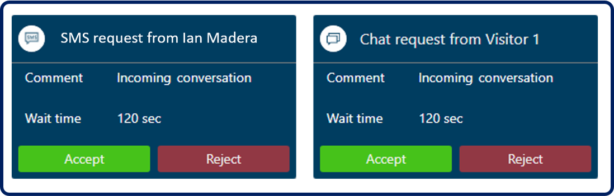
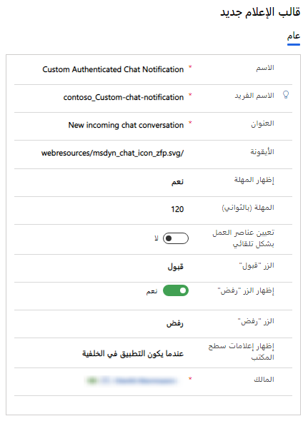
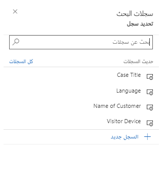
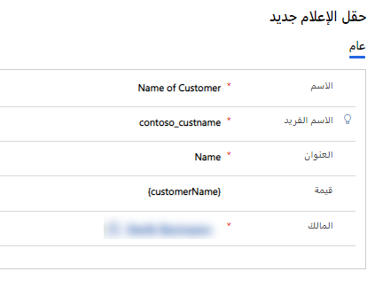
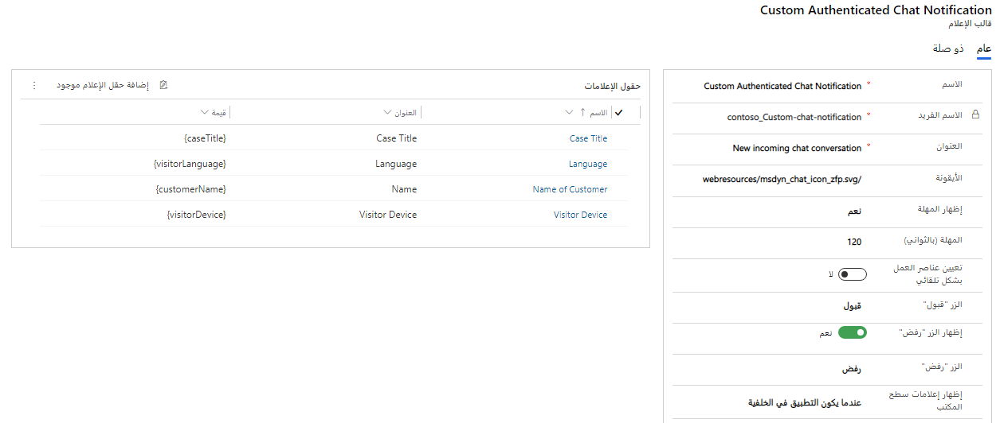

بينما يحاول العملاء التفاعل مع مؤسستك عبر قنوات مختلفة، يتم إنشاء طلبات المحادثة وتوجيهها إلى الوكلاء المتاحين. بعد أن يُحدد النظام أحد الوكلاء، يرسل إشعارًا إليه. الإشعار هو تنبيه مرئي يظهر في كل مرة تتلقى فيها طلب محادثة نصية أو دردشة من أحد العملاء. يتضمن الإشعار تفاصيل حول العميل الذي ستتفاعل معه. ستبدأ جلسة عند قبول الطلب، ويمكنك عرض المعلومات السياقية للعميل والمشكلة في صفحة **ملخص العميل**.

تتضمن السيناريوهات التي قد تتلقى فيها إشعارات ما يلي:

- الدردشة أو الرسائل النصية أو محادثات القنوات الاجتماعية الواردة.

- المحادثات التي يتم تحويلها إليك من وكيل آخر.

- المحادثات التي يتم تصعيدها إليك من وكيل آخر أو روبوت.

تُظهر الصورة التالية أمثلة على إشعارين مختلفين من قنوات مختلفة.

> [!div class="mx-imgBorder"]
> 

الصورة الأولى هي إشعار وارد من عميل حالي مُعرَّف من رسالة نصية. الإشعار الثاني وارد من مستخدم غير معرّف عبر قناة دردشة. لدى كل مؤسسة متطلبات عمل متنوعة وتريد من الإشعارات أن تعرض المعلومات ذات الصلة للوكلاء.

على غرار قوالب التبويب الخاصة بالجلسات والتطبيقات، يمكنك استخدام قوالب الإشعارات المضمنة الموجودة أو إنشاء قوالبك الخاصة. قالب الإشعار عبارة عن مجموعة من المعلومات المتعلقة بالإشعار والقابلة لإعادة الاستخدام، ويتم استخدامه لتكوين المعلومات التي يجب عرضها للوكلاء والمشرفين فيما يتعلق بمحادثة واردة أو تصعيد أو تحويل أو استشارة.

## قوالب الإشعار المضمنة

عندما تستخدم مؤسستك القناة متعددة الاتجاهات لـ Customer Service، سيتم تزويدك بالعديد من قوالب الإشعارات المضمنة التي يمكنك استخدامها في بيئتك. وبناءً على ما إذا كان العميل قد تمت مصادقته أم لا، تتوفر قوالب مختلفة مصدّق عليها وغير مصدّق عليها. على سبيل المثال، إذا قام أحد العملاء بتسجيل الدخول إلى بوابة دعم شركتك ثم بدأ محادثة دردشة، فستتضمن رسالة الإشعار تفاصيل العميل. وإذا لم يسجل دخوله إلى البوابة الإلكترونية، فلن يتم تضمين معلومات العميل في الرسالة.

يتم توضيح القوالب المضمنة في الجدول التالي.

| القناة أو الكيان | استشارة | مصدّق | غير مصدّق | تحويل |
|-------------------|---------|---------------|-----------------|----------|
| دردشة | دردشة - استشارة - افتراضي | دردشة - وارد مصدّق عليه - افتراضي | دردشة - وارد غير مصدّق عليه - افتراضي | دردشة - تحويل - افتراضي |
| رسائل مخصصة | رسائل مخصصة - استشارة - افتراضي | رسائل مخصصة - وارد مصدّق عليه - افتراضي | رسائل مخصصة - وارد غير مصدّق عليه - افتراضي | رسائل مخصصة - تحويل - افتراضي |
| Facebook | Facebook - استشارة - الافتراضي | Facebook - وارد مصدّق عليه - افتراضي | Facebook - وارد غير مصدّق عليه - افتراضي | Facebook - تحويل - افتراضي |
| LINE | LINE - استشارة - افتراضي | LINE - وارد مصدّق عليه - افتراضي | LINE - وارد غير مصدّق عليه - افتراضي | LINE - تحويل - افتراضي |
| الرسائل القصيرة | رسالة نصية قصيرة - استشارة - افتراضي | رسالة نصية قصيرة - وارد مصدّق عليه - افتراضي | رسالة نصية قصيرة - وارد غير مصدّق عليه - افتراضي | رسالة نصية قصيرة - تحويل - افتراضي |
| Microsoft Teams | Teams - استشارة - افتراضي | Teams - وارد مصدّق عليه - افتراضي | Teams - وارد غير مصدّق عليه - افتراضي | Teams - تحويل - افتراضي |
| Twitter | Twitter - استشارة - افتراضي | Twitter - وارد مصدّق عليه - افتراضي | Twitter - وارد غير مصدّق عليه - افتراضي | Twitter - تحويل - افتراضي |
| WeChat | WeChat - استشارة - افتراضي | WeChat - وارد مصدّق عليه - افتراضي | WeChat - وارد غير مصدّق عليه - افتراضي | WeChat - تحويل - افتراضي |

لا يمكنك تخصيص قوالب الإشعار المضمنة. إذا كنت تريد رسائل إشعار مخصصة، فأنت بحاجة إلى إنشاء قوالبك المخصصة.

## إنشاء قالب إشعار

يمكنك إنشاء قوالب إشعار جديدة من صفحة **إدارة ملفات تعريف التطبيق** من خلال توسيع إما **مساحة عمل Customer Service** أو **إدارة القناة متعددة الاتجاهات**، ثم تحديد **الإشعارات** ضمن العنوان **القوالب**، ثم تحديد الزر **جديد** على شريط الأوامر.

يتضمن قالب الإشعار العناصر التالية:

- **الاسم** - يحدد اسم الإشعار.

- **الاسم الفريد** - معرف فريد بتنسيق `<prefix>_<name>`.

- **العنوان** - يحدد عنوان الإشعار الذي يتم عرضه للوكلاء في واجهة المستخدم في وقت التشغيل، مثل **محادثة دردشة واردة جديدة**.

- **الأيقونة** - تحدد المسار إلى مورد الويب الذي سيتم استخدامه لأيقونة الإشعار، مثل `/webresources/msdyn_chat_icon_zfp.svg`.

- **إظهار المهلة** - يحدد ما إذا كان يجب عرض مؤقت العد التنازلي للمستخدم، والذي يحدد وقت انتهاء صلاحية الإشعار.

- **المهلة (بالثواني)** - تحدد مدة عداد المهلة.

- **التعيين التلقائي لعناصر العمل** - يحدد ما إذا كان يجب تعيين العناصر تلقائيًا للفنيين.

- **زر القبول** - يحدد النص الذي سيتم عرضه على زر النص.

- **إظهار زر الرفض** - يحدد ما إذا كان يجب عرض الزر **رفض** للوكلاء. إذا تم التعيين على **نعم**، يمكنك تعديل النص الذي يتم عرضه.

- **إظهار إشعارات سطح المكتب**: يحدد ما إذا كنت تريد عرض الإشعارات للوكلاء عندما يكون تطبيق القناة متعددة الاتجاهات لـ Customer Service خارج نطاق التركيز.

> [!div class="mx-imgBorder"]
> 

## حقول الإشعار

بعد حفظ قالب الإشعار مبدئيًا، سيظهر قسم **حقول الإشعار** على الصفحة.

يُستخدم حقل الإشعار لعرض المعلومات السياقية في الإشعار. على سبيل المثال، إذا كنت تريد أن يعرض الإشعار اسم العميل الذي يطلب الدردشة، يمكنك إنشاء حقل إشعار يحدد البيانات المراد تعبئتها. يمكنك تحديد حقول الإشعار التي تريد استخدامها لهذا القالب عن طريق تحديد الزر **إضافة إشعار موجود**. سيفتح هذا التحديد نافذة بحث حيث يمكنك إضافة حقول إشعار موجودة أو حقل جديد إذا لزم الأمر.

> [!div class="mx-imgBorder"]
> 

عند تحديد حقل إشعار، ستحتاج إلى تحديد المعلمات التالية:

- **الاسم** - يحدد اسم حقل الإشعار.

- **الاسم الفريد** - معرف فريد بتنسيق `<prefix>_<name>`.

- **العنوان** - يحدد عنوان حقل الإشعار.

- **القيمة** - تحدد القيمة التي سيتم تقديمها إلى الوكيل في وقت التشغيل، مثل **{customerName}**.

> [!div class="mx-imgBorder"]
> 

في المثال السابق، تم إدخال **{customerName}** في حقل **القيمة**. يشار إلى هذا الإدخال باسم حقل احتياط. حقل الاحتياط عبارة عن معلمة استبدال يتم ملؤها في وقت التشغيل بناءً على متغيرات السياق.
في هذه الحالة، سيتم استبدال **{customerName}** باسم العميل الذي بدأ محادثة الدردشة، مثل **Kenny Smith**.

يوفر الجدول التالي قائمة بإدخالات حقول الاحتياط المتوفرة.

| حقل الاحتياط | الوصف |
|------|-------------|
| {customerName} | اسم العميل الذي بدأ المحادثة. |
| {caseId} | المعرّف الفريد العالمي لمشكلة ما. يتم عرض معرف المشكلة فقط إذا كانت المشكلة مرتبطة بالمحادثة. |
| {caseTitle} | عنوان المشكلة. يتم عرض عنوان المشكلة فقط إذا كانت المشكلة مرتبطة بالمحادثة. |
| {queueId} | المعرّف الفريد العالمي لقائمة انتظار. |
| {visitorLanguage} | اللغة التي يبدأ بها العميل المحادثة. |
| {visitorDevice} | جهاز العميل الذي بدأ المحادثة. |
| {entityRoutingLogicalName} | اسم الكيان إذا كان الإشعار لسجلات كيان. |
| {entityRoutingRecordId} | المعرّف الفريد العالمي لسجل الكيان إذا كان الإشعار لسجلات كيان. لمزيد من المعلومات، راجع توجيه سجلات الكيانات في المستندات. |
| {customerEntityName} | اسم الكيان (جهة الاتصال أو كيان الحساب) إذا تمت مصادقة العميل. |
| {customerRecordId} | المعرّف الفريد العالمي للكيان (جهة اتصال أو كيان الحساب) إذا تمت مصادقة العميل. |
| {*name of the pre-chat survey question*} | يمكن استخدام جميع أسئلة استبيان ما قبل الدردشة التي تم تكوينها لتدفق العمل باعتبارها حقل احتياط. التنسيق هو نفسه السؤال. |

بعد إضافة جميع حقول الإشعار التي تريد تضمينها في القالب، سيتم ملؤها عند تقديم الإشعار، في حالة وجود بيانات لهذه القيم.

> [!div class="mx-imgBorder"]
> 

الآن بعد أن تعرفت على القوالب المختلفة التي تريد استخدامها، فإن الخطوة الأخيرة هي التأكد من استخدامها بشكل مناسب عن طريق تعيينها إلى تدفقات العمل المناســبة.
