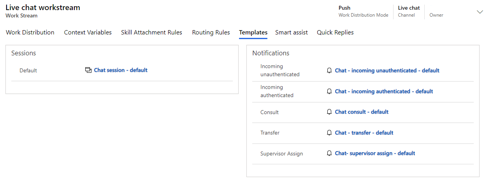

يحدد تدفق العمل كيفية توجيه المحادثات الواردة وتوزيعها على الوكلاء. يتضمن تدفق العمل تفاصيل مثل كيفية تعيين العمل للوكلاء، وقوائم الانتظار التي يتم التوجيه إليها، وحتى الردود السريعة التي يمكن استخدامها. يتم إنشاء تدفقات العمل لدعم القنوات المختلفة مثل الدردشة أو الرسائل النصية أو القنوات الاجتماعية.

تأكد من ربط القوالب التي تقوم بإنشائها بتدفقات العمل المرتبطة بالقنوات حيث سيتم استخدام القوالب.
على سبيل المثال، إذا قمت بإنشاء إشعار دردشة مخصص تريد التأكد من استخدامه عند طلب محادثات الدردشة، فستحتاج إلى ربط قالب الإشعارات بتدفق عمل الدردشة.
بعد أن يتم ربطه، سيتم استخدام الإشعار المخصص من تلك النقطة فصاعدًا لقنوات الدردشة التي تستخدم تدفق العمل هذا. بعد أن يقبل الوكيل طلب المحادثة، ستبدأ الجلسة بناءً على قالب الجلسة المرتبط بتدفق العمل.

## إرفاق القوالب بتدفق العمل

يمكنك تعيين قوالب إلى تدفق عمل في مركز إدارة القنوات متعددة الاتجاهات ومركز خدمة العملاء وتطبيقات إدارة القنوات متعددة الاتجاهات.
يتم تحديد قوالب الجلسات والإشعارات في علامة التبويب **القوالب** في تدفقات العمل الفردية.

تتضمن علامة التبويب **القوالب** قسمين:

- **الجلسات** - تحدد قالب الجلسة الذي يجب استخدامه مع تدفق العمل هذا.  

- **الإشعارات** - تحدد قوالب الإشعارات التي يجب استخدامها في سيناريوهات مختلفة. السيناريوهات المتاحة هي:

  - **وارد غير مصدّق عليه** - يُستخدم عندما يأتي طلب المحادثة من شخص لم تتم مصادقته من قبل، كعدم قيامه بتسجيل الدخول إلى بوابة العملاء الخاصة بك.

  - **وارد مصدّق عليه** - يُستخدم عندما يأتي طلب المحادثة من شخص تمت مصادقته حاليًا، كقيامه بتسجيل الدخول إلى بوابة العملاء الخاصة بك.

  - **استشارة** - يُستخدم عندما يطلب وكيل آخر التشاور معك بشأن محادثة يعملون فيها.

  - **تحويل** - يُستخدم عند تحويل محادثة من وكيل إلى آخر.

  - **تعيين المشرف** - يُستخدم عندما يقوم المشرف بتعيين محادثة إلى مستخدم.

> [!div class="mx-imgBorder"]
> 

يمكنك قبول القوالب الافتراضية للجلسات والإشعارات، أو يمكنك استخدام أي قوالب مخصصة قمت بإنشائها.

> [!NOTE]
> قد تلاحظ أنه لا يتوفر مكان لتعريف علامات تبويب قوالب التطبيق. يتم إرفاق هذه التعريفات على مستوى قالب الجلسة.
