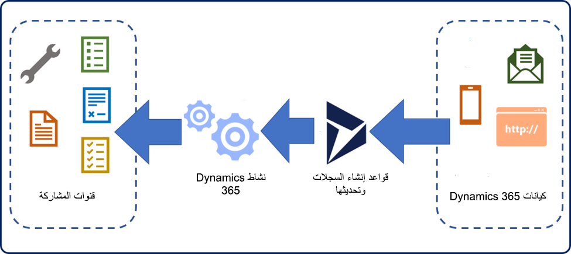

في الماضي القريب، فتح معظم العملاء حالات مع المؤسسات عبر الهاتف. عادةً، عند ورود مكالمة، يقوم المندوب الذي استلمها بإنشاء الحالة أثناء تفاعلهم مع العميل. واليوم، يمكن للعملاء التعامل مع الحالات وإرسالها بأي عدد من الطرق، غالبًا دون التحدث إلى مندوب. على سبيل المثال، قد يُرسل العميل طلبًا للدعم إلى الاسم المستعار للبريد الإلكتروني لمؤسسة ما مثل `support@microsoft.com`. عند استلام الطلب، يجب تحويل البريد الإلكتروني إلى سجل حالة. يضمن هذا النهج أن الطلب سيكون متاحًا للمندوبين للعمل عليه، وأنه يمكن توجيهه إلى صف مختلف بناءً على محتويات البريد الإلكتروني أو من جاء منه.

يوفر Microsoft Dynamics 365 Customer Service القدرة على إنشاء السجلات وتحديث القواعد تلقائيًا، مما يوفر أساسًا للمستخدمين لاستهلاك المعلومات من قنوات مختلفة. بالإضافة إلى ذلك، يمكنك تحويل طلبات العملاء تلقائيًا إلى سجل حالة Microsoft Dynamics 365.

توضح الصورة التالية المفهوم الأساسي لتدفق النشاط هذا.

> [!div class="mx-imgBorder"]
> 

نظرًا لأن العميل يتعامل مع مؤسستك من خلال قناة تفاعل مثل البريد الإلكتروني أو الوسائط الاجتماعية أو طلب حالة عبر الإنترنت، يتم تسجيل الصنف كنشاط Dynamics 365.

لكل نوع نشاط تم تكوينه، يمكنك تحديد قواعد إنشاء السجلات وتحديثها لتقييم التفاصيل من النشاط. بعد ذلك، يمكنك مقارنتها بالشروط المخزنة في القاعدة. استنادًا إلى نتائج الشرط، ستنشئ خدمة العملاء سجل Dynamics 365 مطابقًا، مثل حالة.

يجب أن تتضمن قاعدة التحديث والإنشاء النموذجية العناصر الثلاثة التالية:

- **‏‫نوع النشاط المراد مراقبته‬** - يحدد أنواع الأنشطة المتاحة في المؤسسة التي ستطبق عليها قاعدة الإنشاء والتحديث.

- **الشروط المطلوب تقييمها** - يحدد المعايير التي يجب أن يستوفيها السجل ليتم تحويله إلى حالة. على سبيل المثال، قد تحدد أن نشاط البريد الإلكتروني يجب أن يأتي من عميل دعم من المستوى الذهبي.

- **‏‫الإجراءات التي يجب اتخاذها‬** - يحدد الإجراءات التي يجب أن تتخذها القاعدة عند استيفاء الشرط. على سبيل المثال، إذا كان البريد الإلكتروني من عميل على مستوى ذهبي، فقم بإنشاء سجل حالة جديد واربطه بالعميل الذي تم استلام البريد الإلكتروني منه.

ستفحص بقية هذه الوحدة إجراءات قواعد إنشاء السجلات وتحديثها بمزيد من التفصيل وستشرح عملية تحديدها.
