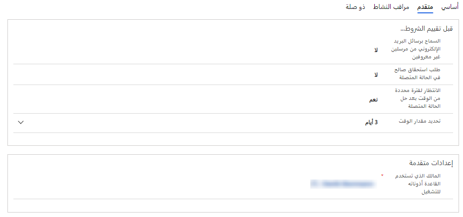

بعد تحديد السيناريو الذي تريد إنشاء السجلات فيه تلقائيًا، مثل الحالات، يمكنك استخدام وظيفة ‏‫قاعدة إنشاء السجل وتحديثه‬ للقيام بذلك. يمكنك الوصول إلى وظيفة قاعدة إنشاء السجل وتحديثه‬ من ملف منطقة **إدارة الخدمات** بتطبيق مركز خدمة العملاء‬.

عند إنشاء قاعدة، ستحتاج أولاً إلى تحديد المعلومات التالية:

- **‏‫اسم القاعدة** - لتحديد اسم القاعدة.

- **‏‫الصف المراد مراقبته‬** - لتحديد أي صف (إن وجد) ستراقبه القاعدة للبحث عن السجلات. على سبيل المثال، قد تحدد مراقبة قصف الدعم الافتراضي لمؤسستك.

- **‏‫نوع النشاط المراد مراقبته‬** - لتحديد نوع سجل النشاط الذي ستبحث عنه القاعدة عند تطبيق القاعدة.

## القواعد والصفوف

تؤدي الصفوف دورًا رئيسيًا في قواعد إنشاء السجلات. عندما تحدد صفًا للمراقبة، عندما تكون القاعدة نشطة، فإنها ستراقب جميع الأنشطة الواردة إلى صف المصدر. إذا كان نوع النشاط يطابق نوع النشاط المحدد للصف، مثل بريد إلكتروني، فستقوم القاعدة بمعالجة النشاط الوارد لإنشاء السجلات أو تحديثها.

> [!IMPORTANT]
> بالنسبة لنوع مصدر البريد الإلكتروني، يعد تحديد صف أمرًا إلزاميًا. بالنسبة لجميع أنواع المصادر الأخرى، بما في ذلك الأنشطة المخصصة ، الأمر اختياري.

لمزيد من المعلومات، راجع [إنشاء صف أو تغييره](/dynamics365/customer-service/set-up-queues-manage-activities-cases/?azure-portal=true).

## أنواع الأنشطة

في Dynamics 365، غالبًا ما تمثل سجلات النشاط تفاعلات مع العملاء، مثل بريد إلكتروني تم استلامه من أحد العملاء. تتمثل إحدى ميزات الأنشطة في إمكانية تحويلها إلى أنواع مختلفة من السجلات، مثل الحالات أو الفرص (عند استخدام Microsoft Dynamics 365 Sales). عند إنشاء قاعدة، تأكد من تحديد نوع النشاط الذي تنطبق عليه القاعدة. تضمن هذه المواصفات أن النظام يعرف أنواع الأنشطة التي يبحث عنها عند إنشاء السجل.

تشمل أنواع أنشطة Dynamics 365 التي يمكنك تحويلها إلى حالة افتراضيًا ما يلي:

- المواعيد
- الاستجابات للحملات
- رسائل البريد الإلكتروني
- الفاكسات
- الخطابات
- المكالمات الهاتفية
- أنشطة الخدمة
- المهام
- الأنشطة الاجتماعية

بالإضافة إلى الأنشطة السابقة، يمكنك استخدام سجلات أنشطة أخرى، مثل الأنشطة التي تمت إضافتها كجزء من حل مثبت أو أنشطة مخصصة.

> [!IMPORTANT]
> على الرغم من أنه يمكنك إنشاء قواعد متعددة لنوع مصدر واحد، يمكنك الحصول على قاعدة نشطة واحدة فقط لنفس نوع المصدر وصف في أي وقت.
>
> على سبيل المثال، لديك قاعدة نشطة تسمى **البريد الإلكتروني إلى الحالة‬‏‫** محددة لصف يسمى **الدعم** يحتوي على نوع مصدر **البريد الإلكتروني**. إذا قمت بإنشاء قاعدة أخرى لنفس الصف **‎الدعم** يحتوي على **البريد الإلكتروني** محدد كنوع مصدر، فإنه يتم إلغاء تنشيط **البريد الإلكتروني إلى الحالة** عند محاولة تنشيط قاعدة **البريد الإلكتروني إلى الحالة 2**.

> [!NOTE]
> يكون السيناريو السابق صحيحًا أيضًا إذا كان لديك قاعدتان غير مرتبطين بصف معين ولكن لهما نفس نوع المصدر. كن على علم بهذا العامل أثناء تصميم القواعد.

بعد حفظ قاعدة للمرة الأولى، يمكنك تعديل الأصناف الأخرى التي تؤثر على وقت إنشاء السجلات. تتوفر هذه الخيارات في علامة التبويب **خيارات متقدمة**. بناءً على نوع النشاط الذي تحدده، ستختلف الخيارات المتاحة.

على سبيل المثال، عندما يتم تعيين نوع المصدر إلى **البريد الإلكتروني**، تكون الشروط كما يلي:

- **السماح برسائل البريد الإلكتروني من مرسلين غير معروفين‬** - لتحديد ما إذا كنت ستسمح بإنشاء الحالات تلقائيًا والتي تأتي من عناوين البريد الإلكتروني غير المرفقة بحساب Dynamics 365 أو جهة اتصال.

- **‏‫طلب استحقاق صالح في الحالة المتصلة‬** - لتحديد وجوب وجود سجل استحقاق صالح للعميل الذي أرسل البريد الإلكتروني. لا يتحقق من وجود محددات في الاستحقاق، ولكن هذا واحد فقط موجود.
إذا كان لدى العميل العديد من الاستحقاقات، سيتم إنشاء سجل.

- **الانتظار لفترة محددة من الوقت بعد الحالة المتصلة‬** - لتحديد ما إذا كان البريد الإلكتروني مرتبطًا بحالة تم حلها مؤخرًا وما إذا كان ينبغي التعامل معها كحالة جديدة.

> [!div class="mx-imgBorder"]
> 

تمثل هذه الشروط فقط الخيارات المتاحة لنوع النشاط **البريد الإلكتروني**.
تأكد من التحقق من الخيارات المتاحة لأنواع الأنشطة الأخرى، مثل الأنشطة الاجتماعية.

الآن بعد أن تم تحديد الإعدادات الأولية للقاعدة، تحتاج إلى تحديد الشروط والإجراءات التي يجب استخدامها في تحديد وقت وكيفية إنشاء السجلات.
