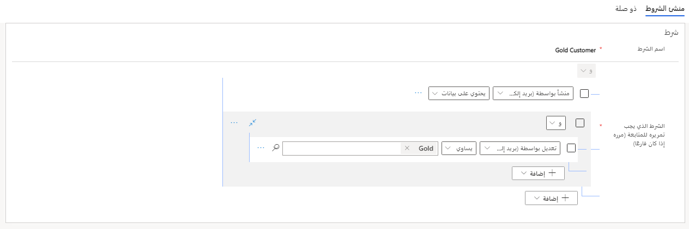
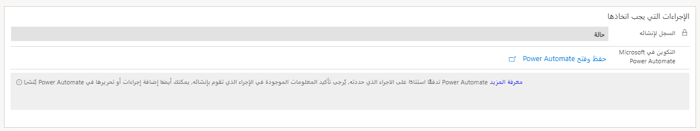

ضمن القاعدة، قد يكون لديك العديد من الشروط والإجراءات التي تم تحديدها للمساعدة في ضمان أنها مرنة بما يكفي للتعامل مع السيناريوهات المختلفة التي تواجهها. تحدد عناصر القاعدة الشروط المراد تقييمها والإجراءات التي يجب اتخاذها بناءً على الشروط. من المحتمل أن تحتوي القاعدة الواحدة على عدة عناصر قاعدة محددة لها. نظراً لتطبيق القاعدة على سجل وارد، يتم تقييم كل عنصر من عناصر القاعدة بالترتيب المحدد في القاعدة. 

على سبيل المثال، قد تحتوي قاعدة البريد الإلكتروني إلى الحالة على عناصر القاعدة الثلاثة التالية:

- **عنصر القاعدة 1** - تحقق مما إذا كان حساب المرسل في Dynamics 365 يظهر باعتباره **عميلاً ذهبياً**. إذا كانت الإجابة بنعم، فأنشئ حالة خدمة بمستوى ذهبي لهذا العميل مع أصل **البريد الإلكتروني**.

- **عنصر القاعدة 2** - تحقق مما إذا كان حساب المرسل في Dynamics 365 يظهر باعتباره **عميلاً فضياً**. إذا كانت الإجابة بنعم، فأنشئ حالة خدمة بمستوى فضي لهذا العميل مع أصل **البريد الإلكتروني**.

- **عنصر القاعدة 3** - أنشئ حالة دون تحديد مستوى خدمة وأصل **البريد الإلكتروني**.

> [!div class="mx-imgBorder"]
> 

## الشروط

يمكن للشروط تقييم محتويات محددة في النشاط المراد تحويله إلى سجل Dynamics 365 أو من السجلات المرتبطة به. على سبيل المثال، يمكنك تحديد شرط يبحث في سجل الحساب أو جهة الاتصال المرتبط بمرسل البريد الإلكتروني. بعد ذلك، سيتحقق مما إذا كان حقل مستوى خدمة الحساب (العمود المخصص الذي تضيفه) يساوي الذهب.
يوفر هذا التحقق مزيداً من المرونة لاستخدام محتويات رسائل البريد الإلكتروني كمعايير، بالإضافة إلى البيانات الأخرى ذات الصلة من Dynamics 365.

> [!div class="mx-imgBorder"]
> 

ضمن شرط واحد، يمكن تحديد العديد من العناصر على أنها شروط **و/أو** باعتبارها ذات نطاق أكثر تحديداً. على سبيل المثال، يمكنك إنشاء شرط يبحث عن كلمة "عاجل" في موضوع رسائل البريد الإلكتروني وما إذا كانت مرسلة من عميل ذهبي.

## الإجراءات التي يجب اتخاذها

بعد تحديد الشروط المراد تقييمها، تحتاج إلى تحديد الإجراء الذي يجب اتخاذه عند استيفاء الشرط، مثل إنشاء سجل حالة. الجزءان الرئيسيان من الإجراءات هما:

- **السجل المراد إنشاؤه** - تحديد نوع السجل الذي ستنشئه القاعدة.

- **التكوين في Microsoft Power Automate** - استخدام Microsoft Power Automate لتحديد التفاصيل المحددة للسجل الذي سيتم إنشاؤه.

> [!div class="mx-imgBorder"]
> 

عند تحديد السجل الذي تريد إنشاءه، سيتم استخدام هذه المعلومات لملء الجدول المحدد مسبقاً في تدفق Power Automate.

في الخطوة التالية، ستتعلم المزيد حول استخدام Power Automate مع قواعد إنشاء السجلات.
