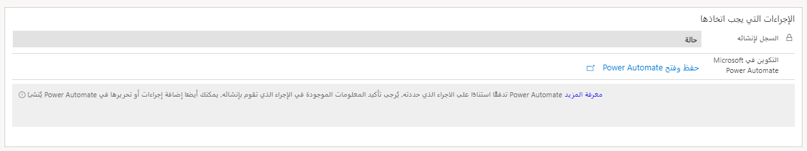
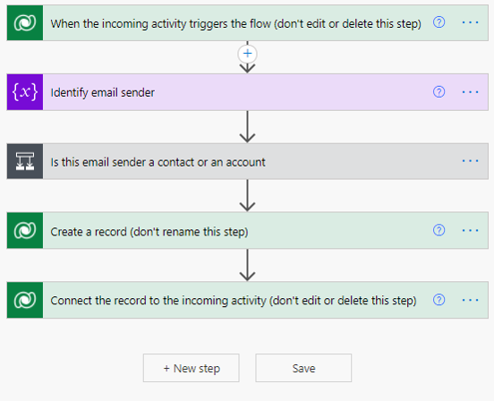
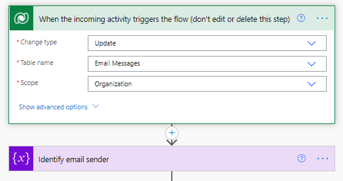
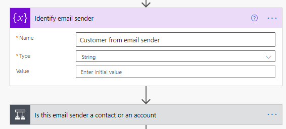
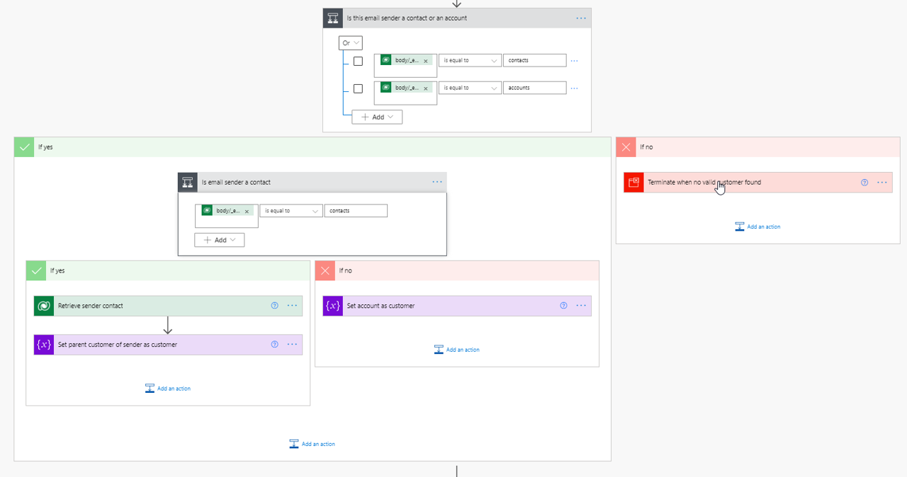
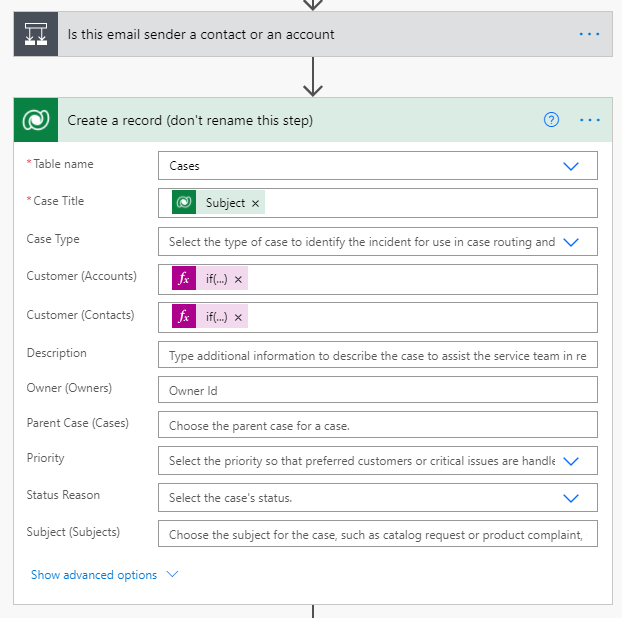
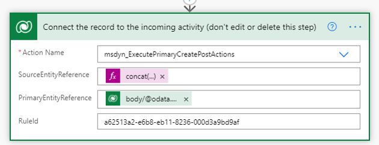

بعد تحديد تفاصيل الشرط المراد تقييمه في عنصر القاعدة، يمكنك تكوين الإجراء المطلوب اتخاذه. عادةً ما يتكون الإجراء المطلوب اتخاذه من إنشاء سجل جديد، مثل حالة، في التطبيق.

عندما تحدد الإجراء المطلوب اتخاذه، فأنت بحاجة إلى تحديد جزأين رئيسيين:

- **السجل المراد إنشاؤه** - تحديد نوع السجل الذي سيتم إنشاؤه.

- **التكوين في Microsoft Power Automate** - استخدام Power Automate لتعبئة الحقول في السجل، مثل العميل أو أصل الحالة أو مستوى الخدمة.

> [!div class="mx-imgBorder"]
> 

يتم استخدام Power Automate بسبب المرونة التي يوفرها فيما يتعلق بالتنفيذ التلقائي. باستخدام Power Automate، يمكنك الاتصال بشبكة جداول Microsoft Dataverse للشبكة التي تستخدمها Customer Service، ويمكنك أيضاً استخدام موصلات Power Automate الأخرى المتوفرة لدمج البيانات من التطبيقات أو الخدمات الأخرى، إذا لزم الأمر. على سبيل المثال، قد يكون لدى مؤسستك بيانات خطوط الطول والعرض مضمنة في سجلات الحالة إذا كان يلزم تصعيدها والعمل عليها شخصياً. باستخدام Power Automate، يمكن تمرير التفاصيل من عنوان العميل المقترن إلى خدمة تحديد الموقع الجغرافي. يمكن إدخال خط الطول وخط العرض اللذين يتم إرجاعهما من الخدمة في سجل الحالة عند إنشائه.

قبل قيامك بتكوين القاعدة في Power Automate، ستحتاج إلى تحديد السجل المراد إنشاؤه. يجب عليك إكمال هذه الخطوة أولاً لأنه عند إنشاء تدفق Power Automate، فإنه يُدرج تلقائياً خطوة لإنشاء سجل في جدول Dataverse هذا.

عند تحديد **حفظ وفتح Power Automate**، سيتم فتح تدفق Power Automate في علامة تبويب جديدة. ويحتاج التدفق إلى الاتصال بموصل Microsoft Dataverse لتعبئة البيانات، لذا قد تحتاج إلى تسجيل الدخول إلى الموصل.
بعد قيامك بتسجيل الدخول، سيظهر التدفق.

في البداية، سيتضمن التدفق خمسة عناصر:

- **عندما يقوم النشاط الوارد بتشغيل التدفق** - يتم تشغيل التدفقات استناداً إلى المعلومات القادمة من Dynamics 365.

- **تحديد مرسل رسالة البريد الإلكتروني** - التقاط اسم الشخص الذي جاءت منه رسالة البريد الإلكتروني.

- **هل مرسل رسالة البريد الإلكتروني هذا جهة اتصال أم حساب** - تحديد ما إذا كانت رسالة البريد الإلكتروني قد تم استلامها من حساب موجود أو جهة اتصال في النظام.

- **إنشاء سجل** - إنشاء السجل الجديد في النظام.

- **توصيل السجل بالنشاط الوارد** - إقران السجل الذي تم إنشاؤه بسجل نشاط البريد الإلكتروني الوارد الأصلي.

> [!div class="mx-imgBorder"]
> 

يجب أن تعتبر القالب نقطة بداية جيدة لإنشاء السجل. إذا تم استخدام القالب في شكله الحالي، فسيساعدك على إنشاء السجل؛ ومع ذلك، يجب عليك فحص السجل عن كثب وإجراء التغييرات حسب الحاجة.

ثلاث خطوات يكون فيها التحرير أو الحذف محدوداً:

- **عندما يقوم النشاط الوارد بتشغيل التدفق** - لا تقم بتحرير هذه الخطوة أو حذفها.

- **إنشاء سجل** - يمكنك تعديل هذه الخطوة حسب الحاجة، ولكن تأكد من عدم إعادة تسميتها أو حذفها.

- **توصيل السجل بالنشاط الوارد** - لا تقم بتحرير هذه الخطوة أو حذفها.

بخلاف الخطوات السابقة، يمكن تحرير خطوات أخرى أو إضافتها أو إزالتها لتلبي احتياجاتك بشكل أفضل. قبل أن تبدأ في إجراء تغييرات كبيرة على التدفق، يجب أن تكون على دراية بما تفعله كل خطوة وكيف يتم استخدام المعلومات طوال التدفق. تفحص الأقسام التالية كل خطوة افتراضية بمزيد من التفصيل.

## عندما يقوم النشاط الوارد بتشغيل التدفق‬‏‫

خطوة التشغيل التي تحدد كيفية بدء تشغيل التدفق تكون **عندما يقوم النشاط الوارد بتشغيل التدفق‬‏‫‬**.
جميع المعلومات الموجودة في الخطوة محددة مسبقاً وتستند إلى نوع النشاط، الذي تم تحديده عند إنشاء القاعدة.

عنصران رئيسيان تحددهما هذه الخطوة:

- **نوع التغيير** - تحديد حدث السجل الذي سيقوم بتشغيل التدفق. في هذه الحالة، يتم تشغيله بعد تحديث نشاط البريد الإلكتروني الذي تم إنشاؤه في النظام، والذي يحدث عند تشغيل القاعدة مقابل العنصر.

- **اسم الجدول** - تحديد جدول Microsoft Dataverse المقترن النشاط به. في هذه الحالة، نظراً لأن القاعدة مقترنة بنشاط بريد إلكتروني، فإنها تستخدم جدول رسائل البريد الإلكتروني.

> [!div class="mx-imgBorder"]
> 

> [!IMPORTANT]
> تذكر أنه لا يتعين عليك تعديل هذه الخطوة أو حذفها من التدفق.

## تحديد مرسل رسالة البريد الإلكتروني

للتأكد من إقران السجل الذي تم إنشاؤه بجهة الاتصال أو سجل الحساب الصحيح، تحتاج إلى تحديد مَن تم إرسال البريد الإلكتروني منه. لإكمال هذه المهمة، ستقوم بإدخال خطوة تهيئة المتغير لالتقاط ما تحتاج إليه.
تأخذ خطوة **تحديد مرسل رسالة البريد الإلكتروني** اسم مرسل رسالة البريد الإلكتروني وتخزنه. بعد حصولك على معلومات المرسل، يمكنك مطابقتها مع جهة اتصال محتملة أو سجلات الحساب في خطوة مستقبلية.

> [!div class="mx-imgBorder"]
> 

## هل مرسل رسالة البريد الإلكتروني هذا جهة اتصال أم حساب؟

تحدد خطوة **هل مرسل رسالة البريد الإلكتروني هذا جهة اتصال أم حساب** ما إذا كان الشخص الذي تم استلام رسالة البريد الإلكتروني منه حساباً أو جهة اتصال. بعد تحديد هذه المعلومات، يمكنك إقران نشاط البريد الإلكتروني بالسجل الصحيح في التطبيق لاحقاً في التدفق. بالإضافة إلى ذلك، ستستخدم هذه الخطوة عند إنشاء سجل الحالة للتأكد من أن الحالة مقترنة بالعميل الصحيح.

في هذه الحالة، يكون قد تم إدراج خطوة شرط لتقييم ما إذا كان نوع المرسل سجل جهة اتصال أو حساب. إذا لم يكن نوع المرسل حساباً أو جهة اتصال، فسيتم إلغاء التدفق. بخلاف ذلك، يحدد هذا أي نوع هو ثم يلتقطه كمتغير لاستخدامه لاحقاً في التدفق.

> [!div class="mx-imgBorder"]
> 

## إنشاء سجل

تنشئ خطوة **إنشاء سجل** السجل في Dynamics 365. بخلاف إضافة المزيد من الخطوات المحتملة إلى التدفق، إن هذه الخطوة هي الخطوة التي من المحتمل أن تقوم بتعديلها أكثر من غيرها لضمان تعبئة البيانات في السجل كما ينبغي. على سبيل المثال، قد ترغب في تعيين حقل أصل الحالة إلى **البريد الإلكتروني**، أو قد ترغب في قيام التدفق بتعيين القيمة في حقل مستوى الخدمة إلى قيمة مثل **ذهب**. يمكن أن تساعد هذه الخطوة في تسهيل توجيه الحالة في المستقبل، إذا لزم الأمر.

> [!div class="mx-imgBorder"]
> 

بعض البيانات محددة مسبقاً، مثل التعبيرات التي تعيّن حقل **حسابات العملاء** أو **جهات اتصال العملاء** استناداً إلى ما إذا كان العنصر جاء من سجل جهة اتصال أو حساب. يمكنك تحرير هذه التعبيرات أو إزالتها حسب احتياجاتك. أثناء تعديل هذه الخطوة، اتبع الممارسات القياسية للعمل مع موصل Microsoft Dataverse في تدفق Power Automate.

لمزيد من المعلومات، راجع [Microsoft Dataverse](/connectors/commondataserviceforapps/?azure-portal=true).

## توصيل السجل بالنشاط الوارد

ستعمل الخطوة الأخيرة في التدفق على ربط السجل بالنشاط الوارد مرة أخرى، مثل رسالة البريد الإلكتروني التي تم استلامها في الأصل. مثل خطوة التشغيل، جميع المعلومات الموجودة في خطوة **توصيل السجل بالنشاط الوارد** معبأة مسبقاً، لذا يجب عليك تركها في حالتها الحالية. سيؤثر أي تحرير أو حذف على التدفق.

> [!div class="mx-imgBorder"]
> 

بعد الانتهاء من تعديل التدفق بناءً على احتياجاتك، يمكنك حفظ التدفق والخروج منه للعودة إلى القاعدة الخاصة بك.
