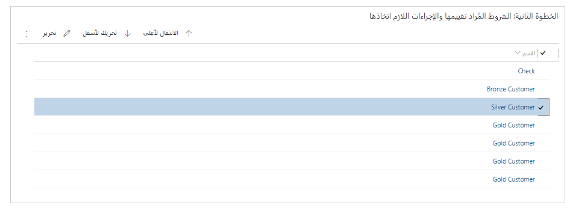

بعد إنشاء عناصر القاعدة، يمكنك تنشيط القاعدة بحيث يمكن استخدامها. أحد القرارات النهائية التي يجب عليك اتخاذها هو ما إذا كنت تريد إرسال بريد إلكتروني إلى العميل بعد مطابقة الشرط وإنشاء حالة. على سبيل المثال، بعد أن يتعرف النظام على حالة وينشئها لعميل ذهبي، يمكنك إرسال بريد إلكتروني لإعلامه بأنه تم إنشاء حالة. تتم هذه العملية كجزء من الخطوة الثالثة في القاعدة. يمكنك تعيين حقل **الرد على البريد الإلكتروني تلقائياً‬** إلى **نعم**، ثم تحديد قالب البريد الإلكتروني الذي تريد استخدامه. وبشكل افتراضي، يتوفر قالب بريد إلكتروني **إقرار حالة جديدة**. بخلاف ذلك، يمكن إضافة المزيد من قوالب البريد الإلكتروني ضمن مجموعة القوالب في **إدارة الخدمة**.

> [!div class="mx-imgBorder"]
> 

## تغيير ترتيب القاعدة

الخطوة الأخرى التي سترغب في اتخاذها هي التأكد من أن عناصر القاعدة الخاصة بك يتم تنفيذها بالترتيب الصحيح. كما ذكرنا سابقاً، يتم فحص عناصر القاعدة بالترتيب المحدد في القاعدة. عندما تعثر القاعدة على عنصر قاعدة مطابق، فإنها ستطبق عنصر القاعدة هذا وتتوقف عن البحث عن المزيد من التطابقات. يمكنك التحكم في الترتيب الذي يتحقق به عناصر القاعدة، لذلك من الأفضل وضع القواعد الأكثر تحديداً أولاً ثم العمل في طريقك إلى أسفل القائمة.

> [!div class="mx-imgBorder"]
> 

عندما تكون مستعداً لتفعيل قاعدتك، يمكنك تحديد الزر **تنشيط** في شريط الأوامر. بعد تنشيط القاعدة، ستبدأ في تعريف الحالات لأنشطة البريد الإلكتروني التي يتم إرسالها إلى قائمة انتظار معينة.

لمزيد من المعلومات، راجع [تنشيط قاعدة لإنشاء السجلات أو تحديثها تلقائياً](/dynamics365/customer-service/automatically-create-update-records/?azure-portal=true#activate-a-rule-for-creating-or-updating-records-automatically).
