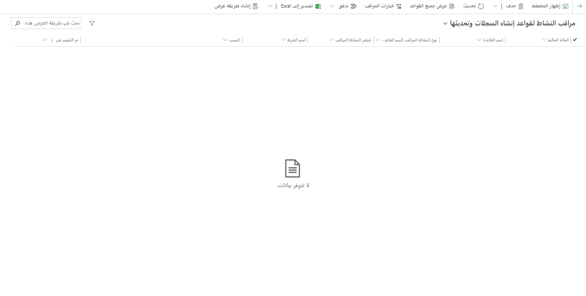

مع دخول الأنشطة وتقييمها، لن تستوفي جميعها معايير التحويل إلى حالة لأسباب عديدة مختلفة. على سبيل المثال، استناداً إلى كيفية تكوين قاعدة ما، قد لا يأتي البريد الإلكتروني من حساب موجود أو جهة اتصال في النظام، أو قد تكون الحالة مرتبطة بالسجل بالفعل.

يمكنك مراجعة الصحة العامة لقواعد إنشاء السجل التلقائي وتعقبها وحل المشكلات المتعلقة بها باستخدام مراقبة النشاط. تقوم أداة مراقبة النشاط بتتبع القواعد وتقييمها أثناء تنفيذها في مركز خدمة العملاء وقبل تشغيل القاعدة في Power Automate.

يمكنك الوصول إلى مراقبة النشاط بطريقتين مختلفتين:

- من **مراقبة النشاط** لكل قاعدة على حدة.

- عن طريق تحديد الزر **عرض مراقبة النشاط** على شريط الأوامر من قائمة **إنشاء السجلات التلقائية وقواعد التحديث**.

بغض النظر عن الطريقة التي تحددها، تتوفر التفاصيل التالية للقواعد:

- **الحالة الحالية** - عرض حالة القاعدة.
  ستعرض ثلاث نتائج رئيسية:

  - **فشل** - تحديد أن النظام حاول تشغيل القاعدة، لكنه فشل لسبب ما.

  - **تم التخطي** - تحديد أن النظام لم يحاول تشغيل القاعدة على السجل لسبب ما. على سبيل المثال، ليس لدى المرسل سجل استحقاق مقترن به.

  - **جاهز لـ Power Automate** - الإشارة إلى أن النظام عالج القاعدة في نهاية Customer Service وأنه جاهز لـ Power Automate للقيام بذلك.

- **اسم القاعدة** - تحديد اسم قاعدة إنشاء السجل التي تمت مراقبتها.

- **نوع النشاط المراقب** - تحديد نوع النشاط الذي ارتبطت به القاعدة مثل البريد الإلكتروني أو المهمة أو الموعد.

- **عنصر النشاط المراقب** - عرض موضوع نوع النشاط.

- **اسم الشرط** - تحديد اسم الحالة التي تم العثور فيها على المشكلة.

- **السبب** - عرض معلومات حول كيفية معالجة القاعدة.

  علي سبيل المثال، إذا كانت القيمة بـ **الحالة الحالية** لإحدى القواعد **تم تخطيها**، لن يتم اتخاذ أي إجراء بسبب وجود حالة قاعدة، على علامة التبويب **متقدم**، مثل تعيين  **السماح برسائل البريد الإلكتروني من مرسلين غير معروفين**  إلى **لا**.
  لذلك، إذا كان البريد الإلكتروني من مرسل غير معروف، فلا داعي لاتخاذ أي إجراء آخر.

- **تم التقييم في‬** - عرض تاريخ ووقت المشكلة.

> [!div class="mx-imgBorder"]
> 

بشكل افتراضي، لا تلتقط مراقبة النشاط سوى الأحداث الفاشلة حيث لا يمكن للقاعدة إكمال عملية الإنشاء. بناءً على احتياجاتك، عند عرض السجلات من عرض قائمة القواعد، يمكنك تحديد الزر **خيارات المراقبة** في شريط الأوامر لتغيير النتائج التي يتم عرضها.
