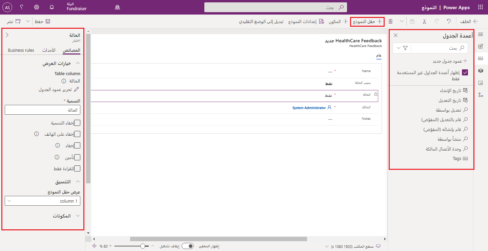
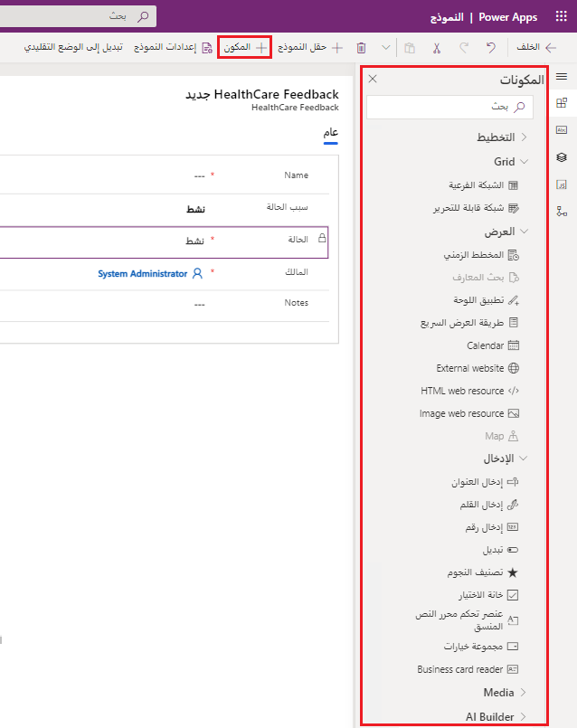
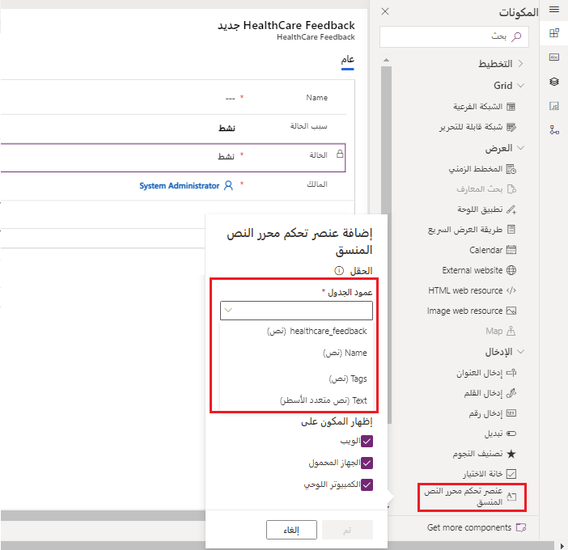
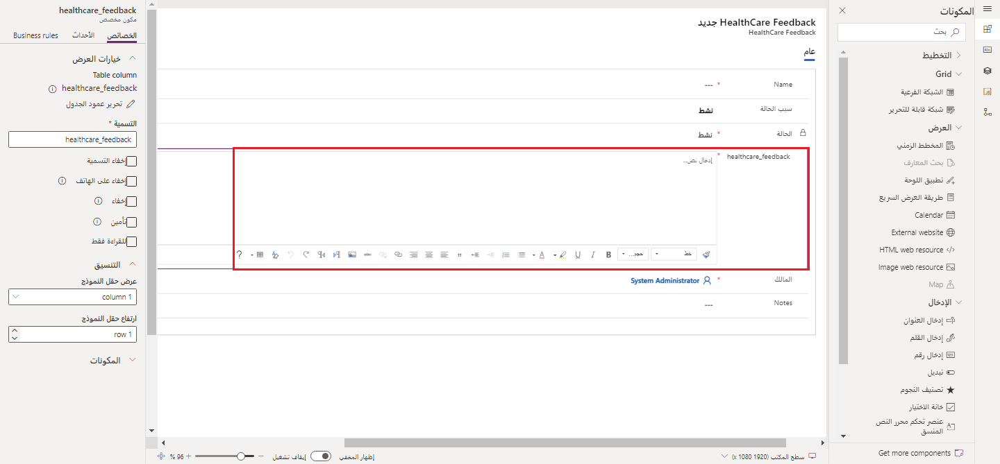
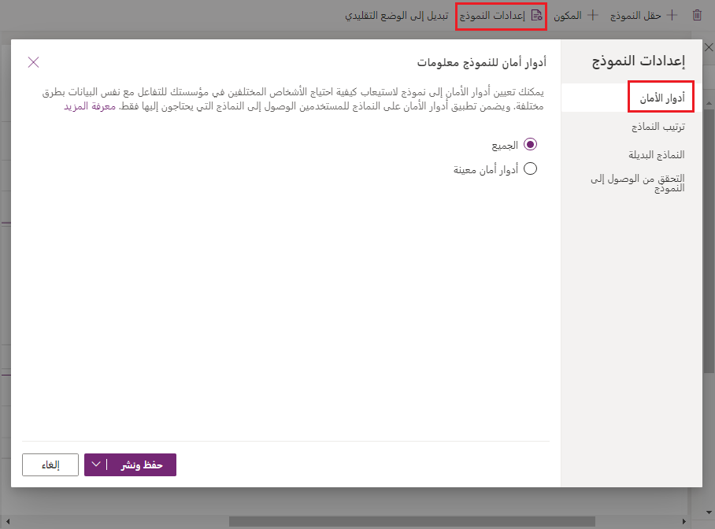
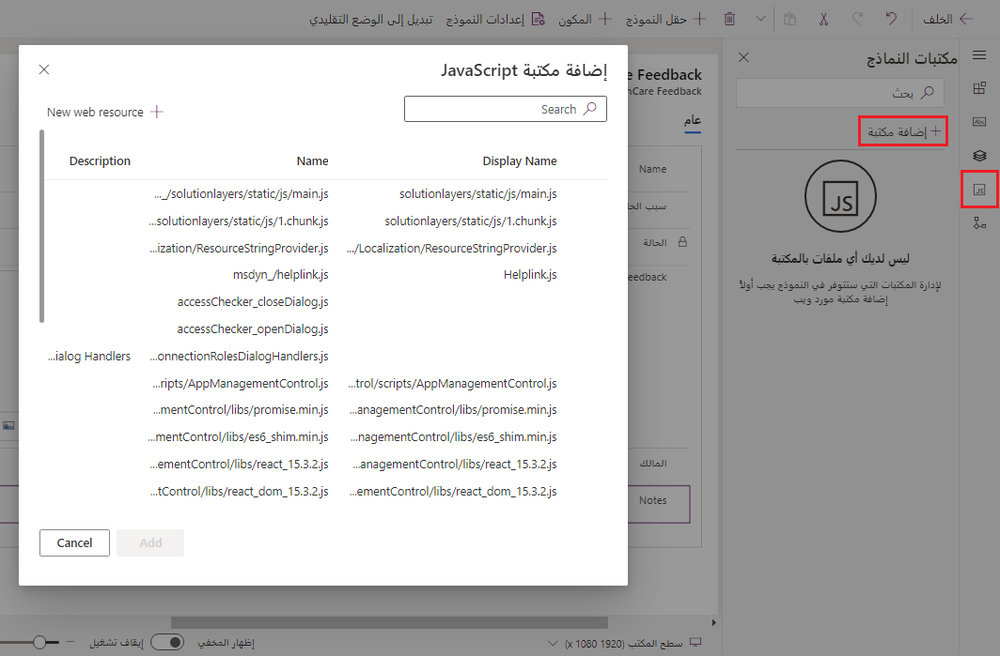

توفر النماذج التي تستند إلى نموذج وسائل لتقديم صف من البيانات التفصيلية للمستخدم لتحريرها وعرضها. توفر لك النماذج طريقة مهيكلة لتمثيل البيانات التي يتم عرضها للتفاعل مع المستخدم. تلخص النماذج مُنشئ النموذج من تفاصيل العرض الدقيقة المطلوبة لتحويل تعريف النموذج الذي تقوم بإنشائه لحجم جهاز المستخدم وقدراته. ومع ذلك، عند تخطيط النموذج باستخدام بعض المعرفة بمحرك عرض النموذج الحالي، فإنه سيساعدك على إنشاء المزيد من النماذج القابلة للاستخدام. الواجهة الموحدة هي إطار العمل الذي يعرض تعريفات النموذج للمستخدم. عندما تقوم بتحرير النماذج، لن تكون التغييرات مرئية للمستخدمين حتى يتم نشر النموذج.

يتم تنظيم النماذج في رأس ونص وتذييل، كل واحد مها قادر على احتواء عناصر النموذج، مثل الأعمدة. تمت هيكلة نص النموذج بشكل أكبر باستخدام مناطق تسمى علامات تبويب تحتوي على أقسام. يمكن تكوين علامات التبويب والأقسام لدعم أعمدة عناصر النموذج لإعطاء بنية إضافية للمحتوى. علامة التبويب الأولى في النموذج هي الأهم ويجب أن تحتوي على بيانات الأولوية التي يجب أن يراها المستخدم. على الرغم من أنه يمكنك تكوين العديد من علامات التبويب، إلا أن الحد من عددها مع تجميع منطقي للبيانات يمكن أن يجعل تجربة الاستخدام أكثر سهولة، لأن المستخدم لا يلجأ باستمرار إلى علامات التبويب للعثور على الأشياء.

### أعمدة الجدول

المهمة الأكثر شيوعاً التي ستقوم بها عند تحرير نموذج هي وضع عناصر تحكم العمود في النموذج. تفضل بإلقاء نظرة على واجهة **مصمم النماذج** لإضافة/تعديل نموذج في تطبيقك. يظهر النموذج بحد ذاته في منتصف الشاشة. لاحظ وجود شريط الأوامر الموجود في الأعلى حيث يمكن تحديد **+ حقل النموذج‬**. تبيّن لك قائمة **أعمدة الجدول** التي تظهر على اليسار أعمدة الجدول الموجودة في مصدر بياناتك. يمكنك اختيار إظهار فقط الأعمدة التي لم تستخدمها، أو يمكنك عرضها كلها. علي الجانب الأيسر من الشاشة، يحتوي أحد الأجزاء على خصائص أي عمود محدد في النموذج.

يمكن إضافة عمود إلى النموذج عدة مرات، إذا لزم الأمر، وستكون القيمة المعروضة هي نفسها لكل حدوث. يمكنك ضبط خصائص العمود مثل الاسم والرؤية والقراءة فقط. بدون تكوين خاص، سيظهر عمود مع عنصر تحكم محدد تلقائياً بواسطة وقت التشغيل المناسب لنوع بيانات العمود. على سبيل المثال، سيعرض عمود الاختيار البيانات في قائمة منسدلة.

### مكونات النموذج

توفر لك مكونات النموذج القدرة على إجراء المزيد من عمليات التخصيص على النموذج. توفر لك اختيارات التخطيط طرقاً لتنظيم البنية الفعلية للنموذج. تمكّنك مكونات الشبكة من السماح بإدخال البيانات عبر الشبكة. تسمح لك مكونات العرض بإدراج التقويمات والمواقع الخارجية وتطبيقات اللوحة وعناصر أخرى في تجربة النموذج.  توفر مكونات الإدخال للمستخدم وسائل أخرى لإدخال البيانات، مثل خانات الاختيار ومجموعات الخيارات ومفاتيح التبديل وإدخالات القلم.

عندما تحدد مكوناً لإضافته، سيطالبك Power Apps بالحقل الذي يمكنك تطبيق هذا المكون عليه، والتعليق على الأنظمة الأساسية التي سيتم عرض المكون عليها. إذا لم يكن هناك عمود جدول يمكنك تطبيق المكون عليه، فلن تتمكن من إدراجه. في المثال أدناه، حددنا **عنصر التحكم Rich Text Editor**.  ستتم مطالبتنا بتحديد **عمود جدول** (لاحظ أنه عبارة عن حقل مطلوب) وستوفر لنا القائمة المنسدلة أربعة خيارات للاختيار منها.

أدى تحديد العمود *healthcare_feedback* وتحديد **تم** إلى إدراج عنصر تحكم Rich Text Editor Control يرتبط بـ *healthcare_feedback* في نموذجنا.

مرة أخرى، يحدد نوع بيانات العمود عناصر التحكم المخصصة التي يمكننا تضمينها في نموذجنا.

### إعدادات النموذج

تسمح لنا إعدادات النموذج بتثبيت عناصر تحكم على نماذجنا تعمل في الخلفية، من دون أن يلاحظها المستخدم.  يمكننا تحديد أدوار الأمان للنموذج للتحكم في الوصول إليه وترتيب النماذج والنماذج البديلة. بالإضافة إلى ذلك، توفر لنا إعدادات النموذج القدرة على التحقق من وصول مجموعة أمان معينة إلى النموذج. تعرض الصورة الموجودة أدناه علامة تبويب *أدوار الأمان*.

يسمح لك *ترتيب النماذج* بتحديد النموذج الذي يظهر أولاً ثم التالي بناءً على دور الأمان. يسمح هذا الأمر بظهور نماذج مختلفة لمستخدمين مختلفين.  تسمح لك *النماذج البديلة* بتمكين نموذج معين في حال عدم وجود نموذج محدد لدور الأمان، أو العكس. يمكنك معرفة المزيد عن هذه الإعدادات [هنا](https://go.microsoft.com/fwlink/?linkid=2132854).

### إظهار عناصر النموذج أو إخفاؤها

توفر لك عناصر النموذج خيار إظهارها أو إخفائها، بشكل افتراضي. توجد هذه الإمكانية في قسم **الخصائص** في كل حقل نموذج. توفر كل من علامات التبويب والأقسام والأعمدة وإطارات iFrames وموارد الويب هذا الخيار. عندما تستخدم البرامج النصية للنماذج أو قواعد العمل، يمكن التحكم في رؤية هذه العناصر لإنشاء نموذج ديناميكي لواجهة المستخدم يتكيف مع الشروط في النموذج.

بدلاً من تصميم النماذج التي تعتمد على البرامج النصية للتحكم في خيارات الرؤية، ضع في اعتبارك ما إذا كانت قاعدة العمل (أو التبديل إلى نموذج مختلف) قد تكون أكثر ملاءمة لتلبية متطلباتك. إذا كنت تستخدم البرامج النصية، فتأكد من أن أي عنصر قد يكون مخفياً هو مخفي بشكل افتراضي. لا تعمل على إظهاره إلا مع البرامج النصية عندما يستدعي منطقك ذلك. وبهذه الطريقة، لن يتم عرضه في العروض التقديمية التي لا تدعم البرامج النصية.

### معالجات أحداث النماذج

تسمح معالجات أحداث النماذج بتكوين منطق المطور الذي يتم تشغيله عندما يتفاعل المستخدم مع النموذج.

يمكن تكوين معالجات أحداث النماذج للنماذج للمناطق التالية في نموذج:

| عناصر| الحدث| الوصف |
| - | - | - |
| النموذج| OnLoad| يحدث عند تحميل النموذج. |
| النموذج| OnSave| يحدث عند حفظ البيانات. |
| علامة التبويب| TabStateChange| يحدث عند توسيع علامة التبويب أو طيها. |
| العمود| OnChange| يحدث عندما تتغير البيانات الموجودة في العمود ويفقد عنصر التحكم التركيز. |
| iFrame| OnReadyStateComplete| يحدث عند تحميل محتوى iFrame. |

يتكون معالج الأحداث من مرجع إلى مورد ويب JavaScript ووظيفة محددة داخل مورد الويب هذا سيتم تنفيذها عند وقوع الحدث. يمكن أن يحتوي كل عنصر على ما يصل إلى 50 معالج أحداث منفصل تم تكوينه.

يقوم المطورون في معظم الأحيان بإنشاء معالجات الأحداث؛ ومع ذلك، قد ترغب في مراجعة ما تم تكوينه في نموذجك.

يمكنك تحميل معالجات الأحداث إلى نموذجك عبر علامة التبويب **إضافة مكتبة** في قائمة الهامش الأيسر، وتحديد **+ إضافة مكتبة** من قائمة **مكتبات النماذج‬** ثم البحث عن مكتبة JavaScript التي ترغب في إضافتها أو تحديدها.

يوفر لك مصمم النماذج في Power Apps القدرة على إنشاء كل جوانب النموذج والتحكم فيها من خلال الحقول والمكونات والإعدادات ومعالجات الأحداث. يمكنك تصميم نموذج أساسي غير مرئي، أو يمكنك تصميم نماذج تتكيف مع دور الأمان المعين للمستخدم، وتشغيل البرامج النصية أثناء تفاعل المستخدم، وتوفير واجهة رسومية تتضمن بيانات.

في الوحدة التالية، سنستكشف كيفية تكوين نماذج متعددة.
