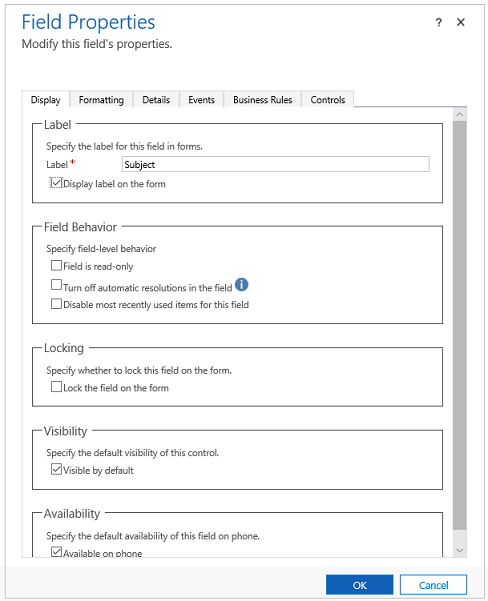

النماذج المستندة إلى نموذج هي كيفية تقديم البيانات التفصيلية لصف ما للمستخدم أثناء التحرير والعرض. توفر النماذج طريقة منظمة لتمثيل البيانات عند عرضها للتفاعل مع المستخدم. تلخص النماذج مُنشئ النموذج من تفاصيل العرض الدقيقة المطلوبة لتحويل تعريف النموذج الذي تقوم بإنشائه لحجم جهاز المستخدم وقدراته. ومع ذلك، عند تخطيط النموذج باستخدام بعض المعرفة بمحرك عرض النموذج الحالي، فإنه سيساعدك على إنشاء المزيد من النماذج القابلة للاستخدام. الواجهة الموحدة هي الاسم الحالي لإطار العمل الذي يعرض تعريفات النموذج للمستخدم. عند تحرير النماذج، لن تكون التغييرات مرئية للمستخدمين حتى يتم حفظ النموذج ونشره أيضاً.

يتم تنظيم النماذج في رأس ونص وتذييل، كل واحد مها قادر على احتواء عناصر النموذج مثل الأعمدة. يتم تنظيم نص النموذج بشكل أكبر باستخدام مناطق تسمى علامات التبويب التي تحتوي على أقسام. يمكن تكوين علامات التبويب والأقسام لدعم أعمدة عناصر النموذج لإعطاء بنية إضافية للمحتوى. علامة التبويب الأولى في النموذج هي الأهم ويجب أن تحتوي على بيانات الأولوية التي يجب أن يراها المستخدم. على الرغم من أنه يمكنك تكوين العديد من علامات التبويب، إلا أن الاحتفاظ بها على رقم أصغر مع تجميع منطقي للبيانات يمكن أن يجعل تجربة أكثر قابلية للاستخدام لأن المستخدم لا يتنقل باستمرار للعثور على الأشياء.

### عناصر تحكم العمود القياسية

المهمة الأكثر شيوعاً التي ستقوم بها عند تحرير نموذج هي وضع عناصر تحكم العمود في النموذج. يمكن إضافة عمود إلى النموذج عدة مرات إذا لزم الأمر، وستكون القيمة المعروضة هي نفسها لكل تكرار. كل عنصر تحكم تضعه في النموذج يمكنك التحكم في التسمية المعروضة، وخصائص أخرى مثل الرؤية والقراءة فقط. بدون تكوين خاص، سيتم عرض العمود بعنصر تحكم محدد تلقائياً بواسطة وقت التشغيل المناسب لنوع بيانات العمود. على سبيل المثال، سيعرض عمود مجموعة الخيارات البيانات في قائمة منسدلة.

يوضح ما يلي مثالاً لخصائص العمود التي يمكن تحريرها في كل عنصر تحكم عمود.

بناءً على نوع العمود، قد يعرض العمود إعدادات أخرى يمكن تغييرها. على سبيل المثال، سيسمح لك عمود البحث بتعيين طريقة العرض الافتراضية والخيارات الأخرى المتعلقة بالعرض.

### عناصر التحكم المخصصة 

تتيح لك عناصر التحكم المخصصة تحويل الأعمدة التي تحتوي عادةً على نص إلى رسوم مرئية. وبالمثل، يمكنك استخدام عناصر التحكم المخصصة لتحويل مجموعات البيانات، مثل طريقة العرض، لعرضها في عرض مرئي أكثر من قائمة الصفوف. يمكن أن تظهر عناصر التحكم المخصصة كمرئيات في النماذج ولوحات المعلومات وطرق العرض وشبكات الصفحة الرئيسية. يمكنك تعيين نوع واحد من التحكم المخصص للظهور في عميل متصفح الويب مع ظهور عنصر تحكم مخصص مختلف في تطبيقات الهاتف المحمول أو الجهاز اللوحي. على سبيل المثال، يمكنك استخدام عنصر تحكم مخصص لإدخال رقم لعمود في عملاء مستعرض الويب وعنصر تحكم مخصص في شريط التمرير لتطبيق الهاتف. بعد نشر التخصيص، يمكن للمستخدمين التفاعل بشكل كامل مع عنصر التحكم لتغيير القيمة، مثل تحريك عنصر التحكم عند استخدام عنصر التحكم المخصص في شريط التمرير الخطي. يتم حفظ التغييرات تلقائياً عند إغلاق النموذج تماماً كما هو الحال عندما يغير المستخدم عموداً تقليدياً في النموذج.

فيما يلي مثال يظهر في علامة التبويب عناصر التحكم في خصائص العمود كيف يمكنك تكوين عنصر تحكم مخصص.

 

يحدد نوع بيانات العمود عناصر التحكم المخصصة المتوفرة. تتضمن أمثلة عناصر التحكم المخصصة ما يلي:

**اختيارات**

**مفتاح التبديل**

**شريط التمرير الخطي**

**نقطة ارتكاز شعاعية**

**تصنيف النجوم**

**إدخال الرقم**

### عناصر التحكم المتخصصة

بالإضافة إلى البيانات المرتبطة بالعمود، يمكنك أيضاً تكوين العديد من عناصر التحكم المتخصصة لاستخدامها في النموذج. يمكن أن توفر عناصر التحكم هذه عرضاً فريداً للبيانات أو الوصول إلى خدمة مثل التعيين. اللوحة المرجعية هي قسم متخصص يمكن إضافته إلى النماذج الرئيسية التي توفر التفاعل مع البيانات ذات الصلة في سياق صف جدول الاستضافة. تعرض الشبكات الفرعية قائمة الصفوف أو المخططات. يعرض عنصر تحكم العرض السريع البيانات من صف تم تحديده في بحث في النموذج - على سبيل المثال، في نموذج الحساب، قد ترغب في عرض جميع تفاصيل جهة الاتصال الأساسية المضمنة في نموذج الحساب. بشكل عام، ستؤدي إضافة iFrames إلى نموذج إلى دمج المحتوى من موقع ويب آخر داخل النموذج. 

## إظهار أو إخفاء عناصر النموذج

هناك عدة أنواع من عناصر النموذج لديها خيار إظهارها أو إخفاؤها بشكل افتراضي. توفر كل من علامات التبويب والأقسام والأعمدة وإطارات iFrames وموارد الويب هذا الخيار. باستخدام البرامج النصية للنماذج أو قواعد العمل، يمكن التحكم في رؤية هذه العناصر لإنشاء نموذج ديناميكي لتوفير واجهة مستخدم تتكيف مع الشروط في النموذج.

بدلاً من تصميم النماذج التي تعتمد على البرامج النصية للتحكم في رؤية الخيارات، ضع في اعتبارك ما إذا كانت قاعدة العمل، أو التبديل إلى نموذج مختلف، قد تكون أكثر ملاءمة لتلبية متطلباتك. إذا كنت تستخدم البرامج النصية، فتأكد من إخفاء أي عنصر قد يكون مخفياً بشكل افتراضي. أظهرها فقط مع البرامج النصية عندما يستدعي منطقك ذلك. بهذه الطريقة لن يتم عرضها في العروض التقديمية التي لا تدعم البرامج النصية.

## معالجات أحداث النماذج

تسمح معالجات أحداث النماذج بتكوين منطق المطور الذي يتم تشغيله عندما يتفاعل المستخدم مع النموذج.

يمكن تكوين معالجات أحداث النماذج للنماذج للمناطق التالية في نموذج:

| عناصر| الحدث| الوصف |
| - |
| النموذج| OnLoad| يحدث عند تحميل النموذج. |
| النموذج| OnSave| يحدث عند حفظ البيانات. |
| علامة التبويب| TabStateChange| يحدث عند توسيع علامة التبويب أو طيها. |
| العمود| OnChange| يحدث عندما تتغير البيانات الموجودة في العمود ويفقد عنصر التحكم التركيز. |
| iFrame| OnReadyStateComplete| يحدث عند تحميل محتوى iFrame. |

يتكون معالج الحدث من مرجع إلى مورد ويب JavaScript ووظيفة محددة داخل مورد الويب هذا والتي سيتم تنفيذها عند وقوع الحدث. يمكن أن يحتوي كل عنصر على ما يصل إلى 50 معالج أحداث منفصل تم تكوينه.

يقوم المطورون في معظم الأحيان بإنشاء معالجات الأحداث؛ ومع ذلك، قد ترغب في مراجعة ما تم تكوينه في نموذج.

 

 
