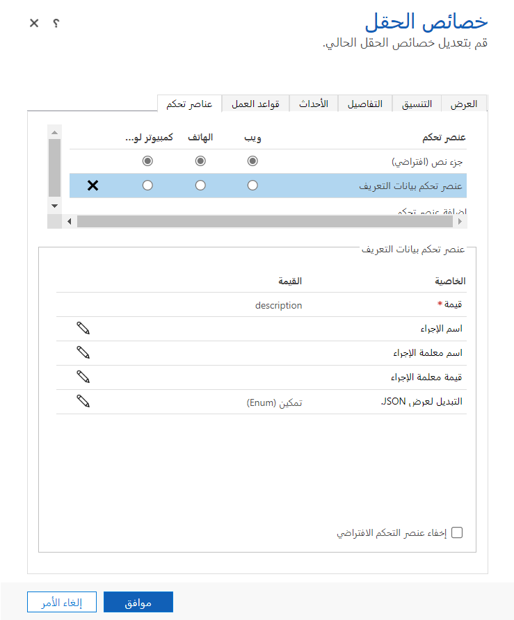

كما ذكرنا سابقاً، هناك العديد من مكونات النماذج المتخصصة المتاحة للتطبيقات التي تستند إلى النموذج. تحتوي هذه الوحدة على تفاصيل إضافية عن عدد كبير من مكونات النماذج الأكثر شيوعاً.

>[!NOTE]
>تعد أوصاف المكونات التالية جزءاً من التجربة الكلاسيكية للتطبيقات التي تستند إلى نموذج ولا تنطبق تماماً على التجربة الحديثة في هذا الوقت.  يمكن إضافة عناصر التحكم المدرجة أدناه وتكوينها بواسطة مصمم النماذج الكلاسيكي.

### لوحة مرجعية

اللوحة المرجعية هي قسم متخصص يمكن إضافته إلى النماذج الرئيسية التي توفر التفاعل مع البيانات ذات الصلة في سياق صف جدول الاستضافة. يمكنها أن تحتوي على شبكات فرعية من جداول ذات صلة وتعرض البيانات ذات الصلة دون الحاجة إلى الانتقال إلى نموذج مختلف. للحصول على القيمة الكاملة للوحة المرجعية، يجب أيضاً تكوين نماذج العرض السريع. يمكن أن يحتوي كل نموذج على لوحة مرجعية واحدة فقط، ولكن يمكن أن تحتوي كل لوحة مرجعية على شبكات فرعية متعددة.

### خرائط Bing

يمكن عرض خرائط Bing في نموذج للحساب، وجهة الاتصال، والعميل المتوقع، وعرض الأسعار، والأمر، الفاتورة، والمنافس، وجداول مستخدم النظام. ومع ذلك، لاستخدام الخرائط [يجب أن يتم تمكين إعداد النظام "إظهار خرائط Bing على النماذج‬"](/power-apps/maker/model-driven-apps/configure-bing-maps-legacy?azure-portal=true#enable-maps-for-your-environment). بشكل افتراضي، يتم تكوينها على النموذج الرئيسي لجداول كل الحسابات وجهات الاتصال، ولكن يمكن إضافتها إلى جدول مستخدم النظام. يمكنك إزالة منطقة خرائط Bing في محرر النماذج أو إضافتها مرة أخرى باستخدام زر خرائط Bing في علامة التبويب "إدراج" في محرر النماذج. تعرض الخريطة، عند تمكينها، الموقع المحدد في أعمدة العنوان المركبة للصف المعين.

### عنصر تحكم المؤقت

استخدم عنصر تحكم المؤقت مع النماذج حيث تحتاج الصفوف إلى تلبية حدث رئيسي محدد يستند إلى الوقت. يعرض عنصر تحكم المؤقت مقدار الوقت المتاح لإكمال إجراء في حل صف نشط أو مقدار الوقت المنقضي منذ انقضاء وقت إكمال الإجراء. كحد أدنى، يجب تكوين عناصر تحكم المؤقت لإظهار النجاح أو الفشل في إكمال الإجراء. بالإضافة إلى ذلك، يمكن تكوينها لعرض التحذيرات عندما تقترب الشروط من الفشل.

يمكن إضافة عنصر تحكم المؤقت إلى نموذج لأي جدول، ولكن يتم استخدامه بشكل متكرر لجدول الحالة، خاصة عند ربطه بالأعمدة التي تتعقب اتفاقيات مستوى الخدمة. يمكنك إضافة عدة عناصر تحكم عداد في نص النموذج. لا يمكنك إضافتها إلى العنوان أو تذييل الصفحة.

### تحكم سريع في العرض

يعرض عنصر تحكم العرض السريع في نموذج تطبيق يستند إلى نموذج بيانات من صف تم تحديده في بحث في النموذج. يتم تحديد البيانات المعروضة في عنصر التحكم باستخدام نموذج العرض السريع. البيانات المعروضة غير قابلة للتحرير، ولكن عندما يتم تضمين العمود الأساسي في نموذج العرض السريع، يصبح ارتباطاً لفتح الصف ذي الصلة.

### iFrame

يمكنك إضافة إطارات مضمنة (iFrames) إلى نموذج لدمج محتوى من موقع ويب آخر داخل نموذج. يمكن إضافة iFrames إلى التجربة الحديثة عن طريق إدراج عنصر تحكم عرض **موقع ويب خارجي** في النموذج. لمزيد من المعلومات، راجع [إضافة iframe إلى نموذج تطبيق رئيسي يستند إلى النموذج](/power-apps/maker/model-driven-apps/iframe-properties-legacy/?azure-portal=true).

### عنصر تحكم Timeline

يوفر عنصر التحكم Timeline مكاناً مشتركاً لعرض تفاعلات العملاء بما في ذلك الأنشطة والملاحظات جميعها في موقع واحد. يسمح لك المخطط الزمني بسرعة بمعرفة وقت حدوث التفاعل والجديد منذ آخر زيارة إلى صف البيانات. باستخدام عوامل التصفية، بإمكان المستخدمين اقتطاع ما هو مرئي بسرعة. تسمح لك خصائص عنصر التحكم بتغيير أشياء مثل نوع صف الإنشاء الافتراضي، والأنشطة التي تظهر في المخطط الزمني. في التجربة الحديثة، يمكن إدراج **المخطط الزمني** في أحد النماذج كمكون، مع قدر كبير من الوظائف نفسها. لمزيد من المعلومات حول مكون **المخطط الزمني**، راجع [إعداد عنصر تحكم Timeline](/power-apps/maker/model-driven-apps/set-up-timeline-control/?azure-portal=true).

### عناصر التحكم المخصصة

في وقت سابق، قدمنا نظرة عامة حول عناصر التحكم المخصصة. تمكّنك عناصر التحكم المخصصة من تغيير الأجزاء المحددة في عمود بيانات معين باستخدام عناصر مثل أشرطة التمرير والمقاييس ومدخلات الأرقام وما إلى ذلك. يتم تحديد عناصر التحكم المتوفرة حسب نوع بيانات العمود. يجب أن يكون مرتبطاً بعمود في النموذج.

### المزيد من عناصر التحكم

يوجد لدى تطبيقات مثل LinkedIn Sales Navigator عناصر واجهة مستخدم متوفرة للاستخدام على النماذج بالطريقة نفسها. تتوفر لدى عناصر مثل LinkedIn Sales Navigator خيارات تكوين متعددة.

### شبكات فرعية قابلة للتحرير

يمكن إضافة الشبكات الفرعية القابلة للتحرير إلى النماذج بنفس الطريقة التي يمكن بها إضافة عناصر تحكم مخصصة أخرى. يمكن العثور على تفاصيل حول الشبكات الفرعية القابلة للتحرير لاحقاً في هذه الوحدة. توفر الشبكات الفرعية القابلة للتحرير التحرير والتجميع الموضعيين.
