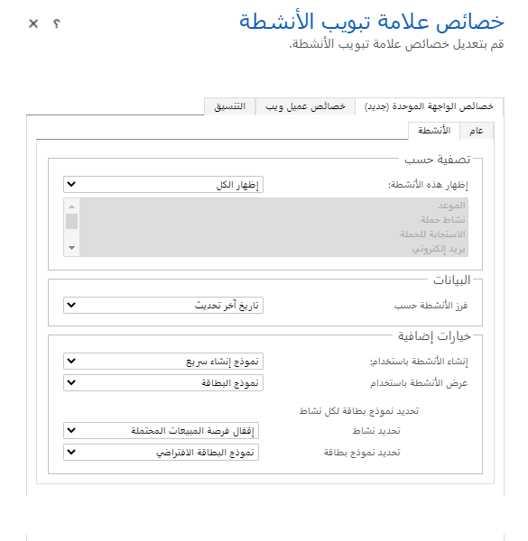

كما ذكرنا سابقاً، هناك العديد من مكونات النماذج المتخصصة المتاحة للتطبيقات التي تعتمد على النماذج. ويتضمن هذا الموضوع تفاصيل إضافية عن عدد من المواضيع الأكثر شيوعاً.

## لوحة مرجعية

اللوحة المرجعية هي قسم متخصص يمكن إضافته إلى النماذج الرئيسية التي توفر التفاعل مع البيانات المتعلقة بسياق صف جدول الاستضافة. يمكن أن تحتوي على شبكات فرعية متعلقة بالجداول وعرض البيانات ذات الصلة دون الحاجة إلى الانتقال إلى نموذج مختلف. للحصول على القيمة الكاملة للوحة المرجعية، يجب أيضاً تكوين نماذج العرض السريع. يمكن أن يحتوي كل نموذج على لوحة مرجعية واحدة فقط، ولكن يمكن أن تحتوي كل لوحة مرجعية على شبكات فرعية متعددة.

‎

إذا بحثت على الجانب الأيمن ستلاحظ رمزين، واحد لكل شبكة فرعية تم تكوينها لهذه اللوحة المرجعية. يمكنك التبديل بينهما كما تريد لعرض الصفوف.

إذا بحثت في الجانب الأيسر، ستلاحظ علامات التبويب الموجودة خلف الشبكة. هذه هي الصفوف التي تم عرضها مؤخراً لهذا الجدول في اللوحة المرجعية الخاصة بنا.

أثناء عرض الصفوف الفردية، سترى نموذج العرض السريع للجدول. يتم عرض جميع الأعمدة من نموذج العرض السريع للقراءة فقط. 

## خرائط Bing

يمكن عرض خرائط Bing في نموذج للحساب، جهة الاتصال، العميل المتوقع، عرض الأسعار، الطلب، الفاتورة، المنافس، وجداول مستخدم النظام. يمكنك إزالة منطقة خرائط Bing في محرر النماذج أو إضافتها مرة أخرى باستخدام زر خرائط Bing في علامة التبويب إدراج في محرر النماذج.

## عنصر تحكم المؤقت

استخدم عنصر تحكم مؤقت مع النماذج حيث تحتاج الصفوف إلى تلبية حدث رئيسي محدد يستند إلى الوقت. يعرض عنصر تحكم المؤقت مقدار الوقت المتاح لإكمال إجراء في حل صف نشط أو مقدار الوقت المنقضي منذ انقضاء وقت إكمال الإجراء. كحد أدنى، يجب تكوين عناصر تحكم المؤقت لإظهار النجاح أو الفشل في إكمال الإجراء. بالإضافة إلى ذلك، يمكن تهيئتها لعرض التحذيرات عندما تقترب الظروف من الفشل.

يمكن إضافة عنصر تحكم مؤقت إلى نموذج لأي جدول، ولكن يتم استخدامه بشكل متكرر لجدول الحالة، خاصة عند ربطه بالأعمدة التي تتعقب SLAs. يمكنك إضافة عدة عناصر تحكم عداد في نص النموذج. لا يمكنك إضافتها إلى العنوان أو تذييل الصفحة.

## تحكم سريع في العرض

يعرض عنصر تحكم العرض السريع في نموذج تطبيق يستند إلى نموذج بيانات من صف تم تحديده في بحث في النموذج. يتم تحديد البيانات المعروضة في عنصر التحكم باستخدام نموذج العرض السريع. البيانات المعروضة غير قابلة للتحرير، ولكن عندما يتم تضمين العمود الأساسي في نموذج العرض السريع، يصبح رابطاً لفتح الصف ذي الصلة. 

## iFrame 

يمكنك إضافة إطارات iFrames إلى نموذج لدمج محتوى من موقع ويب آخر داخل نموذج.

## التحكم في الجدول الزمني

يوفر عنصر التحكم في المخطط الزمني مكاناً مشتركاً لعرض تفاعلات العملاء بما في ذلك الأنشطة والملاحظات جميعها في موقع واحد. يسمح لك المخطط الزمني بسرعة بمعرفة وقت حدوث التفاعل والجديد منذ آخر زيارة للصف. باستخدام المرشحات، يمكن للمستخدمين تقليص ما هو مرئي بسرعة. تسمح لك خصائص التحكم بتغيير أشياء مثل نوع صف الإنشاء الافتراضي، وكذلك الأنشطة التي تظهر في المخطط الزمني.

 
## عناصر التحكم المخصصة

في السابق، قدمنا نظرة عامة على عناصر التحكم المخصصة؛ الآن سننظر بشكل أعمق في تكوينها في نموذج. يتم تحديد عناصر التحكم المتوفرة حسب نوع بيانات العمود. يجب أن يكون مرتبطاً بعمود في النموذج، وفي هذه الحالة لجهة اتصال يكون مرتبطاً بالاسم الأخير لصف جهة الاتصال.

### ضوابط إضافية

تطبيقات مثل LinkedIn Sales Navigator لها أدوات متاحة للاستخدام في النماذج بنفس الطريقة. يحتوي هذا العنصر أدناه على العديد من خيارات التكوين. 

### شبكات فرعية قابلة للتحرير

يمكن إضافة الشبكات الفرعية القابلة للتحرير إلى النماذج بنفس الطريقة التي يمكن بها إضافة عناصر تحكم مخصصة أخرى. يمكن العثور على تفاصيل حول الشبكات الفرعية القابلة للتحرير لاحقاً في هذه الوحدة.

يتوفر الآن التحرير والتجميع المضمن في نموذج المضيف.

 
