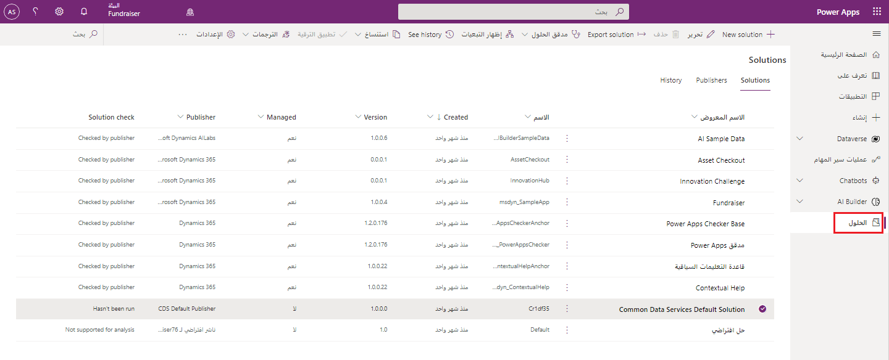
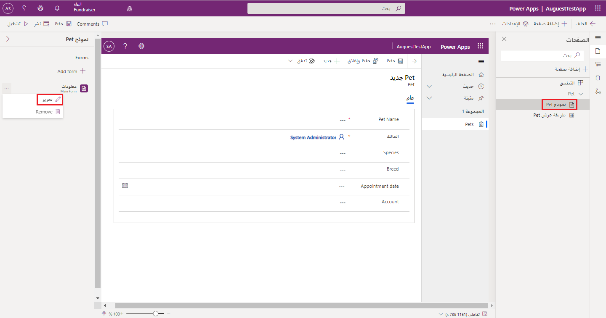
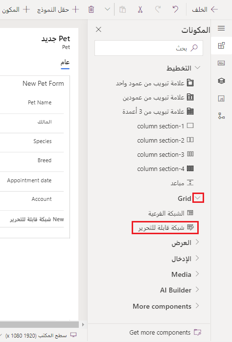
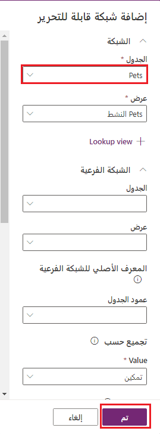
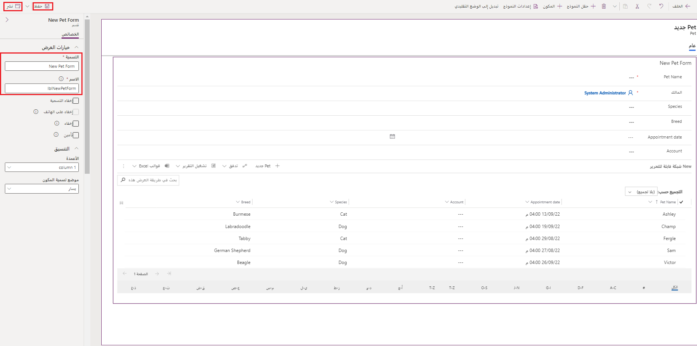

> [!NOTE]
> يسمح عنصر التحكم بالشبكة في Power Apps (حالياً في وضع الإصدار الأولي) للمستخدمين بعرض السجلات وفتحها وتحريرها من طرق العرض والشبكات الفرعية. بإمكان المستخدمين الآن تنفيذ عمليات التحرير الموضعي بالإضافة إلى التمرير عبر البيانات الموجودة في قوائمهم. يحل عنصر التحكم الجديد هذا محل الشبكات للقراءة فقط والقابلة للتحرير في التطبيقات التي تستند إلى النموذج. على الرغم من أن الوثائق النهائية قابلة للاستخدام حالياً، إلا أنها عرضة للتغيير.

يسمح عنصر التحكم بالشبكة في Power Apps للمستخدمين بعرض السجلات وفتحها وتحريرها من طرق العرض والشبكات الفرعية. عندما تقوم بتكوين عنصر التحكم بالشبكة لجدول، ستظهر جميع طرق العرض الخاصة بذلك الجدول باستخدام تلك الشبكة.

لإضافة عنصر التحكم بالشبكة إلى طرق عرض خاصة بجدول، انتقل إلى منطقة الحلول ضمن Power Apps. (من الصفحة الرئيسية make.powerapps.com، توجد علامة تبويب **الحلول** في أسفل جزء التنقل على الجانب الأيمن.) يمكنك البحث عن الحل في الجدول وتحديده.

بعد ذلك، نحتاج إلى الوصول إلى محرر النماذج لتطبيقك الذي يستند إلى النموذج. في الحل المحدد، ابحث عن التطبيق الذي ترغب في تعديله من قائمة **الكائنات** وحدده. ابحث عن شاشة النموذج التي ستعمل عليها. بعد ذلك، حدد علامة القطع إلى جانب النموذج وحدد **تحرير**.

يفتح هذا الإجراء مثيل مستعرض منفصلاً من محرر النماذج. في شاشة تحرير النموذج، حدد منطقة شاشتك حيث تريد وضع عنصر التحكم بالشبكة في Power Apps. بعد ذلك، حدد قائمة **المكونات** من جزء التنقل الأيمن ووسّع خيار **الشبكة**. حدد **شبكة قابلة للتحرير**.

من الجزء المنبثق **إضافة شبكة قابلة للتحرير**، يمكنك تحديد الجدول الذي تريد ربطه بعنصر التحكم هذا. هناك خيارات أخرى يمكنك تحديدها، مثل "طريقة عرض" أو "تخطيط". إذا قمت بالتمرير إلى أسفل الجزء، فيمكنك تحديد الجهاز الذي سيظهر عليه هذا المكوّن، بما في ذلك الويب والجهاز المحمول والكمبيوتر اللوحي. عندما تقتنع باختياراتك، حدد **تم**.

ستظهر شبكتك الجديدة القابلة للتحرير في النموذج. قد تحتاج إلى إضافة/تحديث الحقول المطلوبة ضمن علامة تبويب "الخصائص". أخيراً، انقر فوق **حفظ** و/أو **نشر** لتسجيل التغييرات.

